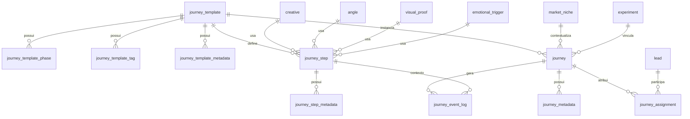

# Modelo de Dados da Jornada

Este documento consolida o **modelo físico de dados** do módulo de Jornadas no banco MySQL 5, com base nos changelogs Liquibase do backend.

## Visão geral (ER)

## Tabelas principais

### `journey_template`
| Campo | Tipo | Regra |
|---|---|---|
| id | BIGINT | PK, auto increment |
| name | VARCHAR(255) | NOT NULL, UNIQUE |
| description | LONGTEXT | opcional |
| objective | VARCHAR(255) | opcional |
| preferred_channel | VARCHAR(100) | opcional |
| created_at | DATETIME | default CURRENT_TIMESTAMP |
| updated_at | DATETIME | default CURRENT_TIMESTAMP ON UPDATE |

### `journey_step`
| Campo | Tipo | Regra |
|---|---|---|
| id | BIGINT | PK, auto increment |
| template_id | BIGINT | NOT NULL, FK `journey_template(id)` |
| position | INT | NOT NULL |
| name | VARCHAR(255) | opcional |
| description | LONGTEXT | opcional |
| phase | VARCHAR(32) | NOT NULL |
| stimulus_type | VARCHAR(128) | NOT NULL |
| creative_id | BIGINT | FK `creative(id)` |
| angle_id | BIGINT | FK `angle(id)` |
| visual_proof_id | BIGINT | FK `visual_proof(id)` |
| emotional_trigger_id | BIGINT | FK `emotional_trigger(id)` |
| entry_condition | VARCHAR(255) | opcional |
| exit_condition | VARCHAR(255) | opcional |
| delay_minutes | INT | opcional |

### `journey`
| Campo | Tipo | Regra |
|---|---|---|
| id | BIGINT | PK, auto increment |
| template_id | BIGINT | NOT NULL, FK `journey_template(id)` |
| name | VARCHAR(255) | NOT NULL, UNIQUE |
| description | LONGTEXT | opcional |
| status | VARCHAR(32) | NOT NULL |
| niche_id | BIGINT | FK `market_niche(id)` |
| experiment_id | BIGINT | FK `experiment(id)` |
| segment_reference | VARCHAR(255) | opcional |
| segment_filter | LONGTEXT | opcional |
| start_at | DATETIME | opcional |
| end_at | DATETIME | opcional |
| created_at | DATETIME | default CURRENT_TIMESTAMP |
| updated_at | DATETIME | default CURRENT_TIMESTAMP ON UPDATE |

### `journey_assignment`
| Campo | Tipo | Regra |
|---|---|---|
| id | BIGINT | PK, auto increment |
| journey_id | BIGINT | NOT NULL, FK `journey(id)` |
| type | VARCHAR(20) | NOT NULL |
| lead_id | BINARY(16) | FK `lead(id)` |
| segment_identifier | VARCHAR(255) | opcional |
| status | VARCHAR(20) | NOT NULL |
| current_step_id | BIGINT | FK `journey_step(id)` |
| next_step_id | BIGINT | FK `journey_step(id)` |
| last_event_at | DATETIME | opcional |
| context_payload | LONGTEXT | opcional |
| next_attempt_at | DATETIME | opcional |
| retry_count | INT | default 0 |
| created_at | DATETIME | default CURRENT_TIMESTAMP |
| updated_at | DATETIME | default CURRENT_TIMESTAMP ON UPDATE |

### `journey_event_log`
| Campo | Tipo | Regra |
|---|---|---|
| id | BIGINT | PK, auto increment |
| actor_id | BINARY(16) | opcional |
| event_type | VARCHAR(100) | NOT NULL |
| journey_id | BIGINT | FK `journey(id)` |
| journey_step_id | BIGINT | FK `journey_step(id)` |
| source | VARCHAR(100) | opcional |
| campaign_id | VARCHAR(100) | opcional |
| metadata | LONGTEXT | opcional |
| event_value | DECIMAL(12,2) | opcional |
| occurred_at | DATETIME | NOT NULL |
| received_at | DATETIME | default CURRENT_TIMESTAMP |

## Tabelas auxiliares (coleções e metadados)

- `journey_template_phase` (PK composta: `template_id`, `phase_order`).
- `journey_template_tag` (PK composta: `template_id`, `tag`).
- `journey_template_metadata` (PK composta: `template_id`, `meta_key`).
- `journey_step_metadata` (PK composta: `step_id`, `meta_key`).
- `journey_metadata` (PK composta: `journey_id`, `meta_key`).

## Índices relevantes

- `idx_journey_step_template` em `journey_step(template_id)`.
- `idx_journey_template_name` em `journey_template(name)`.
- `idx_journey_status` em `journey(status)`.
- `idx_journey_assignment_journey` em `journey_assignment(journey_id)`.
- `idx_journey_assignment_next_attempt` em `journey_assignment(next_attempt_at)`.
- `idx_journey_event_log_actor` em `journey_event_log(actor_id)`.

## Observações de evolução do schema

- `journey_step.stimulus_type` foi ampliado para `VARCHAR(128)` para suportar novos estímulos.
- `journey_event_log.value` foi renomeado para `event_value`.
- Há restrições de unicidade para `journey_template.name` e `journey.name`.
