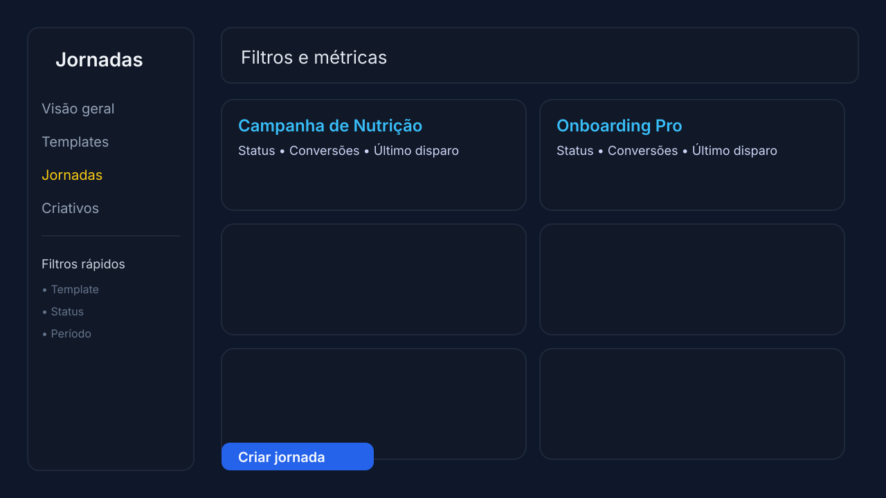
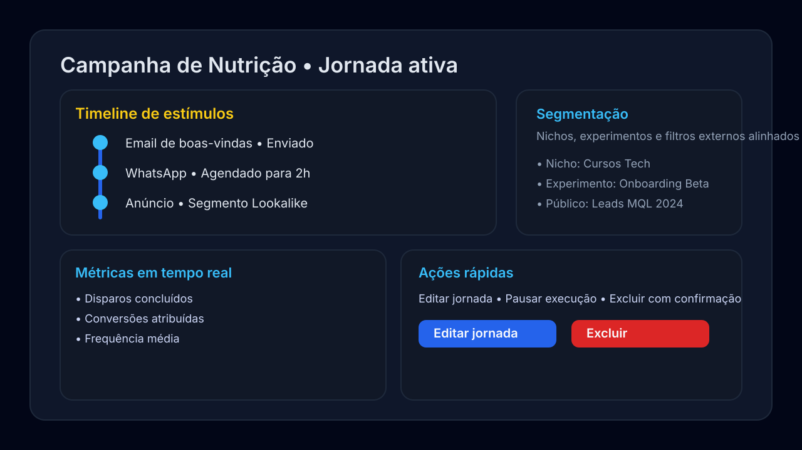
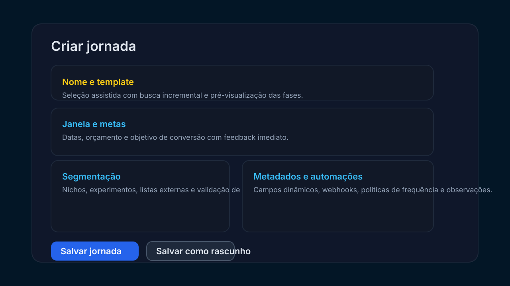

# Orquestração de Jornadas: estímulos e respostas

## Visão geral
O Marketing Hub modela jornadas em três camadas complementares:

1. **Blueprint** — Templates descrevem fases, passos e preferências de canal que orientam a estratégia.【F:docs/swagger/openapi.yaml†L377-L480】【F:backend/ads-service/src/main/java/com/marketinghub/journey/model/JourneyTemplate.java†L11-L72】
2. **Instância operacional** — Jornadas materializam um template para um segmento específico com janela de execução e metadados de segmentação.【F:docs/swagger/openapi.yaml†L604-L724】【F:backend/ads-service/src/main/java/com/marketinghub/journey/model/Journey.java†L13-L79】
3. **Vínculo com o público** — Atribuições conectam leads ou segmentos às jornadas e guardam o contexto usado para disparar estímulos.【F:docs/swagger/openapi.yaml†L725-L806】【F:backend/ads-service/src/main/java/com/marketinghub/journey/model/JourneyAssignment.java†L12-L82】

Sobre esses modelos atua um motor de execução que avalia condições, respeita limites de frequência e despacha estímulos canalizados, registrando telemetria e eventos canônicos para monitorar respostas.【F:backend/ads-service/src/main/java/com/marketinghub/journey/execution/JourneyExecutionService.java†L28-L347】【F:backend/ads-service/src/main/java/com/marketinghub/journey/execution/TelemetryService.java†L26-L198】

## Modelo de dados de jornada

### JourneyTemplate
* Lista ordenada de fases (AIDA por padrão) e metadados estratégicos (objetivo, canal preferido, tags).【F:backend/ads-service/src/main/java/com/marketinghub/journey/model/JourneyTemplate.java†L31-L63】
* Cada passo referencia criativos, ângulos, provas visuais e gatilhos emocionais opcionais, além de condições de entrada/saída e atraso antes do disparo.【F:backend/ads-service/src/main/java/com/marketinghub/journey/model/JourneyStep.java†L33-L79】

### Journey
* Instância operacional com status (draft, active etc.), janela temporal, segmentação externa e vínculos com nicho/experimento para análise cruzada.【F:backend/ads-service/src/main/java/com/marketinghub/journey/model/Journey.java†L31-L70】
* Armazena metadados arbitrários e mantém a lista de atribuições produzidas para a jornada.【F:backend/ads-service/src/main/java/com/marketinghub/journey/model/Journey.java†L61-L70】

### JourneyAssignment
* Representa a execução de um passo seguinte para um lead ou segmento, com status (`PENDING`, `IN_PROGRESS`, `COMPLETED`, `STOPPED`) e histórico de tentativas.【F:backend/ads-service/src/main/java/com/marketinghub/journey/model/JourneyAssignment.java†L27-L82】【F:backend/ads-service/src/main/java/com/marketinghub/journey/model/JourneyAssignmentStatus.java†L6-L11】
* Persiste o passo atual/próximo e o `contextPayload` (JSON) utilizado pelo motor para personalizar o estímulo.【F:backend/ads-service/src/main/java/com/marketinghub/journey/model/JourneyAssignment.java†L39-L66】

### EventLog
* Registro canônico de eventos multicanal: tipo (`journey.stimulus.*`, `journey.completed` etc.), ator, jornada, passo, origem e metadados livres.【F:backend/ads-service/src/main/java/com/marketinghub/journey/model/EventLog.java†L14-L55】
* Valores monetários e carimbo de ocorrência permitem reconciliar respostas (conversões, compras) com estímulos disparados.【F:backend/ads-service/src/main/java/com/marketinghub/journey/model/EventLog.java†L31-L44】

## APIs expostas
* **Templates de jornada** — CRUD completo em `/api/journey-templates` para blueprinting e manutenção de passos.【F:docs/swagger/openapi.yaml†L377-L606】
* **Jornadas operacionais** — CRUD em `/api/journeys`, filtragem por template/status, métricas agregadas em `/api/journeys/metrics` e vinculação a nichos/experimentos.【F:docs/swagger/openapi.yaml†L604-L724】【F:docs/swagger/openapi.yaml†L724-L732】
* **Atribuições** — Paginação e criação em lote de vínculos via `/api/journeys/{id}/assignments`, aceitando leads, segmentos e contexto serializado.【F:docs/swagger/openapi.yaml†L725-L806】【F:backend/ads-service/src/main/java/com/marketinghub/journey/dto/JourneyAssignmentRequest.java†L11-L18】
* **Eventos multicanal** — Ingestão unificada em `/api/events`, validando jornada/passo e persistindo com `occurredAt` customizável.【F:docs/swagger/openapi.yaml†L808-L836】【F:backend/ads-service/src/main/java/com/marketinghub/journey/service/EventLogService.java†L40-L84】

## Experiência no Marketing Hub
* A nova navegação lateral traz o item "Jornadas" com acesso direto à visão geral, criação rápida e templates, reforçando a descoberta das funcionalidades de orquestração.【F:frontend/src/components/MainNavigation.tsx†L34-L118】

### Lista de jornadas
A listagem apresenta cards responsivos com filtros por template, status e período, busca textual e indicadores de saúde consolidados pelo endpoint `/api/journeys/metrics`. Atalhos permitem abrir o detalhamento em uma nova aba, duplicar ou excluir a jornada com confirmação, enquanto o botão "Criar jornada" permanece visível para incentivar novos fluxos.【F:frontend/src/pages/journey/JourneyListPage.tsx†L1-L260】【F:frontend/src/pages/journey/JourneyListPage.css†L1-L167】

### Detalhe da jornada
O detalhamento organiza timeline, métricas em tempo real e contexto de segmentação em painéis independentes, facilitando a identificação de gargalos no fluxo. Ações rápidas permitem editar a jornada, pausar a execução ou removê-la com modal de confirmação, enquanto o histórico de estímulos evidencia o status de cada passo e os identificadores registrados na telemetria.【F:frontend/src/pages/journey/JourneyDetailPage.tsx†L1-L248】【F:frontend/src/pages/journey/JourneyDetailPage.css†L1-L168】

### Formulário de criação e edição
O formulário reutilizável é dividido em seções para nome/template, janela e metas, segmentação e metadados avançados. Cada campo exibe validações inline e loaders contextuais, garantindo feedback imediato durante operações de salvar como rascunho ou publicar. A seleção assistida de nichos/experimentos oferece busca incremental e garante coerência com o template escolhido via hooks de criação e atualização.【F:frontend/src/pages/journey/JourneyForm.tsx†L1-L330】【F:frontend/src/api/journey/useCreateJourney.ts†L1-L55】【F:frontend/src/api/journey/useUpdateJourney.ts†L1-L55】

## Tratamento de vínculos (assignments)
* Atribuições podem ser criadas para leads individuais (verificação de existência) ou identificadores de segmento externos.【F:backend/ads-service/src/main/java/com/marketinghub/journey/service/JourneyAssignmentService.java†L49-L121】
* O serviço aceita passo atual e próximo explícitos, garantindo que pertençam ao template da jornada; na ausência de próximo, utiliza o primeiro passo disponível.【F:backend/ads-service/src/main/java/com/marketinghub/journey/service/JourneyAssignmentService.java†L54-L144】
* `contextPayload` armazena dados operacionais (ex.: email, telefone, origem da lead) reutilizados pelos handlers na personalização.【F:backend/ads-service/src/main/java/com/marketinghub/journey/service/JourneyAssignmentService.java†L56-L75】【F:backend/ads-service/src/main/java/com/marketinghub/journey/model/JourneyAssignment.java†L55-L66】

## Motor de execução e tratamento de estímulos
1. **Seleção de candidatos** — Busca atribuições elegíveis (`PENDING`/`IN_PROGRESS`) respeitando janelas de jornada e `nextAttemptAt`.【F:backend/ads-service/src/main/java/com/marketinghub/journey/execution/JourneyExecutionService.java†L74-L105】
2. **Avaliações pré-disparo** — Analisa condição de entrada (SpEL), limites de frequência e disponibilidade de handler para o tipo de estímulo.【F:backend/ads-service/src/main/java/com/marketinghub/journey/execution/JourneyExecutionService.java†L108-L123】【F:backend/ads-service/src/main/java/com/marketinghub/journey/execution/JourneyConditionEvaluator.java†L18-L48】
3. **Despacho** — Encaminha para o handler por tipo (`EMAIL`, `WHATSAPP`, `AD`, `LANDING_PAGE`, `INSTANT_FORM`, `LEAD_PORTAL_IMAGE_FLOW`, `SHOWCASE_IMAGE`, `PAYMENT_PAGE`) e interpreta `ChannelDispatchResult` com status `OK`, `TRANSIENT_ERROR` ou `PERMANENT_ERROR`.【F:backend/ads-service/src/main/java/com/marketinghub/journey/execution/JourneyExecutionService.java†L119-L217】【F:backend/ads-service/src/main/java/com/marketinghub/journey/execution/channel/ChannelDispatchResult.java†L8-L26】【F:backend/ads-service/src/main/java/com/marketinghub/journey/model/JourneyStimulusType.java†L3-L15】【F:backend/ads-service/src/main/java/com/marketinghub/journey/execution/channel/ChannelDispatchStatus.java†L3-L10】
4. **Persistência e avanço** — Em sucesso o passo vira `currentStep`, o próximo é agendado e eventos `journey.stimulus.dispatched`/`journey.completed` são gravados; falhas transitórias reprogramam tentativas com backoff, permanentes marcam o vínculo como `STOPPED`.【F:backend/ads-service/src/main/java/com/marketinghub/journey/execution/JourneyExecutionService.java†L219-L347】

### Limite de frequência e resiliência
* Configurações externas (`journey.execution.*`) definem intervalo de polling, tamanho do lote, tentativas máximas e jitter de backoff.【F:backend/ads-service/src/main/java/com/marketinghub/journey/execution/JourneyExecutionProperties.java†L17-L65】
* `FrequencyCapService` conta estímulos disparados por ator (lead) nos últimos 1 e 7 dias e bloqueia novas exposições até o `cooldown`, registrando o evento `journey.stimulus.frequency_capped`.【F:backend/ads-service/src/main/java/com/marketinghub/journey/execution/policy/FrequencyCapService.java†L16-L74】【F:backend/ads-service/src/main/java/com/marketinghub/journey/execution/JourneyExecutionService.java†L113-L201】
* Falhas transitórias consultam `nextAttemptAt` sugerido ou calculam um backoff exponencial via `RetryBackoffCalculator`, mantendo histórico em `retryCount`.【F:backend/ads-service/src/main/java/com/marketinghub/journey/execution/JourneyExecutionService.java†L245-L275】

### Handlers de canal
* **SendGrid (Email)** — Requer API key e remetente; extrai destinatário de `context.email` ou `context.lead.email`, suporta templates, assunto e conteúdo em metadata do passo.【F:backend/ads-service/src/main/java/com/marketinghub/journey/execution/channel/SendGridEmailChannelHandler.java†L33-L137】
* **WhatsApp (Meta Cloud)** — Exige token e `phoneNumberId`; aceita template pré-aprovado (`templateName`/`templateLanguage`) ou mensagem textual derivada do contexto.【F:backend/ads-service/src/main/java/com/marketinghub/journey/execution/channel/WhatsAppChannelHandler.java†L33-L128】
* Ambos traduzem respostas HTTP em `ChannelDispatchResult`, sinalizando IDs de mensagem para telemetria ou definindo `Retry-After` quando disponível.【F:backend/ads-service/src/main/java/com/marketinghub/journey/execution/channel/SendGridEmailChannelHandler.java†L114-L172】【F:backend/ads-service/src/main/java/com/marketinghub/journey/execution/channel/WhatsAppChannelHandler.java†L84-L128】

## Telemetria e acompanhamento de respostas
* Cada sucesso registra eventos canônicos e dispara telemetria:
  * **Meta Pixel** — Envia `event_name`, IDs de jornada/passo/estímulo e metadados (ex.: `provider_message_id`, valor). Permite reconciliar conversões client-side com a orquestração.【F:backend/ads-service/src/main/java/com/marketinghub/journey/execution/TelemetryService.java†L49-L105】
  * **GA4 Measurement Protocol** — Propaga estímulos como eventos do GA4, incluindo `journey_phase`, `stimulus_type`, `source` (quando disponível) e timestamp server-side.【F:backend/ads-service/src/main/java/com/marketinghub/journey/execution/TelemetryService.java†L107-L158】
* Eventos são identificados por `assignmentId-stepId`, garantindo rastreabilidade entre tentativas e respostas coletadas posteriormente.【F:backend/ads-service/src/main/java/com/marketinghub/journey/execution/TelemetryService.java†L187-L197】

## Registro de eventos externos
* `EventLogService` aceita registros vindos de outros canais/sistemas, validando a coerência entre jornada e passo antes de persistir e preenchendo `occurredAt` com o horário fornecido ou `Instant.now()`.【F:backend/ads-service/src/main/java/com/marketinghub/journey/service/EventLogService.java†L40-L70】
* O metadata do evento é serializado como JSON e rejeitado se não puder ser convertido, evitando armazenar payloads inválidos.【F:backend/ads-service/src/main/java/com/marketinghub/journey/service/EventLogService.java†L75-L84】
* O repositório fornece contagens e última ocorrência por ator/evento, base para relatórios ou políticas adicionais (ex.: frequency cap).【F:backend/ads-service/src/main/java/com/marketinghub/journey/repository/EventLogRepository.java†L12-L18】

## Tipos de estímulo e eventos canônicos
* Estímulos suportados: anúncios pagos, email, WhatsApp, landing pages, instant forms, fluxos de lead portal com envio de imagem, vitrines de imagem e páginas de pagamento.【F:backend/ads-service/src/main/java/com/marketinghub/journey/model/JourneyStimulusType.java†L3-L15】
* Eventos emitidos pelo motor: disparo, falha, pulo por condição, bloqueio por frequência e conclusão da jornada.【F:backend/ads-service/src/main/java/com/marketinghub/journey/model/JourneyEventType.java†L4-L20】
* A API de eventos permite registrar respostas correlatas (ex.: conversões) usando `eventType` customizado e `value` monetário quando aplicável.【F:backend/ads-service/src/main/java/com/marketinghub/journey/dto/EventLogRequest.java†L11-L20】【F:docs/swagger/openapi.yaml†L808-L824】

## Configuração operacional
* Propriedades ajustáveis permitem calibrar cadência (`pollInterval`), throughput (`batchSize`) e limites de exposição (`perDay`, `perWeek`, `cooldown`).【F:backend/ads-service/src/main/java/com/marketinghub/journey/execution/JourneyExecutionProperties.java†L23-L47】
* Retentativas podem ser customizadas via `maxAttempts`, `initialBackoff`, `maxBackoff` e `jitterPercentage`, garantindo resiliência controlada a falhas transitórias.【F:backend/ads-service/src/main/java/com/marketinghub/journey/execution/JourneyExecutionProperties.java†L49-L65】

Esta documentação consolida a arquitetura vigente de tratamento de jornadas e o acompanhamento de estímulos/respostas, servindo como referência para evoluções futuras.
