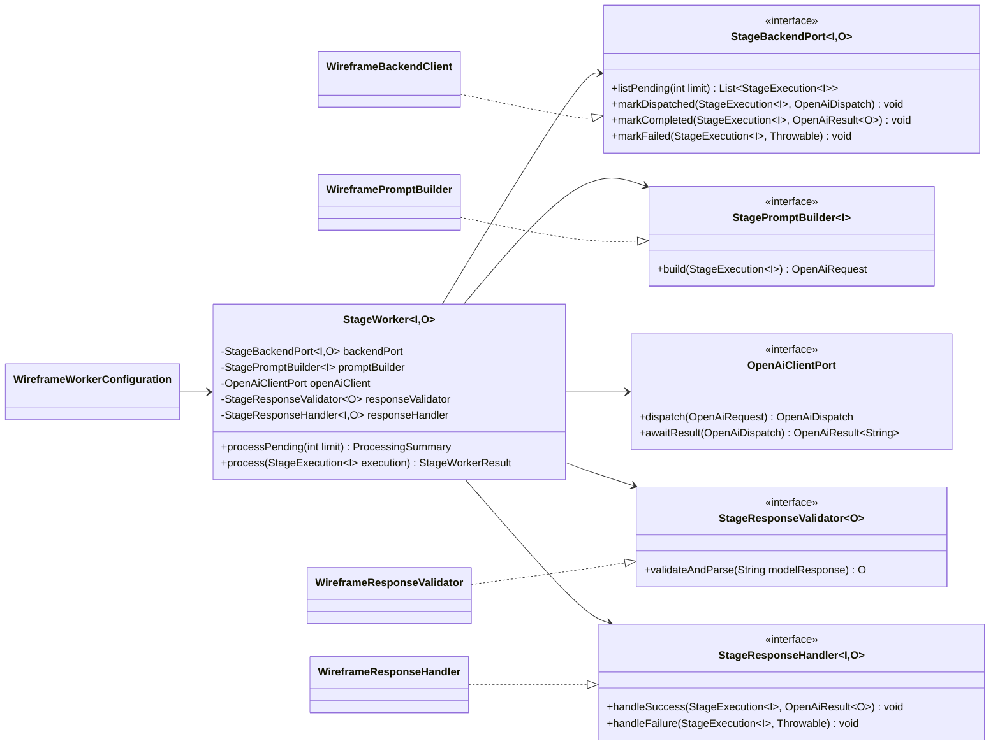

# Como Pedir a Geração de um Worker OpenAI/ChatGPT do Zero

## Objetivo

Este documento explica como solicitar a geração de uma implementação Java/Spring Boot de um Worker assíncrono para integrações com OpenAI/ChatGPT quando ainda não existe uma implementação inicial.

A ideia é evitar um pedido genérico como:

```text
Gere um worker para OpenAI.
```

E substituir por uma especificação completa de arquitetura, requisitos de produção e entregável.

---

## Por que o pedido precisa ser específico

Quando existe uma implementação inicial, é possível evoluir a partir dela.  
Mas quando não existe nada, o pedido precisa informar claramente:

1. qual é o problema de negócio;
2. qual é o fluxo esperado;
3. quais partes devem ser genéricas;
4. quais partes devem ser específicas da primeira etapa;
5. quais requisitos são obrigatórios para produção;
6. qual deve ser o formato do entregável.

Sem isso, a primeira versão tende a sair funcional, mas incompleta para produção.

---

## Prompt mestre recomendado

Use um prompt parecido com este:

```text
Quero que você projete e gere uma implementação Java/Spring Boot do zero para um Worker assíncrono de integrações com OpenAI/ChatGPT.

Contexto:
- O Worker deve servir para etapas textuais de um pipeline, como Wireframe, Copy, Briefing etc.
- A primeira implementação concreta deve ser Wireframe.
- Quero um núcleo genérico reutilizável e uma implementação concreta Wireframe.
- O pacote raiz deve ser novo: com.marketinghub.worker.openai.core.
- Não existe implementação inicial. Projete a arquitetura do zero.

Requisitos arquiteturais:
- Criar um core genérico que não conheça Wireframe, GeraLanding, Experiment ou endpoints específicos.
- Criar ports/interfaces para:
  - buscar pendências no backend;
  - montar prompt/request;
  - chamar OpenAI;
  - validar resposta;
  - enviar sucesso/falha ao backend.
- Criar records genéricos para:
  - StageExecution;
  - OpenAiRequest;
  - OpenAiDispatch;
  - OpenAiResult;
  - ProcessingSummary.
- Criar implementação concreta Wireframe usando o core.
- A implementação Wireframe deve chamar:
  - GET /api/internal/geralanding/wireframe/stage-executions/pending
  - POST /api/internal/geralanding/wireframe/stage-executions/{idJob}/recebe-prompt
  - POST /api/internal/geralanding/wireframe/stage-executions/{idJob}/recebe-resposta

Requisitos OpenAI:
- Usar OpenAI Responses API.
- Usar Structured Outputs com JSON Schema.
- O request deve guardar:
  - model;
  - prompt;
  - requestBodyJson;
  - schemaName;
  - schemaJson.
- O result deve guardar:
  - openAiJobId;
  - rawResponse;
  - modelResponse;
  - inputTokens;
  - outputTokens;
  - costUsd.

Requisitos de produção:
- Não usar URL default de backend.
- Não usar @Component nas classes concretas Wireframe.
- Criar beans via @Configuration.
- Usar @ConditionalOnProperty para só subir o Worker se wireframe.worker.enabled=true.
- Usar @ConfigurationProperties com validação para configurações.
- Se wireframe.worker.enabled=false ou ausente, nenhum bean Wireframe deve subir.
- Se wireframe.worker.enabled=true e faltar configuração obrigatória, a aplicação deve falhar no startup.
- Incluir exemplo de application.properties para produção e teste.

Requisitos Spring:
- Usar WebClient.
- Usar ObjectMapper.
- Criar scheduler com @Scheduled.
- Evitar que testes de outros módulos que usam @SpringBootTest quebrem por falta de configuração do Wireframe.

Entregável:
- Gerar um ZIP com os arquivos Java.
- Incluir README.md.
- Incluir diagrama Mermaid de classes no README.
- Incluir exemplo de configuração .properties.
- Não criar pacote example.
- A implementação concreta deve se chamar wireframe.
```

---

## Pedido complementar antes de gerar o ZIP

Antes de pedir o ZIP final, é melhor pedir uma etapa de revisão arquitetural:

```text
Antes de gerar o ZIP, me mostre:
1. árvore de pacotes;
2. diagrama de classes;
3. fluxo de execução;
4. lista de propriedades obrigatórias;
5. riscos de produção que você está mitigando.

Depois gere o ZIP.
```

Isso ajuda a validar a arquitetura antes da geração dos arquivos.

---

## Por que esse prompt funciona melhor

Esse prompt força a solução a nascer com decisões de produção desde o início:

- separação entre core genérico e implementação concreta;
- uso de ports/interfaces;
- configuração externa;
- feature toggle;
- validação de propriedades;
- isolamento dos testes;
- ausência de defaults perigosos;
- integração com OpenAI via contrato claro;
- resposta estruturada com schema.

A frase mais importante é:

```text
Projete como se fosse para produção desde a primeira versão, sem depender de uma implementação existente.
```

Essa frase muda o tipo de solução gerada.

---

## Estrutura esperada da solução

Uma boa solução deve separar o código em dois blocos.

### Core genérico

```text
com.marketinghub.worker.openai.core
├── StageWorker.java
├── OpenAiWorkerProperties.java
├── model
│   ├── StageExecution.java
│   ├── OpenAiRequest.java
│   ├── OpenAiDispatch.java
│   ├── OpenAiResult.java
│   ├── ProcessingSummary.java
│   └── StageWorkerResult.java
├── port
│   ├── StageBackendPort.java
│   ├── StagePromptBuilder.java
│   ├── OpenAiClientPort.java
│   ├── StageResponseValidator.java
│   └── StageResponseHandler.java
├── openai
│   ├── OpenAiClientProperties.java
│   ├── OpenAiCostEstimator.java
│   └── ResponsesApiOpenAiClient.java
└── exception
    ├── StageWorkerException.java
    └── InvalidModelResponseException.java
```

### Implementação concreta Wireframe

```text
com.marketinghub.worker.openai.core.wireframe
├── WireframeWorkerConfiguration.java
├── WireframeWorkerProperties.java
├── WireframeBackendClient.java
├── WireframePromptBuilder.java
├── WireframeResponseValidator.java
├── WireframeResponseHandler.java
├── WireframeExecutionScheduler.java
├── WireframeInput.java
└── WireframeOutput.java
```

---

## Diagrama conceitual



---

## Fluxo esperado

```text
1. Scheduler dispara o Worker.
2. Worker chama backendPort.listPending(limit).
3. Backend retorna execuções com status INICIADO.
4. Worker monta OpenAiRequest com StagePromptBuilder.
5. Worker chama OpenAiClientPort.dispatch(request).
6. Worker chama backendPort.markDispatched(...).
7. Worker aguarda resultado com openAiClient.awaitResult(...).
8. Worker valida resposta com StageResponseValidator.
9. Worker chama responseHandler.handleSuccess(...).
10. Worker chama backendPort.markCompleted(...).
11. Em caso de erro, chama responseHandler.handleFailure(...) e backendPort.markFailed(...).
```

---

## Requisitos de produção indispensáveis

### 1. Não usar default perigoso de backend

Evite:

```java
@Value("${backend.base-url:http://localhost:8000}")
```

E principalmente evite:

```java
@Value("${backend.base-url:http://ip-de-producao:8000}")
```

A solução correta é:

```text
Se o worker estiver habilitado e a URL não foi configurada:
  a aplicação deve falhar no startup.

Se o worker estiver desabilitado:
  os beans do worker não devem subir.
```

---

### 2. Usar @ConditionalOnProperty

A configuração do Worker deve ser carregada somente quando a propriedade estiver explicitamente habilitada:

```java
@Configuration
@ConditionalOnProperty(
    prefix = "wireframe.worker",
    name = "enabled",
    havingValue = "true",
    matchIfMissing = false
)
public class WireframeWorkerConfiguration {
}
```

Isso evita que testes ou ambientes que não usam Wireframe tentem criar beans desnecessários.

---

### 3. Usar @ConfigurationProperties com validação

Preferir:

```java
@ConfigurationProperties(prefix = "wireframe.worker")
public record WireframeWorkerProperties(...) {}
```

Em vez de espalhar:

```java
@Value("${...}")
```

por várias classes.

Isso centraliza configuração, melhora validação e deixa claro quais propriedades são obrigatórias.

---

### 4. Não usar @Component nas classes concretas da etapa

Evite:

```java
@Component
public class WireframeBackendClient {
}
```

Prefira criar os beans explicitamente dentro de uma configuração condicional:

```java
@Bean
public WireframeBackendClient wireframeBackendClient(...) {
    return new WireframeBackendClient(...);
}
```

Assim, todo o conjunto de beans da etapa fica controlado por `wireframe.worker.enabled`.

---

## Configuração recomendada

### Produção

```properties
wireframe.worker.enabled=true
wireframe.worker.pending-limit=10
wireframe.worker.cron=0 */30 * * * *
wireframe.worker.backend-base-url=https://seu-backend-producao.com
wireframe.worker.api-prefix=/api
wireframe.worker.prompt-resource=prompts/geralanding-wireframe.md
wireframe.worker.schema-resource=schemas/geralanding-wireframe.schema.json
wireframe.worker.schema-name=landing_page_wireframe
wireframe.worker.timeout=PT30M

openai.api-key=${OPENAI_API_KEY}
openai.base-url=https://api.openai.com/v1
openai.model=gpt-5.2
openai.timeout=PT30M
```

### Testes que não usam Wireframe

```properties
wireframe.worker.enabled=false
```

Ou simplesmente omitir `wireframe.worker.enabled`.

---

## Como adaptar para outra etapa

Para uma etapa `Copy`, por exemplo, trocar:

```text
Stage = Copy
stageCode = landing-page-copy
pending endpoint = /internal/geralanding/copy/stage-executions/pending
promptResource = prompts/geralanding-copy.md
schemaResource = schemas/geralanding-copy.schema.json
schemaName = landing_page_copy
Input/Output concretos = CopyInput / CopyOutput
```

O core continua igual.

---

## Checklist para pedir geração do zero

Antes de pedir o código final, valide se o pedido contém:

- [ ] nome do pacote raiz;
- [ ] nome da primeira etapa concreta;
- [ ] endpoints da etapa;
- [ ] status esperados;
- [ ] contratos de entrada e saída;
- [ ] regra de ativação por propriedade;
- [ ] configurações obrigatórias;
- [ ] exigência de `@ConfigurationProperties`;
- [ ] exigência de `@ConditionalOnProperty`;
- [ ] proibição de defaults perigosos;
- [ ] proibição de `@Component` solto em classes condicionais;
- [ ] uso de OpenAI Responses API;
- [ ] uso de Structured Outputs com JSON Schema;
- [ ] README;
- [ ] diagrama Mermaid;
- [ ] ZIP com os arquivos.

---

## Referências oficiais

- Spring Boot — `@ConditionalOnProperty`: usado para condicionar criação de beans/configurações conforme propriedades do ambiente.
- Spring Boot — `@ConfigurationProperties`: usado para vincular e validar configuração externa em classes/records tipados.
- Spring Boot — Externalized Configuration: permite usar o mesmo código com configurações diferentes por ambiente.
- OpenAI — Structured Outputs: permite gerar respostas que seguem um JSON Schema definido.
- OpenAI — Responses API: API recomendada para chamadas modernas de geração/estruturação de respostas.
