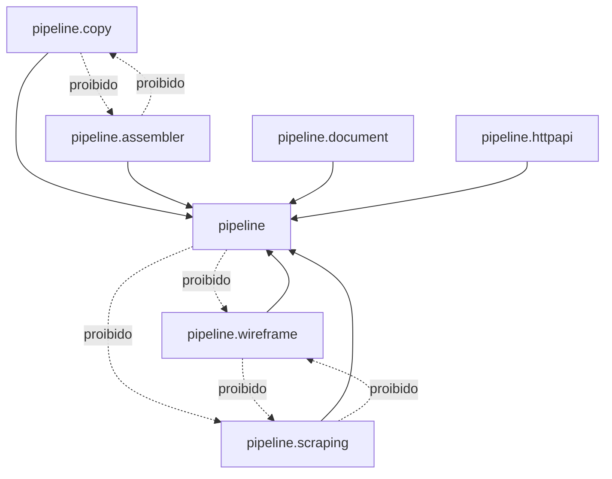
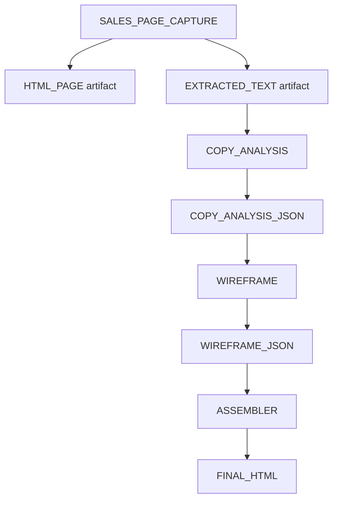

# Arquitetura de Pipeline por Etapa com Proteção por ArchUnit

## Objetivo

Este documento descreve uma abordagem arquitetural para o Marketing Hub onde diferentes tipos de execução são tratados como **etapas de pipeline**.

A mesma estrutura deve servir para:

- acesso à API da OpenAI ou outras APIs de IA;
- web scraping;
- captura de páginas HTML;
- download e processamento de documentos na web;
- chamadas a APIs externas;
- geração de artefatos intermediários;
- processamento determinístico local;
- montagem final de HTML, JSON ou outros outputs.

A ideia central é não construir um framework específico para OpenAI. A OpenAI deve ser apenas um tipo de etapa dentro de um motor mais geral.

---


## Escopo obrigatório: módulo executor, nunca backend por padrão

O protocolo padrão módulo é uma regra para o **módulo que executa o fluxo**: workers, coletores, serviços executores ou módulos operacionais que fazem scraping, chamadas a modelos, downloads, transformações e integrações externas.

Este protocolo **não deve ser aplicado no backend principal** apenas porque o backend expõe endpoints, registra estado, persiste dados ou contém contratos HTTP. Nesses casos, o backend continua sendo fonte de verdade de dados/contratos e deve receber somente os endpoints, entidades, migrations, Swagger e testes necessários para o executor operar.

Regra prática obrigatória antes de implementar:

1. Identificar quem executa a etapa.
2. Se quem executa é um worker/coletor/módulo externo, aplicar o núcleo `pipeline` e as regras ArchUnit nesse módulo executor.
3. Se o backend apenas disponibiliza fila, pending, callback, status, contrato ou persistência, **não criar** no backend `PipelineWorker`, `StageProcessor`, `StageContext`, `StageResult`, `StageArtifact` nem regras de protocolo padrão módulo.
4. Não descrever a aplicação do protocolo padrão módulo como alteração de backend quando o diff não modificou código/contratos do backend; a comunicação do PR deve dizer explicitamente que não houve alteração de backend.
5. Se o usuário quiser padronização arquitetural do backend, o gatilho correto é `aplique o protocolo padrão backend`, que é outro protocolo.

Exemplo OPRM NichoCNAE: como a execução das etapas ocorre no `oprm-coletor-mei`, o protocolo padrão módulo deve ser aplicado no `oprm-coletor-mei`; o `backend/ads-service` deve permanecer como API/persistência/contrato do OPRM.

---
## Conceito principal

O conceito geral é:

> Uma etapa recebe uma entrada, executa uma ação, gera artefatos, produz uma saída estruturada e registra o estado da execução.

Essa ação pode ser uma chamada à OpenAI, um scraping de página, uma chamada HTTP, um download de PDF, uma transformação local determinística ou qualquer outro processamento necessário.

O nome prático para essa abordagem pode ser:

```text
Pipeline Stage Execution Engine
```

Ou, em português:

```text
Motor Genérico de Execução de Etapas
```

---

## Padrão de pacotes escolhido

A organização escolhida deve seguir o padrão:

```text
com.marketinghub.worker.pipeline
com.marketinghub.worker.pipeline.<etapa>
```

Ou seja, o pacote raiz `pipeline` contém o núcleo genérico, e cada etapa concreta fica em um subpacote próprio.

Exemplo:

```text
com.marketinghub.worker.pipeline
    PipelineWorker
    StageProcessor
    StageContext
    StageResult
    StageArtifact
    ArtifactStore
    StageBackendPort
    StageResponseHandler

com.marketinghub.worker.pipeline.wireframe
    WireframeProcessor
    WireframeInput
    WireframeOutput
    WireframeProperties
    WireframeConfiguration
    WireframeBackendClient

com.marketinghub.worker.pipeline.scraping
    ScrapingProcessor
    ScrapingInput
    ScrapingOutput
    ScrapingProperties
    ScrapingConfiguration
    PageFetchClient
    HtmlExtractor

com.marketinghub.worker.pipeline.copy
    CopyProcessor
    CopyInput
    CopyOutput
    CopyProperties
    CopyConfiguration

com.marketinghub.worker.pipeline.assembler
    AssemblerProcessor
    AssemblerInput
    AssemblerOutput
    AssemblerProperties
    AssemblerConfiguration
```

### Regra mental

O pacote raiz `pipeline` é o núcleo genérico.

Os pacotes `pipeline.<etapa>` são implementações concretas.

Logo:

```text
pipeline.wireframe  -> pode depender de pipeline
pipeline.scraping   -> pode depender de pipeline
pipeline.copy       -> pode depender de pipeline
pipeline.assembler  -> pode depender de pipeline
```

Mas:

```text
pipeline            -> não pode depender de pipeline.wireframe
pipeline            -> não pode depender de pipeline.scraping
pipeline.wireframe  -> não pode depender de pipeline.scraping
pipeline.scraping   -> não pode depender de pipeline.wireframe
pipeline.copy       -> não pode depender de pipeline.assembler
```

### Necessidade obrigatória: etapas concretas plugáveis e removíveis

Cada etapa concreta precisa ser tratada como um **plugin operacional independente**: ela pode ser criada, desativada, substituída ou removida sem obrigar alteração nas demais etapas concretas.

Essa necessidade existe porque o pipeline do Marketing Hub evolui por experimentação. Novas etapas podem surgir para scraping, IA, captura de documentos, validação, enriquecimento, montagem determinística ou integrações externas. Se uma etapa concreta depender diretamente de outra, a evolução deixa de ser plugável: remover uma etapa passa a quebrar código não relacionado, trocar uma tecnologia passa a exigir refatoração em cascata e o dano arquitetural só aparece tarde, durante execução ou deploy.

Portanto, a regra operacional é:

```text
etapa concreta -> pode depender do núcleo pipeline
etapa concreta -> pode depender de infraestrutura compartilhada permitida
etapa concreta -> não pode depender de outra etapa concreta
núcleo pipeline -> não pode depender de etapa concreta
```

Exemplo correto:

```text
pipeline.wireframe -> pipeline
pipeline.scraping  -> pipeline
pipeline.copy      -> pipeline
```

Exemplo proibido:

```text
pipeline.wireframe -> pipeline.scraping
pipeline.copy      -> pipeline.wireframe
pipeline.assembler -> pipeline.copy
```

Quando uma etapa precisa consumir dado produzido por outra, ela deve consumir o **contrato persistido da execução** ou um **artefato auditável** (`StageArtifact`, storage key, DTO persistido no backend, evento de fila ou outro contrato oficial), nunca importar a classe concreta da etapa anterior. O encadeamento deve acontecer por dados e contratos, não por chamada direta entre implementações.

Consequência esperada:

```text
adicionar etapa nova   -> não exige mudar etapas existentes
remover etapa existente -> não quebra outras etapas concretas
substituir tecnologia   -> fica restrito ao pacote da própria etapa
reordenar pipeline      -> muda orquestração/contratos, não acoplamento entre classes de etapas
```

A proteção por ArchUnit deve validar essa necessidade explicitamente. Não basta testar apenas que o núcleo não conhece etapas concretas; também é obrigatório testar que uma etapa concreta não conhece outra etapa concreta.

---

## Diagrama conceitual



---

## Diferença em relação ao modelo acoplado à OpenAI

Um worker acoplado à OpenAI normalmente segue este fluxo:

```text
StageExecution
    -> PromptBuilder
    -> OpenAiClient
    -> ModelResponse
    -> ResponseValidator
    -> Backend completed
```

Esse desenho funciona para etapas de IA, mas não funciona bem para scraping, download de documentos, chamadas de APIs comuns ou processamento determinístico.

O modelo desejado deve seguir este fluxo:

```text
StageExecution
    -> StageProcessor
    -> StageResult
    -> StageArtifact
    -> Backend completed
```

O `PipelineWorker` não deve saber se a etapa usa OpenAI, scraping, Jsoup, Playwright, WebClient, S3, PDF parser ou lógica local.

Quem conhece a tecnologia específica é o `StageProcessor` da etapa.

---

## Contrato principal: StageProcessor

O contrato principal da arquitetura é o `StageProcessor`.

Exemplo:

```java
package com.marketinghub.worker.pipeline;

public interface StageProcessor<I, O> {
    StageResult<O> process(StageContext<I> context);
}
```

Cada etapa concreta implementa esse contrato.

Exemplo de etapa OpenAI:

```java
package com.marketinghub.worker.pipeline.wireframe;

import com.marketinghub.worker.pipeline.StageContext;
import com.marketinghub.worker.pipeline.StageProcessor;
import com.marketinghub.worker.pipeline.StageResult;

public class WireframeProcessor implements StageProcessor<WireframeInput, WireframeOutput> {

    @Override
    public StageResult<WireframeOutput> process(StageContext<WireframeInput> context) {
        // 1. Monta prompt
        // 2. Chama OpenAI
        // 3. Salva request e response como artefatos
        // 4. Valida JSON
        // 5. Retorna WireframeOutput
        return null;
    }
}
```

Exemplo de etapa de scraping:

```java
package com.marketinghub.worker.pipeline.scraping;

import com.marketinghub.worker.pipeline.StageContext;
import com.marketinghub.worker.pipeline.StageProcessor;
import com.marketinghub.worker.pipeline.StageResult;

public class ScrapingProcessor implements StageProcessor<ScrapingInput, ScrapingOutput> {

    @Override
    public StageResult<ScrapingOutput> process(StageContext<ScrapingInput> context) {
        // 1. Lê a URL da entrada
        // 2. Faz download da página
        // 3. Salva HTML completo como artefato
        // 4. Extrai texto, links, imagens e metadados
        // 5. Retorna ScrapingOutput
        return null;
    }
}
```

Exemplo de etapa determinística:

```java
package com.marketinghub.worker.pipeline.assembler;

import com.marketinghub.worker.pipeline.StageContext;
import com.marketinghub.worker.pipeline.StageProcessor;
import com.marketinghub.worker.pipeline.StageResult;

public class AssemblerProcessor implements StageProcessor<AssemblerInput, AssemblerOutput> {

    @Override
    public StageResult<AssemblerOutput> process(StageContext<AssemblerInput> context) {
        // 1. Recebe JSONs já validados de etapas anteriores
        // 2. Monta HTML de forma determinística
        // 3. Não inventa conteúdo
        // 4. Salva HTML final como artefato
        // 5. Retorna referência do HTML gerado
        return null;
    }
}
```

---

## StageContext

O `StageContext` representa tudo que uma etapa precisa para executar.

Exemplo:

```java
package com.marketinghub.worker.pipeline;

import java.util.Map;

public record StageContext<I>(
        StageExecution<I> execution,
        I input,
        ArtifactStore artifactStore,
        Map<String, Object> config
) {
}
```

Ele pode carregar:

- dados da execução;
- entrada tipada;
- store de artefatos;
- configurações;
- correlation ID;
- informações de tenant;
- metadados de experimento;
- parâmetros de debug.

---

## StageResult

O `StageResult` representa o resultado completo da etapa.

Ele não deve guardar apenas a saída final. Também deve referenciar artefatos, métricas e informações úteis para auditoria.

Exemplo:

```java
package com.marketinghub.worker.pipeline;

import java.util.List;
import java.util.Map;

public record StageResult<O>(
        O output,
        List<StageArtifact> artifacts,
        Map<String, Object> metrics
) {
}
```

Exemplo de resultado de uma etapa de scraping:

```json
{
  "output": {
    "title": "Página de vendas exemplo",
    "description": "Descrição capturada da página",
    "detectedCtas": ["Comprar agora", "Quero acessar"],
    "links": ["https://exemplo.com/checkout"]
  },
  "artifacts": [
    {
      "type": "HTML_PAGE",
      "name": "pagina-original.html",
      "contentType": "text/html",
      "storageKey": "experiments/123/scraping/page.html"
    },
    {
      "type": "EXTRACTED_TEXT",
      "name": "texto-extraido.txt",
      "contentType": "text/plain",
      "storageKey": "experiments/123/scraping/text.txt"
    }
  ],
  "metrics": {
    "httpStatus": 200,
    "durationMs": 1342,
    "contentLength": 58291
  }
}
```

---

## StageArtifact

O `StageArtifact` é uma peça central dessa arquitetura.

Um artefato é qualquer coisa usada, capturada ou gerada por uma etapa.

Exemplo:

```java
package com.marketinghub.worker.pipeline;

import java.util.Map;

public record StageArtifact(
        String type,
        String name,
        String contentType,
        String storageKey,
        String sha256,
        Map<String, Object> metadata
) {
}
```

Tipos comuns de artefato:

```text
OPENAI_REQUEST
OPENAI_RESPONSE
HTML_PAGE
SCREENSHOT
PDF_DOCUMENT
API_RESPONSE_JSON
EXTRACTED_TEXT
NORMALIZED_JSON
FINAL_HTML
VALIDATION_REPORT
ERROR_REPORT
```

### Por que artefatos são importantes

Eles permitem:

- auditar o que foi enviado para a IA;
- auditar o que a IA respondeu;
- guardar HTML completo de páginas analisadas;
- reprocessar uma página no futuro sem fazer novo scraping;
- comparar versões;
- debugar erros;
- alimentar etapas seguintes;
- manter rastreabilidade do pipeline inteiro.

Sem artefatos, cada etapa vira uma caixa preta.

Com artefatos, cada etapa vira uma execução auditável.

---

## PipelineWorker

O `PipelineWorker` deve ser genérico.

Ele orquestra a execução, mas não conhece tecnologias concretas.

Exemplo:

```java
package com.marketinghub.worker.pipeline;

import java.util.List;
import java.util.Objects;

public class PipelineWorker<I, O> {

    private final StageBackendPort<I, O> backendPort;
    private final StageProcessor<I, O> processor;
    private final StageResponseHandler<I, O> responseHandler;
    private final ArtifactStore artifactStore;

    public PipelineWorker(
            StageBackendPort<I, O> backendPort,
            StageProcessor<I, O> processor,
            StageResponseHandler<I, O> responseHandler,
            ArtifactStore artifactStore
    ) {
        this.backendPort = Objects.requireNonNull(backendPort);
        this.processor = Objects.requireNonNull(processor);
        this.responseHandler = Objects.requireNonNull(responseHandler);
        this.artifactStore = Objects.requireNonNull(artifactStore);
    }

    public ProcessingSummary processPending(int limit) {
        List<StageExecution<I>> pending = backendPort.listPending(limit);

        for (StageExecution<I> execution : pending) {
            process(execution);
        }

        return null;
    }

    public StageWorkerResult process(StageExecution<I> execution) {
        try {
            backendPort.markRunning(execution);

            StageContext<I> context = new StageContext<>(
                    execution,
                    execution.input(),
                    artifactStore,
                    execution.config()
            );

            StageResult<O> result = processor.process(context);

            responseHandler.handleSuccess(execution, result);
            backendPort.markCompleted(execution, result);

            return StageWorkerResult.success(execution.idJob());
        } catch (Exception error) {
            responseHandler.handleFailure(execution, error);
            backendPort.markFailed(execution, error);
            return StageWorkerResult.failure(execution.idJob(), error);
        }
    }
}
```

O `PipelineWorker` não deve importar:

```java
OpenAiClientPort
WebClient
Jsoup
Playwright
S3Client
PdfParser
WireframeProcessor
ScrapingProcessor
```

Ele deve conhecer apenas os contratos genéricos.

---

## Exemplos de etapas

### 1. Etapa de OpenAI

Pacote:

```text
com.marketinghub.worker.pipeline.wireframe
```

Responsabilidade:

```text
Gerar o JSON de wireframe usando modelo de IA.
```

Entrada:

```json
{
  "experimentId": 123,
  "briefing": "Produto para emagrecimento saudável",
  "offer": "Curso online",
  "targetAudience": "Mulheres acima de 35 anos"
}
```

Artefatos:

```text
OPENAI_REQUEST
OPENAI_RESPONSE
VALIDATION_REPORT
```

Saída:

```json
{
  "sections": [
    {
      "type": "hero",
      "intent": "apresentar promessa principal"
    },
    {
      "type": "benefits",
      "intent": "mostrar benefícios"
    }
  ]
}
```

---

### 2. Etapa de scraping

Pacote:

```text
com.marketinghub.worker.pipeline.scraping
```

Responsabilidade:

```text
Capturar uma página da web e extrair informações úteis.
```

Entrada:

```json
{
  "url": "https://exemplo.com/pagina-de-vendas",
  "captureHtml": true,
  "captureScreenshot": true,
  "extractText": true
}
```

Artefatos:

```text
HTML_PAGE
SCREENSHOT
EXTRACTED_TEXT
```

Saída:

```json
{
  "title": "Título da página",
  "metaDescription": "Descrição da página",
  "headings": ["H1", "H2", "H3"],
  "ctas": ["Comprar agora", "Quero participar"],
  "images": [
    {
      "src": "https://exemplo.com/image.jpg",
      "alt": "Imagem exemplo"
    }
  ]
}
```

---

### 3. Etapa de chamada HTTP externa

Pacote:

```text
com.marketinghub.worker.pipeline.httpapi
```

Responsabilidade:

```text
Chamar uma API externa e normalizar a resposta.
```

Entrada:

```json
{
  "method": "GET",
  "url": "https://api.exemplo.com/products/123",
  "headers": {
    "Accept": "application/json"
  }
}
```

Artefatos:

```text
API_REQUEST_JSON
API_RESPONSE_JSON
```

Saída:

```json
{
  "status": 200,
  "normalizedData": {
    "name": "Produto X",
    "price": 197.0
  }
}
```

---

### 4. Etapa de documento web

Pacote:

```text
com.marketinghub.worker.pipeline.document
```

Responsabilidade:

```text
Baixar, armazenar e extrair texto de documentos externos.
```

Entrada:

```json
{
  "url": "https://exemplo.com/documento.pdf",
  "documentType": "PDF"
}
```

Artefatos:

```text
PDF_DOCUMENT
EXTRACTED_TEXT
DOCUMENT_METADATA
```

Saída:

```json
{
  "pageCount": 12,
  "title": "Documento exemplo",
  "textArtifactKey": "experiments/123/document/text.txt"
}
```

---

### 5. Etapa determinística

Pacote:

```text
com.marketinghub.worker.pipeline.assembler
```

Responsabilidade:

```text
Montar HTML final sem inventar conteúdo.
```

Entrada:

```json
{
  "wireframe": {},
  "copy": {},
  "designPreset": {}
}
```

Artefatos:

```text
FINAL_HTML
VALIDATION_REPORT
```

Saída:

```json
{
  "htmlArtifactKey": "experiments/123/final/index.html",
  "status": "READY"
}
```

---

## Por que usar ArchUnit

ArchUnit deve ser usado para transformar decisões arquiteturais em testes automatizados.

Sem ArchUnit, a arquitetura depende da disciplina dos programadores.

Com ArchUnit, o build quebra quando alguém viola uma regra.

Exemplos de problemas que ArchUnit deve impedir:

```java
// Proibido: core genérico importando etapa concreta
package com.marketinghub.worker.pipeline;

import com.marketinghub.worker.pipeline.wireframe.WireframeProcessor;
```

```java
// Proibido: uma etapa dependendo de outra etapa
package com.marketinghub.worker.pipeline.wireframe;

import com.marketinghub.worker.pipeline.scraping.ScrapingProcessor;
```

```java
// Proibido: PipelineWorker dependendo de tecnologia concreta
package com.marketinghub.worker.pipeline;

import org.jsoup.Jsoup;
import org.springframework.web.reactive.function.client.WebClient;
```

---

## Teste ArchUnit recomendado

Arquivo sugerido:

```text
ai-worker/src/test/java/com/marketinghub/worker/architecture/PipelineArchitectureTest.java
```

Código base:

```java
package com.marketinghub.worker.architecture;

import com.marketinghub.worker.pipeline.StageProcessor;
import com.tngtech.archunit.base.DescribedPredicate;
import com.tngtech.archunit.core.domain.JavaClass;
import com.tngtech.archunit.core.importer.ImportOption;
import com.tngtech.archunit.junit.AnalyzeClasses;
import com.tngtech.archunit.junit.ArchTest;
import com.tngtech.archunit.lang.ArchRule;

import static com.tngtech.archunit.lang.syntax.ArchRuleDefinition.classes;
import static com.tngtech.archunit.lang.syntax.ArchRuleDefinition.noClasses;
import static com.tngtech.archunit.library.dependencies.SlicesRuleDefinition.slices;

@AnalyzeClasses(
        packages = "com.marketinghub.worker",
        importOptions = ImportOption.DoNotIncludeTests.class
)
class PipelineArchitectureTest {

    private static final String PIPELINE_ROOT = "com.marketinghub.worker.pipeline";

    private static final DescribedPredicate<JavaClass> CLASSES_DE_ETAPA =
            new DescribedPredicate<>("classes dentro de pipeline.<etapa>") {
                @Override
                public boolean test(JavaClass javaClass) {
                    String packageName = javaClass.getPackageName();
                    return packageName.startsWith(PIPELINE_ROOT + ".");
                }
            };

    @ArchTest
    static final ArchRule pacote_pipeline_raiz_nao_deve_depender_de_etapas =
            noClasses()
                    .that()
                    .resideInAPackage(PIPELINE_ROOT)
                    .should()
                    .dependOnClassesThat(CLASSES_DE_ETAPA)
                    .because("o pacote pipeline é o núcleo genérico e não pode conhecer etapas concretas");

    @ArchTest
    static final ArchRule etapas_nao_devem_depender_umas_das_outras =
            slices()
                    .matching("com.marketinghub.worker.pipeline.(*)..")
                    .should()
                    .notDependOnEachOther()
                    .because("cada pipeline.<etapa> deve ser independente das outras etapas");

    @ArchTest
    static final ArchRule etapas_nao_devem_ter_ciclos =
            slices()
                    .matching("com.marketinghub.worker.pipeline.(*)..")
                    .should()
                    .beFreeOfCycles();

    @ArchTest
    static final ArchRule processors_de_etapa_devem_implementar_stage_processor =
            classes()
                    .that()
                    .resideInAPackage("com.marketinghub.worker.pipeline..")
                    .and()
                    .resideOutsideOfPackage(PIPELINE_ROOT)
                    .and()
                    .haveSimpleNameEndingWith("Processor")
                    .should()
                    .implement(StageProcessor.class)
                    .because("toda etapa concreta deve entrar no pipeline através do contrato StageProcessor");

    @ArchTest
    static final ArchRule pipeline_raiz_nao_deve_depender_de_tecnologias_concretas =
            noClasses()
                    .that()
                    .resideInAPackage(PIPELINE_ROOT)
                    .should()
                    .dependOnClassesThat()
                    .resideInAnyPackage(
                            "org.springframework.web.reactive.function.client..",
                            "org.jsoup..",
                            "com.microsoft.playwright..",
                            "software.amazon.awssdk..",
                            "okhttp3.."
                    )
                    .because("o núcleo do pipeline deve depender de abstrações, não de tecnologias concretas");
}
```

---

## Observação importante sobre a regra de etapas

A regra:

```java
slices()
        .matching("com.marketinghub.worker.pipeline.(*)..")
        .should()
        .notDependOnEachOther();
```

trata cada subpacote direto de `pipeline` como uma fatia.

Exemplo:

```text
pipeline.wireframe
pipeline.scraping
pipeline.copy
pipeline.assembler
```

Isso impede dependências diretas entre etapas.

Portanto, se `pipeline.wireframe` importar `pipeline.scraping`, o teste deve falhar.

Esse é um dos testes mais importantes para manter o projeto organizado.

---

## Cuidado com classes dentro do pacote raiz

Como o núcleo fica diretamente em:

```text
com.marketinghub.worker.pipeline
```

é importante evitar criar subpacotes genéricos se eles puderem confundir a regra de slices.

Por exemplo, este padrão pode gerar dúvida:

```text
com.marketinghub.worker.pipeline.model
com.marketinghub.worker.pipeline.port
```

Porque `model` e `port` poderiam ser interpretados pelo ArchUnit como etapas.

Por isso existem duas opções:

### Opção A — núcleo todo no pacote raiz

```text
com.marketinghub.worker.pipeline
    PipelineWorker
    StageProcessor
    StageContext
    StageResult
    StageArtifact
    ArtifactStore
    StageBackendPort
```

E etapas em:

```text
com.marketinghub.worker.pipeline.wireframe
com.marketinghub.worker.pipeline.scraping
com.marketinghub.worker.pipeline.assembler
```

Essa é a opção mais simples.

### Opção B — permitir subpacotes internos reservados

Se quiser usar subpacotes como `model`, `port` e `artifact`, então a regra ArchUnit precisa excluir esses nomes da análise de etapas.

Exemplo de convenção:

```text
com.marketinghub.worker.pipeline.core
com.marketinghub.worker.pipeline.stage.wireframe
com.marketinghub.worker.pipeline.stage.scraping
```

Mas essa opção foge da decisão atual de usar `pipeline.<etapa>`.

Portanto, para manter simples, a recomendação deste documento é usar a Opção A.

---

## Regra para impedir vazamento de OpenAI

Se a etapa `wireframe` usa OpenAI, a dependência de OpenAI deve ficar dentro de `pipeline.wireframe` ou de outro pacote de etapa específico que realmente use IA.

O pacote raiz `pipeline` não deve depender de:

```text
OpenAiClientPort
OpenAiRequest
OpenAiResponse
ResponsesApiOpenAiClient
```

Uma regra adicional pode ser criada:

```java
@ArchTest
static final ArchRule pipeline_raiz_nao_deve_conhecer_openai =
        noClasses()
                .that()
                .resideInAPackage("com.marketinghub.worker.pipeline")
                .should()
                .dependOnClassesThat()
                .resideInAnyPackage(
                        "..openai.."
                )
                .because("OpenAI deve ser detalhe de implementação de uma etapa, não do núcleo do pipeline");
```

Essa regra deve ser ajustada com cuidado se o projeto ainda tiver pacotes antigos com o nome `openai`.

---

## Regra para impedir scraping no núcleo

O pacote raiz `pipeline` não deve saber se scraping usa `Jsoup`, `WebClient`, `Playwright`, Selenium ou qualquer outra ferramenta.

Exemplo:

```java
@ArchTest
static final ArchRule pipeline_raiz_nao_deve_conhecer_scraping =
        noClasses()
                .that()
                .resideInAPackage("com.marketinghub.worker.pipeline")
                .should()
                .dependOnClassesThat()
                .resideInAnyPackage(
                        "org.jsoup..",
                        "com.microsoft.playwright..",
                        "org.openqa.selenium.."
                )
                .because("scraping deve ser detalhe de implementação de uma etapa concreta");
```

---

## Como lidar com compartilhamento entre etapas

Se duas etapas precisam usar a mesma lógica, não faça uma etapa depender da outra.

Errado:

```text
pipeline.wireframe -> pipeline.scraping
```

Melhor:

```text
pipeline.wireframe -> pipeline
pipeline.scraping  -> pipeline
```

Mas se a lógica compartilhada não pertence ao núcleo, crie um pacote fora das etapas, por exemplo:

```text
com.marketinghub.worker.shared.html
com.marketinghub.worker.shared.json
com.marketinghub.worker.shared.storage
```

Ou mantenha a lógica como serviço de infraestrutura:

```text
com.marketinghub.worker.infrastructure.storage
com.marketinghub.worker.infrastructure.http
```

A regra é:

> Etapa não deve depender de outra etapa. Se algo é compartilhado, ele precisa sair da etapa e virar componente compartilhado.

---

## Como o pipeline ficaria na prática

### Fluxo com scraping e IA



### Etapas envolvidas

```text
pipeline.scraping
    captura página
    salva HTML
    extrai texto

pipeline.copy
    analisa texto com IA
    salva prompt e resposta
    gera JSON de análise

pipeline.wireframe
    gera JSON de wireframe
    salva prompt e resposta

pipeline.assembler
    monta HTML final de forma determinística
    salva HTML final
```

---

## Benefício para uso com Codex e IA programando

Essa arquitetura é especialmente útil quando o projeto é desenvolvido com ajuda de IA, porque reduz a chance de uma tarefa gerar uma solução grande, acoplada e difícil de corrigir.

O padrão deixa claro:

```text
1. Toda etapa fica em pipeline.<nomeDaEtapa>.
2. Toda etapa entra pelo contrato StageProcessor.
3. Toda etapa pode gerar StageArtifacts.
4. O núcleo pipeline não conhece tecnologias concretas.
5. Etapas não dependem umas das outras.
6. ArchUnit quebra o build se alguém violar essas regras.
```

Isso ajuda a IA a trabalhar em pequenos passos sem misturar responsabilidades.

---

## Checklist para criar uma nova etapa

Ao criar uma nova etapa, seguir este checklist:

```text
[ ] Criar pacote com.marketinghub.worker.pipeline.<etapa>
[ ] Criar <Etapa>Input
[ ] Criar <Etapa>Output
[ ] Criar <Etapa>Processor implementando StageProcessor<I, O>
[ ] Criar <Etapa>Properties se houver configuração
[ ] Criar <Etapa>Configuration se for necessário registrar beans Spring
[ ] Criar <Etapa>BackendClient se a etapa buscar/marcar execuções no backend
[ ] Salvar artefatos importantes da execução
[ ] Não importar classes de outra etapa
[ ] Não colocar tecnologia concreta no pacote raiz pipeline
[ ] Rodar mvn test e garantir que os testes ArchUnit passam
```

---

## Checklist de revisão de código

Antes de aceitar um PR ou alteração gerada por IA, verificar:

```text
[ ] Alguma classe em pipeline importou pipeline.<etapa>?
[ ] Alguma etapa importou outra etapa?
[ ] PipelineWorker importou WebClient, OpenAI, Jsoup, Playwright, S3 ou algo específico?
[ ] Um Processor concreto deixou de implementar StageProcessor?
[ ] Algum artefato importante deixou de ser salvo?
[ ] A saída estruturada está separada dos artefatos brutos?
[ ] O processamento determinístico está inventando conteúdo que deveria vir dos JSONs anteriores?
[ ] Os testes ArchUnit estão passando?
```

---

## Recomendações finais

A melhor base conceitual para o Marketing Hub é:

```text
PipelineWorker + StageProcessor + StageResult + StageArtifact
```

O `PipelineWorker` orquestra.

O `StageProcessor` executa a etapa.

O `StageResult` representa a saída estruturada.

O `StageArtifact` registra tudo que foi usado, capturado ou gerado.

Com isso, OpenAI, scraping, chamadas HTTP, documentos web e processamento determinístico viram apenas variações do mesmo modelo.

A arquitetura deixa de ser:

```text
um worker de OpenAI
```

E passa a ser:

```text
um motor de pipeline capaz de executar qualquer tipo de etapa
```

A proteção com ArchUnit deve ser considerada obrigatória, porque ela impede que, com o tempo, programadores ou IAs misturem etapas e quebrem a separação arquitetural.

---

## Resumo curto

Use:

```text
com.marketinghub.worker.pipeline
com.marketinghub.worker.pipeline.<etapa>
```

Com estas regras:

```text
pipeline é núcleo genérico
pipeline.<etapa> é implementação concreta
pipeline não conhece etapas
etapas não conhecem outras etapas
tecnologias concretas ficam dentro das etapas
artefatos registram tudo que foi usado ou gerado
ArchUnit garante que ninguém quebre essas regras
```

Essa abordagem permite evoluir o Marketing Hub com várias etapas diferentes mantendo o código simples, auditável e resistente à bagunça arquitetural.
