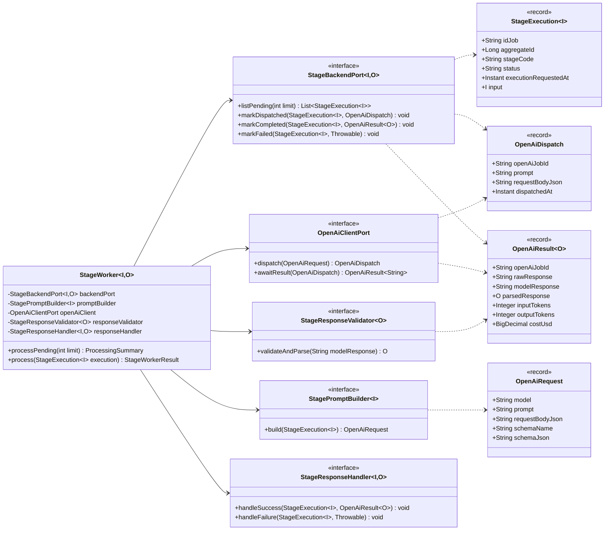
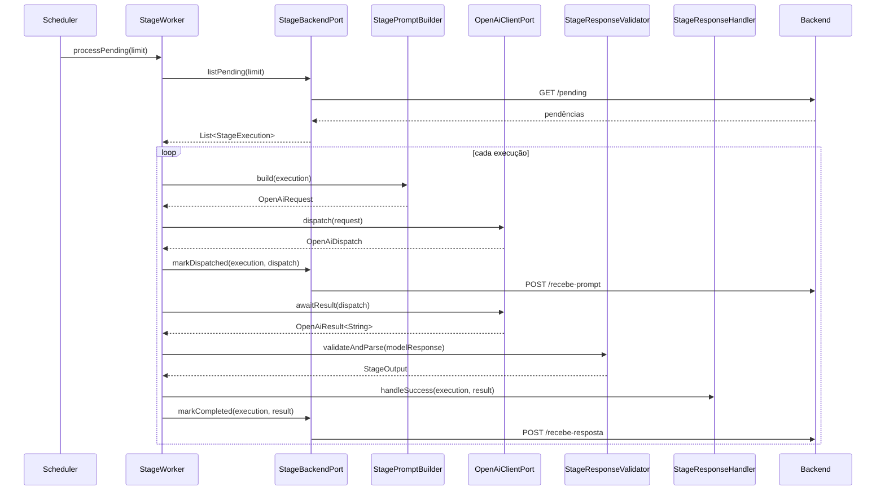

# Guia de Construção de Etapas do Worker AI

## 1. Objetivo

Este documento define um padrão genérico para construir novas etapas do **Worker AI** em integrações com OpenAI/ChatGPT.

Ele deve orientar a implementação de etapas como:

- Copy;
- Design Preset;
- Wireframe;
- Image Planning;
- Briefing;
- Landing Page Content;
- Deliverables;
- outras etapas futuras que usem IA para gerar texto ou JSON estruturado.

O objetivo é garantir que todas as etapas sigam o mesmo modelo arquitetural, sejam seguras para produção, testáveis, rastreáveis e fáceis de evoluir.

---

## 2. Ideia central

Cada etapa do Worker AI deve ser vista como uma **execução assíncrona de uma etapa textual**.

O Worker não deve ser apenas uma classe que chama a OpenAI.  
Ele deve ser um componente com ciclo completo:

```text
buscar pendências
  → montar prompt/request
  → enviar para OpenAI/ChatGPT
  → registrar dispatch no backend
  → receber resultado
  → validar resposta
  → devolver sucesso ou falha ao backend
```

Cada etapa concreta deve implementar apenas o que muda de uma etapa para outra:

```text
Copy
  → dados de entrada específicos
  → prompt específico
  → schema específico
  → endpoint específico

Design Preset
  → dados de entrada específicos
  → prompt específico
  → schema específico
  → endpoint específico
```

O restante deve ser compartilhado por um núcleo comum.

---

## 3. Princípios arquiteturais

Toda nova etapa deve seguir estes princípios:

1. **Core genérico reutilizável.**
2. **Implementação concreta por etapa.**
3. **Nenhuma etapa deve duplicar a orquestração principal.**
4. **Cada etapa deve ter configuração própria.**
5. **Cada etapa deve poder ser ligada ou desligada por propriedade.**
6. **Nenhuma etapa deve subir em produção sem configuração obrigatória.**
7. **Nenhuma etapa deve quebrar testes de outras áreas quando estiver desabilitada.**
8. **Toda resposta da OpenAI deve ser validada antes de ser enviada ao backend.**
9. **Toda execução deve ser rastreável por `idJob`.**
10. **Prompt, request, resposta, tokens, custo e erro devem ser auditáveis.**

---

## 4. Estrutura geral

A estrutura recomendada tem dois níveis:

```text
com.marketinghub.worker.openai.core
  → núcleo genérico

com.marketinghub.worker.openai.core.<stage>
  → implementação concreta da etapa
```

Exemplos:

```text
com.marketinghub.worker.openai.core.copy
com.marketinghub.worker.openai.core.designpreset
com.marketinghub.worker.openai.core.wireframe
com.marketinghub.worker.openai.core.imageplanning
```

---

## 5. Core genérico

O core genérico não deve conhecer:

- Copy;
- Wireframe;
- Design Preset;
- GeraLanding;
- Experiment;
- endpoints específicos;
- nomes de campos específicos de uma etapa.

Ele deve conhecer apenas conceitos genéricos:

```text
StageExecution
OpenAiRequest
OpenAiDispatch
OpenAiResult
StageWorker
StageBackendPort
StagePromptBuilder
StageResponseValidator
StageResponseHandler
OpenAiClientPort
```

### 5.1 Estrutura do core

```text
com.marketinghub.worker.openai.core
├── StageWorker.java
├── model
│   ├── StageExecution.java
│   ├── OpenAiRequest.java
│   ├── OpenAiDispatch.java
│   ├── OpenAiResult.java
│   ├── StageWorkerResult.java
│   └── ProcessingSummary.java
├── port
│   ├── StageBackendPort.java
│   ├── StagePromptBuilder.java
│   ├── OpenAiClientPort.java
│   ├── StageResponseValidator.java
│   └── StageResponseHandler.java
├── openai
│   ├── OpenAiClientProperties.java
│   ├── ResponsesApiOpenAiClient.java
│   └── OpenAiCostEstimator.java
└── exception
    ├── StageWorkerException.java
    └── InvalidModelResponseException.java
```

---

## 6. Implementação concreta de uma etapa

Cada nova etapa deve ter seu próprio pacote.

Modelo:

```text
com.marketinghub.worker.openai.core.<stage>
├── <Stage>WorkerConfiguration.java
├── <Stage>WorkerProperties.java
├── <Stage>BackendClient.java
├── <Stage>PromptBuilder.java
├── <Stage>ResponseValidator.java
├── <Stage>ResponseHandler.java
├── <Stage>ExecutionScheduler.java
├── <Stage>Input.java
└── <Stage>Output.java
```

Exemplo para Copy:

```text
com.marketinghub.worker.openai.core.copy
├── CopyWorkerConfiguration.java
├── CopyWorkerProperties.java
├── CopyBackendClient.java
├── CopyPromptBuilder.java
├── CopyResponseValidator.java
├── CopyResponseHandler.java
├── CopyExecutionScheduler.java
├── CopyInput.java
└── CopyOutput.java
```

Exemplo para Design Preset:

```text
com.marketinghub.worker.openai.core.designpreset
├── DesignPresetWorkerConfiguration.java
├── DesignPresetWorkerProperties.java
├── DesignPresetBackendClient.java
├── DesignPresetPromptBuilder.java
├── DesignPresetResponseValidator.java
├── DesignPresetResponseHandler.java
├── DesignPresetExecutionScheduler.java
├── DesignPresetInput.java
└── DesignPresetOutput.java
```

---

## 7. Responsabilidade de cada classe da etapa

### 7.1 `<Stage>WorkerConfiguration`

Responsável por criar os beans da etapa.

Deve:

- usar `@Configuration`;
- usar `@EnableConfigurationProperties`;
- usar `@ConditionalOnProperty`;
- criar todos os beans da etapa via `@Bean`;
- impedir que a etapa suba quando estiver desabilitada.

Não deve:

- conter regra de negócio;
- acessar backend;
- chamar OpenAI diretamente;
- ter lógica de montagem de prompt.

Exemplo conceitual:

```java
@Configuration
@EnableConfigurationProperties({
    CopyWorkerProperties.class,
    OpenAiClientProperties.class
})
@ConditionalOnProperty(
    prefix = "copy.worker",
    name = "enabled",
    havingValue = "true",
    matchIfMissing = false
)
public class CopyWorkerConfiguration {
}
```

---

### 7.2 `<Stage>WorkerProperties`

Responsável por declarar as propriedades obrigatórias da etapa.

Deve usar `@ConfigurationProperties` e validação.

Exemplo:

```java
@Validated
@ConfigurationProperties(prefix = "copy.worker")
public record CopyWorkerProperties(
    boolean enabled,

    @Min(1)
    int pendingLimit,

    @NotBlank
    String backendBaseUrl,

    String apiPrefix,

    @NotBlank
    String promptResource,

    @NotBlank
    String schemaResource,

    @NotBlank
    String schemaName,

    @NotNull
    Duration timeout,

    @NotBlank
    String cron
) {}
```

Regra de produção:

```text
Se copy.worker.enabled=true e faltar propriedade obrigatória:
  aplicação deve falhar no startup.

Se copy.worker.enabled=false ou ausente:
  nenhum bean da etapa deve subir.
```

---

### 7.3 `<Stage>BackendClient`

Implementa `StageBackendPort<I, O>`.

Responsável por conversar com o backend da aplicação.

Deve implementar:

```java
List<StageExecution<I>> listPending(int limit);

void markDispatched(StageExecution<I> execution, OpenAiDispatch dispatch);

void markCompleted(StageExecution<I> execution, OpenAiResult<O> result);

void markFailed(StageExecution<I> execution, Throwable error);
```

Responsabilidades:

- buscar execuções pendentes;
- converter payload do backend em `StageExecution<I>`;
- chamar endpoint de `recebe-prompt`;
- chamar endpoint de `recebe-resposta`;
- enviar erro ao backend quando algo falhar.

Não deve:

- montar prompt;
- chamar OpenAI;
- validar resposta do modelo;
- conter regra específica de JSON Schema.

---

### 7.4 `<Stage>PromptBuilder`

Implementa `StagePromptBuilder<I>`.

Responsável por transformar o input da etapa em `OpenAiRequest`.

Deve:

- carregar prompt markdown;
- carregar schema JSON;
- substituir placeholders;
- montar corpo da OpenAI Responses API;
- usar `text.format` com `json_schema` quando a resposta precisa ser estruturada;
- salvar no `OpenAiRequest`:
  - model;
  - prompt;
  - requestBodyJson;
  - schemaName;
  - schemaJson.

Não deve:

- chamar backend;
- chamar OpenAI;
- persistir resultado;
- tratar status da execução.

---

### 7.5 `<Stage>ResponseValidator`

Implementa `StageResponseValidator<O>`.

Responsável por validar e converter a resposta do modelo.

Deve:

- rejeitar resposta vazia;
- parsear JSON quando a saída for estruturada;
- converter para `<Stage>Output`;
- lançar `InvalidModelResponseException` se a resposta for inválida.

Mesmo usando Structured Outputs, a etapa deve validar localmente a resposta antes de enviá-la ao backend.

---

### 7.6 `<Stage>ResponseHandler`

Implementa `StageResponseHandler<I, O>`.

Responsável por comportamento complementar da etapa.

Pode:

- logar sucesso;
- logar falha;
- calcular métricas;
- normalizar payload;
- gerar artefato auxiliar local;
- aplicar pós-processamento específico.

Não deve:

- substituir `markCompleted`;
- substituir `markFailed`;
- acessar repository diretamente.

---

### 7.7 `<Stage>ExecutionScheduler`

Responsável por acionar periodicamente o `StageWorker`.

Deve:

- chamar `worker.processPending(limit)`;
- logar resumo da execução;
- ser criado apenas quando a etapa estiver habilitada.

Exemplo:

```java
@Scheduled(cron = "${copy.worker.cron:0 */30 * * * *}")
public void run() {
    ProcessingSummary summary = worker.processPending(properties.pendingLimit());
}
```

---

### 7.8 `<Stage>Input`

Representa os dados necessários para montar o prompt.

Exemplo para Copy:

```java
public record CopyInput(
    Long experimentId,
    String stageCode,
    String idJob,
    Map<String, Object> promptData
) {}
```

Exemplo para Design Preset:

```java
public record DesignPresetInput(
    Long experimentId,
    String stageCode,
    String idJob,
    Map<String, Object> promptData
) {}
```

---

### 7.9 `<Stage>Output`

Representa a resposta validada do modelo.

Pode ser genérico:

```java
public record CopyOutput(
    Map<String, Object> payload
) {}
```

Ou mais tipado:

```java
public record CopyOutput(
    String headline,
    String subheadline,
    List<String> bullets,
    String cta
) {}
```

A escolha depende do nível de estabilidade do schema.

---

## 8. Fluxo padrão de execução

```text
Scheduler
  ↓
StageWorker.processPending(limit)
  ↓
StageBackendPort.listPending(limit)
  ↓
StagePromptBuilder.build(execution)
  ↓
OpenAiClientPort.dispatch(request)
  ↓
StageBackendPort.markDispatched(execution, dispatch)
  ↓
OpenAiClientPort.awaitResult(dispatch)
  ↓
StageResponseValidator.validateAndParse(modelResponse)
  ↓
StageResponseHandler.handleSuccess(...)
  ↓
StageBackendPort.markCompleted(...)
```

Fluxo de erro:

```text
Erro em qualquer ponto
  ↓
StageResponseHandler.handleFailure(...)
  ↓
StageBackendPort.markFailed(...)
```

---

## 9. Diagrama de classes genérico



---

## 10. Diagrama de sequência genérico



---

## 11. Convenções de nomenclatura

### 11.1 Nome de pacote

Usar nome curto, em lowercase:

```text
copy
designpreset
wireframe
imageplanning
```

### 11.2 Nome de classes

```text
<Stage>WorkerConfiguration
<Stage>WorkerProperties
<Stage>BackendClient
<Stage>PromptBuilder
<Stage>ResponseValidator
<Stage>ResponseHandler
<Stage>ExecutionScheduler
<Stage>Input
<Stage>Output
```

### 11.3 Nome de propriedades

```properties
copy.worker.enabled=true
copy.worker.pending-limit=10
copy.worker.backend-base-url=https://backend
copy.worker.api-prefix=/api
copy.worker.prompt-resource=prompts/geralanding-copy.md
copy.worker.schema-resource=schemas/geralanding-copy.schema.json
copy.worker.schema-name=landing_page_copy
copy.worker.timeout=PT30M
copy.worker.cron=0 */30 * * * *
```

Para Design Preset:

```properties
design-preset.worker.enabled=true
design-preset.worker.pending-limit=10
design-preset.worker.backend-base-url=https://backend
design-preset.worker.api-prefix=/api
design-preset.worker.prompt-resource=prompts/geralanding-design-preset.md
design-preset.worker.schema-resource=schemas/geralanding-design-preset.schema.json
design-preset.worker.schema-name=landing_page_design_preset
design-preset.worker.timeout=PT30M
design-preset.worker.cron=0 */30 * * * *
```

---

## 12. Endpoints esperados por etapa

Cada etapa deve ter três endpoints internos principais no backend:

```text
GET  /api/internal/geralanding/<stage>/stage-executions/pending
POST /api/internal/geralanding/<stage>/stage-executions/{idJob}/recebe-prompt
POST /api/internal/geralanding/<stage>/stage-executions/{idJob}/recebe-resposta
```

Exemplo Copy:

```text
GET  /api/internal/geralanding/copy/stage-executions/pending
POST /api/internal/geralanding/copy/stage-executions/{idJob}/recebe-prompt
POST /api/internal/geralanding/copy/stage-executions/{idJob}/recebe-resposta
```

Exemplo Design Preset:

```text
GET  /api/internal/geralanding/design-preset/stage-executions/pending
POST /api/internal/geralanding/design-preset/stage-executions/{idJob}/recebe-prompt
POST /api/internal/geralanding/design-preset/stage-executions/{idJob}/recebe-resposta
```

---

## 13. Estados esperados no backend

O Worker deve respeitar o ciclo de estados definido pelo backend.

```text
INICIADO
  → AGUARDANDO_RETORNO_OPENAI
  → CONCLUIDO ou FALHA
```

Responsabilidades:

| Estado | Quem muda | Quando |
|---|---|---|
| `INICIADO` | Backend | Quando a execução é criada |
| `AGUARDANDO_RETORNO_OPENAI` | Backend, após callback do Worker | Quando o Worker envia `recebe-prompt` |
| `CONCLUIDO` | Backend, após callback do Worker | Quando o Worker envia resposta válida |
| `FALHA` | Backend, após callback do Worker | Quando o Worker envia erro |

---

## 14. Regras de produção

### 14.1 Feature toggle obrigatório

Toda etapa deve ter:

```properties
<stage>.worker.enabled=true|false
```

A configuração da etapa deve usar:

```java
@ConditionalOnProperty(
    prefix = "<stage>.worker",
    name = "enabled",
    havingValue = "true",
    matchIfMissing = false
)
```

Regra:

```text
Se enabled=false ou ausente:
  nenhum bean da etapa deve subir.

Se enabled=true:
  todas as propriedades obrigatórias devem ser validadas no startup.
```

---

### 14.2 Não usar default de backend em produção

Não usar:

```java
@Value("${backend.base-url:http://localhost:8000}")
```

E nunca usar:

```java
@Value("${backend.base-url:http://ip-de-producao:8000}")
```

Regra correta:

```text
Se o worker estiver habilitado e backendBaseUrl não estiver configurado:
  falhar no startup.
```

---

### 14.3 Não usar `@Component` nas classes concretas da etapa

Evitar:

```java
@Component
public class CopyBackendClient {
}
```

Preferir:

```java
@Bean
public CopyBackendClient copyBackendClient(...) {
    return new CopyBackendClient(...);
}
```

Motivo:

```text
Todos os beans da etapa devem ser controlados por uma única configuração condicional.
```

---

### 14.4 Configuração tipada

Usar `@ConfigurationProperties` para cada etapa.

Evitar espalhar muitos `@Value`.

Motivos:

- facilita validação;
- centraliza configuração;
- melhora legibilidade;
- reduz erro de digitação;
- deixa claro o contrato de configuração da etapa.

---

### 14.5 Isolamento de testes

Testes que não usam uma etapa não devem precisar configurar essa etapa.

Exemplo:

```properties
copy.worker.enabled=false
design-preset.worker.enabled=false
wireframe.worker.enabled=false
```

Ou simplesmente omitir essas propriedades, desde que `matchIfMissing=false`.

---

## 15. Regras para OpenAI/ChatGPT

### 15.1 Usar Responses API

O core deve concentrar a chamada à OpenAI em `OpenAiClientPort`.

A implementação concreta pode ser:

```text
ResponsesApiOpenAiClient
```

A etapa não deve chamar OpenAI diretamente.

---

### 15.2 Usar Structured Outputs quando houver JSON

Se a etapa espera JSON estruturado, deve usar JSON Schema.

O prompt builder deve montar request com:

```text
text.format.type = json_schema
text.format.name = <schemaName>
text.format.schema = <schemaJson>
text.format.strict = true
```

Mesmo assim, o Worker deve validar localmente a resposta antes de chamar `markCompleted`.

---

### 15.3 Registrar informações para auditoria

O request/result deve preservar:

```text
model
prompt
requestBodyJson
schemaName
schemaJson
openAiJobId
rawResponse
modelResponse
inputTokens
outputTokens
costUsd
```

---

## 16. Checklist para criar uma nova etapa

Antes de abrir PR de uma nova etapa, validar:

- [ ] Existe pacote próprio da etapa.
- [ ] A etapa implementa o core genérico.
- [ ] Existe `<Stage>WorkerConfiguration`.
- [ ] A configuração usa `@ConditionalOnProperty`.
- [ ] Existe `<Stage>WorkerProperties`.
- [ ] Propriedades obrigatórias são validadas.
- [ ] Não há `@Component` solto nas classes concretas da etapa.
- [ ] Não há default perigoso para backend.
- [ ] Existe `<Stage>BackendClient`.
- [ ] Existe `<Stage>PromptBuilder`.
- [ ] Existe `<Stage>ResponseValidator`.
- [ ] Existe `<Stage>ResponseHandler`.
- [ ] Existe `<Stage>ExecutionScheduler`.
- [ ] Existe `<Stage>Input`.
- [ ] Existe `<Stage>Output`.
- [ ] Existem prompt markdown e schema JSON no classpath.
- [ ] O prompt builder monta `OpenAiRequest`.
- [ ] O validator rejeita resposta inválida.
- [ ] O backend client chama `pending`.
- [ ] O backend client chama `recebe-prompt`.
- [ ] O backend client chama `recebe-resposta`.
- [ ] O erro é enviado para o backend.
- [ ] A etapa pode ser desligada sem quebrar testes.
- [ ] A etapa falha no startup se estiver habilitada sem configuração obrigatória.

---

## 17. Template de propriedades por etapa

```properties
<stage>.worker.enabled=true
<stage>.worker.pending-limit=10
<stage>.worker.cron=0 */30 * * * *
<stage>.worker.backend-base-url=https://backend
<stage>.worker.api-prefix=/api
<stage>.worker.prompt-resource=prompts/<prompt-file>.md
<stage>.worker.schema-resource=schemas/<schema-file>.schema.json
<stage>.worker.schema-name=<schema_name>
<stage>.worker.timeout=PT30M
```

Configurações OpenAI compartilhadas:

```properties
openai.api-key=${OPENAI_API_KEY}
openai.base-url=https://api.openai.com/v1
openai.model=gpt-5.2
openai.timeout=PT30M
openai.input-usd-per-million-tokens=0
openai.output-usd-per-million-tokens=0
```

---

## 18. Exemplo de adaptação para Copy

```text
Stage: Copy
Pacote: com.marketinghub.worker.openai.core.copy
stage path: copy
schemaName: landing_page_copy
promptResource: prompts/geralanding-copy.md
schemaResource: schemas/geralanding-copy.schema.json
Input: CopyInput
Output: CopyOutput
BackendClient: CopyBackendClient
PromptBuilder: CopyPromptBuilder
```

Endpoints:

```text
GET  /api/internal/geralanding/copy/stage-executions/pending
POST /api/internal/geralanding/copy/stage-executions/{idJob}/recebe-prompt
POST /api/internal/geralanding/copy/stage-executions/{idJob}/recebe-resposta
```

---

## 19. Exemplo de adaptação para Design Preset

```text
Stage: DesignPreset
Pacote: com.marketinghub.worker.openai.core.designpreset
stage path: design-preset
schemaName: landing_page_design_preset
promptResource: prompts/geralanding-design-preset.md
schemaResource: schemas/geralanding-design-preset.schema.json
Input: DesignPresetInput
Output: DesignPresetOutput
BackendClient: DesignPresetBackendClient
PromptBuilder: DesignPresetPromptBuilder
```

Endpoints:

```text
GET  /api/internal/geralanding/design-preset/stage-executions/pending
POST /api/internal/geralanding/design-preset/stage-executions/{idJob}/recebe-prompt
POST /api/internal/geralanding/design-preset/stage-executions/{idJob}/recebe-resposta
```

---

## 20. Anti-padrões

Evitar:

```text
- Cada etapa criar sua própria orquestração completa.
- Cada etapa chamar OpenAI diretamente.
- Cada etapa usar nomes e fluxo diferentes.
- Usar @Component em classes que deveriam ser condicionais.
- Usar URL default de backend.
- Usar um único worker gigante com if/else por stage.
- Não validar resposta do modelo.
- Enviar resposta inválida ao backend.
- Ocultar erro sem chamar recebe-resposta.
- Quebrar testes de outros módulos por configuração ausente.
```

---

## 21. Recomendação final

Toda nova etapa deve responder a estas perguntas antes de ser implementada:

1. Qual é o `stage path`?
2. Qual é o `stageCode`?
3. Qual endpoint de pending?
4. Qual endpoint de recebe-prompt?
5. Qual endpoint de recebe-resposta?
6. Qual prompt markdown?
7. Qual schema JSON?
8. Qual output esperado?
9. Quais dados de entrada são necessários?
10. Quais propriedades obrigatórias precisam existir?
11. Como a etapa será habilitada/desabilitada?
12. Como a resposta será validada?
13. O que deve ser enviado ao backend em caso de erro?

Se essas perguntas não tiverem resposta, a etapa ainda não está pronta para implementação.

---

## 22. Referências técnicas

- Spring Boot `@ConditionalOnProperty`: usado para criar beans/configurações somente quando uma propriedade do ambiente atende uma condição.
- Spring Boot `@ConfigurationProperties`: usado para vincular propriedades externas a classes/records tipados e validáveis.
- Spring Boot Externalized Configuration: permite usar o mesmo código em ambientes diferentes com configurações diferentes.
- Spring WebClient: cliente HTTP reativo e fluente usado para chamadas ao backend e à OpenAI.
- OpenAI Structured Outputs: garante aderência da resposta a um JSON Schema definido.
- OpenAI Responses API: API central para geração de respostas e integração com recursos modernos da plataforma.
