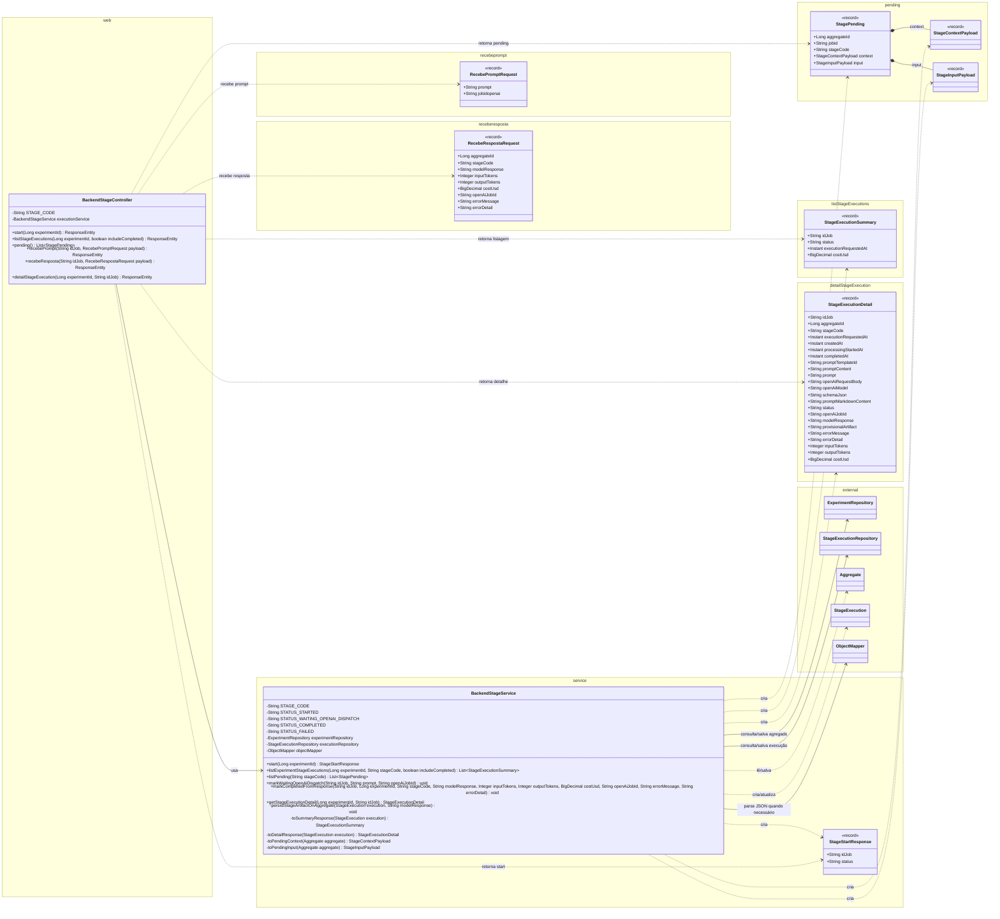
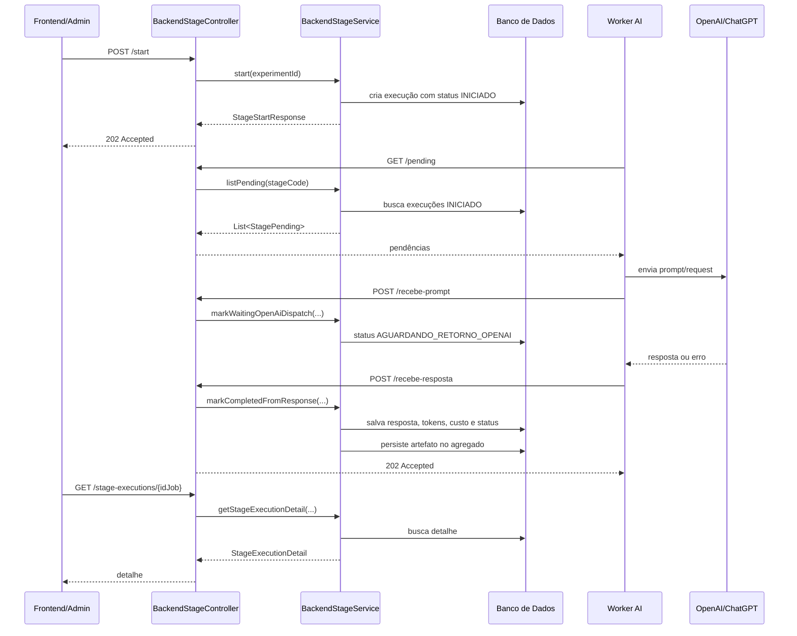

# Padrão de Backend para Integrações com OpenAI/ChatGPT

## 1. Objetivo

Este documento define um padrão arquitetural para construção de backends que integrem etapas do sistema com modelos de IA geradora de texto, tendo **OpenAI/ChatGPT como provedor padrão**.

A etapa `Wireframe` foi usada como referência inicial, mas este padrão deve ser aplicado a qualquer etapa textual do pipeline que siga o mesmo tipo de fluxo:

1. registrar uma execução;
2. disponibilizar a execução para um Worker;
3. montar e enviar prompt/request para OpenAI/ChatGPT;
4. receber a resposta da OpenAI/ChatGPT;
5. persistir o resultado;
6. permitir rastreabilidade por listagem e detalhe.

Exemplos de etapas que devem seguir este padrão:

- geração de copy;
- geração de wireframe;
- geração de briefing textual;
- planejamento textual de imagem;
- geração de conteúdo para landing page;
- geração de variações textuais;
- qualquer integração assíncrona com OpenAI/ChatGPT que gere texto.

---

## 2. Decisão arquitetural

A integração padrão do projeto será orientada para OpenAI/ChatGPT.

Outros provedores de IA só devem ser considerados exceção. Mesmo nesses casos, o backend deve preservar o mesmo ciclo interno:

```text
start
  → pending
  → recebe-prompt
  → recebe-resposta
  → detail/list
```

Portanto, o domínio do backend não deve ser modelado como uma chamada genérica qualquer de IA. Ele deve ser modelado como uma **execução rastreável de etapa textual**, com status, prompt, resposta, custo, tokens e auditoria.

---

## 3. Princípios

1. **Um pacote por etapa textual.**
2. **Controller fino.**
3. **Service central para regra de aplicação, status e persistência.**
4. **Records separados por contrato de API.**
5. **Fluxo de status explícito.**
6. **Worker consome apenas execuções pendentes.**
7. **Callback de prompt e callback de resposta são operações diferentes.**
8. **Acesso ao banco concentrado no service.**
9. **Nenhum controller acessa repository diretamente.**
10. **Nenhum record contém regra de negócio.**
11. **A etapa deve ser auditável do início ao fim.**

---

## 4. Estrutura padrão de pacotes

Cada etapa textual deve ter um pacote próprio.

Modelo:

```text
com.marketinghub.<dominio>.<stage>
├── web
│   └── Backend<Stage>Controller.java
│
├── service
│   ├── Backend<Stage>Service.java
│   ├── <Stage>StartResponse.java
│   │
│   ├── pending
│   │   ├── Record<Stage>Pending.java
│   │   ├── Record<Stage>Context.java
│   │   └── Record<Stage>Input.java
│   │
│   ├── recebeprompt
│   │   └── RecebePromptRequest.java
│   │
│   ├── receberesposta
│   │   └── RecebeRespostaRequest.java
│   │
│   ├── listStageExecutions
│   │   └── <Stage>ExecutionSummaryResponse.java
│   │
│   └── detailStageExecution
│       └── RecordBackend<Stage>DetalheDto.java
│
└── provisorio
    ├── <Stage>ProvisionalArtifactAssembler.java
    └── <Stage>ArtifactGenerator.java
```

O pacote `provisorio` é opcional. Ele deve existir apenas quando a etapa precisar gerar HTML provisório, preview, artefato temporário ou representação intermediária do resultado textual.

---

## 5. Responsabilidades por pacote

### 5.1 `web`

Contém a entrada HTTP da etapa.

Pode:

- declarar endpoints;
- receber `@PathVariable`, `@RequestParam` e `@RequestBody`;
- validar payloads com `@Valid`;
- chamar o service da etapa;
- retornar `ResponseEntity`;
- registrar logs básicos de entrada.

Não pode:

- acessar repository;
- alterar entidade diretamente;
- montar records complexos;
- executar parse de JSON de domínio;
- controlar transição de status;
- persistir resultado da OpenAI/ChatGPT.

Exemplo:

```java
@RestController
@RequestMapping("/api")
public class Backend<Stage>Controller {

    private static final String STAGE_CODE = "<stage-code>";

    private final Backend<Stage>Service executionService;

    public Backend<Stage>Controller(Backend<Stage>Service executionService) {
        this.executionService = executionService;
    }
}
```

---

### 5.2 `service`

Contém a regra de aplicação da etapa.

Pode:

- iniciar execução;
- gerar ou registrar `idJob`;
- listar execuções da etapa;
- listar pendências para o Worker;
- receber dados do prompt enviado para OpenAI/ChatGPT;
- receber resposta final da OpenAI/ChatGPT;
- alterar status da execução;
- salvar tokens, custo e erro;
- persistir o resultado final no agregado principal;
- converter entidades em records de resposta;
- acessar repositories.

Não pode:

- expor endpoint HTTP;
- depender do controller;
- retornar entidade JPA diretamente para API;
- espalhar regra de status em outros pacotes.

Regra principal:

```text
O service é o único ponto da etapa que acessa diretamente repositories.
```

---

### 5.3 `pending`

Contém o contrato consumido pelo Worker para encontrar execuções que precisam ser processadas.

Esse contrato deve carregar tudo que o Worker precisa para montar o prompt/request para OpenAI/ChatGPT.

Exemplo:

```java
public record Record<Stage>Pending(
    Long experimentId,
    String jobid,
    String stageCode,
    Record<Stage>Context context,
    Record<Stage>Input input
) {}
```

Esse record não é o mesmo contrato de detalhe. O contrato `pending` existe para processamento interno pelo Worker.

---

### 5.4 `recebeprompt`

Contém o payload recebido quando o Worker já preparou ou enviou o prompt/request para OpenAI/ChatGPT.

Exemplo:

```java
public record RecebePromptRequest(
    @NotBlank String prompt,
    @NotBlank String jobidopenai
) {}
```

Ao receber esse payload, o backend deve:

1. localizar a execução pelo `idJob`;
2. salvar o prompt ou request enviado;
3. salvar o identificador externo da OpenAI, quando existir;
4. preencher `processingStartedAt`;
5. alterar o status para `AGUARDANDO_RETORNO_OPENAI`.

---

### 5.5 `receberesposta`

Contém o payload recebido quando OpenAI/ChatGPT devolve uma resposta final ou erro.

Exemplo:

```java
public record RecebeRespostaRequest(
    Long experimentId,
    String stageCode,
    String modelResponse,
    Integer inputTokens,
    Integer outputTokens,
    BigDecimal costUsd,
    String openAiJobId,
    String errorMessage,
    String errorDetail
) {}
```

Ao receber esse payload, o backend deve:

1. localizar a execução;
2. salvar resposta do modelo;
3. salvar tokens e custo;
4. salvar mensagem e detalhe de erro, quando existirem;
5. preencher `completedAt`;
6. mudar status para `CONCLUIDO` ou `FALHA`;
7. persistir o artefato final no agregado principal.

---

### 5.6 `listStageExecutions`

Contém o contrato resumido de listagem de execuções.

Esse record deve ser pequeno e voltado para tela de histórico/listagem.

Exemplo:

```java
public record <Stage>ExecutionSummaryResponse(
    String idJob,
    String status,
    Instant executionRequestedAt,
    BigDecimal costUsd
) {}
```

Não deve conter:

- prompt completo;
- request completo da OpenAI;
- resposta completa do modelo;
- schema;
- detalhes de erro longos.

---

### 5.7 `detailStageExecution`

Contém o contrato completo de auditoria de uma execução.

Esse record deve conter os dados necessários para suporte, rastreabilidade e diagnóstico.

Exemplo:

```java
public record RecordBackend<Stage>DetalheDto(
    String idJob,
    Long experimentId,
    String stageCode,
    Instant executionRequestedAt,
    Instant createdAt,
    Instant processingStartedAt,
    Instant completedAt,
    String promptTemplateId,
    String promptContent,
    String prompt,
    String openAiRequestBody,
    String openAiModel,
    String schemaJson,
    String promptMarkdownContent,
    String status,
    String openAiJobId,
    String modelResponse,
    String provisionalArtifact,
    String errorMessage,
    String errorDetail,
    Integer inputTokens,
    Integer outputTokens,
    BigDecimal costUsd
) {}
```

---

## 6. Fluxo de estados

Toda integração assíncrona com OpenAI/ChatGPT deve seguir o ciclo abaixo.

### 6.1 Fluxo de sucesso

```text
INICIADO
    ↓
AGUARDANDO_RETORNO_OPENAI
    ↓
CONCLUIDO
```

### 6.2 Fluxo de falha

```text
INICIADO
    ↓
AGUARDANDO_RETORNO_OPENAI
    ↓
FALHA
```

### 6.3 Significado dos status

| Status | Significado | Operação responsável |
|---|---|---|
| `INICIADO` | Execução registrada e disponível para o Worker | `start(...)` |
| `AGUARDANDO_RETORNO_OPENAI` | Worker já enviou o prompt/request para OpenAI/ChatGPT | `markWaitingOpenAiDispatch(...)` |
| `CONCLUIDO` | Resposta recebida com sucesso e resultado persistido | `markCompletedFromResponse(...)` |
| `FALHA` | Resposta recebida com erro ou processamento final falhou | `markCompletedFromResponse(...)` |

---

## 7. Endpoints padrão

Os caminhos abaixo devem ser adaptados para o nome da etapa.

Use `<stage>` para o nome da etapa no path.

---

### 7.1 Iniciar execução

```http
POST /api/experiments/{experimentId}/geralanding/<stage>/start
```

Responsabilidade:

- criar execução inicial;
- gerar `idJob`;
- salvar status `INICIADO`;
- retornar resposta mínima com `idJob` e `status`.

Retorno sugerido:

```java
public record <Stage>StartResponse(
    String idJob,
    String status
) {}
```

---

### 7.2 Listar execuções da etapa

```http
GET /api/experiments/{experimentId}/geralanding/<stage>/stage-executions
```

Responsabilidade:

- listar execuções recentes da etapa;
- retornar dados resumidos;
- permitir filtro para incluir ou excluir concluídas.

Retorno sugerido:

```java
List<<Stage>ExecutionSummaryResponse>
```

---

### 7.3 Buscar pendências para o Worker

```http
GET /api/internal/geralanding/<stage>/stage-executions/pending
```

Responsabilidade:

- buscar execuções com status `INICIADO`;
- montar payload suficiente para o Worker;
- não alterar status;
- não marcar como enviado.

Retorno sugerido:

```java
List<Record<Stage>Pending>
```

---

### 7.4 Receber prompt enviado para OpenAI/ChatGPT

```http
POST /api/internal/geralanding/<stage>/stage-executions/{idJob}/recebe-prompt
```

Responsabilidade:

- salvar prompt/request enviado;
- salvar `openAiJobId`;
- preencher `processingStartedAt`;
- alterar status para `AGUARDANDO_RETORNO_OPENAI`.

Payload sugerido:

```java
RecebePromptRequest
```

---

### 7.5 Receber resposta final da OpenAI/ChatGPT

```http
POST /api/internal/geralanding/<stage>/stage-executions/{idJob}/recebe-resposta
```

Responsabilidade:

- salvar `modelResponse`;
- salvar tokens e custo;
- salvar erro, quando existir;
- preencher `completedAt`;
- alterar status para `CONCLUIDO` ou `FALHA`;
- persistir o artefato final no experimento ou agregado principal.

Payload sugerido:

```java
RecebeRespostaRequest
```

---

### 7.6 Consultar detalhe da execução

```http
GET /api/experiments/{experimentId}/geralanding/<stage>/stage-executions/{idJob}
```

Responsabilidade:

- retornar detalhe completo da execução;
- permitir auditoria;
- permitir diagnóstico técnico;
- expor dados de prompt, request, resposta, erro, custo e tokens.

Retorno sugerido:

```java
RecordBackend<Stage>DetalheDto
```

---

## 8. Regras de dependência interna

As dependências devem seguir esta direção:

```text
web
 ↓
service
 ↓
repositories
 ↓
banco de dados
```

Os subpacotes de contrato são usados por `web` e `service`, mas não devem depender deles.

```text
pending
recebeprompt
receberesposta
listStageExecutions
detailStageExecution
```

Regras obrigatórias:

1. `web` pode depender de `service` e dos records de contrato.
2. `service` pode depender dos records de contrato, repositories e entidades.
3. Records não dependem de controller.
4. Records não dependem de service.
5. Records não acessam repository.
6. Controller não acessa repository.
7. Repository não depende da etapa.
8. O acesso direto ao banco fica no service da etapa.
9. Não deve haver dependência circular entre subpacotes.
10. A transição de status fica no service.

---

## 9. Regras para records

Cada endpoint deve ter um contrato próprio quando o formato ou a finalidade da resposta for diferente.

Não usar um único record gigante para todos os endpoints.

Separação recomendada:

```text
start              → <Stage>StartResponse
list executions    → <Stage>ExecutionSummaryResponse
pending            → Record<Stage>Pending
recebe-prompt      → RecebePromptRequest
recebe-resposta    → RecebeRespostaRequest
detail             → RecordBackend<Stage>DetalheDto
```

Regras:

1. `StartResponse` é mínimo.
2. `ExecutionSummaryResponse` é para listagem.
3. `Pending` é para consumo interno pelo Worker.
4. `RecebePromptRequest` é para callback de prompt/request enviado.
5. `RecebeRespostaRequest` é para callback de resposta final.
6. `DetalheDto` é completo e usado para auditoria.

---

## 10. Regras de persistência

A entidade de execução da etapa deve registrar, no mínimo:

- `idJob`;
- `experimentId` ou identificador do agregado principal;
- `stageCode`;
- `status`;
- `executionRequestedAt`;
- `createdAt`;
- `processingStartedAt`;
- `completedAt`;
- `prompt`;
- `openAiRequestBody`, se existir;
- `openAiModel`, se existir;
- `schemaJson`, se existir;
- `openAiJobId`;
- `modelResponse`;
- `errorMessage`;
- `errorDetail`;
- `inputTokens`;
- `outputTokens`;
- `costUsd`.

O resultado final da OpenAI/ChatGPT deve ser persistido também no agregado principal quando fizer parte do estado de negócio.

Exemplos:

```text
Experiment.landingPageWireframe
Experiment.landingPageCopy
Experiment.imagePlanning
```

---

## 11. Integração com OpenAI/ChatGPT

A implementação padrão deve considerar OpenAI/ChatGPT como provedor principal.

Campos recomendados na execução:

```text
openAiJobId
openAiModel
openAiRequestBody
prompt
schemaJson
modelResponse
inputTokens
outputTokens
costUsd
```

Regras:

1. O backend deve persistir o request enviado à OpenAI sempre que possível.
2. O backend deve persistir o identificador externo da OpenAI.
3. O backend deve persistir a resposta bruta ou estruturada recebida.
4. O backend deve persistir tokens e custo quando disponíveis.
5. O backend deve permitir auditoria completa por `idJob`.
6. Se for usado JSON estruturado, o schema deve ser versionável e auditável.
7. O Worker é responsável por chamar OpenAI/ChatGPT; o backend é responsável por registrar o ciclo de execução.

---

## 12. Diagrama de classes padrão



---

## 13. Diagrama de sequência padrão



---

## 14. Checklist para nova integração OpenAI/ChatGPT

Antes de considerar uma nova etapa pronta, validar:

- [ ] Existe pacote próprio para a etapa.
- [ ] Existe controller em `web`.
- [ ] Existe service central da etapa.
- [ ] Controller não acessa repository.
- [ ] Service concentra acesso ao banco.
- [ ] Existe endpoint de start.
- [ ] Existe endpoint de pending.
- [ ] Existe endpoint de recebe-prompt.
- [ ] Existe endpoint de recebe-resposta.
- [ ] Existe endpoint de listagem.
- [ ] Existe endpoint de detalhe.
- [ ] Status seguem o ciclo `INICIADO → AGUARDANDO_RETORNO_OPENAI → CONCLUIDO/FALHA`.
- [ ] Pending retorna apenas execuções `INICIADO`.
- [ ] Recebe-prompt muda para `AGUARDANDO_RETORNO_OPENAI`.
- [ ] Recebe-resposta muda para `CONCLUIDO` ou `FALHA`.
- [ ] Resposta da OpenAI/ChatGPT é persistida na execução.
- [ ] Artefato final é persistido no agregado principal.
- [ ] Tokens e custo são persistidos.
- [ ] Erros são persistidos.
- [ ] Records estão separados por contrato.
- [ ] Não existe record único gigante usado por todos os endpoints.
- [ ] Não existe dependência circular entre pacotes.
- [ ] `openAiJobId` é salvo quando disponível.
- [ ] `openAiRequestBody` é salvo quando disponível.
- [ ] `openAiModel` é salvo quando disponível.
- [ ] `schemaJson` é salvo quando houver saída estruturada.

---

## 15. Convenções de nomenclatura

Use `<Stage>` em PascalCase para classes:

```text
Wireframe
Copy
ImagePlanning
DesignPreset
```

Use `<stage>` em kebab-case para path e `stageCode`:

```text
landing-page-wireframe
landing-page-copy
landing-page-image-planning
landing-page-design-preset
```

Padrão de classes:

```text
Backend<Stage>Controller
Backend<Stage>Service
<Stage>StartResponse
<Stage>ExecutionSummaryResponse
Record<Stage>Pending
RecordBackend<Stage>DetalheDto
RecebePromptRequest
RecebeRespostaRequest
```

---

## 16. Quando criar services menores

O padrão permite começar com um `Backend<Stage>Service` central.

Se o service crescer muito, ele pode ser dividido em casos de uso menores:

```text
Backend<Stage>StartService
Backend<Stage>PendingService
Backend<Stage>DispatchService
Backend<Stage>CompletionService
Backend<Stage>QueryService
```

Mesmo com essa divisão, a regra continua:

```text
controller → service/casos de uso → repositories
```

E a transição de status continua centralizada na camada de service.

---

## 17. Observações finais

Este padrão deve ser usado como referência para qualquer backend que integre com OpenAI/ChatGPT de forma assíncrona para geração de texto.

A separação entre `pending`, `recebeprompt` e `receberesposta` é obrigatória porque cada operação representa uma fase diferente do ciclo da integração:

```text
pending
  → backend disponibiliza trabalho para o Worker

recebeprompt
  → Worker informa que enviou o prompt/request para OpenAI/ChatGPT

receberesposta
  → Worker informa que recebeu o resultado final da OpenAI/ChatGPT
```

Essa separação melhora rastreabilidade, facilita diagnóstico, reduz ambiguidade de status e torna o backend mais previsível para novas etapas.
