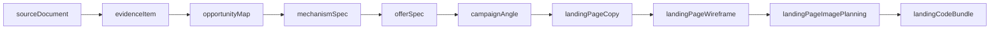

# Modelo Canônico de Artefatos do Pipeline de Experimento

Este documento define o **modelo canônico** dos artefatos do pipeline de experimento, seguindo uma estrutura semelhante ao exemplo fornecido.

## Tabela canônica (artefato → função → campos-chave → origem)

| Artefato | Função | Campos-chave | Origem |
|---|---|---|---|
| `sourceDocument` | Registro bruto da fonte consultada | `sourceType`, `sourceUrl`, `rawText`, `fetchedAt`, `permissionState` | Código |
| `evidenceItem` | Trecho/fato normalizado extraído da fonte | `claim`, `excerpt`, `url`, `citation`, `confidence`, `tags` | Código/LLM |
| `opportunityMap` | Mapa de oportunidade de mercado e demanda | `market`, `problem`, `demandSignals`, `competitionSignals`, `references` | LLM |
| `mechanismSpec` | Definição do mecanismo/solução proposta | `problem`, `causalModel`, `intervention`, `proofBase`, `limitations` | LLM |
| `offerSpec` | Definição estruturada da oferta/produto | `promise`, `scope`, `deliverables`, `constraints`, `pricingIdea` | LLM |
| `campaignAngle` | Ângulo estratégico por variação de comunicação | `visualAngle`, `hook`, `promise`, `objections`, `messageMatch` | LLM |
| `landingPageCopy` | Texto da landing estruturado para validação e renderização | `pageGoal`, `messageMatchSource`, `messageMatchNotes`, `primaryCTA`, `complianceNotes`, `hero`, `bodySections`, `ctaBlocks`, `faq`, `consistencyChecks` | LLM |
| `landingPageWireframe` | Estrutura/layout por seção + contrato do formulário | `variantLayoutId`, `sectionOrder`, `mobilePriorityNotes`, `ctaPlacementNotes`, `formPlacementNotes`, `formSpec`, `consistencyChecks` | LLM |
| `landingPageImagePlanning` | Planejamento visual da landing com binding canônico por seção/imagem | `pageGoal`, `images[]`, `consistencyChecks[]`, `sectionId`, `imageBindingKey`, `imageRole`, `conversionRole`, `layoutBinding` | LLM |
| `landingCodeBundle` | Entrega final da página renderizada/publicável | `html`, `css`, `js`, `imageRefs`, `metadata` | Builder |

## Artefato do item **Texto da Landing** (`LANDING_PAGE_COPY`)

No pipeline operacional, o item visual **Texto da Landing** corresponde ao artefato `landingPageCopy`, persistido em `experiment.landing_page_copy` e gerado na seção `LANDING_PAGE_COPY`.

### Campos canônicos obrigatórios

- Raiz de `landingPageCopy`:
  - `pageGoal`
  - `messageMatchSource`
  - `messageMatchNotes`
  - `primaryCTA`
  - `complianceNotes`
- Bloco `hero`:
  - `eyebrow`, `headline`, `subheadline`, `promise`, `supportingCopy`
  - `proofBadge`, `microcopy`, `ctaLabel`, `ctaUrl`, `ctaMatchNotes`
- Bloco `bodySections[]` (mínimo 4 itens):
  - `sectionId`, `sectionType`, `title`, `summary`, `bullets`, `copy`
  - `ctaSupport`, `sectionDependsOn`, `messageMatchNotes`
- Bloco `ctaBlocks[]` (mínimo 2 itens):
  - `placement`, `ctaVariant`, `ctaLabel`, `ctaUrl`, `matchAdCta`
  - `ctaSupport`, `messageMatchNotes`
- Bloco `faq[]` (mínimo 3 itens):
  - `question`, `answer`, `objectionTag`
- Bloco `consistencyChecks[]` (mínimo 2 itens):
  - `check`, `status`, `details`

### Regras de validação críticas do item

1. `hero.ctaLabel`, `primaryCTA`, `ctaBlocks[].ctaLabel` e `ctaBlocks[].matchAdCta` devem manter igualdade com o CTA oficial do anúncio.
2. `messageMatchSource` deve citar a headline do anúncio de origem.
3. `bodySections[].sectionDependsOn` deve usar apenas: `primaryPromise`, `mechanismSummary`, `proofSummary` ou `primaryCTA`.
4. `consistencyChecks[]` deve incluir explicitamente: `CTA_MATCH`, `PROMISE_MATCH` e `GOOGLE_LANDING_BEST_PRACTICES`.
5. `complianceNotes` deve deixar explícito que a entrega é digital/automatizada.

## Artefato do item **Layout da Landing** (`LANDING_PAGE_WIREFRAME`)

No pipeline operacional, o item **Layout da Landing** corresponde ao artefato `landingPageWireframe`, persistido em `experiment.landing_page_wireframe` e gerado na seção `LANDING_PAGE_WIREFRAME`.

### Envelope do artefato (saída canônica do pipeline)

- `artifact.artifactType`: `experiment.landing.layout`
- `artifact.artifactVersion`: `v1`
- `artifact.status`: `DRAFT | VALIDATED | APPROVED`
- `artifact.parentArtifactIds`: lista de dependências de artefatos anteriores
- `artifact.content`: payload canônico do wireframe (`landingPageWireframe`)

### Campos canônicos obrigatórios

- Raiz de `landingPageWireframe`:
  - `pageGoal`
  - `variantLayoutId` (`form-first`, `proof-first`, `story-first`)
  - `sectionOrder[]` (mínimo 4 itens)
  - `consistencyChecks[]` (mínimo 2 itens)
  - `formSpec`
- Bloco `sectionOrder[]`:
  - `sectionId`, `sectionName`, `objective`, `contentType`
  - `copySource`, `uiNotes`, `messageMatchDependency`, `sectionDependsOn`
  - `mobilePriorityScore` (1..10), `dropOffRisk` (`baixo`, `medio`, `alto`)
  - `surfaceSpec` (obrigatório)
  - `ctaSlot` (opcional, mas recomendado para seções com CTA)
- Bloco `sectionOrder[].surfaceSpec`:
  - `surfaceToken`
  - `style` (`band`, `solid`, `gradient-soft`, `image-tint`)
  - `contrastMode` (`normal`, `high`, `soft`)
  - `notes`
- Bloco `sectionOrder[].ctaSlot`:
  - `hasCta`
  - `ctaLabel`
  - `ctaVariant` (`hero`, `mid`, `final`, `sticky`, `inline`)
  - `matchAdCta`
  - `notes`
- Notas de apoio:
  - `mobilePriorityNotes`
  - `ctaPlacementNotes`
  - `formPlacementNotes`
- Bloco `formSpec`:
  - `formId`, `title`, `submitLabel`, `submitTarget`
  - `fields[]` com `id`, `name`, `label`, `type`, `required`, `placeholder`, `autocomplete`, `helpText`
  - `consent` com `enabled`, `required`, `label`
  - `successState` com `title`, `message`

### Regras de validação críticas do item

1. O wireframe deve preservar **message match** com a copy de landing e com o CTA oficial do anúncio.
2. `sectionOrder[].sectionId` deve manter rastreabilidade com os demais artefatos (`landingPageCopy`, `landingPageImagePlanning`, `landingCodeBundle`).
3. Cada bloco em `sectionOrder[]` deve declarar `mobilePriorityScore`, `dropOffRisk` e `surfaceSpec`.
4. `formSpec` é a **fonte única da verdade** para os campos do formulário na etapa de `LANDING_PAGE_HTML` (sem inventar/remover/renomear campos).
5. `variantLayoutId` deve ficar restrito aos valores canônicos (`form-first`, `proof-first`, `story-first`).

## Artefato do item **Planejamento de Imagens da Landing** (`LANDING_PAGE_IMAGE_PLANNING`)

No pipeline operacional, o item **Planejamento de Imagens da Landing** corresponde ao artefato `landingPageImagePlanning`, persistido em `experiment.landing_page_image_planning` e gerado na seção `LANDING_PAGE_IMAGE_PLANNING`.

### Envelope do artefato (saída canônica do pipeline)

- `artifact.artifactType`: `experiment.landing.image-planning`
- `artifact.artifactVersion`: `v1`
- `artifact.status`: `DRAFT | VALIDATED | APPROVED`
- `artifact.parentArtifactIds`: lista de dependências de artefatos anteriores
- `artifact.content`: payload canônico de planejamento (`landingPageImagePlanning`)

### Campos canônicos obrigatórios

- Raiz de `landingPageImagePlanning`:
  - `pageGoal`
  - `images[]` (mínimo 4 itens)
  - `consistencyChecks[]` (mínimo 3 itens)
- Campos de apoio de raiz (recomendados no contrato atual):
  - `visualDirectionSummary`
  - `sequencingNotes`
  - `ctaIntegrationNotes`
- Bloco `images[]`:
  - Identificação/rastreabilidade:
    - `sectionId`
    - `sectionName`
    - `imageBindingKey` (slug canônico: `^[a-z0-9_\-]{3,64}$`)
  - Função visual e de conversão:
    - `imageRole`
    - `conversionRole`
    - `emotionalJob`
    - `sectionVisualGoal`
    - `objective`
    - `placement` (`hero`, `benefit`, `mechanism`, `proof`, `offer`, `faq`, `cta`)
    - `hierarchyLevel` (`primary`, `secondary`, `support`)
    - `attentionPriority` (`high`, `medium`, `low`)
    - `visualWeight` (`primary`, `secondary`, `support`)
    - `distanceToCTA` (`near`, `medium`, `far`)
    - `supportsFormConversion` (boolean)
    - `formRelationNotes`
  - Prompting e direção criativa:
    - `imagePrompt`
    - `negativePrompt`
    - `generationHints[]`
    - `visualStyle`
    - `composition`
    - `focalPoint`
    - `supportingElements[]`
    - `mood`
    - `messageMatchNotes`
    - `complianceNotes`
  - Layout e constraints:
    - `layoutBinding.preferredDesktopPlacement` (`left`, `right`, `center`, `background`)
    - `layoutBinding.preferredMobilePlacement` (`above-copy`, `below-copy`, `inline`, `background`)
    - `layoutBinding.desktopAspectRatio`
    - `layoutBinding.mobileAspectRatio`
    - `layoutBinding.allowCrop`
    - `layoutBinding.safeCropZones.top|right|bottom|left` (0..1)
    - `dimensions.desktop`
    - `dimensions.mobile`
    - `safeMargins`
    - `textOverlayGuidance`

### Chaves de binding usadas nas integrações posteriores

- Chave primária canônica por imagem no plano:
  - `sectionId + imageBindingKey`
- Chaves obrigatórias que devem ser refletidas no HTML final (atributos `data-*`):
  - `data-image-section-id` ← `sectionId`
  - `data-image-binding-key` ← `imageBindingKey`
  - `data-image-role` ← `imageRole`
  - `data-conversion-role` ← `conversionRole`
  - `data-attention-priority` ← `attentionPriority`
  - `data-visual-weight` ← `visualWeight`
  - `data-distance-to-cta` ← `distanceToCTA`
  - `data-supports-form-conversion` ← `supportsFormConversion`

### Regras de validação críticas do item

1. `images[]` deve conter ao menos 4 itens e cada `sectionId` deve existir no `landingPageWireframe.sectionOrder[]`.
2. Cada item de `images[]` deve conter todos os campos mandatórios de contrato: `sectionId`, `sectionName`, `imageBindingKey`, `imageRole`, `conversionRole`, `emotionalJob`, `sectionVisualGoal`, `placement`, `hierarchyLevel`, `objective`, `layoutBinding`, `attentionPriority`, `visualWeight`, `distanceToCTA`, `supportsFormConversion`, `formRelationNotes`, `imagePrompt`, `dimensions` e `messageMatchNotes`.
3. `imageBindingKey` deve ser curto/canônico e único no contexto do plano; quando necessário o pipeline normaliza para slug.
4. `consistencyChecks[]` deve incluir explicitamente: `IMAGE_MESSAGE_MATCH`, `VISUAL_HIERARCHY` e `CTA_CONTINUITY`.
5. O par `sectionId/imageBindingKey` é a referência oficial para validação de aderência entre `LANDING_PAGE_IMAGE_PLANNING` e `LANDING_PAGE_HTML`.

## Artefato do item **HTML da Landing** (`LANDING_PAGE_HTML`)

No pipeline operacional, o item **HTML da Landing** corresponde ao artefato `landingPageHtml`, persistido em `experiment.landing_page_html` e gerado na seção `LANDING_PAGE_HTML`.

### Envelope do artefato (saída canônica do pipeline)

- `artifact.artifactType`: `experiment.landing.html`
- `artifact.artifactVersion`: `v1`
- `artifact.status`: `DRAFT | VALIDATED | APPROVED`
- `artifact.parentArtifactIds`: lista de dependências de artefatos anteriores
- `artifact.content`: payload canônico final (`landingPageHtml`)

### Campos canônicos obrigatórios

- Raiz de `landingPageHtml`:
  - `htmlDocument` (documento HTML completo com `<style>` e `<script>` internos)
  - `summary` (resumo curto das decisões de implementação)
  - `consistencyChecks[]` (mínimo 3 itens)
- Bloco `consistencyChecks[]`:
  - `check`, `status`, `details`
  - Deve incluir explicitamente: `CTA_MATCH`, `PROMISE_MATCH`, `IMAGE_PLAN_BINDING`, `SURFACE_SPEC_BINDING`, `FORM_SPEC_BINDING` e `FORM_USABILITY`

### Artefatos de entrada obrigatórios consumidos pelo `LANDING_PAGE_HTML`

- `landingPageCopy`:
  - narrativa da página
  - `messageMatchSource`, `primaryCTA`, blocos `hero/bodySections/ctaBlocks`
- `landingPageWireframe`:
  - ordem e hierarquia de `sectionOrder[]`
  - `surfaceSpec` por seção
  - `formSpec` como fonte única da verdade para o formulário
- `landingPageImagePlanning`:
  - plano de imagens por `sectionId + imageBindingKey`
  - metadados de conversão e prioridade para binding em `data-*`

### Chaves e atributos canônicos de binding no HTML

- Em cada `<section>`:
  - `data-section-id` ← `wireframe.sectionOrder[].sectionId`
  - `data-surface-token` ← `wireframe.sectionOrder[].surfaceSpec.surfaceToken`
  - `data-surface-style` ← `wireframe.sectionOrder[].surfaceSpec.style`
  - `data-surface-contrast` ← `wireframe.sectionOrder[].surfaceSpec.contrastMode`
- Em cada `` (binding obrigatório com o plano de imagens):
  - `data-image-section-id` ← `landingPageImagePlanning.images[].sectionId`
  - `data-image-binding-key` ← `landingPageImagePlanning.images[].imageBindingKey`
  - `data-image-role` ← `landingPageImagePlanning.images[].imageRole`
  - `data-conversion-role` ← `landingPageImagePlanning.images[].conversionRole`
  - `data-attention-priority` ← `landingPageImagePlanning.images[].attentionPriority`
  - `data-visual-weight` ← `landingPageImagePlanning.images[].visualWeight`
  - `data-distance-to-cta` ← `landingPageImagePlanning.images[].distanceToCTA`
  - `data-supports-form-conversion` ← `landingPageImagePlanning.images[].supportsFormConversion`

### Regras de validação críticas do item

1. O `htmlDocument` deve ser completo (com `<style>` e `<script>` internos), sem dependências externas.
2. O CTA principal no HTML deve repetir exatamente o CTA oficial já definido nos artefatos anteriores.
3. O formulário deve reproduzir exatamente `wireframe.formSpec` (sem inventar/remover/renomear campos e sem alterar `required`).
4. Todas as seções renderizadas devem manter `data-section-id` e refletir `surfaceSpec` via `data-surface-token`, `data-surface-style` e `data-surface-contrast`.
5. Toda `` deve usar `src` absoluto válido (`https://...` ou `data:image/...`) e manter binding canônico com `data-image-section-id + data-image-binding-key`.
6. `consistencyChecks[]` deve registrar a aderência de CTA, promessa, formulário, surfaces e binding de imagens.

## Dependência lógica sugerida



## Regras de consistência entre artefatos

1. `evidenceItem` deve referenciar a origem em `sourceDocument` por `citation`/`url`.
2. `campaignAngle` deve manter **message match** com `offerSpec` e `mechanismSpec`.
3. `landingPageCopy`, `landingPageWireframe` e `landingPageImagePlanning` devem compartilhar o mesmo `sectionId` para cada seção.
4. `landingCodeBundle` deve manter rastreabilidade de ativos por `imageRefs` e metadados em `metadata`.
5. Todo artefato gerado por IA deve preservar metadados de auditoria (por exemplo: `model` e `prompt`) no fluxo de persistência.

## Exemplo mínimo de payload canônico (JSON)

```json
{
  "sourceDocument": {
    "sourceType": "url",
    "sourceUrl": "https://exemplo.com/artigo",
    "rawText": "...",
    "fetchedAt": "2026-04-10T10:00:00Z",
    "permissionState": "allowed"
  },
  "evidenceItem": {
    "claim": "Usuários valorizam implementação rápida",
    "excerpt": "...",
    "url": "https://exemplo.com/artigo",
    "citation": "Estudo X, seção 2",
    "confidence": 0.84,
    "tags": ["velocidade", "valor"]
  },
  "opportunityMap": {
    "market": "PMEs",
    "problem": "Baixa previsibilidade de geração de leads",
    "demandSignals": ["busca crescente", "dor recorrente"],
    "competitionSignals": ["mensagens genéricas"],
    "references": ["evidenceItem:1"]
  },
  "mechanismSpec": {
    "problem": "Conversão inconsistente",
    "causalModel": "Falta de message match entre anúncio e landing",
    "intervention": "Estruturar promessa + prova + CTA por seção",
    "proofBase": ["case interno", "benchmark"],
    "limitations": ["depende de tráfego qualificado"]
  },
  "offerSpec": {
    "promise": "Landing validada em dias, não semanas",
    "scope": "Diagnóstico + copy + layout + publicação",
    "deliverables": ["copy", "layout", "bundle"],
    "constraints": ["janela de campanha curta"],
    "pricingIdea": "setup + recorrência"
  },
  "campaignAngle": {
    "visualAngle": "clareza de resultado",
    "hook": "Pare de desperdiçar clique",
    "promise": "Mais aproveitamento do tráfego pago",
    "objections": ["já tentei antes"],
    "messageMatch": "alto"
  },
  "landingPageCopy": {
    "pageGoal": "Capturar leads qualificados para diagnóstico",
    "messageMatchSource": "headline_ad: Pare de desperdiçar clique",
    "messageMatchNotes": "Promessa e CTA mantidos do anúncio",
    "primaryCTA": "Quero minha landing",
    "complianceNotes": "Entrega 100% digital e automatizada",
    "hero": {
      "eyebrow": "Para PMEs com tráfego pago",
      "headline": "Converta mais com consistência",
      "subheadline": "Organize promessa, prova e CTA sem fricção",
      "promise": "Mais aproveitamento do tráfego pago",
      "supportingCopy": "Aplicação rápida com foco em resultado",
      "proofBadge": "+120 projetos",
      "microcopy": "Sem consultoria presencial",
      "ctaLabel": "Quero minha landing",
      "ctaUrl": "/formulario",
      "ctaMatchNotes": "Mesmo CTA do anúncio"
    },
    "bodySections": [
      {
        "sectionId": "pain-01",
        "sectionType": "pain",
        "title": "Pare de perder cliques",
        "summary": "Seu tráfego existe, mas não converte",
        "bullets": ["mensagem desalinhada", "falta de prova"],
        "copy": "...",
        "ctaSupport": "Ajuste em poucos dias",
        "sectionDependsOn": "primaryPromise",
        "messageMatchNotes": "Conecta com dor do anúncio"
      },
      {
        "sectionId": "mechanism-01",
        "sectionType": "mechanism",
        "title": "Como funciona",
        "summary": "Processo guiado por dados",
        "bullets": ["copy", "layout", "publicação"],
        "copy": "...",
        "ctaSupport": "Fluxo padronizado",
        "sectionDependsOn": "mechanismSummary",
        "messageMatchNotes": "Mesma promessa, mais profundidade"
      },
      {
        "sectionId": "proof-01",
        "sectionType": "proof",
        "title": "Provas objetivas",
        "summary": "Resultados em cenários similares",
        "bullets": ["cases", "métricas"],
        "copy": "...",
        "ctaSupport": "Confiança para avançar",
        "sectionDependsOn": "proofSummary",
        "messageMatchNotes": "Reforça credibilidade"
      },
      {
        "sectionId": "cta-01",
        "sectionType": "cta",
        "title": "Pronto para aplicar",
        "summary": "Comece hoje",
        "bullets": ["setup rápido"],
        "copy": "...",
        "ctaSupport": "Sem complexidade",
        "sectionDependsOn": "primaryCTA",
        "messageMatchNotes": "Fechamento com CTA oficial"
      }
    ],
    "ctaBlocks": [
      {
        "placement": "hero",
        "ctaVariant": "primary",
        "ctaLabel": "Quero minha landing",
        "ctaUrl": "/formulario",
        "matchAdCta": "Quero minha landing",
        "ctaSupport": "Comece agora",
        "messageMatchNotes": "Match total"
      },
      {
        "placement": "final",
        "ctaVariant": "sticky",
        "ctaLabel": "Quero minha landing",
        "ctaUrl": "/formulario",
        "matchAdCta": "Quero minha landing",
        "ctaSupport": "Última chamada",
        "messageMatchNotes": "Match total"
      }
    ],
    "faq": [
      {
        "question": "Preciso de equipe técnica interna?",
        "answer": "Não, o fluxo já entrega os blocos prontos.",
        "objectionTag": "execucao"
      },
      {
        "question": "Quanto tempo para publicar?",
        "answer": "Normalmente em poucos dias.",
        "objectionTag": "prazo"
      },
      {
        "question": "Funciona para nichos diferentes?",
        "answer": "Sim, ajustando copy e prova por contexto.",
        "objectionTag": "aderencia"
      }
    ],
    "consistencyChecks": [
      {
        "check": "CTA_MATCH",
        "status": "PASS",
        "details": "CTA alinhado entre anúncio e landing"
      },
      {
        "check": "PROMISE_MATCH",
        "status": "PASS",
        "details": "Promessa do anúncio refletida no hero"
      },
      {
        "check": "GOOGLE_LANDING_BEST_PRACTICES",
        "status": "PASS",
        "details": "Oferta clara e continuidade pós-clique"
      }
    ]
  },
  "landingPageWireframe": {
    "pageGoal": "Capturar leads qualificados para diagnóstico",
    "variantLayoutId": "form-first",
    "sectionOrder": [
      {
        "sectionId": "hero",
        "sectionName": "Hero + Form",
        "objective": "Reforçar promessa e capturar lead acima da dobra",
        "contentType": "hero",
        "copySource": "landingPageCopy.hero",
        "uiNotes": "Bloco compacto com alto contraste",
        "messageMatchDependency": "headline_ad",
        "sectionDependsOn": "primaryPromise",
        "mobilePriorityScore": 10,
        "dropOffRisk": "baixo",
        "surfaceSpec": {
          "surfaceToken": "surface-base",
          "style": "solid",
          "contrastMode": "high",
          "notes": "Priorizar leitura do título e CTA"
        },
        "ctaSlot": {
          "hasCta": true,
          "ctaLabel": "Quero minha landing",
          "ctaVariant": "hero",
          "matchAdCta": "Quero minha landing",
          "notes": "CTA principal acima da dobra"
        }
      }
    ],
    "mobilePriorityNotes": "Hero e formulário primeiro; FAQ no final.",
    "ctaPlacementNotes": "CTA em hero, meio e fechamento.",
    "formPlacementNotes": "Formulário ancorado no hero para menor atrito.",
    "consistencyChecks": [
      {
        "check": "CTA_MATCH",
        "status": "PASS",
        "details": "CTA do wireframe igual ao anúncio"
      },
      {
        "check": "MESSAGE_MATCH",
        "status": "PASS",
        "details": "Hierarquia e narrativa compatíveis com a copy"
      }
    ],
    "formSpec": {
      "formId": "lead-capture-primary",
      "title": "Receber a prévia do Kit (IA)",
      "submitLabel": "Desbloquear o Kit (receber a prévia gerada por IA)",
      "submitTarget": "#desbloquear",
      "fields": [
        {
          "id": "nome",
          "name": "nome",
          "label": "Nome",
          "type": "text",
          "required": true,
          "placeholder": "Seu nome",
          "autocomplete": "name",
          "helpText": "Como devemos te chamar"
        }
      ],
      "consent": {
        "enabled": true,
        "required": false,
        "label": "Aceito receber a prévia no contato informado."
      },
      "successState": {
        "title": "Prévia enviada",
        "message": "Confira seu e-mail para acessar o material."
      }
    }
  },
  "landingPageImagePlanning": {
    "pageGoal": "Conectar promessa do anúncio ao CTA principal com reforço visual por seção",
    "visualDirectionSummary": "Estilo realista editorial, foco em clareza e continuidade narrativa",
    "sequencingNotes": "Hero abre com contexto; prova reforça confiança; CTA fecha sem ruído",
    "ctaIntegrationNotes": "Imagens direcionam leitura para o formulário sem competir com o botão",
    "images": [
      {
        "sectionId": "hero",
        "sectionName": "Hero",
        "imageBindingKey": "hero-context-proof",
        "imageRole": "contextual-proof",
        "conversionRole": "attention-anchor",
        "emotionalJob": "reduzir incerteza inicial",
        "sectionVisualGoal": "explicar rapidamente cenário e resultado esperado",
        "placement": "hero",
        "hierarchyLevel": "primary",
        "objective": "ancorar promessa acima da dobra",
        "imagePrompt": "Profissional de marketing analisando painel de métricas em notebook, ambiente moderno, luz natural, composição limpa",
        "negativePrompt": "texto ilegível, watermark, elementos exagerados",
        "visualStyle": "editorial clean",
        "composition": "regra dos terços, sujeito à direita",
        "focalPoint": "rosto e dashboard",
        "supportingElements": ["notebook", "gráficos", "caderno"],
        "mood": "confiança prática",
        "layoutBinding": {
          "preferredDesktopPlacement": "right",
          "preferredMobilePlacement": "above-copy",
          "desktopAspectRatio": "16:9",
          "mobileAspectRatio": "4:5",
          "allowCrop": true,
          "safeCropZones": {
            "top": 0.1,
            "right": 0.1,
            "bottom": 0.1,
            "left": 0.1
          }
        },
        "attentionPriority": "high",
        "visualWeight": "primary",
        "distanceToCTA": "near",
        "supportsFormConversion": true,
        "formRelationNotes": "Direciona olhar para headline e botão principal",
        "dimensions": {
          "desktop": "1600x900",
          "mobile": "1080x1350"
        },
        "safeMargins": "10% em todas as bordas",
        "textOverlayGuidance": "evitar texto no terço inferior esquerdo",
        "generationHints": ["realismo fotográfico", "tons neutros"],
        "messageMatchNotes": "Reforça a promessa de melhorar aproveitamento do tráfego",
        "complianceNotes": "Sem claims absolutos de resultado"
      }
    ],
    "consistencyChecks": [
      {
        "check": "IMAGE_MESSAGE_MATCH",
        "status": "PASS",
        "details": "A imagem reforça promessa e CTA sem desvio"
      },
      {
        "check": "VISUAL_HIERARCHY",
        "status": "PASS",
        "details": "Hierarquia visual preserva foco no CTA"
      },
      {
        "check": "CTA_CONTINUITY",
        "status": "PASS",
        "details": "Leitura visual conduz para o mesmo CTA da copy"
      }
    ]
  },
  "landingCodeBundle": {
    "html": "<html>...</html>",
    "css": "/* ... */",
    "js": "// ...",
    "imageRefs": ["asset://hero-001"],
    "metadata": {
      "version": "1.0.0",
      "generatedAt": "2026-04-10T10:30:00Z"
    }
  }
}
```
