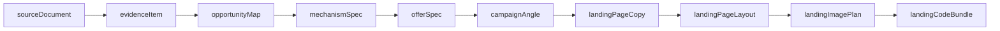

# Modelo Canônico de Artefatos do Pipeline de Experimento

Este documento define o **modelo canônico** dos artefatos do pipeline de experimento, seguindo uma estrutura semelhante ao exemplo fornecido.

## Tabela canônica (artefato → função → campos-chave → origem)

| Artefato | Função | Campos-chave | Origem |
|---|---|---|---|
| `sourceDocument` | Registro bruto da fonte consultada | `sourceType`, `sourceUrl`, `rawText`, `fetchedAt`, `permissionState` | Código |
| `evidenceItem` | Trecho/fato normalizado extraído da fonte | `claim`, `excerpt`, `url`, `citation`, `confidence`, `tags` | Código/LLM |
| `opportunityMap` | Mapa de oportunidade de mercado e demanda | `market`, `problem`, `demandSignals`, `competitionSignals`, `references` | LLM |
| `mechanismSpec` | Definição do mecanismo/solução proposta | `problem`, `causalModel`, `intervention`, `proofBase`, `limitations` | LLM |
| `offerSpec` | Definição estruturada da oferta/produto | `promise`, `scope`, `deliverables`, `constraints`, `pricingIdea` | LLM |
| `campaignAngle` | Ângulo estratégico por variação de comunicação | `visualAngle`, `hook`, `promise`, `objections`, `messageMatch` | LLM |
| `landingPageCopy` | Texto da landing por seção | `sectionId`, `headline`, `body`, `proof`, `cta`, `visualGoal` | LLM |
| `landingPageLayout` | Estrutura/layout por seção | `layoutType`, `order`, `mediaSlot`, `hierarchy`, `ratio` | LLM |
| `landingImagePlan` | Plano visual e pacote de prompt de imagem por seção | `sectionId`, `imageRole`, `promptPackage`, `altText`, `priority` | LLM |
| `landingCodeBundle` | Entrega final da página renderizada/publicável | `html`, `css`, `js`, `imageRefs`, `metadata` | Builder |

## Dependência lógica sugerida



## Regras de consistência entre artefatos

1. `evidenceItem` deve referenciar a origem em `sourceDocument` por `citation`/`url`.
2. `campaignAngle` deve manter **message match** com `offerSpec` e `mechanismSpec`.
3. `landingPageCopy`, `landingPageLayout` e `landingImagePlan` devem compartilhar o mesmo `sectionId` para cada seção.
4. `landingCodeBundle` deve manter rastreabilidade de ativos por `imageRefs` e metadados em `metadata`.
5. Todo artefato gerado por IA deve preservar metadados de auditoria (por exemplo: `model` e `prompt`) no fluxo de persistência.

## Exemplo mínimo de payload canônico (JSON)

```json
{
  "sourceDocument": {
    "sourceType": "url",
    "sourceUrl": "https://exemplo.com/artigo",
    "rawText": "...",
    "fetchedAt": "2026-04-10T10:00:00Z",
    "permissionState": "allowed"
  },
  "evidenceItem": {
    "claim": "Usuários valorizam implementação rápida",
    "excerpt": "...",
    "url": "https://exemplo.com/artigo",
    "citation": "Estudo X, seção 2",
    "confidence": 0.84,
    "tags": ["velocidade", "valor"]
  },
  "opportunityMap": {
    "market": "PMEs",
    "problem": "Baixa previsibilidade de geração de leads",
    "demandSignals": ["busca crescente", "dor recorrente"],
    "competitionSignals": ["mensagens genéricas"],
    "references": ["evidenceItem:1"]
  },
  "mechanismSpec": {
    "problem": "Conversão inconsistente",
    "causalModel": "Falta de message match entre anúncio e landing",
    "intervention": "Estruturar promessa + prova + CTA por seção",
    "proofBase": ["case interno", "benchmark"],
    "limitations": ["depende de tráfego qualificado"]
  },
  "offerSpec": {
    "promise": "Landing validada em dias, não semanas",
    "scope": "Diagnóstico + copy + layout + publicação",
    "deliverables": ["copy", "layout", "bundle"],
    "constraints": ["janela de campanha curta"],
    "pricingIdea": "setup + recorrência"
  },
  "campaignAngle": {
    "visualAngle": "clareza de resultado",
    "hook": "Pare de desperdiçar clique",
    "promise": "Mais aproveitamento do tráfego pago",
    "objections": ["já tentei antes"],
    "messageMatch": "alto"
  },
  "landingPageCopy": [
    {
      "sectionId": "hero",
      "headline": "Converta mais com consistência",
      "body": "...",
      "proof": "+120 projetos",
      "cta": "Quero minha landing",
      "visualGoal": "clareza"
    }
  ],
  "landingPageLayout": [
    {
      "sectionId": "hero",
      "layoutType": "split",
      "order": 1,
      "mediaSlot": "right",
      "hierarchy": "headline>proof>cta",
      "ratio": "60/40"
    }
  ],
  "landingImagePlan": [
    {
      "sectionId": "hero",
      "imageRole": "contextual-proof",
      "promptPackage": {
        "subject": "profissional analisando dashboard",
        "style": "editorial clean",
        "lighting": "natural"
      },
      "altText": "Profissional avaliando indicadores de campanha",
      "priority": "high"
    }
  ],
  "landingCodeBundle": {
    "html": "<html>...</html>",
    "css": "/* ... */",
    "js": "// ...",
    "imageRefs": ["asset://hero-001"],
    "metadata": {
      "version": "1.0.0",
      "generatedAt": "2026-04-10T10:30:00Z"
    }
  }
}
```
