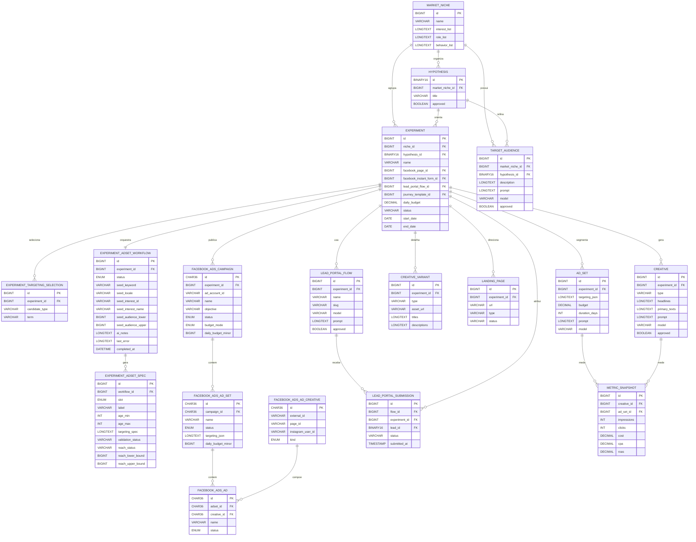

# Modelo de Dados do Experimento (visão focada)

Este documento consolida, em uma única visão, as entidades mais relevantes no
contexto de **experimentos de marketing**: nicho, hipótese, públicos, criativos,
campanha e objetos de ativação/medição.

> Fonte base: estrutura detalhada em `docs/data-model.md`.

## Escopo coberto

- Planejamento do experimento (nicho, hipótese e jornada).
- Geração de públicos e criativos por IA.
- Estrutura de mídia paga (campanha, conjunto de anúncios e anúncios no Meta Ads).
- Coleta de leads no fluxo vinculado ao experimento.

## Diagrama ER (contexto do experimento)

## Leitura rápida das relações

1. **Base estratégica**
   - `market_niche` e `hypothesis` definem o problema/oportunidade testada.
   - `experiment` centraliza a execução e conecta orçamento, período e status.

2. **Públicos e segmentação**
   - `target_audience` nasce de nicho/hipótese e pode ser aprovado antes da mídia.
   - `ad_set` materializa segmentação e orçamento no contexto do experimento.
   - `experiment_adset_workflow` + `experiment_adset_spec` coordenam o playbook automático dos três públicos (slots Designers, Marketing e SMB) e sinalizam quando todos estão com status READY.

3. **Criativos**
   - `creative` guarda peças geradas (com `model` e `prompt`).
   - `creative_variant` representa variações de assets/títulos/descrições.

4. **Campanha (Meta Ads)**
   - `facebook_ads_campaign` referencia diretamente o experimento.
   - Cada campanha possui `facebook_ads_ad_set` e depois `facebook_ads_ad`.
   - `facebook_ads_ad_creative` é vinculado ao anúncio publicado.

5. **Conversão e medição**
   - `lead_portal_flow` e `lead_portal_submission` registram captação de leads.
   - `metric_snapshot` consolida desempenho por criativo + ad set.

## Observações de implementação

- Registros gerados por processos do Worker IA devem manter `model` e `prompt`
  preenchidos nos objetos aplicáveis (ex.: público, criativo, ad set, fluxo).
- O experimento funciona como eixo de rastreabilidade entre planejamento,
  geração por IA, publicação de mídia e métricas.

## Atualização do fluxo simples de público

- `market_niche` agora mantém listas curadas (`interest_list`, `role_list`, `behavior_list`).
- `experiment_targeting_selection` registra as escolhas feitas na aba de segmentação do experimento.
- O disparo do fluxo simples cria uma `targeting_request` interna para resolver os códigos da Meta Ads.
