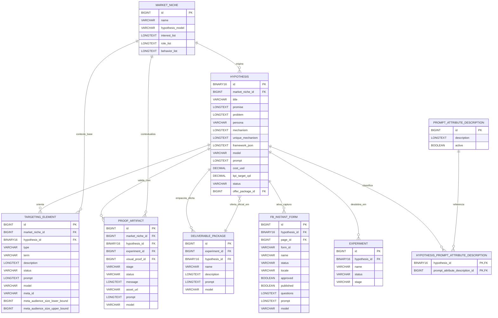

# Modelo de Dados da Hipótese (visão focada)

Este documento consolida, em uma única visão, as entidades mais relevantes no
contexto de **hipóteses** no Marketing Hub: origem no nicho, estrutura de
framework, segmentação, provas, ofertas e ativação em formulários.

> Fonte base: estrutura detalhada em `docs/data-model.md` e entidades do backend (`backend/ads-service`).

## Escopo coberto

- Cadastro e enriquecimento da hipótese (`hypothesis`) a partir de um nicho.
- Rastreabilidade de geração por IA (`model`, `prompt`, `framework_json`, custo).
- Curadoria de segmentação por elemento (`targeting_element`) associado ao nicho e/ou hipótese.
- Catálogo de provas (`proof_artifact`) e oferta oficial (`deliverable_package`) da hipótese.
- Ativação de captura via Meta Instant Forms (`fb_instant_form`).

## Diagrama ER (contexto da hipótese)

## Entidades centrais

### 1) `hypothesis`

Tabela/entidade central do processo. Guarda:

- **Contexto estratégico**: `title`, `promise`, `problem`, `persona`, `mechanism`, `unique_mechanism`.
- **Snapshot de framework**: `framework_json` (Dor → Resultado → Mecanismo → Prova → Oferta).
- **Rastreabilidade IA**: `model`, `prompt`, `cost_usd`.
- **Critério de validação**: `kpi_target_cpl`, `success_rule`, `status`.
- **Oferta ativa**: `offer_package_id` apontando para o pacote oficial de entrega.

### 2) `targeting_element`

Representa os elementos de segmentação (interesse/cargo/comportamento) usados
para transformar hipótese em público executável.

- Pode existir só no nicho (`market_niche_id`) ou refinado por hipótese (`hypothesis_id`).
- Guarda status operacional (`DRAFT`, `APPROVED`, etc.) e metadados vindos da Meta (`meta_id`, faixas de audiência).
- Mantém rastreabilidade de geração por IA (`model`, `prompt`).

### 3) `proof_artifact`

Catálogo de prova reutilizável para hipótese/experimento.

- Ligações opcionais com `market_niche`, `hypothesis`, `experiment` e `visual_proof`.
- Estrutura preparada para operação: `stage`, `status`, `asset_url`, `message`, `delivery_notes`.
- Inclui `model` e `prompt` quando produzido/assistido por IA.

### 4) `deliverable_package` (oferta)

Pacote de entrega/oferta pode nascer em hipótese (antes de experimento) ou em
experimento.

- `hypothesis_id` habilita pacote oficial ainda na fase de validação da hipótese.
- `experiment_id` mantém compatibilidade com empacotamento operacional por experimento.
- `name` + vínculo (`hypothesis_id` ou `experiment_id`) preservam unicidade por contexto.

### 5) `fb_instant_form`

Representa formulários de captura vinculados à hipótese.

- Cada registro pertence a uma hipótese (`hypothesis_id`) e a uma página (`page_id`).
- `approved`/`published` separam revisão interna da publicação externa.
- `questions`, `model` e `prompt` registram como o formulário foi estruturado.

## Leitura rápida do ciclo da hipótese

1. **Nicho → Hipótese**
   - `market_niche` define o contexto e a hipótese consolida o recorte validável.
2. **Hipótese → Segmentação**
   - `targeting_element` traduz a hipótese em critérios concretos de audiência.
3. **Hipótese → Prova/Oferta**
   - `proof_artifact` e `deliverable_package` sustentam a tese comercial com evidências e entrega.
4. **Hipótese → Captura**
   - `fb_instant_form` operacionaliza coleta de leads para teste real.
5. **Hipótese → Experimento**
   - Hipóteses aprovadas viram base de execução em `experiment`.

## Observações de implementação

- O **backend** deve seguir como fonte única de verdade do modelo (o AI Worker consome via artefato/API, sem duplicar schema).
- Entidades geradas por IA devem preservar `model` e `prompt` para auditoria.
- Sempre que a hipótese evoluir para novos artefatos (ex.: nova classe de prova/oferta), manter este documento alinhado com `docs/data-model.md`.
