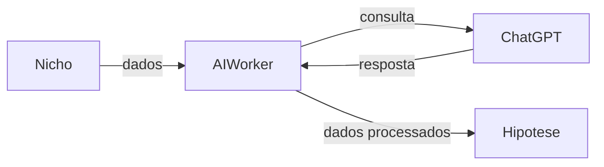

# AI Worker - Serviço NICHO para HIPOTESE

Este documento descreve o novo serviço do AI Worker responsável por coletar dados de **NICHO**, consultar o ChatGPT e retornar informações para **HIPOTESE**.

## Visão Geral

O serviço realiza as seguintes etapas:
1. Coleta dados de **NICHO**.
2. Consulta o ChatGPT com as informações coletadas.
3. Retorna os dados processados para **HIPOTESE**.

## Diagrama de fluxo

