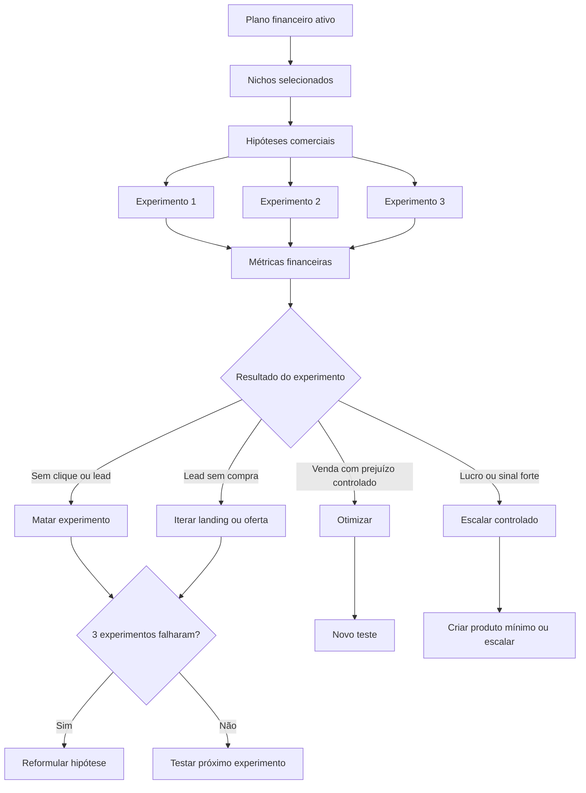

# EPM — Experiment Profit Manager

## Gestor de Lucro dos Experimentos

## 1. Objetivo do módulo

O **EPM — Experiment Profit Manager** é o módulo do Marketing Hub responsável por planejar, controlar e orientar financeiramente os experimentos de validação de produtos digitais.

Ele não é um sistema contábil completo. Sua função principal é responder, de forma operacional:

- quanto pode ser gasto em cada experimento;
- quanto pode ser perdido em uma hipótese antes de descartá-la;
- quantas vendas são necessárias para pagar o tráfego;
- qual experimento merece continuar;
- qual hipótese deve ser reformulada;
- qual produto merece escala controlada.

O módulo existe para impedir que a fábrica de produtos digitais gaste dinheiro sem disciplina, sem métrica e sem decisão clara.

---

## 2. Contexto dentro do Marketing Hub

O Marketing Hub opera como uma fábrica de produtos digitais. O fluxo estratégico do sistema parte de um nicho e transforma hipóteses comerciais em experimentos reais de aquisição.

Fluxo conceitual:

```text
Nicho
  → Hipótese comercial
    → Experimentos
      → Campanha
      → Criativo
      → Landing page
      → Amostra inicial
      → Oferta paga
      → Métricas
      → Decisão
```

O EPM entra como camada de controle financeiro desse processo.

Ele não substitui os módulos de descoberta, geração ou publicação. Ele acompanha os experimentos e ajuda a decidir se o dinheiro deve continuar sendo investido.

---

## 3. Problema que o EPM resolve

A fábrica pode testar muitos nichos, hipóteses e campanhas. Sem um módulo financeiro, o risco é:

- gastar verba demais em hipóteses fracas;
- interpretar errado um experimento inconclusivo;
- continuar investindo em ideias sem sinal de mercado;
- matar ideias cedo demais sem tráfego suficiente;
- não saber quantas vendas são necessárias para pagar os testes;
- não separar experimento ruim de hipótese ruim;
- não saber qual produto merece escala.

O EPM cria uma disciplina simples:

```text
Todo experimento tem orçamento.
Toda hipótese tem limite de perda.
Todo teste precisa gerar uma decisão.
Todo produto validado precisa ter leitura de lucro.
```

---

## 4. Nome do módulo

Nome técnico sugerido:

```text
experiment-profit-manager
```

Sigla:

```text
EPM
```

Nome na interface:

```text
Gestor de Lucro dos Experimentos
```

Nome curto no menu:

```text
Lucro dos Experimentos
```

---

## 5. Escopo do módulo

### 5.1. O que o EPM faz

- Cria planos financeiros por período.
- Define orçamento mensal ou por ciclo.
- Distribui orçamento por nicho.
- Define limite financeiro por hipótese.
- Define orçamento por experimento.
- Calcula custo planejado e custo real.
- Calcula receita, lucro bruto e lucro líquido estimado.
- Calcula métricas como CPL, CPA, ROAS e taxa de conversão.
- Simula ponto de equilíbrio por preço de produto.
- Registra decisões financeiras.
- Sugere matar, iterar ou escalar experimentos.

### 5.2. O que o EPM não faz

- Não é contabilidade fiscal.
- Não substitui gateway de pagamento.
- Não substitui Meta Ads, Google Ads ou checkout.
- Não cria campanhas.
- Não gera landing pages.
- Não cria o produto digital.
- Não decide sozinho a estratégia comercial final.

---

## 6. Conceitos principais

### 6.1. Plano financeiro

Representa o orçamento disponível para um período.

Exemplo:

```text
Plano Junho/2026
Orçamento: R$3.000
Nichos ativos: 5
Verba padrão por experimento: R$20/dia
Duração padrão: 3 dias
Experimentos por hipótese: 3
```

### 6.2. Nicho planejado

Representa um nicho dentro de um plano financeiro.

Exemplo:

```text
Nicho: Personal Trainers
Verba planejada: R$600
Status: TESTING
```

### 6.3. Hipótese financeira

Representa o limite financeiro para testar uma hipótese comercial.

Exemplo:

```text
Hipótese: Agenda Cheia Sem Desconto
Experimentos planejados: 3
Custo por experimento: R$60
Limite de perda: R$180
```

### 6.4. Orçamento de experimento

Representa a verba planejada para um experimento específico.

Exemplo:

```text
Experimento 1
Verba diária: R$20
Duração: 3 dias
Custo planejado: R$60
```

### 6.5. Métricas financeiras

Consolida os resultados do experimento.

Exemplo:

```text
Gasto: R$60
Leads: 10
Vendas: 1
Receita: R$97
Lucro bruto: R$37
```

### 6.6. Decisão financeira

Registra a decisão tomada após o experimento.

Exemplo:

```text
Decisão: SCALE_CONTROLLED
Motivo: experimento gerou venda com lucro bruto positivo.
```

---

## 7. Regras operacionais iniciais

### 7.1. Custo por experimento

```text
custo_experimento = orçamento_diário × duração_em_dias
```

Exemplo:

```text
R$20 × 3 dias = R$60
```

### 7.2. Custo por hipótese

```text
custo_hipótese = custo_experimento × quantidade_de_experimentos
```

Exemplo:

```text
R$60 × 3 experimentos = R$180
```

### 7.3. Custo mensal planejado

```text
custo_mensal = orçamento_diário_total × quantidade_de_dias
```

Exemplo:

```text
R$100/dia × 30 dias = R$3.000
```

### 7.4. Ponto de equilíbrio bruto

```text
vendas_para_empatar = orçamento_total / preço_do_produto
```

Exemplo:

```text
R$3.000 / R$97 = 31 vendas aproximadamente
```

### 7.5. Decisão por hipótese

Regra inicial:

```text
Se 3 experimentos bem executados falharem sem gerar sinal relevante,
a hipótese deve ser reformulada ou descartada.
```

Sinais relevantes:

- leads;
- pedidos de amostra;
- cliques no checkout;
- vendas;
- receita;
- comentários qualificados;
- boa taxa de conversão da landing.

---

## 8. Status sugeridos

### 8.1. Status do plano financeiro

```text
DRAFT
ACTIVE
PAUSED
CLOSED
ARCHIVED
```

### 8.2. Status da hipótese financeira

```text
DRAFT
READY
TESTING
HAS_SIGNAL
NO_SIGNAL
VALIDATED
KILLED
REFORMULATE
ARCHIVED
```

### 8.3. Status do orçamento do experimento

```text
PLANNED
READY_TO_RUN
RUNNING
SPEND_LIMIT_REACHED
FINISHED
CANCELLED
KILLED
```

### 8.4. Decisões sugeridas

```text
CONTINUE
ITERATE_CREATIVE
ITERATE_LANDING
ITERATE_OFFER
KILL_EXPERIMENT
TEST_NEXT_EXPERIMENT
KILL_HYPOTHESIS
REFORMULATE_HYPOTHESIS
CREATE_PRODUCT_MINIMUM
SCALE_CONTROLLED
SCALE_AGGRESSIVE
INCONCLUSIVE
```

---

## 9. Modelo de dados

### 9.1. Visão geral

```text
financial_plan
  └── financial_plan_niche
        └── financial_plan_hypothesis
              └── experiment_budget
                    ├── experiment_financial_metric
                    ├── experiment_financial_event
                    └── experiment_financial_decision

financial_plan
  ├── product_price_scenario
  └── financial_rule
```

---

### 9.2. `financial_plan`

Representa o plano financeiro de um mês ou ciclo.

```sql
CREATE TABLE financial_plan (
    id BIGINT AUTO_INCREMENT PRIMARY KEY,

    name VARCHAR(160) NOT NULL,
    description TEXT NULL,

    period_start DATE NOT NULL,
    period_end DATE NOT NULL,

    total_budget_cents BIGINT NOT NULL,
    daily_budget_limit_cents BIGINT NULL,

    target_revenue_cents BIGINT NULL,
    target_gross_profit_cents BIGINT NULL,
    target_net_profit_cents BIGINT NULL,

    default_experiment_daily_budget_cents BIGINT NOT NULL,
    default_experiment_duration_days INT NOT NULL,
    default_experiments_per_hypothesis INT NOT NULL,

    max_active_niches INT NULL,
    max_active_experiments INT NULL,

    status VARCHAR(40) NOT NULL,

    created_at DATETIME NOT NULL,
    updated_at DATETIME NOT NULL
);
```

---

### 9.3. `financial_plan_niche`

Controla a verba por nicho dentro do plano.

```sql
CREATE TABLE financial_plan_niche (
    id BIGINT AUTO_INCREMENT PRIMARY KEY,

    financial_plan_id BIGINT NOT NULL,

    niche_id BIGINT NULL,
    niche_name VARCHAR(180) NOT NULL,

    planned_budget_cents BIGINT NOT NULL,
    actual_spend_cents BIGINT NOT NULL DEFAULT 0,
    actual_revenue_cents BIGINT NOT NULL DEFAULT 0,

    max_hypotheses INT NULL,
    max_experiments INT NULL,

    status VARCHAR(40) NOT NULL,

    created_at DATETIME NOT NULL,
    updated_at DATETIME NOT NULL,

    CONSTRAINT fk_financial_plan_niche_plan
        FOREIGN KEY (financial_plan_id) REFERENCES financial_plan(id)
);
```

---

### 9.4. `financial_plan_hypothesis`

Controla a verba e a decisão financeira por hipótese.

```sql
CREATE TABLE financial_plan_hypothesis (
    id BIGINT AUTO_INCREMENT PRIMARY KEY,

    financial_plan_niche_id BIGINT NOT NULL,

    hypothesis_id BIGINT NULL,
    hypothesis_name VARCHAR(180) NOT NULL,

    pain_summary TEXT NULL,
    result_summary TEXT NULL,
    mechanism_summary TEXT NULL,
    proof_summary TEXT NULL,
    offer_summary TEXT NULL,

    planned_budget_cents BIGINT NOT NULL,
    max_loss_cents BIGINT NOT NULL,

    actual_spend_cents BIGINT NOT NULL DEFAULT 0,
    actual_revenue_cents BIGINT NOT NULL DEFAULT 0,
    actual_gross_profit_cents BIGINT NOT NULL DEFAULT 0,

    planned_experiments INT NOT NULL,
    completed_experiments INT NOT NULL DEFAULT 0,

    status VARCHAR(40) NOT NULL,
    decision VARCHAR(60) NULL,
    decision_reason TEXT NULL,

    created_at DATETIME NOT NULL,
    updated_at DATETIME NOT NULL,

    CONSTRAINT fk_financial_plan_hypothesis_niche
        FOREIGN KEY (financial_plan_niche_id) REFERENCES financial_plan_niche(id)
);
```

---

### 9.5. `experiment_budget`

Representa o orçamento planejado e realizado de um experimento.

```sql
CREATE TABLE experiment_budget (
    id BIGINT AUTO_INCREMENT PRIMARY KEY,

    financial_plan_hypothesis_id BIGINT NOT NULL,

    experiment_id BIGINT NULL,
    experiment_name VARCHAR(180) NOT NULL,

    experiment_sequence INT NOT NULL,

    campaign_angle VARCHAR(255) NULL,
    primary_promise TEXT NULL,

    planned_daily_budget_cents BIGINT NOT NULL,
    planned_duration_days INT NOT NULL,
    planned_total_budget_cents BIGINT NOT NULL,

    spend_limit_cents BIGINT NOT NULL,
    actual_spend_cents BIGINT NOT NULL DEFAULT 0,
    remaining_budget_cents BIGINT NOT NULL DEFAULT 0,

    started_at DATETIME NULL,
    ended_at DATETIME NULL,

    status VARCHAR(40) NOT NULL,

    created_at DATETIME NOT NULL,
    updated_at DATETIME NOT NULL,

    CONSTRAINT fk_experiment_budget_hypothesis
        FOREIGN KEY (financial_plan_hypothesis_id) REFERENCES financial_plan_hypothesis(id)
);
```

---

### 9.6. `experiment_financial_metric`

Métricas consolidadas do experimento.

```sql
CREATE TABLE experiment_financial_metric (
    id BIGINT AUTO_INCREMENT PRIMARY KEY,

    experiment_budget_id BIGINT NOT NULL,

    impressions BIGINT NOT NULL DEFAULT 0,
    clicks BIGINT NOT NULL DEFAULT 0,
    visitors BIGINT NOT NULL DEFAULT 0,

    leads BIGINT NOT NULL DEFAULT 0,
    sample_requests BIGINT NOT NULL DEFAULT 0,
    checkout_clicks BIGINT NOT NULL DEFAULT 0,
    purchases BIGINT NOT NULL DEFAULT 0,

    ad_spend_cents BIGINT NOT NULL DEFAULT 0,
    revenue_cents BIGINT NOT NULL DEFAULT 0,

    payment_fee_cents BIGINT NOT NULL DEFAULT 0,
    platform_fee_cents BIGINT NOT NULL DEFAULT 0,
    ai_cost_cents BIGINT NOT NULL DEFAULT 0,
    tax_estimate_cents BIGINT NOT NULL DEFAULT 0,

    gross_profit_cents BIGINT NOT NULL DEFAULT 0,
    estimated_net_profit_cents BIGINT NOT NULL DEFAULT 0,

    ctr_decimal DECIMAL(10,6) NULL,
    cpc_cents BIGINT NULL,
    cpl_cents BIGINT NULL,
    cpa_cents BIGINT NULL,
    roas_decimal DECIMAL(10,4) NULL,

    landing_conversion_decimal DECIMAL(10,6) NULL,
    purchase_conversion_decimal DECIMAL(10,6) NULL,

    calculated_at DATETIME NOT NULL,

    CONSTRAINT fk_experiment_metric_budget
        FOREIGN KEY (experiment_budget_id) REFERENCES experiment_budget(id)
);
```

Métricas calculadas:

| Métrica | Fórmula |
|---|---|
| CTR | clicks / impressions |
| CPC | ad_spend / clicks |
| CPL | ad_spend / leads |
| CPA | ad_spend / purchases |
| ROAS | revenue / ad_spend |
| Conversão da landing | leads / visitors |
| Conversão de compra | purchases / visitors |
| Lucro bruto | revenue - ad_spend |
| Lucro líquido estimado | revenue - ad_spend - taxas - IA - imposto estimado |

---

### 9.7. `experiment_financial_event`

Eventos financeiros brutos.

```sql
CREATE TABLE experiment_financial_event (
    id BIGINT AUTO_INCREMENT PRIMARY KEY,

    experiment_budget_id BIGINT NOT NULL,

    event_type VARCHAR(60) NOT NULL,
    event_source VARCHAR(60) NULL,

    amount_cents BIGINT NULL,
    quantity BIGINT NULL,

    external_reference VARCHAR(180) NULL,
    payload_json TEXT NULL,

    occurred_at DATETIME NOT NULL,
    created_at DATETIME NOT NULL,

    CONSTRAINT fk_experiment_event_budget
        FOREIGN KEY (experiment_budget_id) REFERENCES experiment_budget(id)
);
```

Tipos sugeridos:

```text
AD_SPEND
IMPRESSION
CLICK
LANDING_VISIT
FORM_START
LEAD
SAMPLE_REQUEST
CHECKOUT_CLICK
PURCHASE
REFUND
PAYMENT_FEE
PLATFORM_FEE
AI_COST
TAX_ESTIMATE
MANUAL_ADJUSTMENT
```

Fontes sugeridas:

```text
META_ADS
GOOGLE_ADS
LEAD_PORTAL
CHECKOUT
AI_WORKER
MANUAL
SYSTEM
```

---

### 9.8. `experiment_financial_decision`

Guarda a decisão tomada pelo sistema ou pelo usuário.

```sql
CREATE TABLE experiment_financial_decision (
    id BIGINT AUTO_INCREMENT PRIMARY KEY,

    experiment_budget_id BIGINT NOT NULL,

    decision VARCHAR(80) NOT NULL,
    decision_reason TEXT NOT NULL,

    recommended_by VARCHAR(40) NOT NULL,
    confidence_level VARCHAR(40) NULL,

    spend_at_decision_cents BIGINT NOT NULL DEFAULT 0,
    revenue_at_decision_cents BIGINT NOT NULL DEFAULT 0,
    leads_at_decision BIGINT NOT NULL DEFAULT 0,
    purchases_at_decision BIGINT NOT NULL DEFAULT 0,

    decided_at DATETIME NOT NULL,
    created_at DATETIME NOT NULL,

    CONSTRAINT fk_experiment_decision_budget
        FOREIGN KEY (experiment_budget_id) REFERENCES experiment_budget(id)
);
```

---

### 9.9. `product_price_scenario`

Serve para o simulador de ponto de equilíbrio.

```sql
CREATE TABLE product_price_scenario (
    id BIGINT AUTO_INCREMENT PRIMARY KEY,

    financial_plan_id BIGINT NOT NULL,

    name VARCHAR(120) NOT NULL,

    product_price_cents BIGINT NOT NULL,
    expected_payment_fee_percent DECIMAL(10,4) NULL,
    expected_tax_percent DECIMAL(10,4) NULL,
    expected_platform_fee_cents BIGINT NULL,

    expected_net_revenue_per_sale_cents BIGINT NULL,

    break_even_sales INT NULL,
    target_profit_sales INT NULL,

    created_at DATETIME NOT NULL,
    updated_at DATETIME NOT NULL,

    CONSTRAINT fk_price_scenario_plan
        FOREIGN KEY (financial_plan_id) REFERENCES financial_plan(id)
);
```

---

### 9.10. `financial_rule`

Guarda regras configuráveis de decisão.

```sql
CREATE TABLE financial_rule (
    id BIGINT AUTO_INCREMENT PRIMARY KEY,

    financial_plan_id BIGINT NULL,

    rule_code VARCHAR(120) NOT NULL,
    rule_name VARCHAR(180) NOT NULL,
    description TEXT NULL,

    metric_name VARCHAR(80) NOT NULL,
    operator VARCHAR(20) NOT NULL,
    threshold_value DECIMAL(18,6) NOT NULL,

    recommended_decision VARCHAR(80) NOT NULL,

    active BOOLEAN NOT NULL DEFAULT TRUE,

    created_at DATETIME NOT NULL,
    updated_at DATETIME NOT NULL,

    CONSTRAINT fk_financial_rule_plan
        FOREIGN KEY (financial_plan_id) REFERENCES financial_plan(id)
);
```

Exemplos de regras:

```text
IF leads = 0 AND spend >= planned_total_budget THEN KILL_EXPERIMENT
IF leads > 0 AND purchases = 0 THEN ITERATE_OFFER
IF revenue > ad_spend THEN SCALE_CONTROLLED
IF 3 experiments failed AND total_leads = 0 THEN KILL_HYPOTHESIS
IF roas >= 2 THEN SCALE_CONTROLLED
```

---

## 10. Diagrama ER

```mermaid
erDiagram

    FINANCIAL_PLAN ||--o{ FINANCIAL_PLAN_NICHE : "aloca verba para"
    FINANCIAL_PLAN_NICHE ||--o{ FINANCIAL_PLAN_HYPOTHESIS : "controla hipóteses"
    FINANCIAL_PLAN_HYPOTHESIS ||--o{ EXPERIMENT_BUDGET : "planeja experimentos"

    EXPERIMENT_BUDGET ||--o{ EXPERIMENT_FINANCIAL_METRIC : "consolida métricas"
    EXPERIMENT_BUDGET ||--o{ EXPERIMENT_FINANCIAL_EVENT : "recebe eventos"
    EXPERIMENT_BUDGET ||--o{ EXPERIMENT_FINANCIAL_DECISION : "gera decisões"

    FINANCIAL_PLAN ||--o{ PRODUCT_PRICE_SCENARIO : "simula preços"
    FINANCIAL_PLAN ||--o{ FINANCIAL_RULE : "define regras"

    FINANCIAL_PLAN {
        BIGINT id PK
        VARCHAR name
        DATE period_start
        DATE period_end
        BIGINT total_budget_cents
        BIGINT daily_budget_limit_cents
        BIGINT target_revenue_cents
        BIGINT target_gross_profit_cents
        BIGINT target_net_profit_cents
        BIGINT default_experiment_daily_budget_cents
        INT default_experiment_duration_days
        INT default_experiments_per_hypothesis
        INT max_active_niches
        INT max_active_experiments
        VARCHAR status
        DATETIME created_at
        DATETIME updated_at
    }

    FINANCIAL_PLAN_NICHE {
        BIGINT id PK
        BIGINT financial_plan_id FK
        BIGINT niche_id
        VARCHAR niche_name
        BIGINT planned_budget_cents
        BIGINT actual_spend_cents
        BIGINT actual_revenue_cents
        INT max_hypotheses
        INT max_experiments
        VARCHAR status
        DATETIME created_at
        DATETIME updated_at
    }

    FINANCIAL_PLAN_HYPOTHESIS {
        BIGINT id PK
        BIGINT financial_plan_niche_id FK
        BIGINT hypothesis_id
        VARCHAR hypothesis_name
        TEXT pain_summary
        TEXT result_summary
        TEXT mechanism_summary
        TEXT proof_summary
        TEXT offer_summary
        BIGINT planned_budget_cents
        BIGINT max_loss_cents
        BIGINT actual_spend_cents
        BIGINT actual_revenue_cents
        BIGINT actual_gross_profit_cents
        INT planned_experiments
        INT completed_experiments
        VARCHAR status
        VARCHAR decision
        DATETIME created_at
        DATETIME updated_at
    }

    EXPERIMENT_BUDGET {
        BIGINT id PK
        BIGINT financial_plan_hypothesis_id FK
        BIGINT experiment_id
        VARCHAR experiment_name
        INT experiment_sequence
        VARCHAR campaign_angle
        BIGINT planned_daily_budget_cents
        INT planned_duration_days
        BIGINT planned_total_budget_cents
        BIGINT spend_limit_cents
        BIGINT actual_spend_cents
        BIGINT remaining_budget_cents
        DATETIME started_at
        DATETIME ended_at
        VARCHAR status
        DATETIME created_at
        DATETIME updated_at
    }

    EXPERIMENT_FINANCIAL_METRIC {
        BIGINT id PK
        BIGINT experiment_budget_id FK
        BIGINT impressions
        BIGINT clicks
        BIGINT visitors
        BIGINT leads
        BIGINT sample_requests
        BIGINT checkout_clicks
        BIGINT purchases
        BIGINT ad_spend_cents
        BIGINT revenue_cents
        BIGINT gross_profit_cents
        BIGINT estimated_net_profit_cents
        DECIMAL ctr_decimal
        BIGINT cpc_cents
        BIGINT cpl_cents
        BIGINT cpa_cents
        DECIMAL roas_decimal
        DECIMAL landing_conversion_decimal
        DECIMAL purchase_conversion_decimal
        DATETIME calculated_at
    }

    EXPERIMENT_FINANCIAL_EVENT {
        BIGINT id PK
        BIGINT experiment_budget_id FK
        VARCHAR event_type
        VARCHAR event_source
        BIGINT amount_cents
        BIGINT quantity
        VARCHAR external_reference
        TEXT payload_json
        DATETIME occurred_at
        DATETIME created_at
    }

    EXPERIMENT_FINANCIAL_DECISION {
        BIGINT id PK
        BIGINT experiment_budget_id FK
        VARCHAR decision
        TEXT decision_reason
        VARCHAR recommended_by
        VARCHAR confidence_level
        BIGINT spend_at_decision_cents
        BIGINT revenue_at_decision_cents
        BIGINT leads_at_decision
        BIGINT purchases_at_decision
        DATETIME decided_at
        DATETIME created_at
    }

    PRODUCT_PRICE_SCENARIO {
        BIGINT id PK
        BIGINT financial_plan_id FK
        VARCHAR name
        BIGINT product_price_cents
        DECIMAL expected_payment_fee_percent
        DECIMAL expected_tax_percent
        BIGINT expected_platform_fee_cents
        BIGINT expected_net_revenue_per_sale_cents
        INT break_even_sales
        INT target_profit_sales
        DATETIME created_at
        DATETIME updated_at
    }

    FINANCIAL_RULE {
        BIGINT id PK
        BIGINT financial_plan_id FK
        VARCHAR rule_code
        VARCHAR rule_name
        VARCHAR metric_name
        VARCHAR operator
        DECIMAL threshold_value
        VARCHAR recommended_decision
        BOOLEAN active
        DATETIME created_at
        DATETIME updated_at
    }
```



---

## 11. Fluxo de decisão



---

## 12. Índices recomendados

```sql
CREATE INDEX idx_financial_plan_period
ON financial_plan (period_start, period_end);

CREATE INDEX idx_plan_niche_plan
ON financial_plan_niche (financial_plan_id);

CREATE INDEX idx_plan_hypothesis_niche
ON financial_plan_hypothesis (financial_plan_niche_id);

CREATE INDEX idx_experiment_budget_hypothesis
ON experiment_budget (financial_plan_hypothesis_id);

CREATE INDEX idx_experiment_budget_status
ON experiment_budget (status);

CREATE INDEX idx_experiment_event_budget_type
ON experiment_financial_event (experiment_budget_id, event_type);

CREATE INDEX idx_experiment_event_occurred_at
ON experiment_financial_event (occurred_at);

CREATE INDEX idx_experiment_decision_budget
ON experiment_financial_decision (experiment_budget_id);
```

---

## 13. MVP recomendado

A primeira versão do módulo deve evitar complexidade excessiva.

### 13.1. Tabelas da fase 1

```text
financial_plan
financial_plan_niche
financial_plan_hypothesis
experiment_budget
experiment_financial_metric
experiment_financial_decision
product_price_scenario
```

Nesta fase, os números podem ser lançados manualmente na interface.

### 13.2. Tabelas da fase 2

```text
experiment_financial_event
financial_rule
```

Nesta fase, o módulo pode começar a receber eventos automáticos de anúncios, checkout, Lead Portal e Worker AI.

---

## 14. Telas sugeridas

### 14.1. Visão geral

Mostra:

- orçamento do ciclo;
- gasto total;
- receita total;
- lucro bruto;
- lucro líquido estimado;
- hipóteses ativas;
- experimentos rodando;
- experimentos lucrativos;
- experimentos mortos.

### 14.2. Planejamento

Permite configurar:

- período;
- orçamento total;
- verba diária;
- nichos ativos;
- duração padrão dos experimentos;
- quantidade de experimentos por hipótese;
- limite de perda por hipótese.

### 14.3. Simulador

Permite simular:

- preço do produto;
- orçamento de tráfego;
- taxas;
- lucro alvo;
- vendas necessárias para empatar;
- vendas necessárias para lucro.

### 14.4. Experimentos

Mostra por experimento:

- gasto planejado;
- gasto real;
- leads;
- vendas;
- receita;
- lucro;
- decisão sugerida.

### 14.5. Decisões

Mostra:

- experimentos a matar;
- experimentos a iterar;
- hipóteses a reformular;
- produtos prontos para escala.

---

## 15. Regra central do módulo

O EPM deve sempre responder:

```text
Quanto posso gastar?
Quanto já gastei?
Quanto preciso vender para empatar?
Qual experimento merece continuar?
Qual hipótese está queimando dinheiro?
Qual produto merece escala?
```

Se o módulo responder isso com clareza, ele já cumpre seu papel dentro da fábrica de produtos digitais do Marketing Hub.
