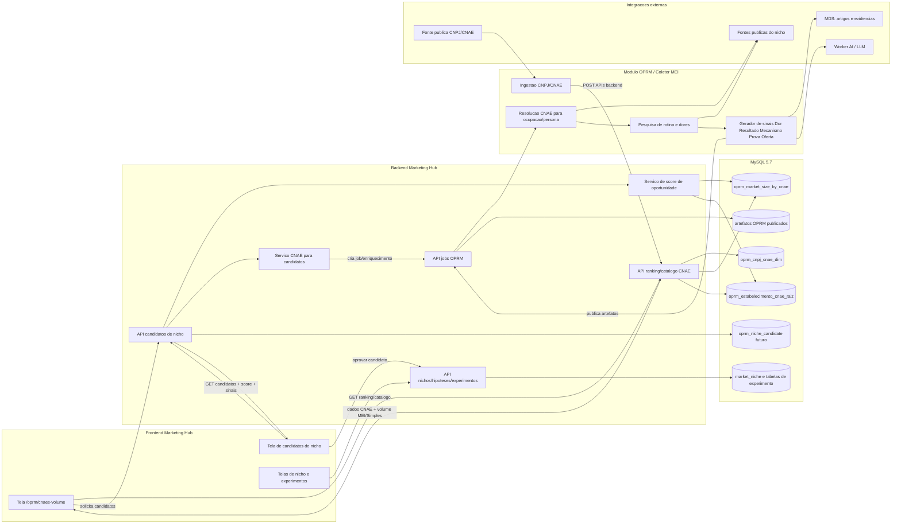
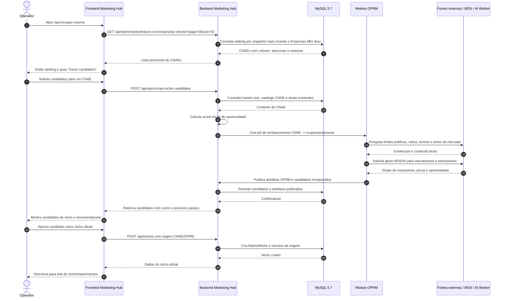
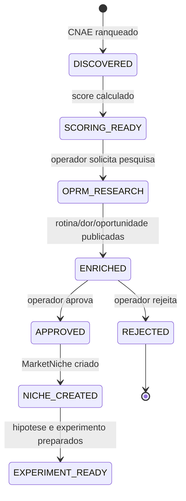

# OPRM — Arquitetura CNAE → Nichos

## Objetivo

Este documento descreve como a lista de CNAEs deve ser usada para descobrir, priorizar e transformar oportunidades de mercado em candidatos de nicho, preservando o eixo **Dor → Resultado → Mecanismo → Prova → Oferta**.

A proposta evita criar nichos automaticamente apenas pelo nome do CNAE. O CNAE entra como evidência de tamanho e concentração de mercado; o nicho final nasce após enriquecimento OPRM, validação humana e conexão com hipóteses comerciais.

## Princípios operacionais

1. **CNAE não é nicho final**: CNAE é fonte estruturada para encontrar mercados com volume e densidade.
2. **Backend é o único ponto de persistência**: frontend e OPRM não escrevem diretamente no banco.
3. **OPRM enriquece a rotina real**: o módulo OPRM transforma CNAE/ocupação em rotina, dores, restrições e oportunidades.
4. **Frontend orienta decisão humana**: a UI mostra ranking, score, candidatos e próximos passos, mas a criação oficial do nicho depende de aprovação.
5. **Integrações externas são insumos, não fonte única de verdade**: dados públicos e pesquisas web complementam o banco interno e os documentos canônicos.

## Diagrama de arquitetura

## Diagrama de sequência

## Fluxo funcional esperado

| Etapa                  | Responsável            | Entrada                                        | Saída                                                                              |
| ---------------------- | ---------------------- | ---------------------------------------------- | ---------------------------------------------------------------------------------- |
| 1. Ingestão CNAE/CNPJ  | Módulo OPRM / coletor  | Dados públicos CNPJ/CNAE                       | Catálogo CNAE, market size e vínculos de estabelecimento persistidos via backend   |
| 2. Ranking             | Backend                | `oprm_market_size_by_cnae` + catálogo CNAE     | Lista paginada de CNAEs por volume, principalmente Empresas MEI                    |
| 3. Seleção operacional | Frontend               | Ranking e métricas                             | CNAE escolhido para pesquisa                                                       |
| 4. Scoring inicial     | Backend                | CNAE, volume, MEI, Simples e sinais existentes | Score de oportunidade e prioridade                                                 |
| 5. Enriquecimento      | OPRM                   | CNAE escolhido e contexto de mercado           | Ocupações/personas, rotina, dores, restrições e oportunidades                      |
| 6. Apoio externo       | OPRM + MDS + AI Worker | Dores e mecanismos candidatos                  | Evidências, mecanismos plausíveis e estrutura Dor/Resultado/Mecanismo/Prova/Oferta |
| 7. Candidato de nicho  | Backend                | Artefatos OPRM enriquecidos                    | Candidatos de nicho com status e justificativa                                     |
| 8. Aprovação           | Frontend + operador    | Candidatos priorizados                         | Nicho oficial criado no Marketing Hub                                              |
| 9. Experimento         | Backend + Frontend     | Nicho aprovado                                 | Hipóteses, ofertas, páginas, públicos e experimentos                               |

## Estados sugeridos para candidatos de nicho

## Contratos e endpoints candidatos

> Os nomes abaixo são proposta de arquitetura. Antes de implementar, deve-se verificar se já existe contrato equivalente no backend.

| Necessidade                  | Endpoint sugerido                                      | Observação                                                            |
| ---------------------------- | ------------------------------------------------------ | --------------------------------------------------------------------- |
| Listar ranking CNAE atual    | `GET /api/oprm/market/import-runs/cnaes/top-volume`    | Endpoint já usado pela tela de CNAEs.                                 |
| Listar catálogo CNAE         | `GET /api/oprm/market/import-runs/cnaes`               | Endpoint já usado pela tela de fallback do catálogo.                  |
| Gerar candidatos de nicho    | `POST /api/oprm/cnae-niche-candidates`                 | Recebe `cnaeCode`, cria/consulta candidatos e pode disparar job OPRM. |
| Listar candidatos            | `GET /api/oprm/cnae-niche-candidates?cnaeCode=...`     | Retorna candidatos, score, status e sinais principais.                |
| Aprovar candidato como nicho | `POST /api/oprm/cnae-niche-candidates/{id}/approve`    | Cria ou vincula `MarketNiche`.                                        |
| Criar pesquisa OPRM          | endpoint de jobs OPRM existente ou novo no pacote OPRM | Deve respeitar escopo do módulo OPRM.                                 |

## Campos mínimos do candidato de nicho

| Campo                 | Finalidade                                                  |
| --------------------- | ----------------------------------------------------------- |
| `id`                  | Identificador do candidato.                                 |
| `cnaeCode`            | CNAE de origem.                                             |
| `cnaeDescription`     | Descrição oficial do CNAE no momento da geração.            |
| `candidateNicheName`  | Nome acionável do nicho, não apenas a descrição CNAE.       |
| `persona`             | Pessoa/ocupação ou tipo de negócio principal.               |
| `painHypothesis`      | Dor operacional ou comercial provável.                      |
| `desiredOutcome`      | Resultado concreto desejado pelo público.                   |
| `mechanismHypothesis` | Mecanismo plausível para gerar transformação.               |
| `proofDirection`      | Direção inicial de prova/evidência.                         |
| `offerIdea`           | Ideia inicial de produto digital ou oferta.                 |
| `marketVolumeSignals` | Métricas usadas: MEI, Simples, estabelecimentos ativos etc. |
| `opportunityScore`    | Score consolidado para priorização.                         |
| `status`              | Estado operacional do candidato.                            |
| `sourceArtifacts`     | Referências aos artefatos OPRM/MDS usados.                  |

## Observações de implementação

- A criação automática de `MarketNiche` deve ser evitada no primeiro momento; o sistema deve criar **candidatos** e deixar o operador aprovar.
- A tela de CNAEs deve mostrar poucos comandos claros: atualizar ranking, gerar candidatos, abrir pesquisa OPRM e aprovar candidato.
- O backend deve manter a persistência relacional e evitar JSON dentro de JSON; campos estruturados devem ter contrato explícito.
- O OPRM deve publicar artefatos finais sem comentários técnicos, flags de debug ou metadados operacionais no conteúdo final apresentável ao usuário.
- Quando a etapa acionar pesquisa web, o payload bruto de ingestão deve ser registrado antes de transformações, conforme regra operacional de logs de ingestão.
