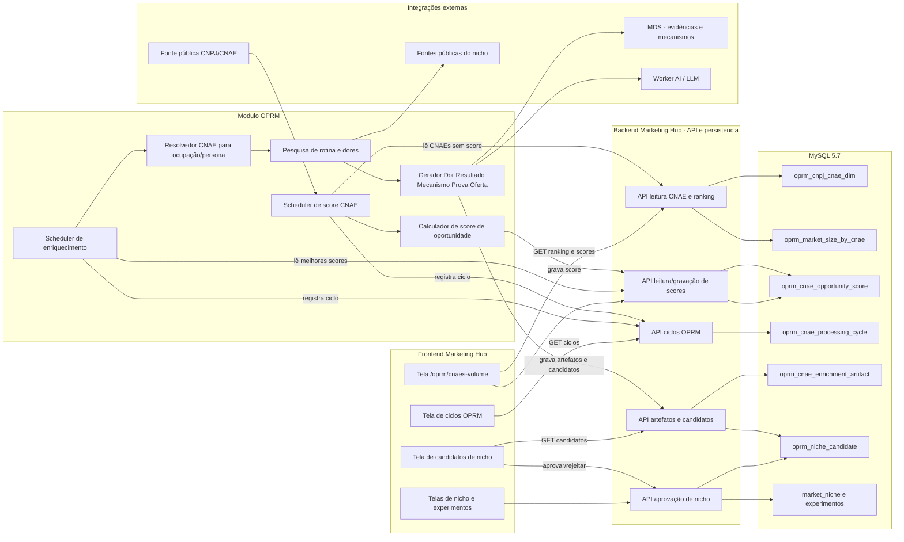
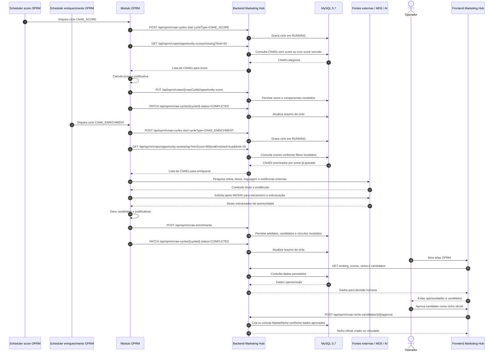
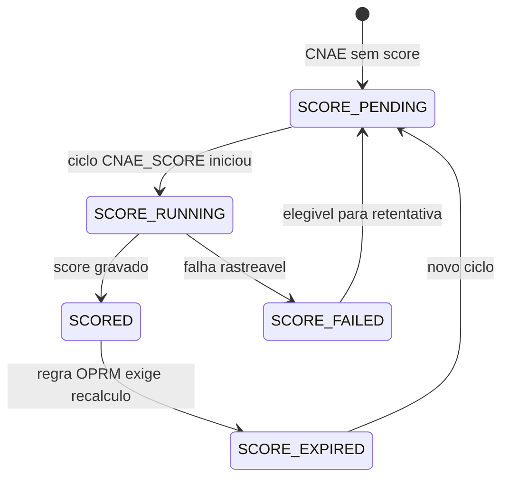
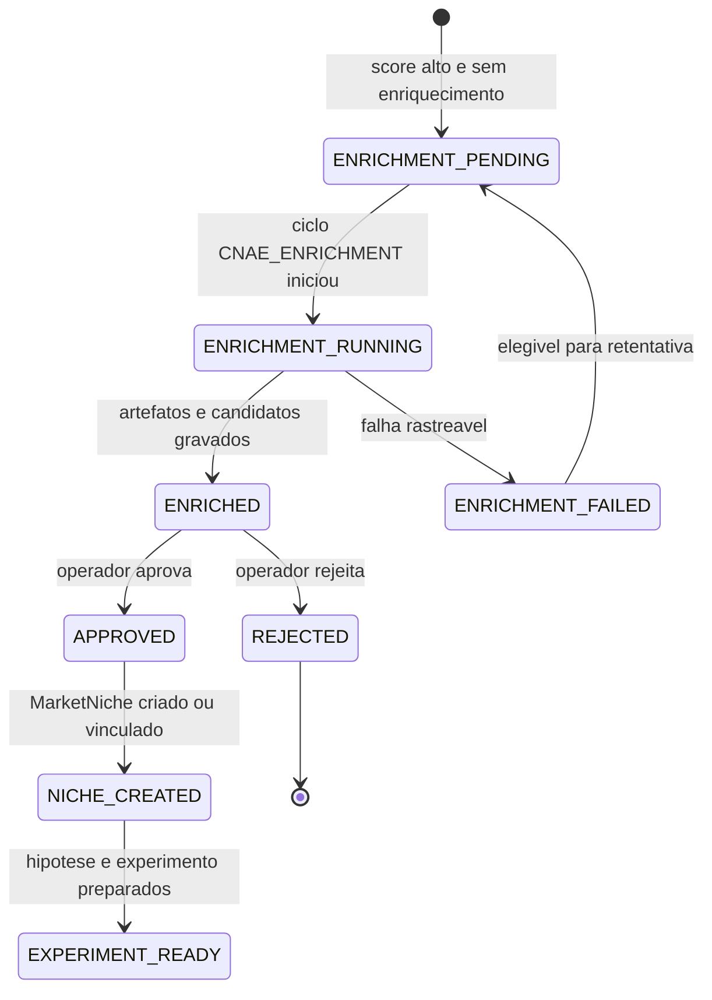

# OPRM — Arquitetura CNAE → Score → Enriquecimento → Nichos

## Objetivo

Este documento descreve como a lista de CNAEs deve ser usada para descobrir, priorizar e transformar oportunidades de mercado em candidatos de nicho, preservando o eixo **Dor → Resultado → Mecanismo → Prova → Oferta**.

A proposta evita criar nichos automaticamente apenas pelo nome do CNAE. O CNAE entra como evidência de tamanho e concentração de mercado; o score, o enriquecimento, as pesquisas externas e a geração de candidatos são responsabilidades do **módulo OPRM**, executadas por ciclos agendados. O backend atua somente como camada de API e persistência: lê dados, valida contrato técnico e grava dados, sem cálculo, enriquecimento ou regra de negócio.

## Princípios operacionais

1. **CNAE não é nicho final**: CNAE é fonte estruturada para encontrar mercados com volume e densidade.
2. **Backend é somente API e persistência**: o backend lê e grava dados, aplica validações técnicas de contrato e integridade, mas não calcula score, não enriquece dados e não decide prioridade de negócio.
3. **OPRM é dono da regra de negócio CNAE → oportunidade**: todo cálculo de score, seleção de CNAEs para enriquecimento, pesquisa externa, geração de sinais e criação de candidatos fica no módulo OPRM.
4. **Processamento é automático por scheduler**: o usuário não solicita geração de score; o OPRM periodicamente busca CNAEs sem score e grava o resultado. Outro scheduler seleciona CNAEs com melhor score para enriquecimento e pesquisa externa.
5. **Ciclos precisam ser rastreáveis**: cada execução agendada deve ter `cycleId`, `cycleType`, `cycleNumber` e logs com início, critérios, quantidade lida, quantidade processada, falhas e resumo final.
6. **Frontend orienta decisão humana**: a UI mostra ranking, score, candidatos, ciclos e próximos passos, mas a criação oficial do nicho depende de aprovação humana.
7. **Integrações externas são insumos, não fonte única de verdade**: dados públicos, fontes web, MDS e Worker AI complementam o banco interno e os documentos canônicos.

## Separação de responsabilidades

| Componente                        | Pode fazer                                                                                                                                    | Não pode fazer                                                                                                                       |
| --------------------------------- | --------------------------------------------------------------------------------------------------------------------------------------------- | ------------------------------------------------------------------------------------------------------------------------------------ |
| Frontend Marketing Hub            | Exibir CNAEs, scores, ciclos, enriquecimentos e candidatos; permitir aprovação/rejeição humana.                                               | Calcular score, enriquecer dados, chamar integrações externas diretamente ou gravar no banco.                                        |
| Backend Marketing Hub             | Expor endpoints do pacote OPRM; consultar e persistir dados; validar contrato técnico; aplicar paginação e filtros de leitura.                | Calcular score, escolher CNAEs prioritários, chamar MDS/AI/fontes externas para enriquecimento ou executar regra de negócio do OPRM. |
| Módulo OPRM                       | Executar schedulers; calcular score; selecionar melhores CNAEs; pesquisar fontes externas; acionar MDS/AI; gerar candidatos e justificativas. | Escrever direto no banco ou consumir controllers de outro módulo fora do escopo OPRM.                                                |
| MySQL 5.7                         | Guardar catálogo CNAE, market size, scores, ciclos, artefatos e candidatos.                                                                   | Executar regra de negócio fora de consultas/filtros necessários.                                                                     |
| MDS / Worker AI / fontes externas | Fornecer evidências, mecanismos, conteúdo bruto e apoio de estruturação.                                                                      | Ser fonte única de verdade ou publicar nicho automaticamente.                                                                        |

## Modelo de ciclos operacionais

Para facilitar logs, comunicação e auditoria, cada execução do OPRM deve registrar um ciclo operacional.

| Campo                      | Exemplo                                         | Finalidade                                                         |
| -------------------------- | ----------------------------------------------- | ------------------------------------------------------------------ |
| `cycleId`                  | `OPRM-CNAE-SCORE-20260531-001`                  | Identificador legível e único do ciclo.                            |
| `cycleType`                | `CNAE_SCORE` ou `CNAE_ENRICHMENT`               | Diferencia o ciclo de cálculo de score do ciclo de enriquecimento. |
| `cycleNumber`              | `1`, `2`, `3`                                   | Número sequencial por tipo de ciclo.                               |
| `startedAt` / `finishedAt` | timestamps UTC                                  | Auditoria de duração e janela operacional.                         |
| `selectionCriteria`        | `score ausente`, `top score >= 80`, `limite 25` | Critério usado pelo OPRM para buscar dados via backend.            |
| `processedCount`           | `50`                                            | Quantidade processada no ciclo.                                    |
| `failedCount`              | `2`                                             | Quantidade com falha rastreável.                                   |
| `status`                   | `RUNNING`, `COMPLETED`, `FAILED`, `PARTIAL`     | Estado do ciclo.                                                   |

Tipos iniciais sugeridos:

1. **Ciclo de score — `CNAE_SCORE`**
   - Scheduler do OPRM roda de tempos em tempos.
   - OPRM chama o backend para buscar CNAEs sem score ou com score vencido.
   - OPRM calcula `opportunityScore` e componentes do score.
   - OPRM grava score e justificativa por endpoint do backend.

2. **Ciclo de enriquecimento — `CNAE_ENRICHMENT`**
   - Scheduler separado do OPRM roda de tempos em tempos.
   - OPRM chama o backend para buscar CNAEs com melhor score e ainda não enriquecidos.
   - OPRM pesquisa fontes externas, aciona MDS/AI quando necessário e gera sinais de rotina, dor, resultado, mecanismo, prova e oferta.
   - OPRM grava artefatos, candidatos e vínculos por endpoint do backend.

## Diagrama de arquitetura

## Diagrama de sequência

## Fluxo funcional esperado

| Etapa                      | Responsável                                  | Entrada                                     | Saída                                                                              |
| -------------------------- | -------------------------------------------- | ------------------------------------------- | ---------------------------------------------------------------------------------- |
| 1. Ingestão CNAE/CNPJ      | Módulo OPRM / coletor + backend persistência | Dados públicos CNPJ/CNAE                    | Catálogo CNAE, market size e vínculos persistidos via backend                      |
| 2. Ranking                 | Backend                                      | `oprm_market_size_by_cnae` + catálogo CNAE  | Lista paginada de CNAEs por Empresas MEI desc, sem cálculo de oportunidade         |
| 3. Ciclo de score          | OPRM scheduler                               | CNAEs sem score lidos via backend           | Score de oportunidade, componentes e justificativa gravados via backend            |
| 4. Monitoramento           | Frontend                                     | Ranking, scores e ciclos lidos via backend  | Visão operacional para o usuário, sem botão obrigatório de gerar score             |
| 5. Ciclo de enriquecimento | OPRM scheduler                               | CNAEs com melhores scores lidos via backend | Pesquisa externa, artefatos e candidatos gravados via backend                      |
| 6. Apoio externo           | OPRM + MDS + Worker AI                       | Dores, rotina e mecanismos candidatos       | Evidências, mecanismos plausíveis e estrutura Dor/Resultado/Mecanismo/Prova/Oferta |
| 7. Candidato de nicho      | OPRM grava via backend                       | Artefatos OPRM enriquecidos                 | Candidatos de nicho com status, score, justificativa e origem                      |
| 8. Aprovação               | Frontend + operador + backend persistência   | Candidatos priorizados                      | Nicho oficial criado ou vinculado no Marketing Hub                                 |
| 9. Experimento             | Backend + Frontend                           | Nicho aprovado                              | Hipóteses, ofertas, páginas, públicos e experimentos                               |

## Estados sugeridos

### Estado do score por CNAE

### Estado do enriquecimento e candidato

## Contratos e endpoints candidatos

> Os nomes abaixo são proposta de arquitetura. Antes de implementar, deve-se verificar se já existe contrato equivalente no backend. Todos os endpoints abaixo pertencem ao escopo OPRM e o backend deve atuar como leitura/gravação, sem cálculo de score ou enriquecimento.

| Necessidade                  | Endpoint sugerido                                                                    | Quem chama                | Observação                                                                      |
| ---------------------------- | ------------------------------------------------------------------------------------ | ------------------------- | ------------------------------------------------------------------------------- |
| Listar ranking CNAE atual    | `GET /api/oprm/market/import-runs/cnaes/top-volume`                                  | Frontend / OPRM           | Endpoint já usado pela tela de CNAEs; leitura paginada por Empresas MEI.        |
| Listar catálogo CNAE         | `GET /api/oprm/market/import-runs/cnaes`                                             | Frontend / OPRM           | Endpoint já usado pela tela de fallback do catálogo.                            |
| Buscar CNAEs sem score       | `GET /api/oprm/cnaes/opportunity-scores/missing?limit=...`                           | OPRM scheduler            | Backend apenas consulta dados elegíveis conforme filtros recebidos.             |
| Gravar score de oportunidade | `PUT /api/oprm/cnaes/{cnaeCode}/opportunity-score`                                   | OPRM scheduler            | Recebe score, componentes, justificativa, `cycleId` e versão do algoritmo OPRM. |
| Listar melhores scores       | `GET /api/oprm/cnaes/opportunity-scores/top?minScore=...&notEnriched=true&limit=...` | OPRM scheduler / Frontend | Backend retorna dados já calculados pelo OPRM.                                  |
| Criar/atualizar ciclo        | `POST/PATCH /api/oprm/cnae-cycles`                                                   | OPRM scheduler            | Registra `cycleId`, `cycleType`, estado, resumo e falhas.                       |
| Gravar enriquecimento        | `POST /api/oprm/cnae-enrichments`                                                    | OPRM scheduler            | Persiste artefatos, evidências, candidatos e vínculos recebidos.                |
| Listar candidatos            | `GET /api/oprm/cnae-niche-candidates?cnaeCode=...`                                   | Frontend                  | Retorna candidatos, score, status, ciclo e sinais principais.                   |
| Aprovar candidato como nicho | `POST /api/oprm/cnae-niche-candidates/{id}/approve`                                  | Frontend                  | Cria ou vincula `MarketNiche` após decisão humana.                              |

## Campos mínimos

### Score de oportunidade do CNAE

| Campo                | Finalidade                                                                                             |
| -------------------- | ------------------------------------------------------------------------------------------------------ |
| `cnaeCode`           | CNAE avaliado.                                                                                         |
| `cnaeDescription`    | Descrição oficial do CNAE no momento do cálculo.                                                       |
| `opportunityScore`   | Score consolidado calculado pelo OPRM.                                                                 |
| `scoreComponents`    | Componentes estruturados do score, em campos explícitos ou tabela filha, evitando JSON dentro de JSON. |
| `scoreJustification` | Justificativa objetiva do score.                                                                       |
| `algorithmVersion`   | Versão da regra/algoritmo do OPRM usado no cálculo.                                                    |
| `cycleId`            | Ciclo que gerou ou atualizou o score.                                                                  |
| `scoredAt`           | Data/hora do cálculo.                                                                                  |
| `scoreStatus`        | Estado operacional do score.                                                                           |

### Candidato de nicho

| Campo                 | Finalidade                                                  |
| --------------------- | ----------------------------------------------------------- |
| `id`                  | Identificador do candidato.                                 |
| `cnaeCode`            | CNAE de origem.                                             |
| `cnaeDescription`     | Descrição oficial do CNAE no momento da geração.            |
| `candidateNicheName`  | Nome acionável do nicho, não apenas a descrição CNAE.       |
| `persona`             | Pessoa/ocupação ou tipo de negócio principal.               |
| `painHypothesis`      | Dor operacional ou comercial provável.                      |
| `desiredOutcome`      | Resultado concreto desejado pelo público.                   |
| `mechanismHypothesis` | Mecanismo plausível para gerar transformação.               |
| `proofDirection`      | Direção inicial de prova/evidência.                         |
| `offerIdea`           | Ideia inicial de produto digital ou oferta.                 |
| `marketVolumeSignals` | Métricas usadas: MEI, Simples, estabelecimentos ativos etc. |
| `opportunityScore`    | Score consolidado usado para priorização.                   |
| `scoreCycleId`        | Ciclo de score que originou a priorização.                  |
| `enrichmentCycleId`   | Ciclo de enriquecimento que gerou o candidato.              |
| `status`              | Estado operacional do candidato.                            |
| `sourceArtifacts`     | Referências aos artefatos OPRM/MDS usados.                  |

## Observações de implementação futura

- A criação automática de `MarketNiche` deve ser evitada; o sistema deve criar **candidatos** e deixar o operador aprovar.
- A tela de CNAEs não deve exigir ação manual para gerar score. Ela deve mostrar score, status, último ciclo e próximos passos.
- A UI pode ter comandos operacionais de acompanhamento, como abrir ciclo, ver falhas, abrir candidatos, aprovar e rejeitar. Não deve virar uma tela com excesso de comandos técnicos.
- O backend deve manter a persistência relacional e evitar JSON dentro de JSON; campos estruturados devem ter contrato explícito.
- O backend não deve chamar MDS, Worker AI ou fontes externas para este fluxo. Essas chamadas pertencem ao módulo OPRM.
- O OPRM deve publicar artefatos finais sem comentários técnicos, flags de debug ou metadados operacionais no conteúdo final apresentável ao usuário.
- Quando a etapa acionar pesquisa web ou ingestão externa, o payload bruto recebido deve ser registrado antes de transformações, conforme regra operacional de logs de ingestão.
- Logs do OPRM devem incluir `cycleId`, `cycleType`, `cycleNumber`, `cnaeCode`, operação executada e exceção completa em caso de falha capturada.
