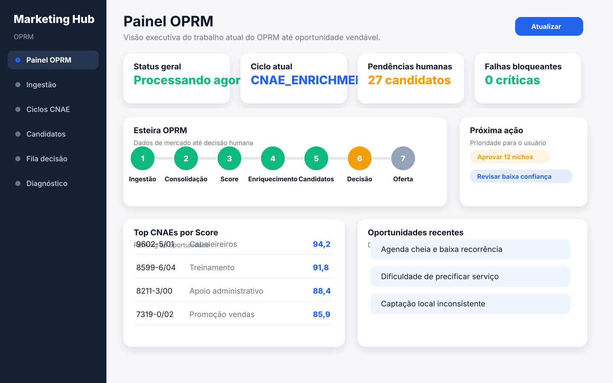
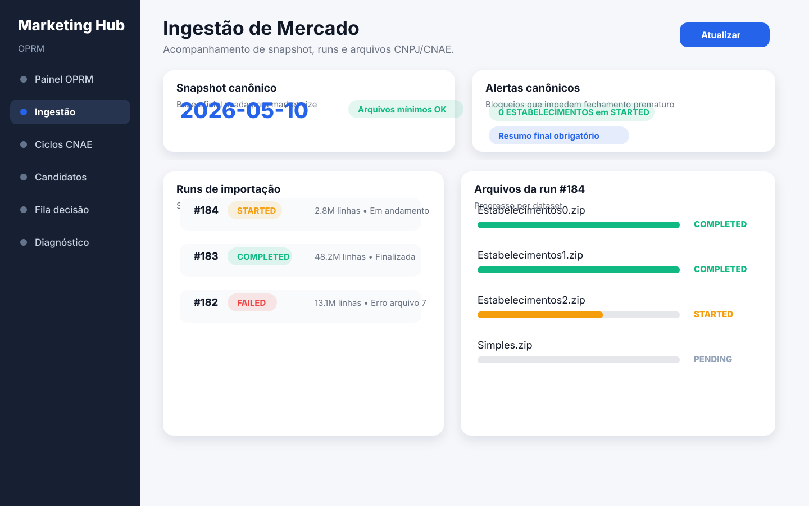
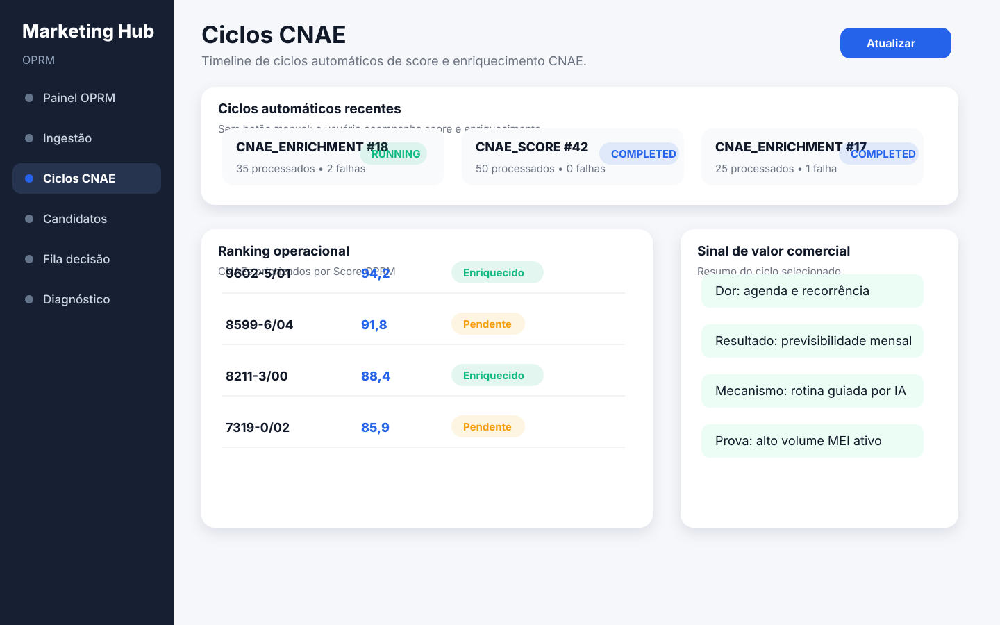
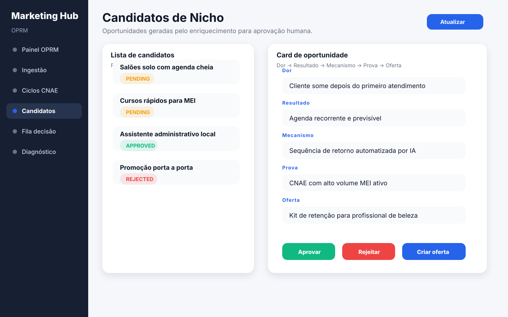
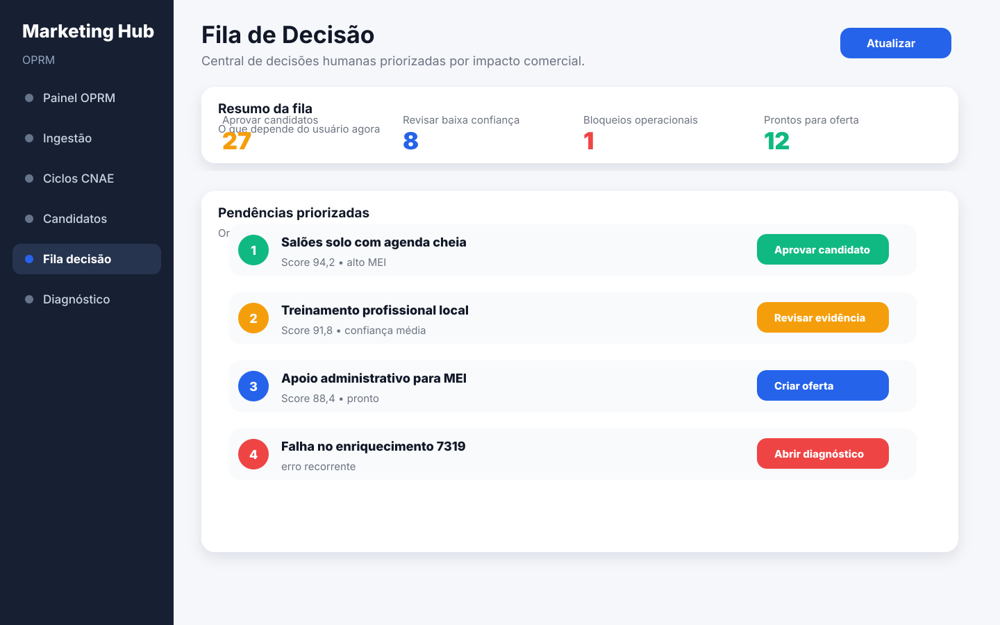
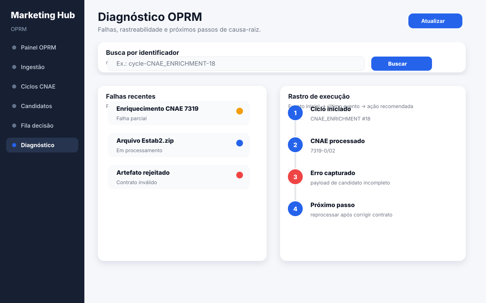

# OPRM — Plano de Telas para Acompanhamento Operacional pelo Usuário

## 1. Objetivo

Este documento planeja as novas telas para o usuário acompanhar **o que está sendo feito no OPRM** sem precisar ler logs, consultar banco ou entender nomes internos de worker.

O foco é transformar a operação automática do OPRM em uma experiência clara de acompanhamento:

- o que está rodando agora;
- qual etapa já terminou;
- qual etapa está pendente;
- onde houve falha;
- qual impacto de negócio foi produzido;
- qual próxima decisão humana é necessária.

A UI deve preservar o eixo central do Marketing Hub: **Dor → Resultado → Mecanismo → Prova → Oferta**. O acompanhamento operacional só é útil se deixar claro como a execução do OPRM aproxima o sistema de uma oportunidade vendável.

---

## 2. Princípios das novas telas

### 2.1 Visão de usuário antes de visão técnica

A tela deve responder primeiro perguntas humanas:

1. O OPRM está trabalhando?
2. Em qual fase ele está?
3. O que já foi encontrado?
4. O que precisa da minha decisão?
5. Existe algum bloqueio que impede geração de oportunidade?

Detalhes técnicos como `cycleId`, `runId`, `fileId` e `correlationId` devem aparecer, mas como rastreabilidade secundária, não como título principal da experiência.

### 2.2 Fluxo único de acompanhamento

O usuário deve enxergar o OPRM como uma esteira:

1. ingestão de dados de mercado;
2. consolidação de CNAEs;
3. cálculo de Score OPRM;
4. enriquecimento comercial;
5. geração de candidatos de nicho;
6. aprovação humana;
7. envio para oferta/experimento.

### 2.3 Sem botões que quebrem automação

Como os ciclos de score e enriquecimento são automáticos, as telas devem priorizar acompanhamento, auditoria e decisão humana. Botões manuais só devem existir quando forem seguros e necessários, por exemplo: atualizar tela, aprovar candidato, rejeitar candidato, copiar identificador ou abrir detalhes.

### 2.4 Sem poluição técnica no artefato final

Nenhuma tela deve incentivar publicação de payload com metadado operacional, comentário técnico, flag de debug ou JSON textual dentro de campo funcional. O usuário pode ver metadados de execução em painéis operacionais, mas o artefato comercial final deve conter somente campos contratuais.

---

## 3. Mapa proposto de navegação

A navegação do OPRM deve ganhar um grupo chamado **Acompanhamento**.

Ordem sugerida no módulo:

1. **Painel OPRM** — visão executiva do que está acontecendo agora.
2. **Ingestão de Mercado** — importação CNPJ/CNAE e arquivos do snapshot.
3. **Ciclos CNAE** — score, enriquecimento e status por ciclo.
4. **Candidatos de Nicho** — oportunidades geradas para decisão humana.
5. **Fila de Decisão** — itens que exigem ação do usuário.
6. **Diagnóstico** — falhas, bloqueios, logs resumidos e rastreabilidade.

A rota `/oprm` pode continuar abrindo o ranking de CNAEs enquanto o MVP novo não estiver pronto, mas a evolução recomendada é transformar `/oprm` no **Painel OPRM** e mover o ranking atual para uma aba explícita como `/oprm/cnaes-volume` ou `/oprm/ciclos-cnae`.

---

## 4. Tela 1 — Painel OPRM

### Objetivo

Ser a tela inicial para o usuário entender, em menos de um minuto, o estado atual do OPRM.

### Perguntas que responde

- O OPRM está ativo?
- Qual foi a última execução relevante?
- Há ciclo em andamento?
- Quantos CNAEs já têm score?
- Quantos CNAEs já foram enriquecidos?
- Quantos candidatos de nicho aguardam decisão?
- Existe falha bloqueante?

### Blocos principais

1. **Status geral**
   - `Operando normalmente`
   - `Processando agora`
   - `Aguardando próxima execução`
   - `Com falha parcial`
   - `Bloqueado`

2. **Esteira visual**
   - Ingestão
   - Consolidação
   - Score
   - Enriquecimento
   - Candidatos
   - Decisão humana
   - Oferta/Experimento

3. **Últimos resultados de negócio**
   - CNAEs com maior Score OPRM;
   - candidatos de nicho mais recentes;
   - oportunidades prontas para avaliação;
   - sinais de dor/resultado/mecanismo encontrados.

4. **Pendências para o usuário**
   - candidatos aguardando aprovação;
   - enriquecimentos com confiança baixa;
   - falhas que exigem reprocessamento;
   - runs incompletas de ingestão.

### Ações principais

- Atualizar dados.
- Abrir ciclo em andamento.
- Abrir candidatos pendentes.
- Abrir diagnóstico de falhas.
- Ir para ranking de CNAEs.

### Dados necessários

- Últimos ciclos de `/api/oprm/cnae-cycles`.
- Ranking de CNAEs de `/api/oprm/market/import-runs/cnaes/top-volume`.
- Lista de runs de `/api/oprm/market/import-runs`.
- Contagem de candidatos pendentes por status.
- Últimos artefatos rejeitados de `/api/oprm/artifacts?status=REJECTED`.

### Critério de pronto

A tela é considerada pronta quando o usuário consegue identificar se o OPRM está avançando para gerar oportunidades vendáveis ou se existe bloqueio operacional.

---

## 5. Tela 2 — Ingestão de Mercado

### Objetivo

Mostrar a importação CNPJ/CNAE de forma rastreável e compreensível, especialmente porque essa etapa alimenta o tamanho de mercado e o ranking de CNAEs.

### Perguntas que responde

- Qual snapshot está sendo usado?
- A run está aberta, concluída ou falhou?
- Quais arquivos foram processados?
- Existe arquivo `STARTED` impedindo fechamento correto?
- Quantas linhas foram lidas, válidas e ignoradas?
- O market size foi publicado?

### Blocos principais

1. **Snapshot atual**
   - data canônica do snapshot;
   - origem dos arquivos;
   - horário da última validação;
   - status dos arquivos mínimos esperados.

2. **Runs de importação**
   - `runId`;
   - status;
   - início/fim;
   - linhas lidas;
   - linhas válidas;
   - linhas ignoradas;
   - erro resumido.

3. **Detalhe por arquivo**
   - tipo do dataset;
   - nome do arquivo;
   - status;
   - linhas lidas;
   - CNAEs consolidados;
   - duração;
   - último evento.

4. **Alertas canônicos**
   - arquivo `ESTABELECIMENTOS` em `STARTED`;
   - fechamento antecipado bloqueado;
   - falha por memória/capacidade;
   - ausência de resumo final ou progresso.

### Ações principais

- Atualizar lista.
- Abrir arquivos da run.
- Copiar `runId`.
- Ver erro detalhado.
- Abrir diagnóstico filtrado pela run.

### Dados necessários

- `/api/oprm/market/import-runs`.
- `/api/oprm/market/import-runs/{runId}/files`.
- Logs resumidos do módulo `oprm-coletor-receita` via MCP para diagnóstico quando houver falha.

### Critério de pronto

A tela é considerada pronta quando o usuário consegue saber se a base de mercado está confiável para alimentar decisão comercial.

---

## 6. Tela 3 — Ciclos CNAE

### Objetivo

Acompanhar os ciclos automáticos de Score OPRM e enriquecimento sem confundir o usuário com execução manual.

### Perguntas que responde

- Qual ciclo rodou por último?
- O ciclo foi de score ou enriquecimento?
- Quantos CNAEs foram processados?
- Quantos falharam?
- Qual critério de seleção foi usado?
- Qual resumo de negócio foi produzido?

### Blocos principais

1. **Timeline de ciclos**
   - ciclo;
   - tipo;
   - status;
   - processados;
   - falhas;
   - início;
   - fim;
   - duração.

2. **Detalhe do ciclo selecionado**
   - critério de seleção;
   - resumo;
   - erro, se houver;
   - lista de CNAEs impactados quando disponível.

3. **Ranking operacional**
   - CNAE;
   - descrição;
   - Score OPRM;
   - status do score;
   - volume total;
   - empresas MEI;
   - empresas Simples;
   - enriquecido ou pendente.

4. **Sinal de valor comercial**
   - top dores identificadas;
   - top resultados desejados;
   - top mecanismos sugeridos;
   - nível de prontidão para virar nicho/oferta.

### Ações principais

- Atualizar ciclos.
- Abrir CNAE no detalhe.
- Filtrar por ciclo com falha.
- Filtrar por `notEnriched`.
- Ir para candidatos gerados daquele CNAE.

### Dados necessários

- `/api/oprm/cnae-cycles`.
- `/api/oprm/market/import-runs/cnaes/top-volume`.
- `/api/oprm/cnae-niche-candidates?cnaeCode={cnaeCode}`.

### Critério de pronto

A tela é considerada pronta quando o usuário consegue acompanhar a evolução automática dos CNAEs até virarem oportunidades analisáveis.

---

## 7. Tela 4 — Candidatos de Nicho

### Objetivo

Transformar o enriquecimento do OPRM em decisão humana clara, evitando criação automática de nicho sem validação.

### Perguntas que responde

- Quais candidatos de nicho foram gerados?
- De qual CNAE vieram?
- Qual dor principal foi detectada?
- Qual resultado desejado foi identificado?
- Qual mecanismo parece plausível?
- Qual prova inicial sustenta a oportunidade?
- O candidato deve ser aprovado, rejeitado ou revisado?

### Blocos principais

1. **Lista de candidatos**
   - status: `PENDING`, `APPROVED`, `REJECTED`;
   - CNAE;
   - nome sugerido do nicho;
   - score/prioridade;
   - data de geração;
   - decisão pendente.

2. **Card de oportunidade**
   - Dor;
   - Resultado;
   - Mecanismo;
   - Prova;
   - Oferta preliminar.

3. **Evidência resumida**
   - origem do sinal;
   - confiança;
   - resumo sem JSON textual;
   - observações do enriquecimento.

4. **Decisão humana**
   - aprovar;
   - rejeitar;
   - enviar para revisão;
   - vincular a nicho oficial existente, quando aplicável.

### Ações principais

- Aprovar candidato.
- Rejeitar candidato.
- Abrir CNAE de origem.
- Enviar para construção de oferta.
- Copiar trilha de decisão.

### Dados necessários

- `/api/oprm/cnae-niche-candidates?cnaeCode={cnaeCode}`.
- `/api/oprm/cnae-niche-candidates/{id}/approve`.
- `/api/oprm/cnae-niche-candidates/{id}/reject`.
- Endpoint agregado futuro recomendado: `GET /api/oprm/cnae-niche-candidates?status=PENDING&page=0&size=50`.

### Critério de pronto

A tela é considerada pronta quando o usuário consegue converter saídas automáticas em decisões comerciais controladas.

---

## 8. Tela 5 — Fila de Decisão

### Objetivo

Centralizar tudo que precisa de ação humana no OPRM.

### Perguntas que responde

- O que depende de mim agora?
- Qual ação gera mais impacto comercial?
- Qual item está parado há mais tempo?
- Qual candidato está pronto para virar oferta?

### Blocos principais

1. **Pendências priorizadas**
   - candidatos pendentes;
   - CNAEs de alto score sem enriquecimento;
   - candidatos com baixa confiança;
   - falhas recorrentes que impedem avanço.

2. **Prioridade comercial**
   - Score OPRM;
   - tamanho de mercado;
   - aderência MEI/Simples;
   - clareza da dor;
   - plausibilidade do mecanismo.

3. **Ação recomendada**
   - aprovar;
   - revisar evidência;
   - aguardar enriquecimento;
   - descartar;
   - abrir diagnóstico.

### Ações principais

- Resolver item.
- Abrir detalhe.
- Ignorar temporariamente.
- Enviar para oferta.

### Dados necessários

- Agregação de candidatos por status.
- Ranking de CNAEs por Score OPRM.
- Ciclos recentes.
- Falhas recentes de artefato e enriquecimento.

### Critério de pronto

A tela é considerada pronta quando o usuário não precisa procurar em várias telas para saber qual decisão tomar primeiro.

---

## 9. Tela 6 — Diagnóstico

### Objetivo

Dar rastreabilidade suficiente para entender bloqueios sem expor o usuário a uma parede de logs.

### Perguntas que responde

- O que falhou?
- Em qual módulo?
- Qual identificador devo usar para investigação?
- A falha é de ingestão, score, enriquecimento, persistência ou frontend?
- Qual é a ação recomendada para resolver causa-raiz?

### Blocos principais

1. **Falhas recentes**
   - tipo;
   - módulo;
   - severidade;
   - mensagem resumida;
   - data/hora;
   - identificador rastreável.

2. **Busca por identificador**
   - `runId`;
   - `fileId`;
   - `cycleId`;
   - `cnaeCode`;
   - `candidateId`;
   - `correlationId`.

3. **Rastro de execução**
   - evento inicial;
   - eventos intermediários;
   - último evento;
   - erro raiz conhecido;
   - recomendação objetiva.

4. **Contratos e endpoints envolvidos**
   - endpoint chamado;
   - método;
   - status HTTP;
   - payload resumido sem secrets;
   - resposta resumida.

### Ações principais

- Copiar identificador.
- Abrir run.
- Abrir ciclo.
- Abrir candidato.
- Filtrar logs resumidos.

### Dados necessários

- `/api/oprm/artifacts?status=REJECTED`.
- `/api/oprm/artifacts?correlationId={correlationId}`.
- `/api/oprm/cnae-cycles`.
- `/api/oprm/market/import-runs`.
- MCP `java_module_logs` para consultas de suporte operacional, mantendo a UI com resumo e não com log bruto interminável.

### Critério de pronto

A tela é considerada pronta quando o usuário consegue sair de “deu erro” para “sei onde falhou e qual é o próximo passo”.

---

## 10. Endpoints já disponíveis e lacunas

### 10.1 Disponíveis hoje

- `GET /api/oprm/market/import-runs` — lista runs de importação.
- `GET /api/oprm/market/import-runs/{runId}/files` — lista arquivos de uma run.
- `GET /api/oprm/market/import-runs/cnaes/top-volume?page=&size=` — ranking paginado de CNAEs por Score OPRM.
- `GET /api/oprm/cnae-cycles?limit=` — ciclos operacionais recentes.
- `GET /api/oprm/cnae-niche-candidates?cnaeCode=` — candidatos de nicho por CNAE.
- `POST /api/oprm/cnae-niche-candidates/{id}/approve` — aprova candidato.
- `POST /api/oprm/cnae-niche-candidates/{id}/reject` — rejeita candidato.
- `GET /api/oprm/artifacts?status=REJECTED` — artefatos rejeitados.
- `GET /api/oprm/artifacts?correlationId=` — rastreio por correlação.

### 10.2 Lacunas recomendadas para o backend

1. `GET /api/oprm/dashboard/summary`
   - status geral;
   - ciclo atual;
   - contadores por etapa;
   - pendências humanas;
   - falhas bloqueantes.

2. `GET /api/oprm/cnae-niche-candidates?status=&page=&size=`
   - listagem paginada por status, sem exigir `cnaeCode`.

3. `GET /api/oprm/decision-queue`
   - fila priorizada de ações humanas.

4. `GET /api/oprm/diagnostics/recent-failures`
   - falhas resumidas por módulo/etapa com identificadores rastreáveis.

5. `GET /api/oprm/cnaes/{cnaeCode}/timeline`
   - linha do tempo do CNAE desde ingestão até candidatos.

Essas lacunas devem ser criadas no backend OPRM antes de qualquer frontend que dependa delas, respeitando a regra de que o frontend não deve inventar contratos inexistentes.

---

## 11. MVP recomendado

### Sprint A — Painel OPRM + Ciclos CNAE

Entregar primeiro:

- novo Painel OPRM;
- cards de status geral;
- últimos ciclos;
- top CNAEs por Score OPRM;
- pendências básicas;
- link para ranking atual.

Motivo: aproveita endpoints já existentes e melhora imediatamente a capacidade do usuário de acompanhar o trabalho automático.

### Sprint B — Ingestão de Mercado

Entregar:

- runs de importação;
- arquivos da run;
- alertas de `STARTED`, `FAILED` e fechamento bloqueado;
- resumo de linhas e consolidação.

Motivo: reduz risco operacional, principalmente nas rotinas grandes de `Estabelecimentos`.

### Sprint C — Candidatos de Nicho + Fila de Decisão

Entregar:

- listagem de candidatos por status;
- cards Dor → Resultado → Mecanismo → Prova → Oferta;
- aprovar/rejeitar;
- fila priorizada.

Motivo: conecta a automação do OPRM com decisão comercial e geração de vendas.

### Sprint D — Diagnóstico

Entregar:

- falhas recentes;
- busca por identificador;
- trilha resumida;
- recomendação de causa-raiz.

Motivo: melhora suporte e evita correções por consequência.

---

## 12. Regras de design para as novas telas

1. Toda tela deve mostrar **próxima ação recomendada**.
2. Todo status técnico deve ter tradução operacional simples.
3. Todo erro deve apontar identificador rastreável.
4. Nenhuma tela deve exibir excesso de JSON bruto.
5. Nenhum campo final de oferta deve receber metadado técnico.
6. A ordenação padrão deve priorizar impacto comercial, não apenas data.
7. Estados vazios devem explicar o motivo provável e o próximo passo.
8. Estados de falha devem separar erro bloqueante de falha parcial.

---

## 13. Resultado esperado

Com essas telas, o usuário deixa de ver o OPRM como uma caixa-preta técnica e passa a acompanhar uma esteira de criação de oportunidade:

**Dados de mercado → Score → Enriquecimento → Nicho candidato → Decisão humana → Oferta vendável**.

A experiência proposta reforça o objetivo comercial do Marketing Hub: gerar produtos digitais vendáveis a partir de necessidades reais, dores concretas, mecanismos plausíveis e oportunidades com sustentação operacional.

---

## 14. Wireframes visuais das telas

As imagens abaixo materializam o planejamento das telas para facilitar validação visual antes da implementação no frontend. Elas são **wireframes SVG**, portanto podem ser abertas diretamente no navegador, versionadas no Git e convertidas para PNG quando necessário.

### 14.1 Painel OPRM

### 14.2 Ingestão de Mercado

### 14.3 Ciclos CNAE

### 14.4 Candidatos de Nicho

### 14.5 Fila de Decisão

### 14.6 Diagnóstico OPRM

