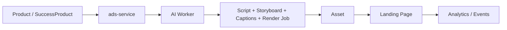

# Plano de Implementação — Avatar de Venda em Vídeo para Landing Page

- **Versão:** v1.0.0
- **Data de revisão:** 2026-03-24
- **Autor:** GPT-5.4 Thinking
- **Status:** proposed

---

## 1) Objetivo

Implementar a funcionalidade de **Avatar de Venda em Vídeo** para gerar, revisar, publicar e medir **vídeos curtos orientados à conversão** nas landing pages do Marketing Hub.

O foco desta funcionalidade não é um chat em tempo real. O foco é um pipeline de **vídeos pré-renderizados**, curtos e reutilizáveis, capazes de:

- explicar os benefícios do produto digital;
- apresentar promessa, mecanismo e diferenciais com clareza;
- reduzir objeções antes do clique no checkout;
- aumentar engajamento e taxa de avanço na landing.

---

## 2) Contexto e motivação

O projeto já possui peças importantes para suportar este módulo:

- backend principal em `backend/ads-service`;
- frontend com rota pública de landing em `/landing/:id`;
- `ai-worker` separado para tarefas assíncronas agendadas;
- modelo de dados com `asset`, `product`, `success_product` e `ai_worker_generation`;
- documentação e pipeline de `avatar` já voltados a geração/ingestão assíncrona e controle de custo.

Isso permite construir o módulo novo sem abrir outro sistema do zero. O encaixe natural é:

- **backend principal**: orquestração, APIs, persistência e publicação;
- **ai-worker**: geração offline de script, storyboard, legendas e render jobs;
- **frontend**: configuração, revisão, preview e publicação na landing;
- **asset store**: armazenamento e distribuição de vídeo, poster e legendas.

---

## 3) Princípios do produto

1. **Vídeo curto vence vídeo complexo**  
   O MVP deve priorizar vídeos de 15 a 45 segundos, com função clara dentro da landing.

2. **Oferta antes do avatar**  
   O personagem é a interface. O ativo principal é a clareza da oferta: dor, promessa, mecanismo, prova, reversão de risco e CTA.

3. **Pré-renderização antes de geração em tempo real**  
   O vídeo deve ser gerado offline e publicado como asset, evitando latência, custo imprevisível e risco operacional na página.

4. **Reuso da arquitetura existente**  
   O módulo deve reaproveitar `asset`, `product`, `success_product`, `ai_worker_generation`, preview de landing e padrão assíncrono do worker.

5. **Conversão com transparência**  
   O vídeo deve persuadir de forma honesta, sem promessas irreais, depoimentos sintéticos enganosos ou alegações sem evidência.

---

## 4) Escopo funcional

### 4.1 MVP

Gerar e publicar três tipos de vídeo por oferta:

1. **Vídeo principal da landing**
   - duração alvo: 30–45s;
   - objetivo: explicar problema, benefício principal, mecanismo e CTA.

2. **Vídeo de objeção**
   - duração alvo: 15–25s;
   - objetivo: responder dúvidas como “serve para mim?”, “vale o preço?”, “quanto tempo leva?”.

3. **Vídeo de prova/credibilidade**
   - duração alvo: 15–30s;
   - objetivo: reforçar confiança, demonstração, transformação esperada ou diferenciais.

### 4.2 Fora do escopo do MVP

- avatar respondendo ao vivo por visitante;
- geração de vídeo on-demand durante a navegação;
- múltiplos personagens concorrendo na mesma dobra sem experimento controlado;
- personalização individual em tempo real baseada em perfil do visitante;
- edição profissional quadro a quadro dentro da plataforma.

---

## 5) Arquitetura alvo

### 5.1 Visão de alto nível



### 5.2 Responsabilidades

#### Backend (`ads-service`)
- receber solicitações de geração;
- persistir configuração e status;
- acionar jobs assíncronos;
- armazenar metadados editoriais e vínculos com produto/landing;
- publicar o vídeo em slots da landing;
- expor métricas e histórico.

#### AI Worker
- consolidar contexto da oferta;
- gerar script e variações de ângulo;
- gerar storyboard técnico;
- gerar legendas e texto auxiliar;
- acionar pipeline de render;
- registrar custo e resultados.

#### Frontend
- configurar vídeos por produto ou landing;
- revisar roteiro antes do render final;
- mostrar status do job;
- exibir preview do vídeo;
- permitir publicar/despublicar na landing.

#### Camada de Assets
- armazenar `mp4`, opcionalmente `webm`, imagem poster e arquivo `.vtt`;
- servir URLs assinadas/internas conforme padrão já usado no backend.

---

## 6) Modelo conceitual

### 6.1 Entidades novas

#### `sales_video_profile`
Representa a configuração do personagem/estilo do vídeo.

Campos sugeridos:
- `id`
- `name`
- `persona_type` (`SPECIALIST`, `MENTOR`, `CONSULTANT`, `HOST`)
- `visual_avatar_asset_id` (opcional)
- `voice_provider`
- `voice_id`
- `language`
- `tone`
- `default_cta`
- `status`
- `created_at`
- `updated_at`

#### `sales_video_script`
Representa o script gerado ou revisado.

Campos sugeridos:
- `id`
- `product_id` (ou `success_product_id`, quando aplicável)
- `landing_page_id` (opcional)
- `profile_id`
- `video_type` (`HERO`, `OBJECTION`, `PROOF`)
- `angle`
- `hook`
- `body_text`
- `cta_text`
- `duration_target_seconds`
- `status` (`DRAFT`, `APPROVED`, `ARCHIVED`)
- `source_prompt`
- `model`
- `created_at`
- `updated_at`

#### `sales_video_render_job`
Representa o pipeline assíncrono de render.

Campos sugeridos:
- `id`
- `script_id`
- `status` (`PENDING`, `PROCESSING`, `READY`, `FAILED`)
- `provider`
- `provider_job_id`
- `output_asset_id`
- `poster_asset_id`
- `captions_asset_id`
- `failure_code`
- `failure_detail`
- `started_at`
- `finished_at`
- `created_at`
- `updated_at`

#### `landing_video_slot`
Representa a publicação do vídeo na landing.

Campos sugeridos:
- `id`
- `landing_page_id`
- `render_job_id`
- `slot_key` (`HERO_TOP`, `OBJECTION_1`, `PROOF_1`, etc.)
- `autoplay`
- `muted`
- `show_controls`
- `show_captions_by_default`
- `poster_asset_id`
- `is_active`
- `created_at`
- `updated_at`

### 6.2 Entidades existentes reaproveitadas

- `asset`: armazenamento do vídeo final, poster e legenda;
- `product`: contém campos valiosos para roteiro como `explicit_pain`, `promise`, `unique_mechanism`, `risk_reversal`, `social_proof`, `checkout_monetization`, `storytelling`;
- `success_product`: fonte adicional para oferta inspiradora ou benchmark interno;
- `ai_worker_generation`: trilha de auditoria de prompts, respostas brutas, tokens e custo.

---

## 7) Fluxo funcional

### 7.1 Geração inicial

1. Usuário abre um produto.
2. Seleciona “Gerar vídeo principal” ou outro tipo.
3. Backend cria `sales_video_script` em `DRAFT` e solicita processamento ao worker.
4. Worker lê contexto do produto e gera:
   - resumo da oferta;
   - script falado;
   - sugestão de duração;
   - storyboard de cenas;
   - CTA final;
   - legenda base.
5. Usuário revisa o script.
6. Usuário aprova o script.
7. Backend cria `sales_video_render_job`.
8. Worker renderiza o vídeo.
9. Worker salva assets e vincula ao job.
10. Usuário publica o vídeo em um slot da landing.

### 7.2 Atualização

1. Usuário ajusta hook, CTA, ângulo ou voz.
2. Sistema cria nova versão de script.
3. Novo render job é disparado.
4. Publicação pode trocar a versão ativa sem apagar histórico.

### 7.3 Falha

1. Job falha por timeout, erro do provider ou asset inválido.
2. Backend grava `failure_code` e `failure_detail`.
3. UI mostra erro compreensível.
4. Usuário pode reenfileirar o job.

---

## 8) Backlog priorizado

## MVP

### 8.1 Backend — domínio e APIs base

- Criar entidades:
  - `sales_video_profile`
  - `sales_video_script`
  - `sales_video_render_job`
  - `landing_video_slot`
- Criar contratos REST:
  - `POST /api/products/{productId}/sales-videos/scripts`
  - `GET /api/products/{productId}/sales-videos/scripts`
  - `PATCH /api/sales-videos/scripts/{scriptId}`
  - `POST /api/sales-videos/scripts/{scriptId}/approve`
  - `POST /api/sales-videos/scripts/{scriptId}/render`
  - `GET /api/sales-videos/render-jobs/{jobId}`
  - `POST /api/landing-pages/{landingPageId}/video-slots`
  - `PATCH /api/landing-pages/{landingPageId}/video-slots/{slotId}`
  - `DELETE /api/landing-pages/{landingPageId}/video-slots/{slotId}`
- Reaproveitar `asset` para os outputs.

### 8.2 AI Worker — geração offline

- Criar job `SALES_VIDEO_SCRIPT`.
- Criar job `SALES_VIDEO_RENDER`.
- Registrar ambos em `ai_worker_generation`.
- Consolidar contexto do produto usando campos estruturados do `product`.
- Produzir script curto, storyboard, CTA e legenda base.

### 8.3 Frontend — setup e publicação

- Adicionar aba “Vídeos de Venda” em produto e/ou landing.
- Criar formulário para:
  - tipo de vídeo;
  - perfil/avatar;
  - duração alvo;
  - tom;
  - CTA;
  - idioma.
- Mostrar preview de script antes do render.
- Mostrar status do render e botão de publicação na landing.

### 8.4 Landing — consumo

- Criar componente `SalesVideoBlock`.
- Renderizar vídeo publicado por slot.
- Expor opções:
  - poster;
  - controles;
  - autoplay mudo;
  - captions;
  - CTA visível após X segundos.

### 8.5 Observabilidade inicial

- Feature flag global: `salesVideo.enabled`.
- Métricas básicas:
  - tempo de geração de script;
  - tempo de render;
  - taxa de erro;
  - custo por vídeo;
  - taxa de publicação;
  - taxa de play e clique.

## V1

### 8.6 Otimização operacional

- Retry manual de render.
- Histórico de versões de script.
- Múltiplos perfis de apresentador.
- Templates de hook por tipo de oferta.
- Geração de 3 variações por ângulo.

### 8.7 Conversão

- A/B test entre dois vídeos na mesma landing/experimento.
- Eventos por quartil de reprodução.
- Heatmap de desempenho por slot.
- Recomendação de melhor vídeo por CTR para checkout.

## V2

### 8.8 Governança e escala

- quotas por tenant/plano;
- budget alert por custo de render;
- fallback entre provedores de voz/avatar;
- cache de scripts semelhantes;
- revisão editorial obrigatória para publicação em produção.

---

## 9) APIs propostas

### 9.1 Criar script

`POST /api/products/{productId}/sales-videos/scripts`

Payload sugerido:

```json
{
  "videoType": "HERO",
  "profileId": 12,
  "durationTargetSeconds": 40,
  "tone": "clear_persuasive",
  "goal": "explain_main_benefit",
  "ctaText": "Quero começar agora",
  "language": "pt-BR"
}
```

Resposta:

```json
{
  "id": 101,
  "status": "DRAFT",
  "videoType": "HERO",
  "durationTargetSeconds": 40
}
```

### 9.2 Aprovar script

`POST /api/sales-videos/scripts/{scriptId}/approve`

### 9.3 Gerar render

`POST /api/sales-videos/scripts/{scriptId}/render`

Payload sugerido:

```json
{
  "provider": "default",
  "renderMode": "TEMPLATE",
  "outputFormats": ["mp4", "webm"],
  "captions": true,
  "poster": true
}
```

### 9.4 Publicar na landing

`POST /api/landing-pages/{landingPageId}/video-slots`

Payload sugerido:

```json
{
  "renderJobId": 501,
  "slotKey": "HERO_TOP",
  "autoplay": true,
  "muted": true,
  "showControls": true,
  "showCaptionsByDefault": true,
  "isActive": true
}
```

---

## 10) Pipeline do Worker

### 10.1 Job 1 — `SALES_VIDEO_SCRIPT`

Entrada:
- `productId`
- `videoType`
- `profileId`
- `durationTargetSeconds`
- `language`
- `tone`
- `ctaText`

Passos:
1. Carregar `product`.
2. Ler campos estruturados da oferta.
3. Gerar resumo interno da oferta.
4. Gerar script principal.
5. Gerar storyboard.
6. Gerar legenda inicial.
7. Persistir tudo em `sales_video_script`.
8. Registrar saída em `ai_worker_generation`.

### 10.2 Job 2 — `SALES_VIDEO_RENDER`

Entrada:
- `scriptId`
- `provider`
- `renderMode`

Passos:
1. Carregar script aprovado.
2. Resolver voz e avatar visual.
3. Montar payload de render.
4. Chamar provider.
5. Receber vídeo, poster e captions.
6. Persistir outputs como `asset`.
7. Atualizar `sales_video_render_job`.
8. Registrar custo e resposta em `ai_worker_generation`.

### 10.3 Modos de render

#### `TEMPLATE`
Usa composição simples com avatar, fundo, headline e CTA.

#### `SCENE_BASED`
Usa storyboard com múltiplas cenas e cortes.

#### `VOICEOVER_ONLY`
Usa voz + motion graphics/legenda, sem personagem visível.

O MVP deve começar por `TEMPLATE`, porque simplifica entrega, reduz latência e aproveita melhor o pipeline assíncrono já existente no projeto.

---

## 11) Regras editoriais para o script

### 11.1 Estrutura recomendada do vídeo principal

1. **Hook** (0–5s)
   - reconhecer dor ou desejo principal.
2. **Problema** (5–10s)
   - mostrar por que a pessoa continua travada.
3. **Mecanismo** (10–22s)
   - explicar o diferencial da solução.
4. **Benefício** (22–32s)
   - traduzir recurso em transformação.
5. **Risco reduzido** (32–38s)
   - garantia, clareza, facilidade, suporte.
6. **CTA** (38–45s)
   - orientar o próximo clique.

### 11.2 Regras de redação

- evitar jargão técnico desnecessário;
- evitar promessa financeira garantida;
- evitar depoimentos artificiais não identificados;
- usar frases curtas e faladas;
- transformar feature em benefício concreto;
- encerrar sempre com CTA explícito.

### 11.3 Campos mínimos do produto para gerar script bom

- `explicit_pain`
- `promise`
- `unique_mechanism`
- `risk_reversal`
- `social_proof`
- `storytelling`

Se esses campos estiverem ausentes, o backend deve sinalizar baixa qualidade editorial antes do render.

---

## 12) Integração com landing page

### 12.1 Slots sugeridos

- `HERO_TOP`: vídeo principal acima ou próximo do CTA principal;
- `OBJECTION_1`: vídeo curto entre seções de dúvida/garantia;
- `PROOF_1`: vídeo curto antes de checkout ou bloco de prova social.

### 12.2 Componente de frontend

Props sugeridas:
- `videoUrl`
- `posterUrl`
- `captionsUrl`
- `autoplay`
- `muted`
- `showControls`
- `ctaLabel`
- `ctaHref`
- `trackingContext`

### 12.3 Regras de UX

- autoplay apenas com `muted=true`;
- poster obrigatório para reduzir custo perceptivo de carregamento;
- CTA visível sem depender do término do vídeo;
- captions disponíveis por padrão;
- não bloquear a leitura principal da página.

---

## 13) Analytics e eventos

### 13.1 Eventos de gestão

- `sales_video.script_requested`
- `sales_video.script_generated`
- `sales_video.script_approved`
- `sales_video.render_requested`
- `sales_video.render_ready`
- `sales_video.render_failed`
- `sales_video.published`
- `sales_video.unpublished`

### 13.2 Eventos de comportamento na landing

- `sales_video.view`
- `sales_video.play`
- `sales_video.progress_25`
- `sales_video.progress_50`
- `sales_video.progress_75`
- `sales_video.progress_100`
- `sales_video.cta_click`
- `sales_video.checkout_click_after_play`

### 13.3 Métricas principais

- taxa de play por impressão do slot;
- conclusão de vídeo;
- CTR para CTA após play;
- taxa de clique para checkout por variante;
- taxa de publicação por script gerado;
- custo médio por vídeo pronto;
- tempo médio `PENDING -> READY`.

---

## 14) Performance, acessibilidade e conformidade

### 14.1 Performance

- gerar `mp4` como formato base;
- considerar `webm` como formato adicional quando houver ganho de compressão;
- usar poster image;
- carregar vídeo de forma lazy quando fora da dobra;
- evitar autoplay com áudio;
- manter bitrate e duração sob controle por slot.

### 14.2 Acessibilidade

- gerar captions para todo vídeo falado;
- permitir exibição de legendas no player;
- revisar legenda automática antes da publicação, quando necessário;
- não depender apenas do áudio para transmitir a proposta de valor.

### 14.3 Conformidade e confiança

- sinalizar internamente quando o apresentador for sintético;
- proibir no prompt alegações de renda garantida, depoimentos inventados e comparações sem base;
- exigir revisão editorial em ofertas sensíveis;
- registrar prompt, output bruto e custo em trilha auditável.

---

## 15) Segurança e governança

- controlar acesso por tenant/usuário;
- registrar autoria de criação, aprovação e publicação;
- versionar scripts e renders;
- não sobrescrever assets publicados sem histórico;
- prever quota de geração por tenant;
- rotacionar segredos e remover qualquer credencial sensível da documentação pública antes do rollout produtivo.

---

## 16) Decomposição por sprint

> Planejamento sugerido para sprints de 2 semanas.

## Sprint 1 — Fundacional

### Backend
- criar migrations das quatro entidades novas;
- implementar APIs de criação, edição e aprovação de script;
- vincular `product` e `landing_page` ao novo domínio;
- reaproveitar `asset` para outputs.

### Worker
- implementar job `SALES_VIDEO_SCRIPT`;
- registrar geração em `ai_worker_generation`;
- produzir script, storyboard e legenda base.

### Frontend
- criar aba “Vídeos de Venda” no detalhe do produto;
- criar editor simples de script;
- mostrar status de geração.

### Critérios de conclusão
- script gerado a partir de produto existente;
- revisão manual possível;
- histórico mínimo salvo.

## Sprint 2 — Render e publicação

### Backend
- implementar `sales_video_render_job`;
- criar endpoints de render e consulta;
- criar publicação em `landing_video_slot`.

### Worker
- implementar job `SALES_VIDEO_RENDER`;
- persistir vídeo, poster e `.vtt` como assets;
- padronizar falhas e retry manual.

### Frontend
- preview do vídeo final;
- botão “Publicar na landing”;
- gerenciamento de slots.

### Critérios de conclusão
- vídeo principal publicado em `/landing/:id`;
- asset disponível e reproduzível;
- erro de render visível na UI.

## Sprint 3 — Conversão e qualidade

### Backend
- instrumentar eventos de play, quartis e CTA;
- expor dados para analytics;
- bloquear publicação quando campos mínimos do produto estiverem ausentes.

### Worker
- gerar 2–3 variações por ângulo;
- melhorar prompts com base em `explicit_pain`, `promise` e `unique_mechanism`.

### Frontend
- dashboard simples por vídeo;
- comparação entre variantes;
- edição rápida de CTA.

### Critérios de conclusão
- métricas de engajamento disponíveis;
- pelo menos duas variantes comparáveis por oferta.

## Sprint 4 — Escala controlada

### Plataforma
- feature flag por tenant;
- limites de uso;
- alertas de custo;
- fallback de provider;
- aprovação editorial opcional por ambiente.

### Critérios de conclusão
- rollout parcial seguro;
- custo previsível;
- incidentes cobertos por observabilidade mínima.

---

## 17) Riscos e mitigação

### Risco 1 — Vídeo bonito, mas fraco em conversão
**Mitigação:** amarrar geração aos campos de oferta e não apenas ao avatar visual.

### Risco 2 — Render caro e lento
**Mitigação:** começar com `TEMPLATE`, limitar duração, controlar quotas e registrar custo por job.

### Risco 3 — Landing lenta
**Mitigação:** poster obrigatório, lazy loading, compressão e formatos adequados.

### Risco 4 — Legenda ruim ou inexistente
**Mitigação:** gerar `.vtt`, permitir revisão e publicar captions por padrão.

### Risco 5 — Promessas enganosas
**Mitigação:** policy de prompt, revisão editorial e logging completo de output.

---

## 18) Critérios de aceite do MVP

O MVP será considerado entregue quando:

1. for possível gerar um script de vídeo principal a partir de um `product` existente;
2. o usuário puder revisar e aprovar o script antes do render;
3. o worker conseguir gerar vídeo, poster e legenda como assets;
4. a landing conseguir consumir o vídeo publicado em um slot configurável;
5. o sistema registrar eventos básicos de play e clique;
6. houver histórico mínimo de geração, falha e custo;
7. o rollout puder ser desligado por feature flag.

---

## 19) Recomendação final

A melhor implementação para o contexto atual do Marketing Hub é tratar **Avatar de Venda em Vídeo** como um módulo próprio, separado do módulo genérico de `avatar`, mas apoiado na mesma filosofia operacional:

- geração assíncrona;
- controle de custo;
- assets persistidos no backend;
- publicação controlada no frontend;
- observabilidade desde o MVP.

O caminho mais forte é começar com **vídeos curtos de benefício na landing**, porque isso resolve o problema real de pré-venda com menor complexidade do que um avatar conversacional ao vivo.

---

## 20) Referências de base usadas neste plano

- Documentação do repositório `Marketing Hub` (`README`, `docs/novos-modulos/avatar/avatar-implementation-plan.md`, `docs/ai-worker/README.md`, `docs/data-model.md`, `docs/frontend-navigation.md`).
- web.dev — práticas de performance para vídeo na web.
- W3C WAI — orientações sobre captions/subtitles.
- FTC — orientações e enforcement contra alegações enganosas envolvendo IA.
