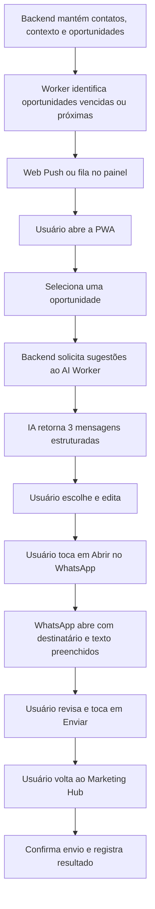
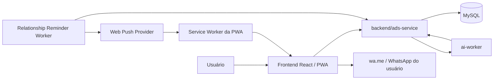
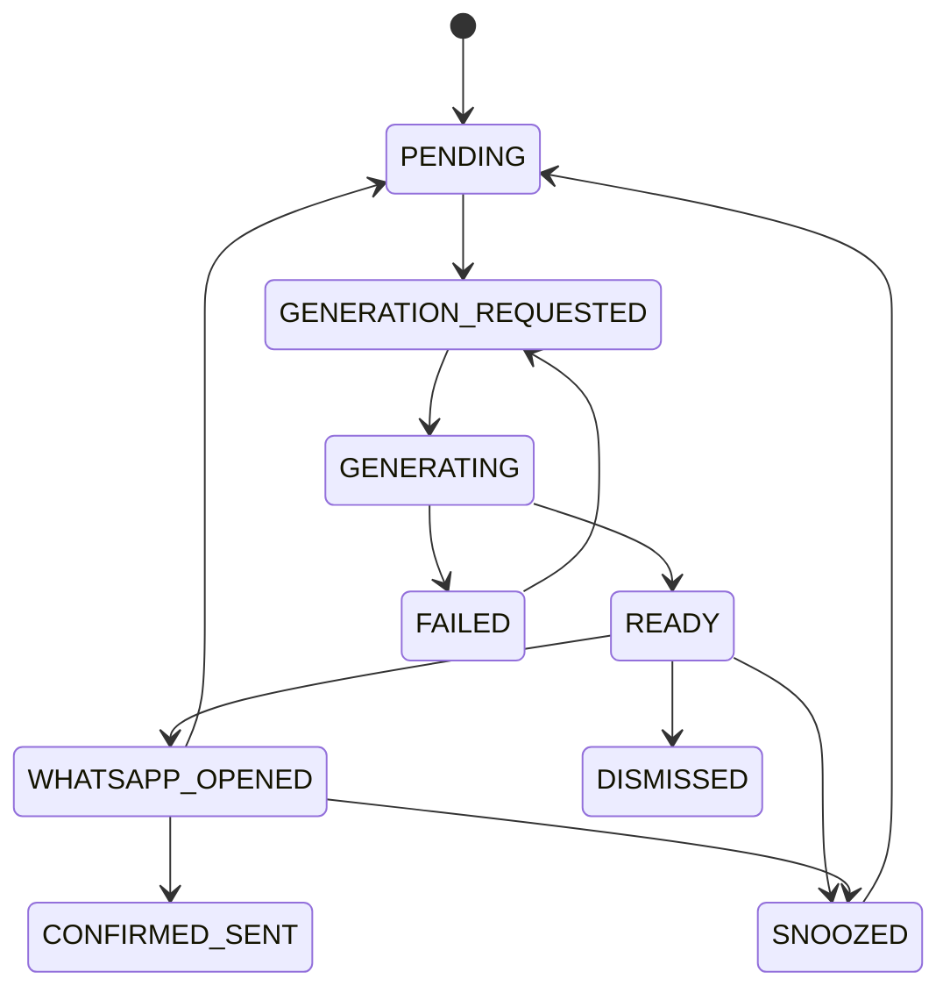

# Assistente Comercial via WhatsApp — Web App/PWA

- **Versão:** v1.0.0
- **Data de revisão:** 2026-06-25
- **Autor:** GPT-5.5 Pro
- **Status:** proposed

---

## 1) Objetivo

Criar um módulo do Marketing Hub que ajude vendedores, consultores e responsáveis pelo relacionamento com clientes a identificar **oportunidades reais de contato**, gerar mensagens personalizadas e iniciar a conversa no WhatsApp do próprio usuário.

O módulo deve funcionar como um **assistente comercial**, não como um robô que controla o WhatsApp.

Fluxo central:

1. o Marketing Hub identifica uma oportunidade de comunicação;
2. a aplicação informa por que vale a pena falar com aquele contato;
3. o backend reúne o contexto comercial disponível;
4. a IA gera três sugestões de mensagem com abordagens diferentes;
5. o usuário escolhe uma sugestão e pode editá-la;
6. a aplicação abre a conversa correspondente no WhatsApp com o texto preenchido;
7. o usuário revisa e toca em **Enviar** no WhatsApp;
8. ao retornar, o usuário pode confirmar o envio e registrar o resultado.

A solução pode ser acessada como página web responsiva, mas a entrega recomendada é uma **Progressive Web App (PWA)** instalável no celular e capaz de receber notificações, quando autorizadas pelo usuário.

> **Princípio central:** a IA prepara e recomenda; o usuário decide, revisa e envia.

---

## 2) Problema de negócio

Muitas vendas e relacionamentos comerciais são perdidos não por falta de interesse, mas porque o responsável:

- esquece de fazer o acompanhamento;
- não sabe qual é o melhor momento para entrar em contato;
- não encontra rapidamente uma mensagem adequada;
- envia mensagens genéricas e sem contexto;
- deixa oportunidades paradas no funil;
- não registra o resultado da conversa;
- perde clientes que poderiam renovar, recomprar ou indicar outras pessoas.

O módulo reduz esse esforço ao transformar dados já existentes no Marketing Hub em uma fila diária de ações simples e contextualizadas.

---

## 3) Casos de uso prioritários

Aniversário é apenas um caso secundário. O foco principal deve ser **vendas, atendimento e relacionamento com clientes**.

### 3.1 Follow-up de lead

Exemplos de gatilho:

- lead pediu informações e não avançou;
- orçamento ou proposta foi enviado;
- demonstração foi realizada;
- lead clicou ou demonstrou interesse, mas não respondeu;
- vendedor combinou um retorno para uma data específica.

Exemplo de oportunidade:

```text
Falar com Mariana Alves

Motivo: proposta enviada há 2 dias e ainda sem retorno registrado.
Objetivo: confirmar se ela conseguiu analisar e descobrir se existe alguma dúvida.
Produto: Programa de Organização Financeira.
```

### 3.2 Recuperação de lead inativo

Exemplos de gatilho:

- conversa sem continuidade há 7, 14 ou 30 dias;
- lead marcou interesse, mas não tomou uma decisão;
- objeção registrada e posteriormente resolvida pela oferta;
- novo benefício ou condição relevante para o perfil do lead.

### 3.3 Continuidade após atendimento

Exemplos de gatilho:

- enviar material prometido;
- confirmar se uma dúvida foi resolvida;
- resumir próximos passos;
- lembrar um compromisso combinado;
- perguntar se a pessoa precisa de ajuda adicional.

### 3.4 Pós-venda e onboarding

Exemplos de gatilho:

- agradecer pela compra;
- orientar o primeiro acesso;
- verificar se o cliente iniciou o uso;
- oferecer ajuda em um ponto de dificuldade;
- lembrar uma etapa importante do onboarding;
- confirmar se o resultado inicial esperado foi alcançado.

### 3.5 Renovação e recompra

Exemplos de gatilho:

- assinatura próxima da renovação;
- produto ou serviço próximo do fim;
- cliente elegível para recompra;
- ciclo natural de consumo concluído;
- nova solução complementar compatível com o histórico do cliente.

### 3.6 Recuperação de cliente

Exemplos de gatilho:

- cancelamento recente;
- cliente sem atividade por determinado período;
- insatisfação previamente registrada;
- oportunidade de retomar o relacionamento com uma solução adequada.

### 3.7 Pedido de avaliação, depoimento ou indicação

Exemplos de gatilho:

- cliente concluiu uma etapa com sucesso;
- resultado positivo foi registrado;
- atendimento foi encerrado de forma satisfatória;
- cliente demonstrou alto nível de satisfação.

A mensagem não deve inventar resultados nem pressionar o cliente. O usuário deve decidir se o momento é apropriado.

### 3.8 Lembretes de agenda e compromissos

Exemplos de gatilho:

- reunião marcada;
- consulta ou demonstração agendada;
- vencimento ou prazo relevante;
- documento ainda não enviado;
- retorno prometido pelo vendedor.

### 3.9 Datas de relacionamento

Exemplos de gatilho:

- aniversário;
- aniversário de compra;
- tempo de relacionamento com a empresa;
- marco relevante informado pelo próprio cliente.

Esses gatilhos são complementares e não devem definir o posicionamento principal do módulo.

---

## 4) Jornada do usuário



### 4.1 Exemplo de tela

```text
FOLLOW-UP RECOMENDADO

Mariana Alves
Proposta enviada há 2 dias
Produto: Programa de Organização Financeira
Objetivo: descobrir se existe alguma dúvida antes da decisão

1. Consultiva
“Oi, Mariana! Você conseguiu analisar a proposta que te enviei?
Se ficou alguma dúvida sobre como o programa funciona, posso te ajudar.”

2. Direta e curta
“Oi, Mariana! Passando para saber se conseguiu ver a proposta.
Posso esclarecer algum ponto para você?”

3. Orientada ao próximo passo
“Oi, Mariana! Queria confirmar se a proposta ficou clara e entender
se faz sentido avançarmos. Existe algo que você gostaria de revisar?”

[Editar mensagem]
[Abrir no WhatsApp]
[Lembrar mais tarde]
[Descartar oportunidade]
```

Depois que o link for acionado:

```text
O WhatsApp foi aberto para Mariana.

Você enviou a mensagem?

[Confirmar envio]
[Manter pendente]
[Lembrar mais tarde]
```

---

## 5) Modelo de integração com o WhatsApp

### 5.1 Abordagem adotada no MVP

O MVP usa o recurso de abertura de conversa por link:

```text
https://wa.me/<TELEFONE>?text=<MENSAGEM_CODIFICADA>
```

Exemplo:

```text
https://wa.me/5511999999999?text=Oi%2C%20Mariana%21
```

Regras:

- incluir código do país e DDD;
- utilizar somente dígitos no telefone;
- remover espaços, hífens, parênteses e o sinal `+`;
- codificar o texto com `encodeURIComponent`;
- abrir o link apenas após uma ação explícita do usuário;
- permitir que o usuário revise e edite o texto antes da abertura.

### 5.2 Controle do usuário

A aplicação consegue:

- escolher o destinatário com base no telefone salvo;
- preparar uma mensagem;
- abrir a conversa correspondente;
- registrar que o botão de abertura foi acionado.

A aplicação não consegue, por esse mecanismo:

- ler conversas do WhatsApp pessoal;
- listar conversas ou grupos do usuário;
- saber se o destinatário respondeu;
- tocar automaticamente em **Enviar**;
- confirmar entrega ou leitura;
- importar o histórico completo do WhatsApp;
- comprovar que a mensagem foi enviada.

O status `WHATSAPP_OPENED` significa apenas que o link foi acionado. Ele não deve ser apresentado como envio confirmado.

### 5.3 Abordagens proibidas

Não utilizar:

- automação de cliques no WhatsApp;
- serviços de acessibilidade para pressionar **Enviar**;
- scraping ou injeção de scripts no WhatsApp Web;
- bibliotecas não oficiais que simulem uma sessão pessoal;
- armazenamento de QR Code, sessão ou credenciais pessoais do WhatsApp;
- disparos em massa disfarçados de ação individual.

Essas abordagens são frágeis, removem o controle do usuário e aumentam os riscos de privacidade, segurança e bloqueio.

### 5.4 Evolução futura separada

Uma integração futura com a **WhatsApp Business Platform** deve ser tratada como outro modo operacional, destinado a números empresariais, permissões próprias e envio programático conforme as regras da plataforma.

Ela não deve ser confundida com o MVP deste documento, que abre o WhatsApp do próprio usuário e mantém o envio final sob controle humano.

---

## 6) Implementação no frontend

O frontend atual usa React 18, Vite e TypeScript. O módulo deve ser responsivo e preparado para funcionar como PWA.

### 6.1 Função TypeScript para montar o link

```ts
const MIN_PHONE_DIGITS = 8;
const MAX_PHONE_DIGITS = 15;

export function buildWhatsAppUrl(phone: string, message: string): string {
  const normalizedPhone = phone.replace(/\D/g, "");
  const normalizedMessage = message.trim();

  if (
    normalizedPhone.length < MIN_PHONE_DIGITS ||
    normalizedPhone.length > MAX_PHONE_DIGITS
  ) {
    throw new Error("Telefone inválido para abertura do WhatsApp.");
  }

  if (!normalizedMessage) {
    throw new Error("A mensagem não pode estar vazia.");
  }

  return `https://wa.me/${normalizedPhone}?text=${encodeURIComponent(
    normalizedMessage,
  )}`;
}

export function openWhatsApp(phone: string, message: string): void {
  window.location.assign(buildWhatsAppUrl(phone, message));
}
```

Uso:

```ts
openWhatsApp(
  "+55 (11) 99999-9999",
  "Oi, Mariana! Você conseguiu analisar a proposta que te enviei?",
);
```

### 6.2 Registro antes da navegação

Antes de abrir o WhatsApp, o frontend deve solicitar ao backend o registro da ação e receber a URL final.

Fluxo recomendado:

```text
POST /api/v1/relationship-opportunities/{id}/open-whatsapp
→ backend valida contato, sugestão e usuário
→ backend registra WHATSAPP_OPENED
→ backend devolve a URL wa.me
→ frontend abre a URL
```

Isso evita depender exclusivamente de um evento local do navegador para a auditoria.

### 6.3 Telas do MVP

1. **Ações de hoje**
   - oportunidades ordenadas por prioridade e vencimento;
   - motivo da recomendação;
   - objetivo comercial;
   - acesso rápido às sugestões.

2. **Detalhe da oportunidade**
   - contato e telefone;
   - produto, oferta ou atendimento relacionado;
   - estágio do relacionamento;
   - fatos usados pela IA;
   - três sugestões de mensagem.

3. **Editor da mensagem**
   - texto editável;
   - contador de caracteres;
   - aviso para revisar informações sensíveis;
   - botão **Abrir no WhatsApp**.

4. **Retorno e confirmação**
   - confirmar envio;
   - manter pendente;
   - adiar;
   - registrar resposta ou resultado manualmente.

5. **Histórico**
   - oportunidades concluídas, descartadas e adiadas;
   - mensagem sugerida e versão efetivamente selecionada;
   - ações do usuário;
   - resultado comercial informado.

6. **Configurações**
   - horários permitidos para lembretes;
   - frequência máxima;
   - tipos de oportunidade ativos;
   - tom padrão das mensagens;
   - autorização de notificações.

---

## 7) PWA e notificações

### 7.1 Por que usar PWA

A PWA permite:

- instalação na tela inicial;
- ícone próprio;
- abertura em modo semelhante a aplicativo;
- uma única base de código para celular e desktop;
- cache de recursos essenciais;
- notificações Web Push, mediante autorização;
- abertura direta na oportunidade indicada pela notificação.

### 7.2 Requisitos mínimos

- aplicação publicada em HTTPS;
- arquivo de manifesto web;
- service worker;
- ícones adequados;
- estratégia de cache que não exponha dados sensíveis;
- tratamento de atualizações do service worker;
- experiência responsiva;
- permissão explícita para notificações.

### 7.3 Conteúdo da notificação

Evitar colocar dados comerciais sensíveis no texto da notificação exibida na tela bloqueada.

Preferir:

```text
Você tem 3 contatos comerciais recomendados para hoje.
```

Em vez de:

```text
Mariana não respondeu à proposta de R$ 4.500.
```

Ao tocar na notificação, o usuário autenticado deve ser direcionado para uma rota interna, por exemplo:

```text
/app/relationship-opportunities/{opportunityId}
```

### 7.4 Limitações operacionais

- notificações dependem da permissão do usuário;
- o usuário pode desativá-las no sistema operacional;
- suporte e comportamento variam por navegador e dispositivo;
- a fila dentro da aplicação deve continuar funcionando mesmo sem Web Push;
- o acesso à agenda de contatos do aparelho não deve ser requisito do MVP.

Contatos podem vir inicialmente de leads/clientes existentes, cadastro manual ou importação autorizada.

---

## 8) Arquitetura proposta para o Marketing Hub



### 8.1 Backend principal — `backend/ads-service`

O backend é a fonte de verdade e deve:

- manter contatos e vínculos com leads/clientes existentes;
- persistir oportunidades de comunicação;
- controlar estados e transições;
- expor contratos para o frontend e workers;
- criar jobs de geração de sugestões;
- receber e persistir resultados do AI Worker;
- registrar abertura do WhatsApp;
- registrar confirmação manual e resultado comercial;
- armazenar inscrições Web Push;
- aplicar autorização e isolamento por usuário/empresa;
- expor histórico auditável.

O backend não deve executar cron nem enviar notificações por conta própria.

### 8.2 Frontend — `frontend`

O frontend deve:

- consumir os contratos do backend;
- exibir a fila de oportunidades;
- solicitar e apresentar sugestões;
- permitir seleção e edição;
- abrir a URL do WhatsApp;
- solicitar confirmação manual;
- registrar resultados;
- instalar e operar o service worker da PWA.

O frontend não deve recriar regras de prioridade, elegibilidade ou status.

### 8.3 AI Worker — `ai-worker`

O AI Worker deve:

- buscar jobs pendentes no backend;
- carregar prompt e schema versionados em arquivos;
- gerar exatamente três sugestões estruturadas;
- validar o JSON de saída;
- reportar resultado ou falha ao backend;
- registrar request, response bruto, modelo, tokens e custo;
- usar apenas o contexto autorizado entregue pelo backend.

O worker não deve acessar o banco diretamente nem decidir a próxima etapa do fluxo.

### 8.4 Worker de lembretes

Recomenda-se um executor específico, por exemplo `relationship-reminder-worker`, no padrão Spring Boot + Java + Maven, para:

- executar polling ou agendamento;
- consultar oportunidades vencidas ou próximas pelo backend;
- respeitar janela de horário e preferências do usuário;
- enviar Web Push;
- aplicar retries locais;
- informar sucesso ou falha ao backend.

Para um MVP reduzido, outro executor existente pode assumir essa função somente se a responsabilidade estiver coerente. O controle do cron deve permanecer no módulo executor, nunca no backend.

---

## 9) Modelo de domínio conceitual

Antes de criar novas tabelas, verificar se contatos, leads, clientes, produtos e ofertas já possuem entidades canônicas reutilizáveis.

### 9.1 `relationship_opportunity`

Representa uma recomendação de comunicação.

Campos sugeridos:

- `id`
- `owner_user_id`
- `contact_id` ou referência canônica ao lead/cliente
- `product_id` ou `offer_id` opcional
- `opportunity_type`
- `trigger_source`
- `trigger_reference_id` opcional
- `reason`
- `objective`
- `priority`
- `due_at`
- `status`
- `snoozed_until` opcional
- `created_at`
- `updated_at`

Tipos iniciais:

```text
LEAD_FOLLOW_UP
PROPOSAL_FOLLOW_UP
INACTIVE_LEAD_REACTIVATION
CUSTOMER_CHECK_IN
ONBOARDING_STEP
RENEWAL
REPURCHASE
CUSTOMER_RECOVERY
APPOINTMENT_REMINDER
TESTIMONIAL_REQUEST
REFERRAL_REQUEST
RELATIONSHIP_DATE
MANUAL
```

### 9.2 `relationship_message_job`

Representa a geração assíncrona de sugestões.

Campos sugeridos:

- `id`
- `opportunity_id`
- `status`
- `prompt_version`
- `schema_version`
- `model`
- `requested_at`
- `started_at`
- `finished_at`
- `error_code` opcional
- `error_message` opcional
- `input_snapshot_json`
- `raw_response_json` conforme política de auditoria
- `token_usage_json` opcional
- `estimated_cost` opcional

### 9.3 `relationship_message_suggestion`

Campos sugeridos:

- `id`
- `job_id`
- `position`
- `approach`
- `tone`
- `message_text`
- `reasoning_summary`
- `selected_at` opcional
- `created_at`

### 9.4 `relationship_action`

Registra ações auditáveis do usuário.

Campos sugeridos:

- `id`
- `opportunity_id`
- `actor_user_id`
- `action_type`
- `suggestion_id` opcional
- `final_message_text` opcional
- `metadata_json` opcional
- `created_at`

Ações iniciais:

```text
SUGGESTIONS_REQUESTED
SUGGESTION_SELECTED
MESSAGE_EDITED
WHATSAPP_OPENED
SEND_CONFIRMED
SNOOZED
DISMISSED
OUTCOME_RECORDED
```

### 9.5 `web_push_subscription`

Campos sugeridos:

- `id`
- `user_id`
- `endpoint`
- `p256dh_key`
- `auth_key`
- `user_agent` opcional
- `active`
- `created_at`
- `last_success_at` opcional
- `invalidated_at` opcional

O endpoint e as chaves devem ser tratados como dados sensíveis.

---

## 10) Estados da oportunidade

```text
PENDING
GENERATION_REQUESTED
GENERATING
READY
WHATSAPP_OPENED
CONFIRMED_SENT
SNOOZED
DISMISSED
FAILED
```

Transições principais:



Regras:

- somente o backend controla transições;
- `WHATSAPP_OPENED` não equivale a envio;
- `CONFIRMED_SENT` exige ação explícita do usuário;
- reabrir o WhatsApp pode gerar outra ação, sem apagar o histórico anterior;
- uma oportunidade pode ser descartada com motivo opcional;
- falha na geração não deve eliminar a oportunidade.

---

## 11) Contratos de API sugeridos

### 11.1 Listar oportunidades

```http
GET /api/v1/relationship-opportunities?status=READY,PENDING&dueUntil=2026-06-25T23:59:59-03:00
```

### 11.2 Consultar detalhe

```http
GET /api/v1/relationship-opportunities/{id}
```

### 11.3 Solicitar sugestões

```http
POST /api/v1/relationship-opportunities/{id}/message-jobs
```

Resposta:

```json
{
  "jobId": "8e774ca3-7795-4a40-9893-50284e43c345",
  "status": "GENERATION_REQUESTED"
}
```

### 11.4 Exemplo de resultado estruturado

```json
{
  "opportunityId": "d7f3607d-96af-46b5-9166-c5fd7361502a",
  "contact": {
    "id": "contact-123",
    "name": "Mariana Alves",
    "phone": "+55 11 99999-9999"
  },
  "reason": "Proposta enviada há 2 dias e sem retorno registrado.",
  "objective": "Confirmar análise e identificar dúvidas.",
  "suggestions": [
    {
      "id": "suggestion-1",
      "approach": "CONSULTATIVE",
      "tone": "PROFESSIONAL_AND_WARM",
      "message": "Oi, Mariana! Você conseguiu analisar a proposta que te enviei? Se ficou alguma dúvida sobre como funciona, posso te ajudar."
    },
    {
      "id": "suggestion-2",
      "approach": "CONCISE",
      "tone": "DIRECT",
      "message": "Oi, Mariana! Passando para saber se conseguiu ver a proposta. Posso esclarecer algum ponto para você?"
    },
    {
      "id": "suggestion-3",
      "approach": "NEXT_STEP",
      "tone": "PROFESSIONAL",
      "message": "Oi, Mariana! Queria confirmar se a proposta ficou clara e entender se faz sentido avançarmos. Existe algo que gostaria de revisar?"
    }
  ]
}
```

### 11.5 Registrar abertura do WhatsApp

```http
POST /api/v1/relationship-opportunities/{id}/open-whatsapp
Content-Type: application/json
```

```json
{
  "suggestionId": "suggestion-1",
  "finalMessage": "Oi, Mariana! Você conseguiu analisar a proposta que te enviei?"
}
```

Resposta:

```json
{
  "actionId": "action-456",
  "status": "WHATSAPP_OPENED",
  "url": "https://wa.me/5511999999999?text=Oi%2C%20Mariana%21"
}
```

### 11.6 Confirmar envio

```http
POST /api/v1/relationship-opportunities/{id}/confirm-sent
```

```json
{
  "openActionId": "action-456",
  "confirmedAt": "2026-06-25T14:30:00-03:00"
}
```

### 11.7 Adiar ou descartar

```http
POST /api/v1/relationship-opportunities/{id}/snooze
POST /api/v1/relationship-opportunities/{id}/dismiss
```

### 11.8 Registrar resultado

```http
POST /api/v1/relationship-opportunities/{id}/outcomes
```

```json
{
  "outcome": "INTERESTED",
  "notes": "Pediu uma nova condição de pagamento.",
  "nextActionAt": "2026-06-27T10:00:00-03:00"
}
```

Resultados iniciais:

```text
NO_RESPONSE
RESPONDED
INTERESTED
MEETING_SCHEDULED
SALE
NOT_INTERESTED
OPTED_OUT
OTHER
```

---

## 12) Geração das três mensagens

### 12.1 Contexto mínimo enviado ao AI Worker

- nome pelo qual o contato deve ser chamado;
- tipo de relacionamento;
- estágio atual;
- produto ou oferta;
- motivo objetivo da oportunidade;
- ação anterior relevante;
- data da ação anterior;
- objeções registradas;
- objetivo da nova mensagem;
- tom configurado pelo usuário;
- fatos permitidos e verificáveis;
- restrições de linguagem;
- chamada para ação desejada.

Não enviar dados sem utilidade para a mensagem.

### 12.2 Saída esperada

O modelo deve retornar exatamente três opções com diferenças reais:

1. **consultiva** — busca entender a situação e oferecer ajuda;
2. **concisa** — mensagem curta e direta;
3. **orientada ao próximo passo** — propõe uma ação simples e clara.

Cada opção deve conter:

- `approach`;
- `tone`;
- `message`;
- `reasoning_summary` curto e não exibido obrigatoriamente ao cliente final.

### 12.3 Regras do prompt

A geração deve:

- usar somente fatos fornecidos;
- não inventar descontos, resultados, prazos ou escassez;
- não afirmar que o cliente demonstrou algo sem evidência;
- não usar culpa, pressão indevida ou falsa urgência;
- evitar mensagens excessivamente longas;
- manter a linguagem natural;
- respeitar o idioma e o tom configurados;
- produzir texto editável e pronto para revisão humana;
- evitar repetir a mesma estrutura nas três opções;
- não incluir dados sensíveis desnecessários.

O prompt e o schema JSON devem ficar versionados no worker, nunca hardcoded na classe.

---

## 13) Priorização das oportunidades

O backend pode calcular uma pontuação explicável usando fatores como:

- proximidade ou atraso da ação combinada;
- estágio do funil;
- intenção previamente registrada;
- valor potencial da oportunidade;
- tempo desde o último contato;
- risco de perda ou cancelamento;
- necessidade de atendimento;
- preferência e frequência configuradas pelo usuário.

A tela deve explicar a recomendação em linguagem simples.

Exemplo:

```text
Prioridade alta porque:
- a proposta foi enviada há 2 dias;
- o lead pediu retorno nesta semana;
- não existe resposta ou próxima ação registrada.
```

A pontuação não deve provocar contato repetitivo. O sistema deve respeitar limites de frequência, adiamentos, descartes e pedidos para não receber novas mensagens.

---

## 14) Privacidade, segurança e uso responsável

### 14.1 Princípios

- coletar apenas os dados necessários;
- exibir claramente a origem do contexto usado na mensagem;
- permitir correção e exclusão de dados conforme as regras do produto;
- proteger telefones, contexto comercial e inscrições Web Push;
- restringir dados por usuário e empresa;
- manter auditoria das ações;
- não expor conteúdo sensível em notificações;
- respeitar pedidos de não contato;
- evitar mensagens em massa ou sem finalidade legítima;
- submeter o fluxo a revisão de privacidade e LGPD antes da produção.

### 14.2 Consentimento e preferências

Registrar quando disponível:

- origem do contato;
- finalidade de comunicação;
- canal permitido;
- pedido de não contato;
- data da última mensagem;
- frequência máxima;
- observações relevantes autorizadas.

Quando o resultado for `OPTED_OUT`, novas oportunidades automáticas devem ser bloqueadas até alteração autorizada.

### 14.3 Segurança técnica

- HTTPS obrigatório;
- autenticação e autorização em todas as APIs;
- validação de ownership da oportunidade;
- proteção contra CSRF conforme o método de autenticação;
- sanitização e limites para textos;
- não registrar tokens ou chaves em logs;
- criptografia e gestão adequada de segredos;
- expiração ou invalidação de inscrições Web Push que falharem;
- rate limit para geração e ações sensíveis;
- proteção contra reenvio acidental de comandos.

---

## 15) Métricas do produto

Como o módulo não lê o WhatsApp, as métricas devem separar fatos observáveis de confirmações manuais.

### 15.1 Métricas observáveis

- oportunidades criadas;
- oportunidades visualizadas;
- sugestões geradas;
- sugestão escolhida;
- porcentagem de mensagens editadas;
- cliques em **Abrir no WhatsApp**;
- oportunidades adiadas ou descartadas;
- falhas de geração;
- notificações enviadas e falhas técnicas.

### 15.2 Métricas declaradas pelo usuário

- envio confirmado;
- resposta recebida;
- reunião marcada;
- interesse identificado;
- venda realizada;
- pedido de não contato.

As métricas manuais devem ser apresentadas como declarações do usuário, não como eventos comprovados pelo WhatsApp.

### 15.3 Indicadores sugeridos

```text
Taxa de ação = oportunidades com WhatsApp aberto / oportunidades visualizadas
Taxa de confirmação = envios confirmados / WhatsApp aberto
Taxa de resposta informada = respostas registradas / envios confirmados
Taxa de avanço = reuniões + interesses + vendas / envios confirmados
Conversão comercial = vendas atribuídas / envios confirmados
```

---

## 16) Escopo do MVP

### 16.1 Incluído

- uso de leads/clientes já existentes no Marketing Hub;
- cadastro ou correção manual de telefone;
- oportunidade manual;
- follow-up de lead e proposta;
- pós-venda simples;
- renovação ou recompra;
- fila **Ações de hoje**;
- geração assíncrona de três sugestões;
- seleção e edição;
- abertura via `wa.me`;
- confirmação manual de envio;
- adiamento e descarte;
- registro manual de resultado;
- PWA instalável;
- Web Push opt-in;
- histórico auditável.

### 16.2 Fora do MVP

- leitura de conversas do WhatsApp;
- envio automático;
- caixa de entrada compartilhada;
- sincronização de respostas;
- automação por WhatsApp Web;
- campanhas de disparo em massa;
- importação automática da agenda do celular;
- transcrição ou análise de áudios do WhatsApp;
- integração com WhatsApp Business Platform;
- atribuição automática de venda baseada em conversa privada.

---

## 17) Fases de implementação

### Fase 1 — Ação manual assistida

- criar oportunidade manual;
- selecionar contato;
- solicitar três sugestões;
- editar;
- abrir WhatsApp;
- confirmar envio e registrar resultado.

Objetivo: validar a utilidade da geração e do fluxo de abertura sem depender de automações complexas.

### Fase 2 — Oportunidades automáticas

- follow-up de proposta;
- lead sem próxima ação;
- pós-venda;
- renovação;
- regras de frequência e prioridade;
- fila diária explicável.

### Fase 3 — PWA e Web Push

- manifesto e instalação;
- service worker;
- inscrições Web Push;
- worker de lembretes;
- deep link interno para a oportunidade.

### Fase 4 — Aprendizado e otimização

- registrar quais abordagens são escolhidas;
- comparar edição e resultado declarado;
- personalizar tom por usuário;
- recomendar horários e tipos de abordagem sem retirar o controle humano.

### Fase futura separada — WhatsApp Business Platform

Avaliar apenas quando existir necessidade real de:

- número empresarial gerenciado;
- caixa de entrada compartilhada;
- status programático;
- templates e mensagens iniciadas pela empresa;
- automações oficiais com consentimento e governança próprios.

---

## 18) Critérios de aceite do MVP

1. O usuário consegue abrir o módulo em celular e desktop.
2. O sistema apresenta uma oportunidade com motivo e objetivo claros.
3. O usuário consegue solicitar três sugestões diferentes.
4. As sugestões usam somente o contexto entregue pelo backend.
5. O usuário consegue selecionar e editar qualquer sugestão.
6. O telefone é normalizado e validado antes da abertura.
7. O botão abre a conversa correta com o texto preenchido.
8. Nenhum envio acontece sem ação no WhatsApp.
9. O sistema registra `WHATSAPP_OPENED`, sem chamar esse evento de envio.
10. O usuário consegue confirmar manualmente o envio.
11. O usuário consegue adiar ou descartar a oportunidade.
12. O usuário consegue registrar um resultado comercial.
13. O histórico mostra as ações de forma auditável.
14. O frontend não acessa o banco diretamente.
15. O AI Worker não decide transições do pipeline.
16. Prompts e schemas estão versionados no worker.
17. Notificações exigem consentimento e não expõem informação sensível.
18. O fluxo continua utilizável quando Web Push não estiver disponível.

---

## 19) Riscos e mitigação

| Risco | Mitigação |
|---|---|
| Usuário interpretar `WHATSAPP_OPENED` como envio | Usar textos explícitos e solicitar confirmação manual |
| Mensagens genéricas ou artificiais | Fornecer contexto rico, três abordagens e edição obrigatoriamente disponível |
| IA inventar fatos | Schema, prompt restritivo, contexto permitido e revisão humana |
| Contato excessivo | Frequência máxima, adiamento, descarte e bloqueio por opt-out |
| Notificações invasivas | Opt-in, janela de horário e conteúdo discreto |
| Telefone incorreto | Normalização, validação e confirmação visual do contato |
| Vazamento de contexto comercial | Autorização, minimização, HTTPS e notificações sem dados sensíveis |
| Dependência do comportamento do dispositivo | Manter fallback visual e não tratar abertura como conclusão |
| Escopo virar automação não oficial | Registrar explicitamente as abordagens proibidas e separar futura API Business |

---

## 20) Decisão recomendada

Implementar o produto como **Assistente Comercial via WhatsApp**, dentro do frontend do Marketing Hub e disponível como PWA.

A primeira versão deve priorizar:

1. fila de oportunidades de vendas e relacionamento;
2. contexto comercial explicável;
3. três mensagens personalizadas;
4. revisão e edição humana;
5. abertura da conversa pelo link `wa.me`;
6. confirmação manual e registro de resultado;
7. notificações opcionais.

Essa abordagem entrega valor comercial sem depender de acesso às conversas privadas do usuário e sem automatizar o envio final.

---

## 21) Referências técnicas

- WhatsApp Help Center — abertura do WhatsApp a partir de outro aplicativo: <https://faq.whatsapp.com/425247423114725>
- MDN — Progressive Web Apps: <https://developer.mozilla.org/en-US/docs/Web/Progressive_web_apps>
- MDN — Push API: <https://developer.mozilla.org/en-US/docs/Web/API/Push_API>
- WebKit — Web Push para web apps no iOS e iPadOS: <https://webkit.org/blog/13878/web-push-for-web-apps-on-ios-and-ipados/>
