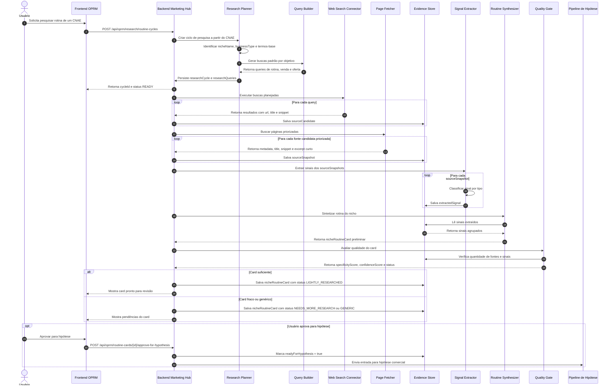
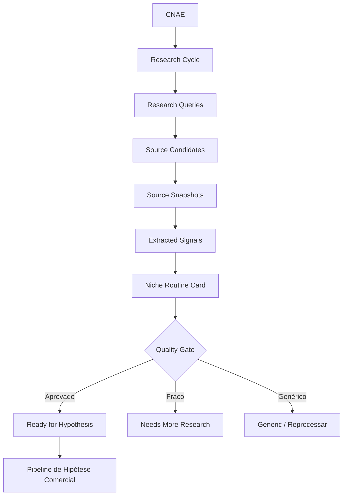

# OPRM — Ciclo Simples de Pesquisa da Rotina do Nicho

## 1. Objetivo

Este documento define uma versão simples, direta e inicial do ciclo de pesquisa do OPRM para transformar um **CNAE** em um **cartão de rotina do nicho** com evidências mínimas.

O objetivo não é fazer uma pesquisa profunda em todas as fontes possíveis. O objetivo é sair do enriquecimento genérico e gerar uma rotina mais próxima da realidade usando poucas fontes, de forma controlada.

Fluxo resumido:

```text
CNAE
  → identificar nicho
  → gerar buscas padrão
  → coletar fontes públicas
  → extrair sinais
  → sintetizar rotina
  → gerar nicheRoutineCard
  → liberar para hipótese comercial
```

---

## 2. Escopo inicial

### 2.1. Fontes iniciais

A primeira versão deve pesquisar apenas três grupos de fontes:

```text
1. Sites de empresas do nicho
2. Vagas e descrições de cargo
3. Conteúdos públicos encontrados por busca web
```

Ficam fora da primeira versão:

```text
Instagram
TikTok
Reddit
YouTube API
Meta Ads Library
Marketplaces
Crawler amplo
Integração automática com EPM
```

Essas fontes podem entrar depois.

---

## 3. Diagrama de sequência do ciclo de pesquisa



---

## 4. Diagrama resumido do fluxo de dados



---

## 5. Tipos de busca gerados

Para cada CNAE/nicho, o sistema deve gerar consultas em três objetivos.

### 5.1. Busca de rotina

Objetivo: descobrir tarefas do dia a dia.

Exemplos:

```text
"vendedor de [nicho] responsabilidades"
"atendente de [nicho] tarefas"
"gerente de [nicho] responsabilidades"
"rotina de [nicho]"
```

### 5.2. Busca de dor/venda

Objetivo: descobrir problemas comerciais, dificuldade de venda e recompra.

Exemplos:

```text
"como vender mais em [nicho]"
"problemas de [nicho]"
"clientes antigos [nicho] whatsapp"
"pós-venda [nicho]"
```

### 5.3. Busca de produtos/serviços

Objetivo: descobrir objetos comerciais e situações de compra.

Exemplos:

```text
"serviços de [nicho]"
"promoções para [nicho]"
"produtos vendidos em [nicho]"
"garantia [nicho]"
```

---

## 6. Modelo de dados inicial

### 6.1. Visão geral

```text
oprm_routine_research_cycle
  └── oprm_routine_research_query
        └── oprm_routine_source_candidate
              └── oprm_routine_source_snapshot
                    └── oprm_routine_extracted_signal

oprm_routine_research_cycle
  └── oprm_niche_routine_card
```

---

## 7. Tabela: `oprm_routine_research_cycle`

Representa uma execução de pesquisa de rotina para um nicho/CNAE.

```sql
CREATE TABLE oprm_routine_research_cycle (
    id BIGINT AUTO_INCREMENT PRIMARY KEY,

    cnae_code VARCHAR(20) NULL,
    cnae_description TEXT NULL,

    niche_name VARCHAR(180) NOT NULL,
    business_type VARCHAR(120) NULL,
    operation_type VARCHAR(120) NULL,

    status VARCHAR(40) NOT NULL,
    confidence_level VARCHAR(40) NULL,

    total_queries INT NOT NULL DEFAULT 0,
    total_source_candidates INT NOT NULL DEFAULT 0,
    total_source_snapshots INT NOT NULL DEFAULT 0,
    total_extracted_signals INT NOT NULL DEFAULT 0,

    started_at DATETIME NULL,
    finished_at DATETIME NULL,
    error_message TEXT NULL,

    created_at DATETIME NOT NULL,
    updated_at DATETIME NOT NULL
);
```

### Status sugeridos

```text
DRAFT
READY
RUNNING
COMPLETED
FAILED
CANCELLED
```

### `confidence_level` sugeridos

```text
INFERRED_FROM_CNAE
LIGHTLY_RESEARCHED
RESEARCH_VALIDATED
MARKET_VALIDATED
```

---

## 8. Tabela: `oprm_routine_research_query`

Representa cada busca gerada para o ciclo.

```sql
CREATE TABLE oprm_routine_research_query (
    id BIGINT AUTO_INCREMENT PRIMARY KEY,

    research_cycle_id BIGINT NOT NULL,

    query_text VARCHAR(500) NOT NULL,
    query_goal VARCHAR(80) NOT NULL,
    source_group VARCHAR(80) NOT NULL,
    priority INT NOT NULL DEFAULT 1,

    status VARCHAR(40) NOT NULL,
    result_count INT NOT NULL DEFAULT 0,
    error_message TEXT NULL,

    created_at DATETIME NOT NULL,
    updated_at DATETIME NOT NULL,

    CONSTRAINT fk_oprm_routine_query_cycle
        FOREIGN KEY (research_cycle_id) REFERENCES oprm_routine_research_cycle(id)
);
```

### `query_goal` sugeridos

```text
ROUTINE_DISCOVERY
SALES_PAIN_DISCOVERY
PRODUCT_SERVICE_DISCOVERY
LANGUAGE_DISCOVERY
WORKAROUND_DISCOVERY
MECHANISM_DISCOVERY
```

### `source_group` sugeridos

```text
WEB_SEARCH
BUSINESS_SITE
JOB_PAGE
PUBLIC_CONTENT
INTERNAL_DATA
```

### Status sugeridos

```text
PENDING
RUNNING
COMPLETED
FAILED
SKIPPED
```

---

## 9. Tabela: `oprm_routine_source_candidate`

Representa um resultado encontrado pela busca antes de buscar/ler a página.

```sql
CREATE TABLE oprm_routine_source_candidate (
    id BIGINT AUTO_INCREMENT PRIMARY KEY,

    research_query_id BIGINT NOT NULL,
    research_cycle_id BIGINT NOT NULL,

    source_url VARCHAR(1000) NOT NULL,
    source_title VARCHAR(500) NULL,
    source_snippet TEXT NULL,
    source_domain VARCHAR(255) NULL,

    source_group VARCHAR(80) NOT NULL,
    relevance_score DECIMAL(10,4) NULL,

    selected_for_fetch BOOLEAN NOT NULL DEFAULT FALSE,
    rejection_reason TEXT NULL,

    created_at DATETIME NOT NULL,
    updated_at DATETIME NOT NULL,

    CONSTRAINT fk_oprm_source_candidate_query
        FOREIGN KEY (research_query_id) REFERENCES oprm_routine_research_query(id),

    CONSTRAINT fk_oprm_source_candidate_cycle
        FOREIGN KEY (research_cycle_id) REFERENCES oprm_routine_research_cycle(id)
);
```

### Finalidade

Esta tabela permite guardar resultados de busca sem ainda depender de leitura completa da página.

Ela ajuda a responder:

```text
Quais fontes apareceram?
Quais foram escolhidas para leitura?
Quais foram descartadas?
```

---

## 10. Tabela: `oprm_routine_source_snapshot`

Representa uma fonte efetivamente coletada.

```sql
CREATE TABLE oprm_routine_source_snapshot (
    id BIGINT AUTO_INCREMENT PRIMARY KEY,

    source_candidate_id BIGINT NULL,
    research_cycle_id BIGINT NOT NULL,

    source_url VARCHAR(1000) NOT NULL,
    source_domain VARCHAR(255) NULL,
    source_title VARCHAR(500) NULL,
    source_type VARCHAR(80) NOT NULL,

    snippet TEXT NULL,
    short_excerpt TEXT NULL,

    fetched_at DATETIME NOT NULL,
    fetch_status VARCHAR(40) NOT NULL,
    http_status INT NULL,
    error_message TEXT NULL,

    storage_policy VARCHAR(60) NOT NULL,
    license_state VARCHAR(60) NULL,

    created_at DATETIME NOT NULL,

    CONSTRAINT fk_oprm_source_snapshot_candidate
        FOREIGN KEY (source_candidate_id) REFERENCES oprm_routine_source_candidate(id),

    CONSTRAINT fk_oprm_source_snapshot_cycle
        FOREIGN KEY (research_cycle_id) REFERENCES oprm_routine_research_cycle(id)
);
```

### `source_type` sugeridos

```text
BUSINESS_SITE
JOB_PAGE
ARTICLE
PUBLIC_COMMENT
FORUM
OFFICIAL_SOURCE
INTERNAL_SOURCE
OTHER
```

### `storage_policy` sugeridos

```text
METADATA_ONLY
SNIPPET_ONLY
SHORT_EXCERPT_ALLOWED
FULL_TEXT_ALLOWED
LINK_ONLY
```

### `license_state` sugeridos

```text
UNKNOWN
PUBLIC_WEB
OFFICIAL_SOURCE
OPEN_LICENSE
RESTRICTED
INTERNAL
```

### Regra inicial

Na primeira versão, armazenar apenas:

```text
URL
domínio
título
snippet
trecho curto
metadados
```

Evitar armazenar HTML completo.

---

## 11. Tabela: `oprm_routine_extracted_signal`

Representa um sinal extraído de uma fonte.

```sql
CREATE TABLE oprm_routine_extracted_signal (
    id BIGINT AUTO_INCREMENT PRIMARY KEY,

    source_snapshot_id BIGINT NOT NULL,
    research_cycle_id BIGINT NOT NULL,

    signal_type VARCHAR(80) NOT NULL,
    signal_text TEXT NOT NULL,

    evidence_quote TEXT NULL,
    confidence_score DECIMAL(10,4) NULL,
    specificity_score DECIMAL(10,4) NULL,

    created_by VARCHAR(40) NOT NULL,
    created_at DATETIME NOT NULL,

    CONSTRAINT fk_oprm_signal_snapshot
        FOREIGN KEY (source_snapshot_id) REFERENCES oprm_routine_source_snapshot(id),

    CONSTRAINT fk_oprm_signal_cycle
        FOREIGN KEY (research_cycle_id) REFERENCES oprm_routine_research_cycle(id)
);
```

### `signal_type` sugeridos

```text
ROUTINE_TASK
COMMERCIAL_TASK
PAIN_SIGNAL
DESIRED_OUTCOME
WORKAROUND
LANGUAGE_PATTERN
COMMERCIAL_OBJECT
COMMERCIAL_MOMENT
MECHANISM_OPPORTUNITY
OFFER_PATTERN
```

### `created_by` sugeridos

```text
AI_EXTRACTOR
RULE_BASED_EXTRACTOR
MANUAL
SYSTEM
```

---

## 12. Tabela: `oprm_niche_routine_card`

Representa o resumo final da rotina do nicho.

```sql
CREATE TABLE oprm_niche_routine_card (
    id BIGINT AUTO_INCREMENT PRIMARY KEY,

    research_cycle_id BIGINT NOT NULL,

    cnae_code VARCHAR(20) NULL,
    niche_name VARCHAR(180) NOT NULL,

    routine_summary TEXT NOT NULL,
    daily_tasks TEXT NULL,
    commercial_tasks TEXT NULL,
    commercial_objects TEXT NULL,
    commercial_moments TEXT NULL,

    pain_summary TEXT NULL,
    desired_outcome_summary TEXT NULL,
    workaround_summary TEXT NULL,
    language_summary TEXT NULL,
    mechanism_opportunity_summary TEXT NULL,

    evidence_summary TEXT NULL,

    source_count INT NOT NULL DEFAULT 0,
    signal_count INT NOT NULL DEFAULT 0,

    specificity_score DECIMAL(10,4) NULL,
    confidence_score DECIMAL(10,4) NULL,
    duplication_score DECIMAL(10,4) NULL,

    confidence_level VARCHAR(40) NOT NULL,
    status VARCHAR(40) NOT NULL,
    ready_for_hypothesis BOOLEAN NOT NULL DEFAULT FALSE,

    created_at DATETIME NOT NULL,
    updated_at DATETIME NOT NULL,

    CONSTRAINT fk_oprm_routine_card_cycle
        FOREIGN KEY (research_cycle_id) REFERENCES oprm_routine_research_cycle(id)
);
```

### Status sugeridos

```text
DRAFT
READY_FOR_REVIEW
LIGHTLY_RESEARCHED
NEEDS_MORE_RESEARCH
GENERIC
APPROVED_FOR_HYPOTHESIS
REJECTED
```

### Observação sobre campos em texto

Na primeira versão, campos como `daily_tasks`, `commercial_tasks`, `pain_summary` e similares podem ser armazenados como `TEXT` com listas em texto simples.

Em uma versão posterior, esses itens podem virar tabelas próprias ou artefatos JSON validados, se necessário.

---

## 13. Índices recomendados

```sql
CREATE INDEX idx_oprm_research_cycle_cnae
ON oprm_routine_research_cycle (cnae_code);

CREATE INDEX idx_oprm_research_cycle_status
ON oprm_routine_research_cycle (status);

CREATE INDEX idx_oprm_research_query_cycle
ON oprm_routine_research_query (research_cycle_id);

CREATE INDEX idx_oprm_source_candidate_cycle
ON oprm_routine_source_candidate (research_cycle_id);

CREATE INDEX idx_oprm_source_candidate_domain
ON oprm_routine_source_candidate (source_domain);

CREATE INDEX idx_oprm_source_snapshot_cycle
ON oprm_routine_source_snapshot (research_cycle_id);

CREATE INDEX idx_oprm_extracted_signal_cycle_type
ON oprm_routine_extracted_signal (research_cycle_id, signal_type);

CREATE INDEX idx_oprm_routine_card_cycle
ON oprm_niche_routine_card (research_cycle_id);

CREATE INDEX idx_oprm_routine_card_status
ON oprm_niche_routine_card (status);
```

---

## 14. Critérios mínimos para o card seguir para hipótese

Um `oprm_niche_routine_card` só deve ser aprovado para hipótese se cumprir critérios mínimos.

Critérios iniciais sugeridos:

```text
source_count >= 5
signal_count >= 10
specificity_score >= 60
confidence_score >= 50
status != GENERIC
routine_summary preenchido
pain_summary preenchido
mechanism_opportunity_summary preenchido
```

Se não cumprir:

```text
status = NEEDS_MORE_RESEARCH
```

ou:

```text
status = GENERIC
```

---

## 15. Exemplo prático — Ópticas

### Entrada

```text
cnaeCode: 4774100
cnaeDescription: Comércio varejista de artigos de óptica
```

### Buscas geradas

```text
vendedor de ótica responsabilidades
atendente de ótica tarefas
como vender mais em ótica
clientes antigos ótica whatsapp
pós-venda ótica lentes
estoque parado ótica armações
serviços de ótica
promoções para óticas
garantia ótica armação
```

### Sinais esperados

```text
ROUTINE_TASK: atender clientes na loja e apresentar armações.
ROUTINE_TASK: acompanhar pedidos de lentes.
COMMERCIAL_OBJECT: lentes, armações, óculos, ajustes, manutenção.
PAIN_SIGNAL: clientes compram uma vez e demoram a voltar.
WORKAROUND: mensagens manuais para clientes antigos.
COMMERCIAL_MOMENT: revisão de grau, troca de lente, manutenção de armação.
MECHANISM_OPPORTUNITY: calendário de recompra por data da última compra.
```

### Card esperado

```text
Nicho: Ópticas

Rotina:
Ópticas atendem clientes presencialmente e por WhatsApp, apresentam armações e lentes, fazem orçamentos, acompanham pedidos, lidam com ajustes, manutenção e estoque.

Dor:
Clientes compram uma vez e demoram a voltar; o pós-venda é irregular; estoque de armações pode ficar parado; o atendimento por WhatsApp nem sempre vira venda.

Resultado desejado:
Aumentar recompra, reativar clientes antigos e vender mais lentes e armações sem depender apenas de movimento espontâneo.

Mecanismos possíveis:
Calendário de recompra por data da última compra, campanhas de revisão de grau, mensagens de WhatsApp para clientes antigos e segmentação por tipo de lente.
```

---

## 16. MVP recomendado

A primeira versão deve implementar apenas o ciclo básico:

```text
1. Criar researchCycle a partir de CNAE.
2. Gerar queries padrão.
3. Registrar sourceCandidates retornados pela busca.
4. Registrar sourceSnapshots com metadados e trechos curtos.
5. Extrair sinais com IA ou regras simples.
6. Gerar nicheRoutineCard.
7. Aplicar quality gate simples.
8. Permitir aprovação manual para hipótese.
```

Não implementar no MVP:

```text
pesquisa profunda em redes sociais
vetores/embeddings
crawler amplo
similaridade avançada
integração automática com campanhas
integração automática com EPM
```

---

## 17. Resultado esperado

Este ciclo deve permitir que o OPRM responda, com evidência mínima:

```text
Qual é o nicho operacional por trás do CNAE?
Quais tarefas aparecem na rotina?
Quais objetos comerciais são específicos desse nicho?
Quais dores aparecem em fontes públicas?
Quais resultados desejados são plausíveis?
Quais mecanismos podem virar produto digital?
A rotina está específica o suficiente para gerar hipótese?
```

O objetivo é simples:

```text
parar de gerar enriquecimentos genéricos
e começar a gerar hipóteses baseadas em sinais reais do dia a dia do nicho.
```
