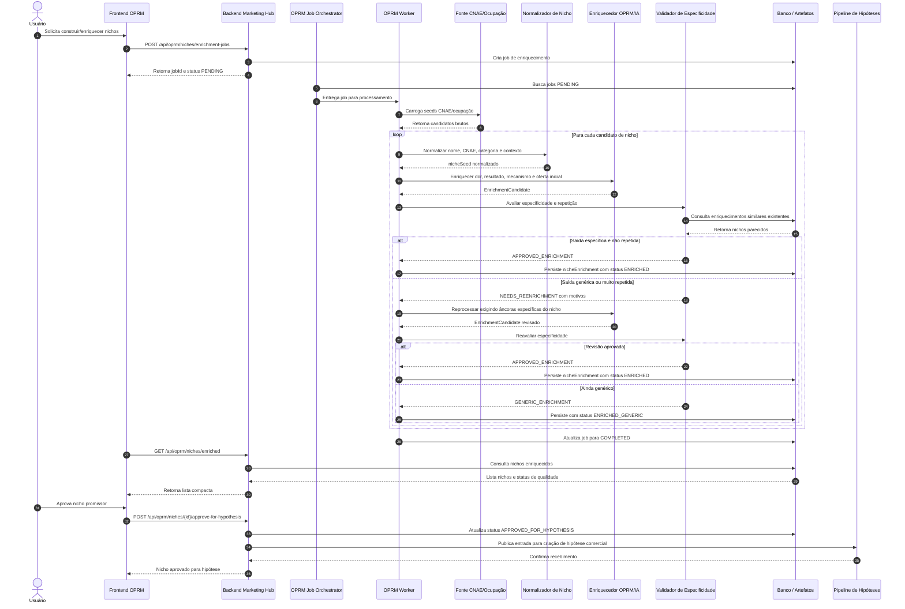
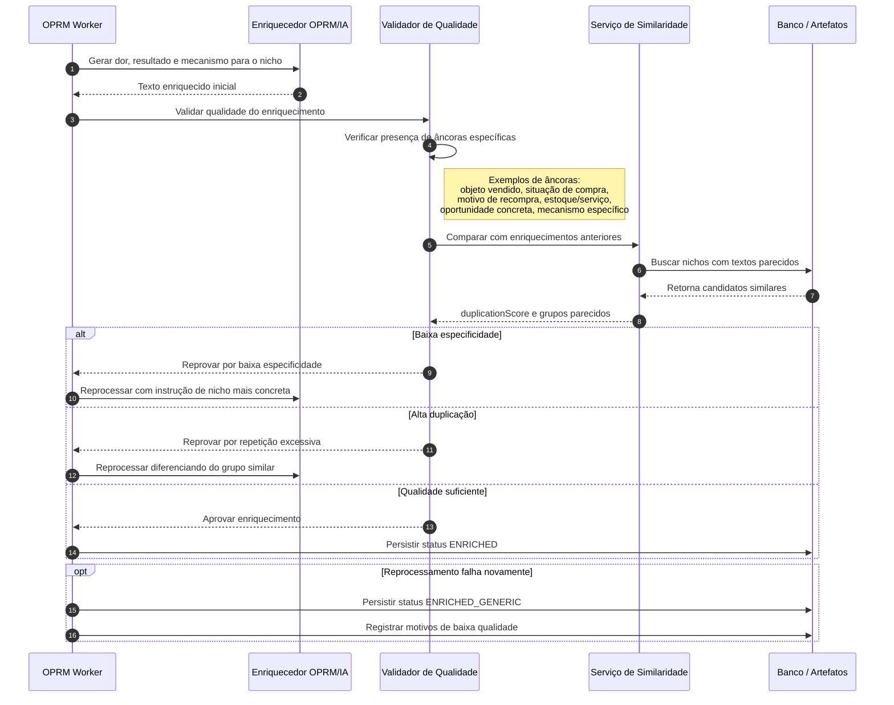

# OPRM — Diagrama de Sequência da Construção de Nichos

## 1. Objetivo

Este documento descreve, em formato de diagrama de sequência, como o módulo **OPRM — Occupation Persona Routine Mapper** pode construir e enriquecer nichos a partir de fontes como CNAE, ocupações e sinais de rotina.

O objetivo do fluxo é transformar um candidato bruto de nicho em um nicho comercialmente utilizável pelo Marketing Hub, contendo:

- nome do nicho;
- CNAE ou origem equivalente;
- dor principal;
- resultado desejado;
- mecanismo plausível;
- oportunidade comercial;
- score;
- status de qualidade;
- indicação se o nicho está pronto para virar hipótese comercial.

Este fluxo deve evitar que vários nichos recebam enriquecimentos genéricos e repetidos.

---

## 2. Visão conceitual

O OPRM não deve apenas copiar uma descrição de CNAE e gerar uma dor genérica.

Ele deve construir um nicho com especificidade comercial suficiente para alimentar o restante do Marketing Hub:

```text
CNAE / ocupação / seed
  → normalização
  → enriquecimento de rotina e contexto
  → dor específica
  → resultado desejado
  → mecanismo aplicável
  → validação de especificidade
  → persistência
  → aprovação para hipótese
```

Um nicho só deve ser considerado útil quando possuir elementos concretos do mercado analisado.

Exemplo fraco:

```text
Comércio varejista precisa vender mais com IA.
```

Exemplo melhor:

```text
Ópticas precisam reativar clientes antigos por ciclo de troca de lentes, revisão de grau e manutenção de armações.
```

---

## 3. Diagrama de sequência principal



---

## 4. Diagrama de sequência com foco na detecção de repetição



---

## 5. Estados sugeridos do nicho enriquecido

```text
DISCOVERED
NORMALIZED
ENRICHMENT_PENDING
ENRICHING
ENRICHED
ENRICHED_GENERIC
NEEDS_REENRICHMENT
APPROVED_FOR_HYPOTHESIS
DISCARDED
ERROR
```

### Significado dos estados

| Status | Significado |
|---|---|
| `DISCOVERED` | Nicho bruto encontrado em CNAE, ocupação ou outra fonte. |
| `NORMALIZED` | Nome, CNAE e categoria foram normalizados. |
| `ENRICHMENT_PENDING` | Nicho está aguardando enriquecimento. |
| `ENRICHING` | Worker está processando o nicho. |
| `ENRICHED` | Nicho enriquecido com qualidade aceitável. |
| `ENRICHED_GENERIC` | Nicho enriquecido, mas com baixa especificidade ou repetição. |
| `NEEDS_REENRICHMENT` | Nicho precisa ser reprocessado. |
| `APPROVED_FOR_HYPOTHESIS` | Nicho aprovado para virar hipótese comercial. |
| `DISCARDED` | Nicho descartado pelo usuário ou pelo sistema. |
| `ERROR` | Falha técnica no enriquecimento. |

---

## 6. Artefatos sugeridos

O fluxo pode produzir ou atualizar os seguintes artefatos:

```text
occupationSeed
nicheSeed
nicheNormalizationSnapshot
nicheEnrichmentCandidate
nicheSpecificityReport
nicheDuplicationReport
nicheEnrichmentSnapshot
nicheApprovalDecision
hypothesisInput
```

### 6.1. `nicheSeed`

Representa a entrada bruta ou semi-normalizada.

Campos sugeridos:

```text
id
sourceType
sourceReference
nicheName
cnaeCode
cnaeDescription
rawLabel
createdAt
```

### 6.2. `nicheEnrichmentSnapshot`

Representa o nicho enriquecido.

Campos sugeridos:

```text
id
nicheSeedId
nicheName
cnaeCode
painSummary
resultSummary
mechanismSummary
offerOpportunitySummary
proofOpportunitySummary
score
specificityScore
duplicationScore
status
createdAt
updatedAt
```

### 6.3. `nicheSpecificityReport`

Registra por que o nicho foi considerado específico ou genérico.

Campos sugeridos:

```text
id
nicheEnrichmentId
specificityScore
hasSpecificCommercialObject
hasSpecificPurchaseSituation
hasSpecificRepurchaseReason
hasSpecificInventoryOrServiceContext
hasConcreteCampaignOpportunity
hasSpecificMechanism
issues
createdAt
```

### 6.4. `nicheDuplicationReport`

Registra similaridade com outros nichos.

Campos sugeridos:

```text
id
nicheEnrichmentId
duplicationScore
similarNicheIds
similarityReason
duplicationGroupKey
createdAt
```

---

## 7. Regras de qualidade do enriquecimento

Um nicho enriquecido deve conter pelo menos:

```text
1. objeto comercial específico do nicho;
2. situação típica de compra;
3. motivo de recompra ou não recompra;
4. tipo de estoque, serviço ou rotina relevante;
5. oportunidade concreta de campanha;
6. mecanismo específico aplicável ao nicho.
```

Se o enriquecimento não cumprir esses critérios, ele deve ser marcado como:

```text
ENRICHED_GENERIC
```

ou enviado para reprocessamento:

```text
NEEDS_REENRICHMENT
```

---

## 8. Exemplo de enriquecimento ruim

```text
Nicho: Comércio varejista de artigos de óptica
Dor: estoque parado, comunicação genérica, baixa recompra.
Resultado: giro de estoque com campanhas simples.
Mecanismo: calendário comercial com IA.
```

Problema:

```text
O texto poderia ser aplicado a muitos varejos diferentes.
Não usa lentes, armações, revisão de grau, manutenção ou ciclo de troca.
```

Status recomendado:

```text
ENRICHED_GENERIC
```

---

## 9. Exemplo de enriquecimento melhor

```text
Nicho: Comércio varejista de artigos de óptica
Dor: clientes compram óculos uma vez e passam anos sem retornar; a ótica perde oportunidades de recompra de lentes, armações, manutenção e revisão de grau.
Resultado: aumentar retorno de clientes antigos com campanhas por ciclo de troca, revisão de grau e cuidado com armações.
Mecanismo: calendário de relacionamento que segmenta clientes por data da compra, tipo de lente, idade provável da receita e necessidade de manutenção.
```

Status recomendado:

```text
ENRICHED
```

Motivo:

```text
O enriquecimento usa objetos comerciais reais do nicho e cria uma oportunidade concreta de produto digital.
```

---

## 10. Como a tela deve consumir esse fluxo

A tela principal de nichos enriquecidos não deve exibir textos completos em colunas longas.

Ela deve mostrar uma visão compacta:

| Nicho | CNAE | Dor curta | Oportunidade | Score | Qualidade | Status | Ações |
|---|---|---|---|---:|---|---|---|
| Óptica | 4774100 | baixa recompra de lentes e armações | calendário de revisão e recompra | 72 | Alta | ENRICHED | Ver detalhes |
| Calçados | 4782201 | estoque parado por numeração e coleção | combos por ocasião e numeração | 68 | Média | ENRICHED | Ver detalhes |

Textos longos devem ir para:

- modal;
- drawer lateral;
- tela de detalhe;
- card expandido.

Ações sugeridas:

```text
Ver detalhes
Aprovar para hipótese
Reprocessar enriquecimento
Descartar
Comparar similares
```

---

## 11. Resultado esperado

Ao final desse fluxo, o OPRM deve entregar ao Marketing Hub nichos que sejam úteis para a fábrica de produtos digitais.

O resultado ideal não é apenas uma lista de CNAEs enriquecidos, mas uma fila de oportunidades com qualidade comercial suficiente para gerar hipóteses testáveis.

O fluxo deve responder:

```text
Este nicho tem uma dor específica?
Existe um resultado desejado claro?
Existe um mecanismo plausível?
A oportunidade é diferente de outros nichos parecidos?
O enriquecimento está específico o bastante?
Este nicho pode virar hipótese comercial agora?
```

Se a resposta for positiva, o nicho pode seguir para o pipeline de hipótese.
