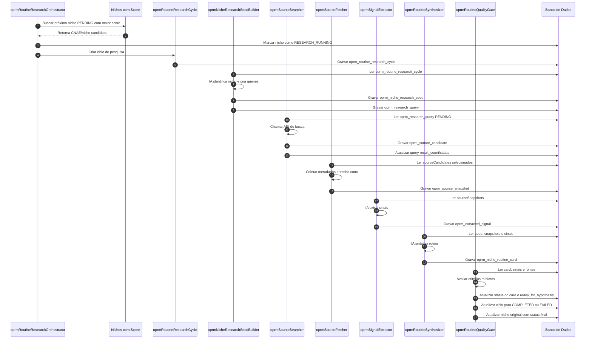

# OPRM — Pipeline de Pesquisa da Rotina do Nicho

## 1. Objetivo

Este documento detalha o pipeline inicial do OPRM para transformar um **CNAE/nicho com score alto** em um **cartão de rotina do nicho** sustentado por sinais pesquisados.

O objetivo do pipeline não é criar oferta, produto, campanha ou landing page. O objetivo é apenas responder:

```text
Como esse nicho funciona no dia a dia?
Quais tarefas aparecem na rotina?
Quais perguntas esse nicho faz quando tem problemas?
Quais dores, desejos, objetos comerciais e oportunidades aparecem nas fontes pesquisadas?
O nicho está específico o suficiente para seguir para o pipeline de hipótese?
```

A saída final deste pipeline é:

```text
oprm_niche_routine_card
```

Esse card será consumido depois por outro pipeline, responsável por gerar hipótese comercial.

---

## 2. Separação entre pipelines

É importante manter a fronteira clara.

### 2.1. Pipeline OPRM — Pesquisa do Nicho

Responsabilidade:

```text
Conhecer o nicho.
```

Entrada:

```text
CNAE/nicho com score alto.
```

Saída:

```text
nicheRoutineCard.
```

### 2.2. Pipeline de Hipótese Comercial

Responsabilidade:

```text
Transformar o nicheRoutineCard em dor, resultado, mecanismo, prova e oferta.
```

Entrada:

```text
nicheRoutineCard aprovado.
```

Saída:

```text
commercialHypothesis.
```

### 2.3. Pipeline de Experimento Comercial

Responsabilidade:

```text
Transformar a hipótese em campanha, criativo, imagem e landing.
```

Entrada:

```text
commercialHypothesis.
```

Saída:

```text
productExperiment.
```

### 2.4. EPM — Experiment Profit Manager

Responsabilidade:

```text
Controlar orçamento, gasto, venda, lucro e decisão dos experimentos.
```

Entrada:

```text
experimentos comerciais.
```

Saída:

```text
decisão financeira: continuar, iterar, matar ou escalar.
```

---

## 3. Visão geral do pipeline OPRM

Fluxo principal:

```text
Nicho com score alto
  ↓
oprmRoutineResearchCycle
  ↓
oprmNicheResearchSeedBuilder
  ↓
oprmSourceSearcher
  ↓
oprmSourceFetcher
  ↓
oprmSignalExtractor
  ↓
oprmRoutineSynthesizer
  ↓
oprmRoutineQualityGate
  ↓
oprm_niche_routine_card
```

---

## 4. Estratégia de início automático

O pipeline deve começar automaticamente.

O usuário não precisa escolher CNAE por CNAE.

O OPRM deve procurar o próximo nicho com melhor pontuação de score e ainda sem pesquisa de rotina concluída.

Fluxo:

```text
1. Orquestrador acorda.
2. Busca o nicho pendente com maior score.
3. Marca o nicho como RESEARCH_RUNNING.
4. Cria um oprmRoutineResearchCycle.
5. Executa as etapas do pipeline.
6. Atualiza o status final.
7. Depois busca o próximo nicho.
```

Nome técnico sugerido para o orquestrador:

```text
oprmRoutineResearchOrchestrator
```

Consulta conceitual:

```sql
SELECT *
FROM tabela_atual_de_nichos_com_score
WHERE routine_research_status = 'PENDING'
  AND score IS NOT NULL
ORDER BY score DESC
LIMIT 1;
```

Observação:

```text
O nome real da tabela atual de nichos com score deve ser identificado no backend antes da implementação.
```

---

## 5. Etapas detalhadas

## 5.1. Etapa 0 — `oprmRoutineResearchOrchestrator`

### Função

Escolher automaticamente o próximo nicho que merece pesquisa.

### Lê de

Tabela existente de nichos/CNAEs enriquecidos com score.

Campos esperados conceitualmente:

```text
id
cnae_code
cnae_description
niche_name
score
routine_research_status
last_routine_research_cycle_id
```

### Faz

- encontra o nicho com maior score ainda pendente;
- evita selecionar nicho já em processamento;
- inicia um ciclo de pesquisa;
- marca o nicho original como em pesquisa.

### Grava em

```text
oprm_routine_research_cycle
```

Também atualiza a fonte original do nicho:

```text
routine_research_status = RESEARCH_RUNNING
last_routine_research_cycle_id = {cycleId}
```

### Usa IA?

```text
Não.
```

---

## 5.2. Etapa 1 — `oprmRoutineResearchCycle`

### Função

Controlar uma execução completa da pesquisa de rotina de um nicho.

Ela é a tabela/processo pai do pipeline.

Ela não pesquisa, não extrai sinais e não gera card. Ela apenas controla o ciclo inteiro.

### Lê de

- nicho selecionado pelo `oprmRoutineResearchOrchestrator`;
- CNAE e score da fonte original.

### Grava em

```text
oprm_routine_research_cycle
```

### Campos principais

```text
id
source_niche_id
cnae_code
cnae_description
niche_name
source_score
trigger_source
status
total_queries
total_source_candidates
total_source_snapshots
total_extracted_signals
started_at
finished_at
error_message
created_at
updated_at
```

### Status sugeridos

```text
READY
RUNNING
COMPLETED
FAILED
CANCELLED
```

### Valores de `trigger_source`

```text
AUTO_SCORE_QUEUE
USER_ACTION
RETRY
SYSTEM_BATCH
```

### Usa IA?

```text
Não.
```

### Saída

Um ciclo criado, por exemplo:

```json
{
  "id": 1001,
  "sourceNicheId": 55,
  "cnaeCode": "9602501",
  "cnaeDescription": "Cabeleireiros, manicure e pedicure",
  "nicheName": "Cabeleireiros, manicure e pedicure",
  "sourceScore": 92,
  "triggerSource": "AUTO_SCORE_QUEUE",
  "status": "RUNNING"
}
```

---

## 5.3. Etapa 2 — `oprmNicheResearchSeedBuilder`

### Função

Transformar o CNAE em um pacote inicial de pesquisa do nicho.

Essa etapa combina duas responsabilidades do MVP:

```text
1. Identificar o nicho operacional.
2. Criar as frases/perguntas que serão pesquisadas.
```

### Lê de

```text
oprm_routine_research_cycle
```

Campos usados:

```text
id
cnae_code
cnae_description
niche_name
source_score
```

### Faz

Usa IA para gerar:

- nome comercial do nicho;
- tipo de negócio;
- tipo de operação;
- tipo de cliente;
- objetos comerciais;
- suposições iniciais;
- frases de pesquisa para descobrir rotina, dores, perguntas e produtos/serviços.

### Grava em

```text
oprm_niche_research_seed
oprm_research_query
```

### Por que duas tabelas?

Porque são dois artefatos diferentes.

`oprm_niche_research_seed` responde:

```text
Quem é o nicho que estamos pesquisando?
```

`oprm_research_query` responde:

```text
Quais frases serão pesquisadas sobre esse nicho?
```

Cada frase precisa ficar em linha própria porque será executada, monitorada e avaliada individualmente.

### Usa IA?

```text
Sim.
```

### Entrada de exemplo

```json
{
  "researchCycleId": 1001,
  "cnaeCode": "9602501",
  "cnaeDescription": "Cabeleireiros, manicure e pedicure"
}
```

### Saída 1 — `oprm_niche_research_seed`

```json
{
  "researchCycleId": 1001,
  "nicheName": "Cabeleireiros, manicures e pedicures",
  "businessType": "serviço local de beleza",
  "operationType": "atendimento com agenda, recorrência, indicação e relacionamento por WhatsApp",
  "customerType": "consumidor final, principalmente clientes recorrentes",
  "commercialObjects": "corte de cabelo, escova, coloração, hidratação, manicure, pedicure, unhas em gel, design de sobrancelha, pacotes de beleza, agenda de horários",
  "initialAssumptions": "O nicho depende de agenda cheia, recorrência, indicação, presença local, relacionamento por WhatsApp e retenção de clientes.",
  "confidenceLevel": "INFERRED_FROM_CNAE",
  "createdBy": "AI"
}
```

### Saída 2 — `oprm_research_query`

Exemplos de queries geradas:

```text
manicure responsabilidades rotina
cabeleireira responsabilidades salão de beleza
como conseguir mais clientes manicure
como lotar agenda de manicure
como atrair clientes para salão de beleza
como divulgar salão de beleza no whatsapp
como fazer clientes voltarem no salão
como vender pacote de manicure
como evitar horário vazio manicure
como cobrar mais caro manicure
unha em gel estraga a unha
quanto tempo dura unha em gel
qual melhor hidratação para cabelo
pacotes para salão de beleza
promoção para manicure
```

Cada query deve ser gravada com objetivo:

```text
ROUTINE_DISCOVERY
NICHE_OWNER_QUESTION_DISCOVERY
FINAL_CUSTOMER_QUESTION_DISCOVERY
SALES_PAIN_DISCOVERY
PRODUCT_SERVICE_DISCOVERY
OFFER_PATTERN_DISCOVERY
```

### Regras para as queries geradas

- cada query deve conter o nome do nicho ou algum objeto comercial do nicho;
- não gerar query genérica como `como vender mais`;
- gerar no máximo 12 a 15 queries no MVP;
- cobrir rotina, perguntas do profissional, perguntas do cliente final e serviços/produtos;
- gravar todas com status `PENDING`.

---

## 5.4. Etapa 3 — `oprmSourceSearcher`

### Função

Executar as frases de pesquisa em uma API de busca e salvar os resultados encontrados.

Essa etapa responde:

```text
Quais páginas, documentos ou conteúdos públicos aparecem para essas perguntas?
```

### Lê de

```text
oprm_research_query
```

Filtros:

```text
status = PENDING
research_cycle_id = {cycleId}
```

### Faz

- envia `query_text` para uma API de busca;
- recebe resultados com URL, título, domínio, snippet e posição;
- salva os resultados como fontes candidatas;
- atualiza a query com `result_count` e status.

### Possíveis provedores de busca

A implementação deve começar com um único provedor configurável.

Possíveis opções:

```text
Brave Search API
Bing Search API
SerpAPI
Tavily
outro conector de busca aprovado
```

### Grava em

```text
oprm_source_candidate
```

Atualiza:

```text
oprm_research_query.status
oprm_research_query.result_count
oprm_routine_research_cycle.total_source_candidates
```

### Usa IA?

```text
Não.
```

### Saída de exemplo

Para a query:

```text
como lotar agenda de manicure
```

Salvar candidatos:

```json
[
  {
    "researchCycleId": 1001,
    "researchQueryId": 2001,
    "sourceUrl": "https://exemplo.com/clientes-manicure",
    "sourceTitle": "Como conseguir mais clientes para manicure",
    "sourceSnippet": "Veja formas de divulgar seus serviços, fidelizar clientes e preencher horários...",
    "sourceDomain": "exemplo.com",
    "sourceGroup": "PUBLIC_CONTENT",
    "searchPosition": 1,
    "status": "FOUND"
  }
]
```

### Observação importante

Esta etapa não lê o conteúdo completo das páginas. Ela apenas salva os resultados retornados pela busca.

---

## 5.5. Etapa 4 — `oprmSourceFetcher`

### Função

Selecionar as melhores fontes candidatas e coletar metadados/trechos curtos das páginas.

Essa etapa responde:

```text
Quais fontes encontradas merecem ser lidas/coletadas para extrair sinais?
```

### Lê de

```text
oprm_source_candidate
```

Filtros conceituais:

```text
research_cycle_id = {cycleId}
selected_for_fetch = true
```

No MVP, `selected_for_fetch` pode ser definido por regra simples:

- top N resultados por query;
- domínio não bloqueado;
- título/snippet relevante;
- não duplicado;
- idioma compatível;
- URL acessível.

### Faz

- acessa a URL;
- coleta título final, domínio, status HTTP, snippet e trecho curto;
- classifica tipo de fonte;
- define política de armazenamento;
- não salva HTML completo no MVP.

### Grava em

```text
oprm_source_snapshot
```

Atualiza:

```text
oprm_source_candidate.selected_for_fetch
oprm_source_candidate.relevance_score
oprm_source_candidate.rejection_reason
oprm_routine_research_cycle.total_source_snapshots
```

### Usa IA?

```text
Não no MVP.
```

Pode usar IA em versão futura para classificar relevância, mas não é necessário no início.

### Políticas de armazenamento

```text
METADATA_ONLY
SNIPPET_ONLY
SHORT_EXCERPT_ALLOWED
LINK_ONLY
```

### Tipos de fonte

```text
BUSINESS_SITE
JOB_PAGE
ARTICLE
PUBLIC_CONTENT
OFFICIAL_SOURCE
INTERNAL_SOURCE
OTHER
```

### Saída de exemplo

```json
{
  "researchCycleId": 1001,
  "sourceCandidateId": 301,
  "sourceUrl": "https://exemplo.com/clientes-manicure",
  "sourceDomain": "exemplo.com",
  "sourceTitle": "Como conseguir mais clientes para manicure",
  "sourceType": "PUBLIC_CONTENT",
  "snippet": "Veja formas de divulgar seus serviços...",
  "shortExcerpt": "Manicures podem atrair mais clientes usando indicação, redes sociais, atendimento pelo WhatsApp, pacotes mensais e lembretes de retorno.",
  "fetchStatus": "COMPLETED",
  "storagePolicy": "SHORT_EXCERPT_ALLOWED"
}
```

---

## 5.6. Etapa 5 — `oprmSignalExtractor`

### Função

Extrair sinais úteis dos trechos coletados.

Essa é uma das etapas centrais do pipeline.

Ela transforma trechos de páginas em informações estruturadas sobre rotina, dor, perguntas, objetos comerciais, oportunidades e linguagem.

### Lê de

```text
oprm_source_snapshot
```

Campos principais:

```text
source_title
snippet
short_excerpt
source_type
source_url
```

### Faz

Usa IA para extrair sinais classificados.

Tipos de sinal:

```text
ROUTINE_TASK
COMMERCIAL_TASK
COMMERCIAL_OBJECT
PAIN_SIGNAL
DESIRED_OUTCOME
WORKAROUND
LANGUAGE_PATTERN
COMMERCIAL_MOMENT
MECHANISM_OPPORTUNITY
OFFER_PATTERN
QUESTION_SIGNAL
```

### Regras para `QUESTION_SIGNAL`

Quando o sinal for uma pergunta, classificar também:

```text
askedBy = NICHE_OWNER | FINAL_CUSTOMER | UNKNOWN
intentType = SALES_GROWTH | LEAD_GENERATION | CUSTOMER_RETENTION | PRICING | INVENTORY_TURNOVER | POST_SALE | CUSTOMER_OBJECTION | SERVICE_DELIVERY | TIME_MANAGEMENT | OTHER
```

Exemplo:

```text
como lotar agenda de manicure
```

Classificação:

```text
askedBy: NICHE_OWNER
intentType: LEAD_GENERATION
painCategory: agenda vazia
```

### Grava em

```text
oprm_extracted_signal
```

Atualiza:

```text
oprm_routine_research_cycle.total_extracted_signals
```

### Usa IA?

```text
Sim.
```

### Entrada de exemplo

```text
Manicures podem atrair mais clientes usando indicação, redes sociais, atendimento pelo WhatsApp, pacotes mensais e lembretes de retorno.
```

### Saída de exemplo

```json
[
  {
    "signalType": "PAIN_SIGNAL",
    "signalText": "A profissional precisa atrair clientes e preencher horários da agenda.",
    "confidenceScore": 0.82,
    "specificityScore": 0.71
  },
  {
    "signalType": "MECHANISM_OPPORTUNITY",
    "signalText": "Sistema de indicação, WhatsApp e lembretes de retorno para aumentar recorrência.",
    "confidenceScore": 0.84,
    "specificityScore": 0.76
  },
  {
    "signalType": "OFFER_PATTERN",
    "signalText": "Pacotes mensais de atendimento podem aumentar previsibilidade.",
    "confidenceScore": 0.75,
    "specificityScore": 0.68
  }
]
```

---

## 5.7. Etapa 6 — `oprmRoutineSynthesizer`

### Função

Montar o card final de rotina do nicho a partir dos sinais extraídos.

Esta etapa é a saída final do pipeline OPRM.

Ela não deve criar oferta final, campanha ou landing.

### Lê de

```text
oprm_niche_research_seed
oprm_source_snapshot
oprm_extracted_signal
```

### Faz

Usa IA para sintetizar:

- resumo da rotina;
- tarefas diárias;
- tarefas comerciais;
- objetos comerciais;
- momentos comerciais;
- dores;
- resultados desejados;
- workarounds;
- linguagem do nicho;
- perguntas reais encontradas;
- oportunidades de mecanismo;
- resumo das evidências.

### Grava em

```text
oprm_niche_routine_card
```

### Usa IA?

```text
Sim.
```

### Saída de exemplo — nicho de beleza

```json
{
  "nicheName": "Cabeleireiros, manicures e pedicures",
  "routineSummary": "Profissionais de beleza trabalham com agenda, atendimento recorrente, relacionamento por WhatsApp e forte dependência de indicação e retorno de clientes. A rotina envolve organizar horários, confirmar atendimentos, executar serviços, postar resultados, responder clientes e tentar preencher horários vagos.",
  "painSummary": "As dores mais fortes são horários vazios, faltas de clientes, dificuldade de cobrar melhor, baixa previsibilidade de renda e falta de processo para fazer clientes voltarem.",
  "desiredOutcomeSummary": "O resultado desejado é ter agenda mais cheia, clientes recorrentes, mais pacotes mensais, menos dependência de promoção e maior previsibilidade de renda.",
  "mechanismOpportunitySummary": "As oportunidades de mecanismo incluem campanhas de WhatsApp para reativação, lembretes de retorno, pacotes mensais, programa de indicação e calendário de conteúdo com provas visuais do trabalho.",
  "questionSummary": "As perguntas mais relevantes do profissional giram em torno de conseguir clientes, lotar agenda, cobrar mais caro, vender pacotes e divulgar serviços no WhatsApp/Instagram.",
  "confidenceLevel": "LIGHTLY_RESEARCHED",
  "readyForHypothesis": false
}
```

---

## 5.8. Etapa 7 — `oprmRoutineQualityGate`

### Função

Avaliar se o card está bom o suficiente para seguir para o pipeline de hipótese.

### Lê de

```text
oprm_niche_routine_card
oprm_extracted_signal
oprm_source_snapshot
```

### Faz

Avalia por regras e, opcionalmente, por IA:

- quantidade de fontes;
- quantidade de sinais;
- presença de perguntas reais;
- presença de tarefas de rotina;
- presença de objetos comerciais específicos;
- presença de dores;
- presença de oportunidades de mecanismo;
- se o texto ficou genérico demais.

### Grava em

No MVP, pode atualizar diretamente:

```text
oprm_niche_routine_card.status
oprm_niche_routine_card.ready_for_hypothesis
oprm_niche_routine_card.specificity_score
oprm_niche_routine_card.confidence_score
oprm_niche_routine_card.duplication_score
```

Em versão posterior, pode gravar tabela separada:

```text
oprm_routine_quality_result
```

### Usa IA?

```text
Parcialmente.
```

Regras determinísticas:

```text
source_count
signal_count
campos obrigatórios preenchidos
quantidade de QUESTION_SIGNAL
quantidade de PAIN_SIGNAL
quantidade de MECHANISM_OPPORTUNITY
```

IA opcional:

```text
verificar se o card ficou específico ou genérico.
```

### Critérios mínimos sugeridos

```text
source_count >= 5
signal_count >= 10
specificity_score >= 60
confidence_score >= 50
routine_summary preenchido
pain_summary preenchido
mechanism_opportunity_summary preenchido
status != GENERIC
```

Se aprovado:

```text
status = LIGHTLY_RESEARCHED
ready_for_hypothesis = true
```

Se fraco:

```text
status = NEEDS_MORE_RESEARCH
ready_for_hypothesis = false
```

Se genérico:

```text
status = GENERIC
ready_for_hypothesis = false
```

---

## 6. Modelo de dados do MVP

## 6.1. `oprm_routine_research_cycle`

Controla uma execução completa da pesquisa.

Campos:

```text
id
source_niche_id
cnae_code
cnae_description
niche_name
source_score
trigger_source
status
total_queries
total_source_candidates
total_source_snapshots
total_extracted_signals
started_at
finished_at
error_message
created_at
updated_at
```

---

## 6.2. `oprm_niche_research_seed`

Guarda o nicho operacional identificado e a base para pesquisa.

Campos:

```text
id
research_cycle_id
cnae_code
cnae_description
niche_name
business_type
operation_type
customer_type
commercial_objects
initial_assumptions
confidence_level
created_by
created_at
```

---

## 6.3. `oprm_research_query`

Guarda cada frase de pesquisa.

Campos:

```text
id
research_cycle_id
niche_research_seed_id
query_text
query_goal
source_group
priority
status
result_count
error_message
created_by
created_at
updated_at
```

Valores de `query_goal`:

```text
ROUTINE_DISCOVERY
NICHE_OWNER_QUESTION_DISCOVERY
FINAL_CUSTOMER_QUESTION_DISCOVERY
SALES_PAIN_DISCOVERY
PRODUCT_SERVICE_DISCOVERY
OFFER_PATTERN_DISCOVERY
LANGUAGE_DISCOVERY
WORKAROUND_DISCOVERY
MECHANISM_DISCOVERY
```

---

## 6.4. `oprm_source_candidate`

Guarda cada resultado encontrado pela busca.

Campos:

```text
id
research_cycle_id
research_query_id
source_url
source_title
source_snippet
source_domain
source_group
search_position
relevance_score
selected_for_fetch
rejection_reason
status
created_at
updated_at
```

---

## 6.5. `oprm_source_snapshot`

Guarda metadados e trechos curtos das fontes selecionadas.

Campos:

```text
id
research_cycle_id
source_candidate_id
source_url
source_domain
source_title
source_type
snippet
short_excerpt
fetched_at
fetch_status
http_status
storage_policy
license_state
error_message
created_at
```

---

## 6.6. `oprm_extracted_signal`

Guarda sinais extraídos das fontes.

Campos:

```text
id
research_cycle_id
source_snapshot_id
signal_type
signal_text
evidence_quote
asked_by
intent_type
pain_category
commercial_relevance_score
confidence_score
specificity_score
created_by
created_at
```

Valores de `signal_type`:

```text
ROUTINE_TASK
COMMERCIAL_TASK
COMMERCIAL_OBJECT
PAIN_SIGNAL
DESIRED_OUTCOME
WORKAROUND
LANGUAGE_PATTERN
COMMERCIAL_MOMENT
MECHANISM_OPPORTUNITY
OFFER_PATTERN
QUESTION_SIGNAL
```

Valores de `asked_by`:

```text
NICHE_OWNER
FINAL_CUSTOMER
UNKNOWN
```

Valores de `intent_type`:

```text
SALES_GROWTH
LEAD_GENERATION
CUSTOMER_RETENTION
PRICING
INVENTORY_TURNOVER
POST_SALE
CUSTOMER_OBJECTION
SERVICE_DELIVERY
TIME_MANAGEMENT
OTHER
```

---

## 6.7. `oprm_niche_routine_card`

Guarda o card final da rotina do nicho.

Campos:

```text
id
research_cycle_id
niche_research_seed_id
cnae_code
niche_name
routine_summary
daily_tasks
commercial_tasks
commercial_objects
commercial_moments
pain_summary
desired_outcome_summary
workaround_summary
language_summary
question_summary
mechanism_opportunity_summary
evidence_summary
source_count
signal_count
question_signal_count
specificity_score
confidence_score
duplication_score
confidence_level
status
ready_for_hypothesis
created_at
updated_at
```

Status sugeridos:

```text
DRAFT
READY_FOR_REVIEW
LIGHTLY_RESEARCHED
NEEDS_MORE_RESEARCH
GENERIC
APPROVED_FOR_HYPOTHESIS
REJECTED
```

---

## 7. Diagrama de sequência



---

## 8. Exemplo completo — CNAE de beleza

### Entrada automática

```json
{
  "cnaeCode": "9602501",
  "cnaeDescription": "Cabeleireiros, manicure e pedicure",
  "sourceScore": 92
}
```

### Seed gerado

```json
{
  "nicheName": "Cabeleireiros, manicures e pedicures",
  "businessType": "serviço local de beleza",
  "operationType": "atendimento com agenda, recorrência, indicação e relacionamento por WhatsApp",
  "customerType": "consumidor final",
  "commercialObjects": "corte de cabelo, escova, coloração, hidratação, manicure, pedicure, unhas em gel, design de sobrancelha, pacotes de beleza, agenda de horários"
}
```

### Queries geradas

```text
manicure responsabilidades rotina
cabeleireira responsabilidades salão de beleza
como conseguir mais clientes manicure
como lotar agenda de manicure
como atrair clientes para salão de beleza
como divulgar salão de beleza no whatsapp
como fazer clientes voltarem no salão
como vender pacote de manicure
como evitar horário vazio manicure
como cobrar mais caro manicure
unha em gel estraga a unha
quanto tempo dura unha em gel
pacotes para salão de beleza
promoção para manicure
```

### Sinais esperados

```text
ROUTINE_TASK: organizar agenda.
ROUTINE_TASK: responder WhatsApp.
PAIN_SIGNAL: horários vazios na agenda.
PAIN_SIGNAL: cliente marca e não aparece.
QUESTION_SIGNAL: como conseguir mais clientes manicure.
QUESTION_SIGNAL: como lotar agenda de manicure.
MECHANISM_OPPORTUNITY: lembretes de retorno pelo WhatsApp.
MECHANISM_OPPORTUNITY: pacotes mensais para recorrência.
OFFER_PATTERN: promoção para manicure e pacotes de salão.
```

### Card esperado

```text
Nicho: Cabeleireiros, manicures e pedicures

Rotina:
Profissionais de beleza trabalham com agenda, atendimento recorrente, relacionamento por WhatsApp e forte dependência de indicação e retorno de clientes. A rotina envolve organizar horários, confirmar atendimentos, executar serviços, postar resultados, responder clientes e tentar preencher horários vagos.

Dores:
Horários vazios, faltas de clientes, dificuldade de cobrar melhor, baixa previsibilidade de renda e falta de processo para fazer clientes voltarem.

Perguntas encontradas:
- como conseguir mais clientes manicure
- como lotar agenda de manicure
- como divulgar salão de beleza no WhatsApp
- como fazer cliente voltar no salão
- como vender pacote de manicure

Oportunidades de mecanismo:
Campanhas de WhatsApp para reativação, lembretes de retorno, pacotes mensais, programa de indicação e calendário de conteúdo com provas visuais.
```

---

## 9. O que fica fora deste pipeline

Este pipeline não deve fazer:

```text
gerar hipótese comercial final
gerar nome de produto final
gerar campanha
gerar anúncio
gerar imagem
gerar landing
medir lucro
controlar orçamento
```

Essas responsabilidades pertencem aos pipelines seguintes.

O OPRM deve parar em:

```text
oprm_niche_routine_card
```

---

## 10. MVP recomendado

Implementar primeiro:

```text
oprmRoutineResearchOrchestrator
oprmRoutineResearchCycle
oprmNicheResearchSeedBuilder
oprmSourceSearcher
oprmSourceFetcher
oprmSignalExtractor
oprmRoutineSynthesizer
oprmRoutineQualityGate
```

Com as tabelas:

```text
oprm_routine_research_cycle
oprm_niche_research_seed
oprm_research_query
oprm_source_candidate
oprm_source_snapshot
oprm_extracted_signal
oprm_niche_routine_card
```

Regras do MVP:

```text
começar automático pelo nicho com maior score
usar uma única API de busca configurável
limitar queries por nicho
limitar fontes coletadas por nicho
não salvar HTML completo
extrair sinais com IA
sintetizar card com IA
não gerar hipótese dentro do OPRM
```

---

## 11. Critério de sucesso

O pipeline estará útil quando, para um CNAE com score alto, o Marketing Hub conseguir mostrar um card respondendo:

```text
Quem é esse nicho?
Como é sua rotina?
Quais perguntas esse nicho faz?
Quais dores aparecem?
Quais objetos comerciais aparecem?
Quais mecanismos parecem oportunidades?
Quais fontes sustentam essas conclusões?
Está pronto para gerar hipótese?
```

Esse é o papel do OPRM dentro da fábrica de produtos digitais.
