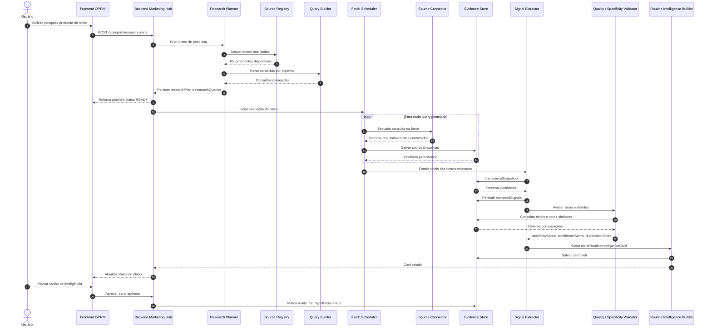

# OPRM — Plano da Camada de Acessos de Pesquisa

## 1. Objetivo

Este documento planeja a **Camada de Acessos de Pesquisa do OPRM** dentro do Marketing Hub.

O objetivo dessa camada é permitir que o OPRM conheça profundamente o dia a dia de um nicho antes de gerar hipótese comercial.

O OPRM não deve criar dor, resultado, mecanismo e oferta apenas com base em CNAE ou em inferência genérica de IA. Ele deve construir uma inteligência de rotina sustentada por sinais pesquisados, fontes rastreáveis e evidências mínimas.

A missão desta camada é responder:

```text
Como esse nicho trabalha?
Como vende?
Onde perde dinheiro?
Onde perde tempo?
O que tenta fazer no improviso?
Como fala sobre os próprios problemas?
Quais oportunidades reais de produto digital aparecem?
```

---

## 2. Nome da camada

Nome técnico sugerido:

```text
oprm-research-access-layer
```

Nome conceitual:

```text
OPRM Research Access Layer
```

Nome em português:

```text
Camada de Acesso a Pesquisa do OPRM
```

Essa camada deve ser parte do OPRM, não um módulo isolado de produto.

---

## 3. Princípio principal

O OPRM não deve pesquisar de forma livre e descontrolada.

Ele deve operar por plano:

```text
Nicho / CNAE / ocupação
  ↓
Plano de pesquisa
  ↓
Consultas por fonte
  ↓
Coleta controlada de metadados e trechos permitidos
  ↓
Extração de sinais
  ↓
Validação de especificidade e repetição
  ↓
Cartão de inteligência de rotina
  ↓
Hipótese comercial
```

A hipótese comercial só deve ser criada depois que existir uma base mínima sobre rotina, tarefas, linguagem, dores, resultados desejados, workarounds e oportunidades de mecanismo.

---

## 4. Problema que esta camada resolve

A tela atual de nichos enriquecidos mostra que vários CNAEs diferentes podem receber enriquecimentos muito parecidos, por exemplo:

```text
Dor: estoque parado, comunicação genérica, baixa recompra.
Resultado: giro de estoque com campanhas simples.
Mecanismo: calendário comercial com IA.
```

Esse tipo de enriquecimento pode até fazer sentido para muitos varejos, mas é genérico demais para gerar produtos digitais específicos.

Uma ótica, uma loja de calçados e uma loja de roupas podem ter dores parecidas, mas seus objetos comerciais, situações de compra, recompra e mecanismos práticos são diferentes.

A camada de pesquisa deve reduzir esse problema buscando evidências externas e internas antes da síntese.

---

## 5. Tipos de fontes de pesquisa

As fontes devem ser organizadas por grupos, pois cada grupo responde perguntas diferentes.

### 5.1. Grupo A — Fontes oficiais e estruturadas

Uso principal:

- classificar o nicho;
- entender descrição formal;
- obter CNAE, CBO ou ocupação;
- identificar termos oficiais;
- mapear atividades relacionadas.

Fontes possíveis:

```text
CNAE / CONCLA / IBGE
CBO
Receita Federal / CNPJ público
associações profissionais
sindicatos
conselhos profissionais
bases setoriais públicas
```

O que extrair:

```text
nome formal da atividade
subsegmentos
atividades permitidas
termos oficiais
categorias relacionadas
ocupações relacionadas
```

Limitação:

```text
Fontes oficiais ajudam a entender o que o nicho é, mas geralmente não revelam bem a dor cotidiana.
```

---

### 5.2. Grupo B — Busca web geral

Uso principal:

- encontrar sites reais do nicho;
- encontrar artigos, guias, dúvidas e páginas comerciais;
- descobrir termos usados pelo mercado;
- localizar fontes mais específicas.

Fontes possíveis:

```text
Bing Web Search
Brave Search API
SerpAPI
Tavily
Google Programmable Search, se aplicável
crawler próprio limitado e controlado
```

O que extrair:

```text
URLs relevantes
títulos
snippets
termos recorrentes
páginas comerciais
páginas de serviços
páginas de dúvidas
indícios de dor
indícios de oferta
```

Regra:

```text
A busca web deve gerar fontes e sinais, não uma hipótese final diretamente.
```

---

### 5.3. Grupo C — Sites de empresas do nicho

Uso principal:

- entender oferta real;
- identificar produtos e serviços vendidos;
- mapear linguagem comercial;
- descobrir mecanismos já usados no mercado.

Exemplos para ópticas:

```text
sites de óticas
páginas de lentes
páginas de armações
páginas de garantia
páginas de manutenção
páginas de convênios
páginas de promoções
```

O que extrair:

```text
produtos vendidos
serviços vendidos
promessas comerciais
garantias
formas de atendimento
categorias de produto
situações de compra
sazonalidade
```

---

### 5.4. Grupo D — Vagas e descrições de cargo

Uso principal:

- entender rotina real;
- descobrir tarefas diárias;
- descobrir ferramentas usadas;
- mapear responsabilidades e metas.

Fontes possíveis:

```text
sites de vagas
páginas de recrutamento
vagas públicas de vendedor, atendente, gerente ou auxiliar do nicho
```

Consultas típicas:

```text
"vendedor de ótica responsabilidades"
"atendente de ótica tarefas"
"gerente de loja de calçados responsabilidades"
"assistente comercial clínica estética tarefas"
```

O que extrair:

```text
tarefas recorrentes
metas comerciais
responsabilidades operacionais
ferramentas usadas
rotina de atendimento
pós-venda
controle de estoque
follow-up
```

Esta fonte é prioritária para entender o dia a dia.

---

### 5.5. Grupo E — Reclamações, avaliações e comentários públicos

Uso principal:

- entender dores reais;
- mapear objeções;
- descobrir atritos na experiência;
- entender problemas de atendimento, prazo, preço e confiança.

Fontes possíveis:

```text
avaliações públicas
reclamações públicas
comentários públicos
reviews de produtos
fóruns públicos
```

O que extrair:

```text
problemas recorrentes
expectativas frustradas
objeções
reclamações sobre atendimento
reclamações sobre preço
reclamações sobre prazo
reclamações sobre qualidade
```

Atenção:

```text
É necessário separar dor do cliente final da dor do profissional ou dono do negócio.
```

Exemplo:

```text
Cliente final reclama que a lente atrasou.
Dono da ótica sofre porque precisa controlar pedido, prazo, fornecedor e expectativa do cliente.
```

---

### 5.6. Grupo F — Redes sociais, vídeos e linguagem real

Uso principal:

- entender linguagem do nicho;
- descobrir frases de dor;
- entender dúvidas recorrentes;
- mapear crenças e objeções;
- encontrar assuntos que engajam.

Fontes possíveis:

```text
YouTube
comentários públicos
Reddit
fóruns públicos
perguntas e respostas
posts públicos de especialistas
```

O que extrair:

```text
termos usados pelo profissional
termos usados pelo cliente final
frases de dor
frases de desejo
objeções comuns
perguntas recorrentes
narrativas de frustração
```

Essa fonte deve ser adicionada depois do MVP inicial, pois exige mais cuidado de acesso e governança.

---

### 5.7. Grupo G — Ofertas, produtos e concorrência

Uso principal:

- entender o que já é vendido para o nicho;
- mapear promessas existentes;
- identificar formatos de produto digital;
- descobrir preços, mecanismos e lacunas.

Fontes possíveis:

```text
Hotmart
Kiwify
Eduzz
Monetizze
Udemy
Amazon Kindle
Mercado Livre
páginas de venda
sites de templates
Meta Ads Library
```

O que extrair:

```text
promessas recorrentes
formatos de produto
preços aparentes
bônus
mecanismos
públicos atendidos
lacunas de oferta
```

Observação:

```text
Essa camada conversa diretamente com MOIS. O OPRM pode consumir resumos gerados pelo MOIS, em vez de duplicar toda a pesquisa de ofertas.
```

---

### 5.8. Grupo H — Dados internos do Marketing Hub

Uso principal:

- aprender com experimentos reais;
- entender quais promessas geram clique;
- entender quais amostras geram lead;
- entender quais ofertas geram venda;
- retroalimentar o OPRM com aprendizado validado.

Fontes internas:

```text
experimentos criados
campanhas testadas
criativos publicados
landings geradas
leads capturados
pedidos de amostra
vendas
receita
EPM
feedback de leads
respostas de formulário
```

Essa será a fonte mais valiosa no longo prazo.

Exemplo de aprendizado:

```text
Óticas clicam mais em "clientes antigos" do que em "estoque parado".
Lojas de calçados respondem melhor a "numeração parada" do que a "campanhas simples".
Personal trainers respondem melhor a "alunos antigos" do que a "tráfego pago".
```

---

## 6. Arquitetura proposta

```text
OPRM Research Access Layer
  ├── Research Planner
  ├── Source Registry
  ├── Query Builder
  ├── Source Connectors
  ├── Fetch Scheduler
  ├── Evidence Store
  ├── Signal Extractor
  ├── Source Quality Scorer
  ├── Specificity Validator
  ├── Duplication Detector
  └── Routine Intelligence Builder
```

### 6.1. Research Planner

Responsável por transformar um nicho em um plano de pesquisa.

Entrada:

```text
nicheSeed
cnaeCode
cnaeDescription
occupationName
researchGoal
```

Saída:

```text
oprm_research_plan
```

Exemplo de perguntas geradas para óptica:

```text
Como óticas fazem pós-venda?
Por que clientes não retornam para óticas?
Quais tarefas vendedores de ótica executam?
Quais produtos ficam parados em óticas?
Quais campanhas óticas usam para clientes antigos?
```

---

### 6.2. Source Registry

Cadastro das fontes que o OPRM pode usar.

Cada fonte deve declarar:

```text
tipo de fonte
método de acesso
necessidade de chave de API
limite de uso
custo estimado
status ativo/inativo
observações de termos de uso
```

---

### 6.3. Query Builder

Gera consultas específicas por fonte.

Exemplo:

```text
"vendedor de ótica responsabilidades"
"como vender mais em ótica"
"clientes antigos ótica whatsapp"
"estoque parado ótica armações"
"pós-venda ótica lentes"
```

As consultas devem ser específicas e ligadas a objetivos de pesquisa.

Objetivos possíveis:

```text
ROUTINE_TASK_DISCOVERY
PAIN_DISCOVERY
DESIRED_OUTCOME_DISCOVERY
WORKAROUND_DISCOVERY
LANGUAGE_DISCOVERY
COMMERCIAL_MOMENT_DISCOVERY
MECHANISM_OPPORTUNITY_DISCOVERY
OFFER_PATTERN_DISCOVERY
```

---

### 6.4. Source Connectors

Componentes responsáveis por acessar cada fonte.

Conectores iniciais sugeridos:

```text
CnaeInternalConnector
WebSearchConnector
JobSearchConnector
InternalExperimentConnector
```

Conectores futuros:

```text
YouTubeConnector
RedditConnector
MarketplaceConnector
AdsLibraryConnector
MoisConnector
EpmConnector
```

---

### 6.5. Fetch Scheduler

Responsável por controlar execução, fila, tentativas e limites.

Deve controlar:

```text
status da busca
quantidade de resultados
falhas
tempo de execução
custo estimado
limite por fonte
```

---

### 6.6. Evidence Store

Armazena metadados e trechos permitidos das fontes.

Não deve armazenar HTML completo por padrão.

Guardar preferencialmente:

```text
url
title
snippet
trecho curto permitido
fonte
consulta que encontrou
horário de coleta
licença/estado de permissão quando conhecido
```

---

### 6.7. Signal Extractor

Extrai sinais a partir das fontes coletadas.

Tipos de sinais:

```text
ROUTINE_TASK
PAIN_SIGNAL
DESIRED_OUTCOME
WORKAROUND
LANGUAGE_PATTERN
COMMERCIAL_MOMENT
MECHANISM_OPPORTUNITY
OFFER_PATTERN
PRICE_SIGNAL
```

Cada sinal deve manter referência à fonte original.

---

### 6.8. Source Quality Scorer

Avalia a qualidade da fonte e do sinal extraído.

Critérios possíveis:

```text
fonte oficial
fonte comercial real
fonte pública verificável
recência
clareza do trecho
relevância para o nicho
especificidade
quantidade de fontes independentes
```

---

### 6.9. Specificity Validator

Verifica se os sinais e a síntese estão específicos o bastante.

Critérios mínimos:

```text
objeto comercial específico do nicho
situação típica de compra
motivo de recompra ou não recompra
tipo de estoque, serviço ou rotina relevante
oportunidade concreta de campanha
mecanismo específico aplicável ao nicho
```

---

### 6.10. Duplication Detector

Compara a nova inteligência com outros nichos já enriquecidos.

Objetivo:

```text
Evitar que muitos nichos diferentes recebam a mesma dor, o mesmo resultado e o mesmo mecanismo.
```

Saídas:

```text
duplicationScore
duplicationGroupKey
similarNicheIds
similarityReason
```

---

### 6.11. Routine Intelligence Builder

Gera o artefato final:

```text
nicheRoutineIntelligenceCard
```

Esse artefato deve ser a base para gerar hipótese comercial.

---

## 7. Modelo de dados sugerido

### 7.1. Visão geral

```text
oprm_research_source
  └── oprm_research_plan
        └── oprm_research_query
              └── oprm_fetch_job
                    └── oprm_source_snapshot
                          └── oprm_extracted_signal

oprm_research_plan
  └── oprm_routine_intelligence_card
```

---

### 7.2. `oprm_research_source`

Cadastro das fontes de pesquisa.

Campos sugeridos:

```text
id
source_code
source_name
source_type
access_method
base_url
requires_api_key
requires_oauth
rate_limit_per_day
cost_model
enabled
terms_notes
created_at
updated_at
```

Exemplos:

```text
source_code: WEB_SEARCH
source_type: SEARCH
access_method: API

source_code: JOB_SEARCH
source_type: JOBS
access_method: SEARCH_QUERY

source_code: INTERNAL_EXPERIMENTS
source_type: INTERNAL
access_method: BACKEND_QUERY
```

---

### 7.3. `oprm_research_plan`

Plano de pesquisa para um nicho.

Campos sugeridos:

```text
id
niche_id
niche_name
cnae_code
cnae_description
research_goal
status
created_at
updated_at
```

Status sugeridos:

```text
DRAFT
READY
RUNNING
COMPLETED
FAILED
CANCELLED
```

---

### 7.4. `oprm_research_query`

Consulta planejada para uma fonte.

Campos sugeridos:

```text
id
research_plan_id
source_code
query_text
query_goal
priority
status
created_at
updated_at
```

Exemplo:

```text
source_code: WEB_SEARCH
query_text: "como vender mais em ótica"
query_goal: PAIN_DISCOVERY
priority: 1
```

---

### 7.5. `oprm_fetch_job`

Execução de coleta para uma consulta.

Campos sugeridos:

```text
id
research_query_id
source_code
status
started_at
finished_at
error_message
result_count
cost_estimate_cents
created_at
updated_at
```

Status sugeridos:

```text
PENDING
RUNNING
COMPLETED
FAILED
SKIPPED
```

---

### 7.6. `oprm_source_snapshot`

Resultado controlado da fonte.

Campos sugeridos:

```text
id
fetch_job_id
source_code
url
title
snippet
published_at
author_name
raw_excerpt
fetched_at
license_state
storage_policy
created_at
```

Políticas de armazenamento sugeridas:

```text
METADATA_ONLY
SNIPPET_ONLY
SHORT_EXCERPT_ALLOWED
FULL_TEXT_ALLOWED
LINK_ONLY
```

---

### 7.7. `oprm_extracted_signal`

Sinal extraído de uma fonte.

Campos sugeridos:

```text
id
source_snapshot_id
research_plan_id
signal_type
signal_text
confidence_score
specificity_score
evidence_quote
created_at
```

Tipos de sinal:

```text
ROUTINE_TASK
PAIN_SIGNAL
DESIRED_OUTCOME
WORKAROUND
LANGUAGE_PATTERN
COMMERCIAL_MOMENT
MECHANISM_OPPORTUNITY
OFFER_PATTERN
PRICE_SIGNAL
```

---

### 7.8. `oprm_routine_intelligence_card`

Artefato final da pesquisa de rotina do nicho.

Campos sugeridos:

```text
id
research_plan_id
niche_id
niche_name
routine_summary
main_tasks
commercial_tasks
pain_summary
desired_outcome_summary
workaround_summary
language_summary
mechanism_opportunity_summary
specificity_score
confidence_score
duplication_score
ready_for_hypothesis
status
created_at
updated_at
```

Status sugeridos:

```text
DRAFT
READY_FOR_REVIEW
APPROVED
NEEDS_MORE_RESEARCH
GENERIC
REJECTED
```

---

## 8. Diagrama de sequência



---

## 9. Fases de implantação

### 9.1. Fase 1 — Pesquisa controlada básica

Objetivo:

```text
Criar infraestrutura mínima para pesquisar e registrar evidências.
```

Fontes iniciais:

```text
CNAE/dados internos existentes
Web Search API
buscas de vagas via web search
```

Implementar:

```text
oprm_research_source
oprm_research_plan
oprm_research_query
oprm_fetch_job
oprm_source_snapshot
oprm_extracted_signal
oprm_routine_intelligence_card
```

Critério de aceite:

```text
Dado um nicho, o sistema cria plano de pesquisa, gera consultas, coleta snapshots, extrai sinais e cria um cartão de rotina.
```

---

### 9.2. Fase 2 — Linguagem social e comentários

Adicionar fontes:

```text
YouTube
Reddit/fóruns públicos
comentários públicos permitidos
```

Objetivo:

```text
Melhorar linguagem real, objeções, frases de dor e frases de desejo.
```

Critério de aceite:

```text
O card passa a conter languagePatterns e painPhrases sustentados por fontes públicas.
```

---

### 9.3. Fase 3 — Ofertas e concorrência

Adicionar:

```text
marketplaces
páginas de venda
bibliotecas de anúncios
integração/resumo do MOIS
```

Objetivo:

```text
Entender o que já é vendido para o nicho e quais lacunas de produto digital existem.
```

Critério de aceite:

```text
O card passa a conter offerPatterns, priceSignals e competitorMechanisms.
```

---

### 9.4. Fase 4 — Feedback interno do Marketing Hub

Adicionar fontes internas:

```text
experimentos
landings
leads
vendas
EPM
respostas de formulários
```

Objetivo:

```text
Permitir que o OPRM aprenda com validação real de mercado.
```

Critério de aceite:

```text
O OPRM identifica quais dores, promessas e mecanismos geraram clique, lead, pedido de amostra ou venda.
```

---

## 10. Regras de governança e segurança

### 10.1. Acesso

Regras:

```text
Preferir APIs oficiais quando existirem.
Respeitar termos de uso das fontes.
Respeitar limites de requisição.
Registrar custo estimado de coleta.
Permitir desligar fontes individualmente.
Não depender de uma única fonte para aprovar um nicho.
```

### 10.2. Armazenamento

Regras:

```text
Não armazenar HTML completo por padrão.
Guardar URL, título, snippet, trecho curto e metadados.
Registrar sourceCode, query e data da coleta.
Registrar política de armazenamento.
Evitar copiar grandes blocos de conteúdo protegido.
```

### 10.3. Rastreabilidade

Regras:

```text
Todo sinal extraído deve apontar para uma fonte.
Todo card de inteligência deve listar evidências resumidas.
Toda hipótese criada a partir do card deve manter lineage.
```

### 10.4. Qualidade

Regras:

```text
Não aprovar card genérico.
Não aprovar card com baixa especificidade.
Não aprovar card baseado em uma única fonte fraca.
Marcar como NEEDS_MORE_RESEARCH quando houver pouca evidência.
Marcar como GENERIC quando a síntese servir para muitos nichos diferentes.
```

---

## 11. Gate para seguir para hipótese comercial

Um nicho só deve seguir para hipótese quando o card cumprir critérios mínimos.

Critérios sugeridos:

```text
specificity_score >= 70
confidence_score >= 60
duplication_score <= 50
mínimo de 5 tarefas reais identificadas
mínimo de 3 dores específicas
mínimo de 3 resultados desejados
mínimo de 2 workarounds
mínimo de 2 oportunidades de mecanismo
mínimo de 3 fontes independentes
status != GENERIC
```

Se não cumprir, status:

```text
NEEDS_MORE_RESEARCH
```

ou:

```text
GENERIC
```

---

## 12. Como a tela deve usar essa camada

A tela de nichos enriquecidos deve deixar de ser apenas uma tabela com textos longos.

A listagem deve mostrar:

```text
nicho
CNAE
resumo curto da dor
resumo curto da oportunidade
quantidade de fontes
quantidade de sinais
specificityScore
confidenceScore
duplicationScore
status
ações
```

Ações sugeridas:

```text
Ver rotina profunda
Ver evidências
Reprocessar pesquisa
Aprovar para hipótese
Descartar
Comparar similares
```

A tela de detalhe deve ter abas:

```text
Resumo
Tarefas
Dores
Resultados
Workarounds
Linguagem
Mecanismos
Evidências
Qualidade
```

---

## 13. Exemplo de uso

### 13.1. Entrada

```text
CNAE: 4774100
Nicho: Comércio varejista de artigos de óptica
```

### 13.2. Consultas planejadas

```text
"vendedor de ótica responsabilidades"
"atendente de ótica tarefas"
"como vender mais em ótica"
"clientes antigos ótica whatsapp"
"pós-venda ótica lentes"
"estoque parado ótica armações"
"campanhas para óticas"
```

### 13.3. Sinais esperados

```text
ROUTINE_TASK: atender clientes, medir necessidade, acompanhar pedido de lente, ajustar armação.
PAIN_SIGNAL: cliente compra uma vez e não retorna por anos.
WORKAROUND: vendedor manda mensagens manuais sem segmentação.
LANGUAGE_PATTERN: grau, lente multifocal, armação, revisão, ajuste, garantia.
MECHANISM_OPPORTUNITY: calendário de recompra por data da última compra e tipo de lente.
```

### 13.4. Card esperado

```text
Nicho: Ópticas
Resumo: óticas dependem de atendimento presencial, venda de armações/lentes e retorno de clientes antigos, mas geralmente não estruturam campanhas por ciclo de recompra, revisão de grau ou manutenção.
Dor: clientes antigos somem, estoque de armações fica parado e o pós-venda é pouco sistemático.
Resultado: aumentar recompra e retorno de clientes antigos.
Mecanismo: calendário de relacionamento por tipo de lente, data de compra e necessidade de revisão/manutenção.
```

---

## 14. MVP recomendado

A primeira implementação deve ser simples e útil.

Implementar primeiro:

```text
Source Registry
Research Plan
Research Query
Fetch Job
Source Snapshot
Extracted Signal
Routine Intelligence Card
```

Conectores iniciais:

```text
CNAE/Internal Data Connector
Web Search Connector
Job Search via Web Search Connector
Internal Experiment Connector somente leitura, se já houver dados disponíveis
```

Não implementar ainda:

```text
YouTube
Reddit
marketplaces
Meta Ads Library
crawler amplo
integração automática com EPM
```

---

## 15. Resultado esperado

Ao final da camada de acessos de pesquisa, o OPRM deve conseguir responder:

```text
De onde veio essa dor?
Que tarefas reais sustentam essa conclusão?
Que fontes mostram a rotina do nicho?
Quais termos o nicho usa?
Quais workarounds aparecem?
O mecanismo é específico ou genérico?
O nicho está pronto para hipótese?
```

O objetivo final é impedir que o Marketing Hub crie produtos digitais genéricos.

A fábrica deve criar produtos a partir de nichos que o sistema entende com profundidade suficiente.
