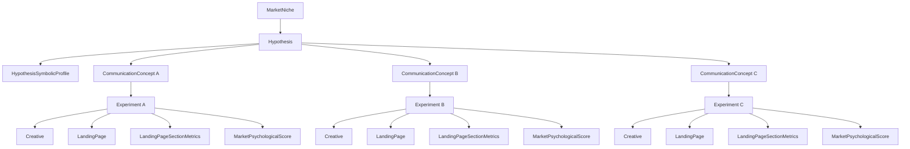

# Estrutura Hierárquica de Módulos — Score PSI

## Leitura rápida

- `MarketNiche` é o contexto macro de mercado.
- Cada `Hypothesis` concentra o perfil simbólico e múltiplos conceitos de comunicação.
- Cada `CommunicationConcept` gera um experimento próprio para validação.
- Cada experimento é medido por criativo, landing, métricas por seção e score psicológico final.
