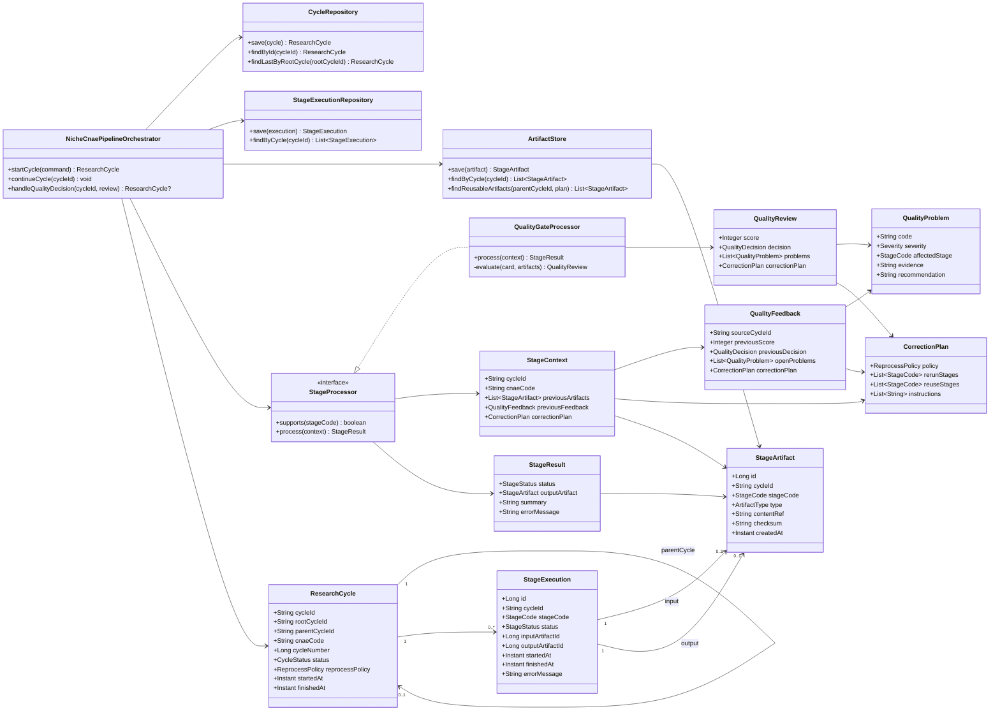
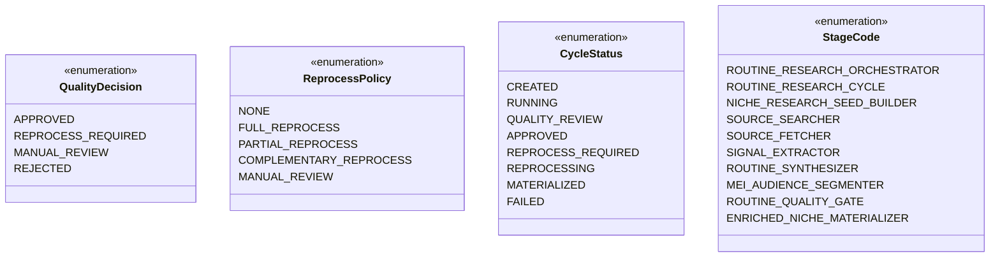

# Diagrama de classes — OPRM NichoCNAE com feedback entre ciclos

Este desenho propõe o pipeline NichoCNAE como um fluxo iterativo por ciclos encadeados. A etapa de qualidade não chama diretamente etapas anteriores: ela produz um feedback estruturado e um plano de correção. O orquestrador cria o próximo ciclo usando esse plano como contexto obrigatório.

## Visão de classes

## Leitura arquitetural

- `ResearchCycle` é o agregado principal: cada tentativa de qualificação do CNAE/subnicho é um ciclo versionado.
- `parentCycleId` liga um reprocessamento ao ciclo anterior; `rootCycleId` agrupa todas as tentativas da mesma investigação.
- `QualityGateProcessor` não reprocessa nada diretamente; ele apenas emite `QualityReview` com decisão, problemas e plano de correção.
- `NicheCnaePipelineOrchestrator` é o único responsável por criar o próximo ciclo quando a decisão for `REPROCESS_REQUIRED`.
- `StageContext` carrega o conhecimento do ciclo anterior por contrato, usando `QualityFeedback`, `CorrectionPlan` e artefatos reutilizáveis.
- `StageProcessor` mantém as etapas plugáveis e coesas; uma etapa não importa nem chama diretamente outra etapa concreta.
- `ArtifactStore` preserva entradas e saídas auditáveis, permitindo reprocessamento parcial ou complementar sem perder rastreabilidade.

## Decisões de reprocessamento

## Regra central

O próximo ciclo só pode nascer a partir de uma decisão explícita do `QualityReview`. Assim, o sistema deixa de “rodar de novo” e passa a executar uma nova tentativa orientada por causa: problema identificado, etapa afetada, artefato reutilizável e plano de correção.
