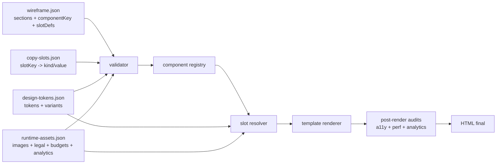

# Padrões de landing pages premium para redesenhar seu renderer de forma determinística

## Resumo executivo

A pesquisa mostra um padrão bastante estável nas landing pages fortes de produto digital: **hero muito claro + prova imediata + blocos de benefícios/mecanismo + preço ou demo/form + FAQ + rodapé legal**, com **um objetivo primário por página** e forte continuidade entre anúncio, promessa e CTA. Unbounce resume a anatomia de páginas de alta conversão em USP/hero, benefícios, prova social e uma única meta de conversão; CXL reforça foco, redução de fricção e estrutura guiando a ação; e o Google Ads insiste em **message match**, CTA espelhado e experiência mobile rápida. citeturn0search7turn15search6turn14search5turn14search0

O ponto mais importante para o seu caso é arquitetural: essas páginas **não** funcionam como “HTML livre gerado do zero”. O padrão dominante é **macro-seções compostas de forma autoral**, porém construídas sobre **primitivas globais reutilizáveis**: tipografia, botões, cards, campos, grids, badges, accordions, pricing cards e variants de superfície. Ou seja: **estrutura única por seção; elementos internos reutilizados por design system**. Isso casa muito bem com **wireframe + copy-slots + design tokens + runtime assets**, desde que o Java deixe de “inventar” placement, hero, CTA, resumo, imagem e formulário. citeturn16search1turn16search5turn16search6turn21search0turn21search1

Nos seus artefatos atuais, a base já existe, mas as fronteiras ainda estão misturadas: o wireframe já define `hero-form-split`, `formSpec`, sticky CTA e prioridade mobile; o copy já traz hero, FAQ e CTA canônico; o design já define paleta, contraste e superfícies; porém o Java ainda resolve hero, summary, CTA e formulário por heurística, constrói CSS opinativo, aceita fallback silencioso e deixa texto operacional do pipeline vazar para o HTML final. fileciteturn0file3 fileciteturn0file2 fileciteturn0file4 fileciteturn0file1 fileciteturn0file0

A recomendação prática é migrar do modelo atual para este pipeline:



Esse é o desenho que mais se aproxima do que as páginas premium fazem na prática e do que os padrões de design tokens e view rendering em Java favorecem. citeturn16search0turn16search1turn17search3turn21search0turn21search1

## Método e amostra de referência

A amostra abaixo usa **20 páginas oficiais de produto** — 10 Brasil e 10 global — escolhidas por três critérios:  
**página primária de produto ou conversão**, **presença clara de CTA/fluxo comercial**, e **representatividade no ecossistema SaaS, creator economy, educação, ecommerce e automação**. Para interpretar padrões, a amostra foi cruzada com fontes de orientação em CRO/UX e padrões técnicos: **Unbounce, CXL, Google Ads, Baymard, W3C, MDN, web.dev e Spring/Thymeleaf**. citeturn0search1turn0search7turn15search1turn15search6turn14search5turn15search0turn16search1turn16search6turn17search3turn21search0

**Legenda da coluna “Estratégia visual”**  
**GV** = componentes globais com variantes de seção.  
**BV** = macro-seções mais autorais/bespoke, mas ainda apoiadas em primitives globais.  

**Nota sobre a coluna “Primitivas normalizadas”**  
Muitas páginas modernas usam CSS modules, utility classes ou nomes minificados. Em vez de tentar reproduzir seletores literais instáveis, normalizei os elementos para equivalentes úteis ao seu renderer: `hero-title`, `section-title`, `body`, `feature-list`, `btn-primary`, `field-input`, etc. Isso é mais útil para projeto de registry do que o nome real do bundle.

### Referências do Brasil

| Página | URL | Mercado | Objetivo principal | Seções presentes | Estratégia visual | Primitivas normalizadas |
|---|---|---:|---|---|---|---|
| Nuvemshop citeturn4search0 | `nuvemshop.com.br/loja-virtual` | BR | teste grátis / criar loja | hero, IA, benefícios, integrações, pricing, depoimentos, FAQ, footer | GV | `p.body` G; `h1.hero-title` G+M; `h2.section-title` G; `h3.card/plan` G; `ul/li.feature-list/item` G; `button.btn-primary` G+M; `form/input` = CTA-only |
| RD Station Marketing citeturn4search2 | `rdstation.com/produtos/marketing` | BR | demo / trial | hero, funcionalidades, prova por módulos, demo/form, footer | GV | `p.body` G; `h1.hero-title` G+M; `h2.section-title` G; `h3.feature-title` G; `ul/li.feature-list/item` G; `button.btn-primary/secondary` G+M; `form/input.field` G |
| Exact Sales citeturn9search3 | `exactsales.com.br` | BR | receber demonstração | hero, portfólio, demo/form, recursos, footer | GV | `p.body` G; `h1.hero-title` G+M; `h2.section-title` G; `h3.solution-card` G; `ul/li.benefit-list/item` G; `button.btn-primary` G; `form/input.field` G |
| mLabs citeturn5search1 | `mlabs.com.br` | BR | teste grátis | hero, prova/logos, depoimentos, features, pricing-lite, FAQ/blog/footer | GV | `p.body` G; `h1.hero-title` G+M; `h2.section-title` G; `h3.feature-title` G; `ul/li.feature-list/item` G; `button.btn-primary` G; `form/input.field` G |
| JivoChat citeturn5search6 | `jivochat.com.br` | BR | começar teste / coletar e-mail | hero com input, canais, IA, prova, features, footer | GV | `p.body` G; `h1.hero-title` G+M; `h2.section-title` G; `h3.module-title` G; `ul/li.channel-list/item` G; `button.btn-primary` G; `form/input.email-field` G |
| Leadster citeturn7search0 | `leadster.com.br` | BR | começar teste grátis | hero, dor/prova, soluções por canal, cases, integrações, footer | BV | `p.body` G; `h1.hero-title` G+S; `h2.section-title` G; `h3.solution-card` G; `ul/li.metric-list/item` G; `button.btn-primary` G+M; `form/input` = CTA-only |
| Kiwify citeturn8search0 | `kiwify.com.br` | BR | cadastro / vender curso online | hero, benefícios, prova, depoimentos, FAQ, pricing, footer legal | GV | `p.body` G; `h1.hero-title` G+M; `h2.section-title` G; `h3.benefit-title` G; `ul/li.feature-list/item` G; `button.btn-primary` G+M; `form/input` = CTA-only |
| Hotmart Checkout citeturn6search0 | `hotmart.com/pt-br/checkout` | BR | adotar checkout / contato comercial | hero, benefícios, segurança, recursos, FAQ, footer | GV | `p.body` G; `h1.hero-title` G+M; `h2.section-title` G; `h3.resource-card` G; `ul/li.feature-list/item` G; `button.btn-primary` G+M; `form/input` = CTA-only |
| Alura citeturn6search1 | `alura.com.br` | BR | matrícula em plano | hero, benefícios, IA, catálogo/carreiras, pricing, FAQ, footer | BV | `p.body` G; `h1.hero-title` G+S; `h2.section-title` G; `h3.plan-card/feature-card` G; `ul/li.plan-list/item` G; `button.btn-primary` G+M; `form/input` = CTA-only |
| Landing Page citeturn9search1 | `landingpage.com.br` | BR | teste grátis / demo | hero, benefícios, before/after, depoimentos, pricing, FAQ, footer | GV | `p.body` G; `h1.hero-title` G+M; `h2.section-title` G; `h3.benefit-card` G; `ul/li.feature-list/item` G; `button.btn-primary/secondary` G+M; `form/input` = CTA-only ou WhatsApp |

### Referências globais

| Página | URL | Mercado | Objetivo principal | Seções presentes | Estratégia visual | Primitivas normalizadas |
|---|---|---:|---|---|---|---|
| Notion AI citeturn0search0turn3view0 | `notion.com/product/ai` | Global | trial / demo / upgrade | hero, logos, módulos, pricing, segurança, use cases, FAQ, footer | BV | `p.body` G; `h1.hero-title` G+S; `h2.section-title` G; `h3.pricing-card/module` G; `ul/li.feature-list/item` G; `button.btn-primary/secondary` G+M; `form/input` = CTA-only |
| ClickUp Brain citeturn11search7 | `clickup.com/brain` | Global | começar grátis / demo | hero, logos/prova, AI workflows, métricas, módulos, privacy/compliance, footer | BV | `p.body` G; `h1.hero-title` G+S; `h2.section-title` G; `h3.module-title` G; `ul/li.feature-list/item` G; `button.btn-primary` G+M; `form/input` = CTA-only |
| Webflow citeturn10search0 | `webflow.com` | Global | get started / sales | hero, AI builder, pilares de produto, logos/prova, customer proof, footer | BV | `p.body` G; `h1.hero-title` G+S; `h2.section-title` G; `h3.card-title` G; `ul/li.feature-list/item` G; `button.btn-primary/secondary` G+M; `form/input` = CTA-only |
| Shopify Start citeturn10search1 | `shopify.com/start` | Global | iniciar loja / capturar e-mail | hero, passos, AI assistant, retenção/canais, email capture, footer | GV | `p.body` G; `h1.hero-title` G+M; `h2.section-title` G; `h3.step-title` G; `ul/li.step-list/item` G; `button.btn-primary` G+M; `form/input.email-field` G |
| Canva Pro citeturn10search2 | `canva.com/pt_br/pro` | Global | teste grátis do Pro | hero, comparação, benefícios, pricing embed, templates, footer | GV | `p.body` G; `h1.hero-title` G+M; `h2.section-title` G; `h3.value-card` G; `ul/li.feature-list/item` G; `button.btn-primary` G+M; `form/input` = CTA-only |
| HubSpot Marketing Hub citeturn11search0 | `hubspot.com/products/marketing` | Global | get demo / trial | hero, soluções, lead gen, automação, ROI proof, pricing, FAQ, footer | GV | `p.body` G; `h1.hero-title` G+M; `h2.section-title` G; `h3.feature-card` G; `ul/li.feature-list/item` G; `button.btn-primary/secondary` G+M; `form/input` = CTA-only ou demo flow |
| Airtable AI citeturn12search1 | `airtable.com/platform/ai` | Global | try now / book demo | hero, logos, AI builder, agents, app building, footer | GV | `p.body` G; `h1.hero-title` G+M; `h2.section-title` G; `h3.module-card` G; `ul/li.feature-list/item` G; `button.btn-primary/secondary` G+M; `form/input` = CTA-only |
| Kajabi citeturn11search6 | `kajabi.com` | Global | free trial / watch demo | hero, all-in-one proof, products/payments/marketing, confidence/sell, footer | GV | `p.body` G; `h1.hero-title` G+M; `h2.section-title` G; `h3.feature-card` G; `ul/li.feature-list/item` G; `button.btn-primary/secondary` G+M; `form/input` = CTA-only |
| Slack Pricing citeturn12search0 | `slack.com/pricing` | Global | upgrade / get started | hero, logos, pricing cards, comparison table, security/compliance, footer | GV | `p.body` G; `h1.hero-title` G+M; `h2.section-title` G; `h3.plan-card` G; `ul/li.plan-list/item` G; `button.btn-primary` G+M; `form/input` = CTA-only |
| Teachable citeturn13search8 | `teachable.com/teach-online` | Global | free trial | hero, proof metrics, AI value prop, creator platform benefits, CTA, footer | GV | `p.body` G; `h1.hero-title` G+M; `h2.section-title` G; `h3.value-card` G; `ul/li.feature-list/item` G; `button.btn-primary` G+M; `form/input` = CTA-only |

A amostra converge para um diagnóstico consistente: **o diferencial das páginas fortes está mais na composição das macro-seções e na qualidade do proof do que em CSS totalmente único por seção**. Mesmo onde o hero ou a prova são mais autorais, os blocos internos continuam se comportando como primitives reutilizáveis. citeturn0search7turn15search6turn10search0turn11search0turn12search0turn9search1

## O que as páginas vencedoras repetem

A resposta para a sua pergunta central é esta: **as páginas premium não costumam estilizar tudo “por seção”**. O padrão observado é **“section as composition, elements as system”**. Em outras palavras, a seção decide **ordem, layout, surface, densidade, presença de mídia e hierarquia local**; já os elementos internos — títulos, parágrafos, listas, botões, campos, cards, accordions, pricing cards — são quase sempre **componentes globais com modifiers**. Isso é compatível com a direção do Design Tokens Community Group, que trata tokens como fonte de verdade para cores, tipografia, espaçamento, tema e relações entre componentes, não como narrativa de layout. citeturn16search1turn16search5turn10search0turn11search0turn12search0turn10search2

Em termos estruturais, a anatomia mais recorrente da seção é:

1. **Eyebrow ou micro-contexto** — dor, nicho, categoria, tag de produto.
2. **Título** — promessa principal da seção.
3. **Subtítulo ou supporting copy** — 1 a 3 linhas de explicação.
4. **Body ou bullets** — benefícios, passos, mecanismos.
5. **Mídia** — screenshot, mockup, vídeo, UI, logos, depoimento, gráfico.
6. **CTA** — principal ou secundário.
7. **Microcopy** — privacidade, tempo, sem cartão, cancelamento, prova adicional.  

Esse desenho é compatível tanto com a anatomia de landing page descrita pela Unbounce quanto com a orientação da CXL para páginas com foco em ação e fricção baixa. citeturn0search7turn15search6turn0search16

Sobre **nesting**, há uma distinção importante:

- **Nesting semântico profundo de `<section>` dentro de `<section>`**: incomum.
- **Nesting de layout e componentes dentro da seção** — grids, cards, tabs, plan cards, accordions, stat blocks, quote cards, proof rails: muito comum.  

Na prática, o que a amostra mostra é que você deve usar **uma lista top-level de seções narrativas** no wireframe, e dentro de cada uma delas permitir **grupos internos de slots** ou **repeaters**, mas não abrir a porta para árvores arbitrárias de seções narrativas recursivas. É assim que páginas como Notion AI, Nuvemshop, HubSpot e Slack conseguem variar composição sem perder sistema visual. citeturn3view0turn4search0turn11search0turn12search0

Para o seu renderer isso significa:

- **Wireframe** decide `componentKey`, ordem, slots, layout class e quais assets são obrigatórios.
- **Copy-slots** só preenche o que o componente espera.
- **Design tokens** só decide tema e variantes visuais.
- **Runtime assets** decide imagens aprovadas, analytics, legal URLs e orçamento de performance.
- **Renderer** não adivinha nada; só valida, resolve e monta.  

É exatamente o oposto do comportamento atual, no qual seu módulo ainda resolve `heroSectionId`, `heroHeadline`, `sanitizePageSummary`, `buildBodySectionCopyMarkup`, `buildCtaBlocksMarkup` e `containsFormBlock`, além de aceitar fallback de imagem e retorno silencioso de `Map.of()` em parse inválido. fileciteturn0file1

## Padrões de CSS e componentes por elemento

As recomendações abaixo são uma síntese da amostra + guias de CRO/UX/acessibilidade. O racional vem de quatro linhas principais: **tipografia e CTA reconhecíveis** em landing pages, **labels visíveis e instruções claras em forms**, **custom properties para tokens**, e **budgets de performance para orientar escolhas de design e implementação**. citeturn0search7turn15search6turn18search0turn18search1turn15search0turn15search2turn16search6turn17search3turn22search0

| Elemento | Atributos normalmente trabalhados | Tokens recomendados | Mobile | Desktop | Observações |
|---|---|---|---|---|---|
| `<p>` | `font-size`, `line-height`, `margin`, `color`, `max-width` | `--type-body-size-100`, `--type-body-leading`, `--color-text-muted`, `--measure-body`, `--space-stack-3` | 16–18px; 1.55–1.7; 32–42ch | 18–20px; 1.6–1.75; 60–72ch | corpo curto e escaneável; parágrafos longos devem ser exceção |
| `<h1>` | `font-size`, `line-height`, `font-weight`, `letter-spacing`, `margin`, `max-width` | `--type-display-size-500`, `--type-display-leading`, `--type-display-tracking`, `--font-weight-display`, `--measure-hero` | 32–44px; 1.05–1.15 | 48–72px; 1.0–1.1 | hero quase sempre curto, com medida controlada |
| `<h2>` | `font-size`, `line-height`, `font-weight`, `margin` | `--type-heading-size-400`, `--type-heading-leading`, `--font-weight-heading` | 24–30px; 1.15–1.25 | 32–40px; 1.1–1.2 | usado para macro-seções |
| `<h3>` | `font-size`, `line-height`, `font-weight`, `margin`, `color` | `--type-heading-size-300`, `--type-heading-leading`, `--font-weight-heading` | 18–22px; 1.2–1.3 | 22–28px; 1.15–1.25 | títulos de cards, planos e FAQs |
| `<ul>/<li>` | `list-style`, `padding-inline-start`, `gap`, `margin`, `line-height`, `marker-color` | `--list-indent`, `--list-gap`, `--color-list-marker`, `--type-list-size`, `--type-list-leading` | indent 16–20px; gap 8–12px | indent 18–24px; gap 10–14px | em páginas premium, muitos bullets viram listas “sem marker” + ícone/check |
| `<button>` / CTA | `font-size`, `font-weight`, `padding`, `min-height`, `background`, `color`, `border`, `border-radius`, `box-shadow`, `display`, `focus-ring` | `--btn-primary-bg`, `--btn-primary-fg`, `--btn-primary-border`, `--btn-radius`, `--btn-pad-x`, `--btn-pad-y`, `--focus-ring`, `--btn-shadow` | 16–18px; min-height 44–52px | 16–18px; min-height 44–56px | CTA precisa parecer CTA; links “com cara de link” perdem força |
| `<form>` | `display:grid`, `gap`, `padding`, `background`, `border`, `border-radius`, `max-width`, `box-shadow` | `--form-gap`, `--form-pad`, `--surface-form`, `--border-subtle`, `--radius-card`, `--shadow-card` | gap 12–16px; pad 16–20px | gap 14–20px; pad 20–28px | form curto, visually chunked |
| `<label>` | `font-size`, `font-weight`, `margin-bottom`, `color` | `--type-label-size`, `--font-weight-label`, `--color-text-strong`, `--space-label-gap` | 14–16px | 14–16px | label visível; não depender de placeholder |
| `<input>` | `font-size`, `padding`, `min-height`, `border`, `background`, `color`, `border-radius`, `focus-ring`, `width` | `--field-height`, `--field-pad-x`, `--field-pad-y`, `--field-radius`, `--field-border`, `--field-bg`, `--focus-ring` | 16–18px; 44–52px altura | 16–18px; 44–56px altura | 16px evita zoom em iOS; labels acima no mobile ajudam muito |
| `` | `width`, `max-width`, `aspect-ratio`, `object-fit`, `border-radius`, `box-shadow`; no HTML: `alt`, `loading`, `decoding`, `fetchpriority`, `sizes` | `--radius-media`, `--shadow-media`, `--aspect-proof`, `--aspect-hero` | hero 4:3, 3:2 ou 16:10; proof 4:3 | hero 16:10, 3:2 ou 16:9; proof 4:3 | `alt` obrigatório se informativa; `alt=""` se decorativa |

Exemplo de **bloco de tokens CSS** que funciona bem para esse modelo:

```css
:root[data-theme="lp-premium-v1"] {
  --color-bg-page: #F7F9FC;
  --color-bg-surface: #FFFFFF;
  --color-bg-band: #F3F7FF;
  --color-text-strong: #0B1220;
  --color-text-muted: #475569;
  --color-border-subtle: #E5E7EB;
  --color-brand-primary: #0B5FFF;
  --color-brand-accent: #16A34A;
  --color-cta-bg: #16A34A;
  --color-cta-fg: #FFFFFF;

  --type-display-size-500: clamp(2.125rem, 5vw, 4.25rem);
  --type-heading-size-400: clamp(1.5rem, 3vw, 2.5rem);
  --type-heading-size-300: clamp(1.125rem, 2vw, 1.5rem);
  --type-body-size-100: 1rem;
  --type-body-leading: 1.65;
  --type-display-leading: 1.08;
  --type-display-tracking: -0.03em;

  --space-2: 8px;
  --space-3: 12px;
  --space-4: 16px;
  --space-5: 20px;
  --space-6: 24px;
  --space-8: 32px;
  --space-12: 48px;
  --space-16: 64px;

  --radius-field: 12px;
  --radius-card: 20px;
  --radius-btn: 999px;

  --shadow-card: 0 12px 30px rgba(2, 6, 23, 0.08);
  --shadow-media: 0 10px 24px rgba(2, 6, 23, 0.10);
  --focus-ring: 0 0 0 4px rgba(11, 95, 255, 0.18);

  --field-height: 48px;
  --btn-pad-y: 14px;
  --btn-pad-x: 18px;
  --measure-body: 68ch;
  --measure-hero: 15ch;
}
```

O ponto relevante aqui não é “gerar mais CSS”, mas **gerar menos CSS opinativo em Java** e mais **tokens + componentes estáveis**. As custom properties existem justamente para isso: centralizar valores reutilizáveis e deixá-los participar da cascata sem recriar blocos CSS inteiros a cada render. citeturn16search6turn16search1

## Arquitetura JSON recomendada

A base recomendada é **JSON Schema Draft 2020-12** para validação dos contratos e **design tokens** como fonte de verdade visual. A especificação 2020-12 é apropriada para validação forte e o padrão de design tokens hoje já suporta theming, aliases e relações entre componentes de forma aberta e interoperável. citeturn16search0turn16search1turn16search5

### Schema de wireframe/structure

```json
{
  "$schema": "https://json-schema.org/draft/2020-12/schema",
  "title": "LandingWireframe",
  "type": "object",
  "required": ["pageId", "locale", "sections"],
  "properties": {
    "pageId": { "type": "string" },
    "locale": { "type": "string", "default": "pt-BR" },
    "variantLayoutId": { "type": "string" },
    "stickyCta": {
      "type": "object",
      "properties": {
        "enabled": { "type": "boolean" },
        "triggerAfterSectionId": { "type": "string" },
        "slotKey": { "type": "string" }
      }
    },
    "sections": {
      "type": "array",
      "minItems": 1,
      "items": {
        "type": "object",
        "required": [
          "sectionId",
          "componentKey",
          "layoutClassNames",
          "surfaceVariant",
          "contrastMode",
          "slotDefs"
        ],
        "properties": {
          "sectionId": {
            "type": "string",
            "pattern": "^[a-z0-9-]+$"
          },
          "componentKey": {
            "type": "string",
            "enum": [
              "hero-form-split",
              "pain-band-bullets",
              "mechanism-steps",
              "proof-mock-left",
              "offer-cards",
              "faq-accordion",
              "cta-stack",
              "footer-legal"
            ]
          },
          "layoutClassNames": {
            "type": "array",
            "items": { "type": "string" }
          },
          "surfaceVariant": { "type": "string" },
          "contrastMode": {
            "type": "string",
            "enum": ["normal", "high", "soft"]
          },
          "requiredAssets": {
            "type": "array",
            "items": { "type": "string" }
          },
          "slotDefs": {
            "type": "array",
            "minItems": 1,
            "items": {
              "type": "object",
              "required": ["slotKey", "kind", "required"],
              "properties": {
                "slotKey": { "type": "string" },
                "kind": {
                  "type": "string",
                  "enum": [
                    "text",
                    "markdown",
                    "array",
                    "metric",
                    "faqItems",
                    "imageRef",
                    "ctaRef",
                    "formRef"
                  ]
                },
                "required": { "type": "boolean" },
                "maxItems": { "type": "integer", "minimum": 1 },
                "layoutRole": { "type": "string" }
              }
            }
          }
        }
      }
    }
  },
  "examples": [
    {
      "pageId": "exp-19",
      "locale": "pt-BR",
      "variantLayoutId": "form-first",
      "sections": [
        {
          "sectionId": "hero-form-split",
          "componentKey": "hero-form-split",
          "layoutClassNames": ["layout-split-form-first", "above-fold"],
          "surfaceVariant": "surface-hero-primary",
          "contrastMode": "high",
          "requiredAssets": ["hero.visual.main"],
          "slotDefs": [
            { "slotKey": "hero.eyebrow", "kind": "text", "required": true },
            { "slotKey": "hero.title", "kind": "text", "required": true },
            { "slotKey": "hero.lead", "kind": "text", "required": true },
            { "slotKey": "hero.bullets", "kind": "array", "required": true, "maxItems": 3 },
            { "slotKey": "hero.proofBadge", "kind": "text", "required": false },
            { "slotKey": "hero.primaryCta", "kind": "ctaRef", "required": true },
            { "slotKey": "hero.microcopy", "kind": "text", "required": false },
            { "slotKey": "hero.leadForm", "kind": "formRef", "required": true }
          ]
        }
      ]
    }
  ]
}
```

### Schema de copy-slots

```json
{
  "$schema": "https://json-schema.org/draft/2020-12/schema",
  "title": "LandingCopySlots",
  "type": "object",
  "required": ["pageId", "locale", "slots"],
  "properties": {
    "pageId": { "type": "string" },
    "locale": { "type": "string", "default": "pt-BR" },
    "slots": {
      "type": "object",
      "patternProperties": {
        "^[a-z0-9._\\-\\[\\]]+$": {
          "type": "object",
          "required": ["kind", "value"],
          "properties": {
            "kind": {
              "type": "string",
              "enum": ["text", "markdown", "array"]
            },
            "value": {
              "oneOf": [
                { "type": "string" },
                {
                  "type": "array",
                  "items": {
                    "oneOf": [
                      { "type": "string" },
                      { "type": "object" }
                    ]
                  }
                }
              ]
            }
          }
        }
      },
      "additionalProperties": false
    }
  },
  "examples": [
    {
      "pageId": "exp-19",
      "locale": "pt-BR",
      "slots": {
        "hero-form-split.hero.eyebrow": {
          "kind": "text",
          "value": "Pare de brigar por preço no WhatsApp"
        },
        "hero-form-split.hero.title": {
          "kind": "text",
          "value": "Transforme seu acompanhamento em um caminho claro antes do preço"
        },
        "hero-form-split.hero.bullets": {
          "kind": "array",
          "value": [
            "PDF com marca d’água",
            "Mini-kit com 5 itens",
            "Mapa visual + check-ins"
          ]
        },
        "faq-objections.items": {
          "kind": "array",
          "value": [
            {
              "question": "Isso vai ficar genérico?",
              "answer": "A amostra nasce do seu briefing."
            }
          ]
        }
      }
    }
  ]
}
```

### Schema de design tokens/preset

```json
{
  "$schema": "https://json-schema.org/draft/2020-12/schema",
  "title": "LandingDesignPreset",
  "type": "object",
  "required": [
    "presetId",
    "colors",
    "typeScale",
    "spacing",
    "radii",
    "shadows",
    "buttonVariants",
    "surfaceVariants",
    "contrastModes"
  ],
  "properties": {
    "presetId": { "type": "string" },
    "colors": {
      "type": "object",
      "required": [
        "bgPage",
        "bgSurface",
        "textStrong",
        "textMuted",
        "borderSubtle",
        "brandPrimary",
        "ctaBg",
        "ctaFg"
      ],
      "properties": {
        "bgPage": { "type": "string" },
        "bgSurface": { "type": "string" },
        "textStrong": { "type": "string" },
        "textMuted": { "type": "string" },
        "borderSubtle": { "type": "string" },
        "brandPrimary": { "type": "string" },
        "brandAccent": { "type": "string" },
        "ctaBg": { "type": "string" },
        "ctaFg": { "type": "string" }
      }
    },
    "typeScale": {
      "type": "object",
      "required": ["display500", "heading400", "heading300", "body100", "label100"],
      "properties": {
        "display500": { "type": "string" },
        "heading400": { "type": "string" },
        "heading300": { "type": "string" },
        "body100": { "type": "string" },
        "label100": { "type": "string" },
        "bodyLeading": { "type": "string" },
        "displayLeading": { "type": "string" },
        "displayTracking": { "type": "string" }
      }
    },
    "spacing": {
      "type": "object",
      "required": ["2", "3", "4", "6", "8", "12"],
      "properties": {
        "2": { "type": "string" },
        "3": { "type": "string" },
        "4": { "type": "string" },
        "6": { "type": "string" },
        "8": { "type": "string" },
        "12": { "type": "string" }
      }
    },
    "radii": {
      "type": "object",
      "required": ["field", "card", "button"],
      "properties": {
        "field": { "type": "string" },
        "card": { "type": "string" },
        "button": { "type": "string" }
      }
    },
    "shadows": {
      "type": "object",
      "required": ["card", "media", "focusRing"],
      "properties": {
        "card": { "type": "string" },
        "media": { "type": "string" },
        "focusRing": { "type": "string" }
      }
    },
    "buttonVariants": {
      "type": "object",
      "patternProperties": {
        "^[a-z0-9-]+$": {
          "type": "object",
          "required": ["bg", "fg", "border", "radius"],
          "properties": {
            "bg": { "type": "string" },
            "fg": { "type": "string" },
            "border": { "type": "string" },
            "radius": { "type": "string" },
            "shadow": { "type": "string" }
          }
        }
      }
    },
    "surfaceVariants": {
      "type": "object",
      "patternProperties": {
        "^[a-z0-9-]+$": {
          "type": "object",
          "required": ["background", "border", "paddingY"],
          "properties": {
            "background": { "type": "string" },
            "border": { "type": "string" },
            "paddingY": { "type": "string" }
          }
        }
      }
    },
    "contrastModes": {
      "type": "object",
      "properties": {
        "normal": { "type": "object" },
        "high": { "type": "object" },
        "soft": { "type": "object" }
      }
    }
  },
  "examples": [
    {
      "presetId": "lp-premium-v1",
      "colors": {
        "bgPage": "#F7F9FC",
        "bgSurface": "#FFFFFF",
        "textStrong": "#0B1220",
        "textMuted": "#475569",
        "borderSubtle": "#E5E7EB",
        "brandPrimary": "#0B5FFF",
        "brandAccent": "#16A34A",
        "ctaBg": "#16A34A",
        "ctaFg": "#FFFFFF"
      },
      "typeScale": {
        "display500": "clamp(2.125rem,5vw,4.25rem)",
        "heading400": "clamp(1.5rem,3vw,2.5rem)",
        "heading300": "clamp(1.125rem,2vw,1.5rem)",
        "body100": "1rem",
        "label100": "0.95rem",
        "bodyLeading": "1.65",
        "displayLeading": "1.08",
        "displayTracking": "-0.03em"
      },
      "spacing": { "2": "8px", "3": "12px", "4": "16px", "6": "24px", "8": "32px", "12": "48px" },
      "radii": { "field": "12px", "card": "20px", "button": "999px" },
      "shadows": {
        "card": "0 12px 30px rgba(2,6,23,.08)",
        "media": "0 10px 24px rgba(2,6,23,.10)",
        "focusRing": "0 0 0 4px rgba(11,95,255,.18)"
      },
      "buttonVariants": {
        "primary": {
          "bg": "var(--color-cta-bg)",
          "fg": "var(--color-cta-fg)",
          "border": "transparent",
          "radius": "var(--radius-button)"
        }
      },
      "surfaceVariants": {
        "surface-hero-primary": {
          "background": "var(--color-bg-surface)",
          "border": "var(--color-border-subtle)",
          "paddingY": "var(--space-12)"
        }
      },
      "contrastModes": { "normal": {}, "high": {}, "soft": {} }
    }
  ]
}
```

### Schema de runtime/assets

```json
{
  "$schema": "https://json-schema.org/draft/2020-12/schema",
  "title": "LandingRuntimeAssets",
  "type": "object",
  "required": [
    "pageId",
    "approvedHosts",
    "imageBindings",
    "legalUrls",
    "performanceBudget"
  ],
  "properties": {
    "pageId": { "type": "string" },
    "approvedHosts": {
      "type": "array",
      "items": { "type": "string" }
    },
    "imageBindings": {
      "type": "array",
      "items": {
        "type": "object",
        "required": ["bindingKey", "sectionId", "url", "alt", "width", "height"],
        "properties": {
          "bindingKey": { "type": "string" },
          "sectionId": { "type": "string" },
          "url": { "type": "string", "format": "uri" },
          "alt": { "type": "string" },
          "decorative": { "type": "boolean", "default": false },
          "width": { "type": "integer", "minimum": 1 },
          "height": { "type": "integer", "minimum": 1 },
          "loading": { "type": "string", "enum": ["eager", "lazy"] },
          "fetchpriority": { "type": "string", "enum": ["high", "low", "auto"] }
        }
      }
    },
    "analytics": {
      "type": "object",
      "properties": {
        "events": {
          "type": "array",
          "items": {
            "type": "object",
            "required": ["eventName", "selector"],
            "properties": {
              "eventName": { "type": "string" },
              "selector": { "type": "string" }
            }
          }
        }
      }
    },
    "legalUrls": {
      "type": "object",
      "required": ["privacyPolicy", "termsOfUse"],
      "properties": {
        "privacyPolicy": { "type": "string", "format": "uri" },
        "termsOfUse": { "type": "string", "format": "uri" },
        "refundPolicy": { "type": "string", "format": "uri" }
      }
    },
    "performanceBudget": {
      "type": "object",
      "required": [
        "maxJsKBGzipMobile",
        "maxHeroImageKB",
        "maxTotalImagesKBMobile",
        "maxRequests",
        "targetLcpMsP75Mobile",
        "targetInpMsP75Mobile",
        "targetClsP75"
      ],
      "properties": {
        "maxJsKBGzipMobile": { "type": "integer" },
        "maxHeroImageKB": { "type": "integer" },
        "maxTotalImagesKBMobile": { "type": "integer" },
        "maxRequests": { "type": "integer" },
        "targetLcpMsP75Mobile": { "type": "integer" },
        "targetInpMsP75Mobile": { "type": "integer" },
        "targetClsP75": { "type": "number" }
      }
    }
  },
  "examples": [
    {
      "pageId": "exp-19",
      "approvedHosts": ["cdn.seudominio.com", "images.seudominio.com"],
      "imageBindings": [
        {
          "bindingKey": "hero.visual.main",
          "sectionId": "hero-form-split",
          "url": "https://cdn.seudominio.com/lp/exp-19/hero-proof.webp",
          "alt": "Prévia em PDF com marca d’água exibida em notebook e celular",
          "decorative": false,
          "width": 1200,
          "height": 900,
          "loading": "eager",
          "fetchpriority": "high"
        }
      ],
      "legalUrls": {
        "privacyPolicy": "https://seudominio.com/privacidade",
        "termsOfUse": "https://seudominio.com/termos"
      },
      "performanceBudget": {
        "maxJsKBGzipMobile": 170,
        "maxHeroImageKB": 350,
        "maxTotalImagesKBMobile": 1200,
        "maxRequests": 35,
        "targetLcpMsP75Mobile": 2500,
        "targetInpMsP75Mobile": 200,
        "targetClsP75": 0.1
      }
    }
  ]
}
```

## Arquitetura Java recomendada

Em Java, o melhor encaixe aqui é **component registry + template engine server-side**. O Spring MVC já trata view rendering como infraestrutura plugável, e o Thymeleaf é particularmente adequado porque trabalha com **HTML natural**, útil para separar template da lógica e permitir que o componente exista como artefato visual real, não como concatenação de strings no Java. citeturn21search1turn21search0turn21search3

### Classes e responsabilidades

| Classe | Responsabilidade | Principais métodos públicos |
|---|---|---|
| `LandingArtifactsParser` | parsear os 4 JSONs em DTOs tipados | `parseWireframe(String)`, `parseCopySlots(String)`, `parseDesignPreset(String)`, `parseRuntime(String)` |
| `LandingArtifactsValidator` | validar schema + integridade cruzada | `validateAll(WireframeSpec, CopySlotsSpec, DesignPresetSpec, RuntimeAssetsSpec)` |
| `ComponentRegistry` | registrar `componentKey -> LandingComponent` | `get(String componentKey)`, `has(String componentKey)` |
| `SlotResolver` | mapear `slotDefs` para valores concretos | `resolveSlots(SectionSpec, CopySlotsSpec)` |
| `ThemeResolver` | mapear variants/tokens em classes e vars | `resolvePageTheme(DesignPresetSpec)`, `resolveSectionTheme(SectionSpec, DesignPresetSpec)` |
| `AssetResolver` | resolver assets aprovados e políticas de host/alt | `resolveRequiredAssets(SectionSpec, RuntimeAssetsSpec)`, `resolveOptionalAssets(...)` |
| `RenderContextFactory` | montar contexto imutável de render | `create(WireframeSpec, CopySlotsSpec, DesignPresetSpec, RuntimeAssetsSpec)` |
| `LandingComponent` | contrato de cada componente renderizável | `componentKey()`, `validate(SectionSpec, SlotBag)`, `buildModel(SectionSpec, SlotBag, RenderContext)`, `render(ComponentModel)` |
| `TemplateRenderer` | renderizar HTML via fragmento/template | `renderFragment(String templateName, Map<String,Object> model)` |
| `LandingRenderService` | orquestrar o render determinístico da página | `render(RenderRequest request): RenderResult` |
| `PostRenderAudit` | auditar a11y, analytics e performance | `audit(RenderResult result): AuditReport` |

### Passos de validação

1. **Schema validation** dos 4 artefatos.  
2. **Wireframe validation**: `sectionId` únicos, `componentKey` conhecido, `slotDefs` consistentes, `layoutClassNames` válidos.  
3. **Copy-slots validation**: todos os slots obrigatórios presentes; nenhum slot órfão sem section correspondente.  
4. **Design validation**: tokens mínimos presentes, variants referenciadas existem, contrastes mínimos respeitados.  
5. **Runtime validation**: hosts aprovados, `alt`, `width`, `height`, legal URLs, budgets.  
6. **Cross-artifact validation**: `formRef`, `ctaRef`, `imageRef` e `requiredAssets` resolvidos.  
7. **Component pre-validation**: cada componente pode impor regras extras, como “hero-form-split exige title + lead + primaryCta + formRef”.  
8. **Post-render audit**: CTA hooks, `aria-*`, budgets, links legais, `alt`, hierarquia heading.  

A diferença-chave em relação ao seu módulo atual é que o Java deixa de “interpretar a intenção” do JSON. Hoje ele ainda resolve headline/section role/CTA/form por heurística e concatena CSS/HTML opinativos em um único fluxo. fileciteturn0file1

### Exemplo de fluxo determinístico para `hero-form-split`

**Entradas**

- **Wireframe section**  
  `sectionId=hero-form-split`  
  `componentKey=hero-form-split`  
  `layoutClassNames=["layout-split-form-first","above-fold"]`  
  `surfaceVariant="surface-hero-primary"`  
  `slotDefs=["hero.eyebrow","hero.title","hero.lead","hero.bullets","hero.proofBadge","hero.primaryCta","hero.microcopy","hero.leadForm"]`

- **Copy-slots**  
  preenche exatamente esses slots.

- **Design tokens**  
  define `surface-hero-primary`, `buttonVariants.primary`, type scale, spacing, radii, shadows.

- **Runtime assets**  
  resolve `hero.visual.main`, legal URLs, analytics hooks e budgets.

**Fluxo**

1. `LandingArtifactsValidator` valida tudo.  
2. `ComponentRegistry.get("hero-form-split")` retorna `HeroFormSplitComponent`.  
3. `SlotResolver.resolveSlots(section, copySlots)` devolve `SlotBag` com os valores exatos.  
4. `AssetResolver.resolveRequiredAssets(section, runtime)` devolve a mídia aprovada.  
5. `ThemeResolver.resolveSectionTheme(section, designPreset)` devolve classes/vars como `lp-surface--hero-primary` e `lp-contrast--high`.  
6. `HeroFormSplitComponent.buildModel(...)` monta um view model puro.  
7. `TemplateRenderer.renderFragment("components/hero-form-split", model)` gera o HTML.  
8. `PostRenderAudit` valida a11y, analytics e budgets.  

**Esqueleto HTML esperado**

```html
<section
  class="lp-section lp-surface--hero-primary lp-contrast--high layout-split-form-first above-fold"
  data-page-id="exp-19"
  data-section-id="hero-form-split"
  data-component-key="hero-form-split"
  data-surface-variant="surface-hero-primary"
>
  <div class="lp-container lp-grid lp-grid--2">
    <div class="lp-copy-col">
      <p class="lp-eyebrow" data-slot-key="hero-form-split.hero.eyebrow">
        Pare de brigar por preço no WhatsApp
      </p>

      <h1 class="lp-h1" data-slot-key="hero-form-split.hero.title">
        Transforme seu acompanhamento em um caminho claro antes do preço
      </h1>

      <p class="lp-lead" data-slot-key="hero-form-split.hero.lead">
        Gere uma amostra em PDF com marca d’água e um mini-kit em minutos.
      </p>

      <ul class="lp-list lp-list--check" data-slot-key="hero-form-split.hero.bullets">
        <li class="lp-list__item">PDF com marca d’água</li>
        <li class="lp-list__item">Mini-kit com 5 itens</li>
        <li class="lp-list__item">Mapa visual + check-ins</li>
      </ul>

      <div class="lp-proof-badge" data-slot-key="hero-form-split.hero.proofBadge">
        Amostra visível antes: PDF + mini-kit
      </div>

      <a
        class="lp-btn lp-btn--primary"
        href="#lead-capture-primary"
        data-slot-key="hero-form-split.hero.primaryCta"
        data-analytics-id="cta-primary-hero"
      >
        Preencha o briefing de 2 minutos e gere agora sua amostra personalizada em PDF.
      </a>

      <p class="lp-microcopy" id="hero-microcopy" data-slot-key="hero-form-split.hero.microcopy">
        Leva ~2 minutos. Você vê a amostra antes de qualquer decisão.
      </p>
    </div>

    <aside class="lp-card lp-form-card" aria-labelledby="lead-form-title">
      <h2 class="lp-h3" id="lead-form-title">Receber a prévia do Kit</h2>

      <form
        id="lead-capture-primary"
        class="lp-form"
        action="/api/flows/exp-19/submissions"
        method="post"
        novalidate
        data-slot-key="hero-form-split.hero.leadForm"
      >
        <div class="lp-field-group">
          <label class="lp-label" for="field-name">Nome</label>
          <input class="lp-input" id="field-name" name="nome" type="text" required />
        </div>

        <div class="lp-field-group">
          <label class="lp-label" for="field-email">E-mail</label>
          <input class="lp-input" id="field-email" name="email" type="email" required />
        </div>

        <div class="lp-field-group">
          <label class="lp-label" for="field-whatsapp">WhatsApp (opcional)</label>
          <input
            class="lp-input"
            id="field-whatsapp"
            name="whatsapp"
            type="tel"
            aria-describedby="field-whatsapp-help"
          />
          <p class="lp-help" id="field-whatsapp-help">
            Usado apenas para enviar a prévia, se você quiser.
          </p>
        </div>

        <button class="lp-btn lp-btn--primary" type="submit" data-analytics-id="form-submit-primary">
          Desbloquear o Kit
        </button>

        <p class="lp-privacy-note">
          Política de privacidade e termos no rodapé.
        </p>
      </form>
    </aside>
  </div>
</section>
```

### Exemplo de bloco CSS de componente + tokens

```css
.lp-section { padding-block: var(--space-12); }
.lp-container { max-width: 1120px; margin-inline: auto; padding-inline: var(--space-4); }
.lp-grid--2 { display: grid; gap: var(--space-8); }
@media (min-width: 960px) {
  .lp-grid--2 { grid-template-columns: 1.1fr 0.9fr; align-items: start; }
}

.lp-h1 {
  font-size: var(--type-display-size-500);
  line-height: var(--type-display-leading);
  letter-spacing: var(--type-display-tracking);
  color: var(--color-text-strong);
  margin: 0 0 var(--space-4);
  max-width: var(--measure-hero);
}

.lp-lead {
  font-size: var(--type-body-size-100);
  line-height: var(--type-body-leading);
  color: var(--color-text-muted);
  margin: 0 0 var(--space-4);
  max-width: var(--measure-body);
}

.lp-btn {
  display: inline-flex;
  align-items: center;
  justify-content: center;
  min-height: var(--field-height);
  padding: var(--btn-pad-y) var(--btn-pad-x);
  border-radius: var(--radius-btn);
  font-weight: 700;
  text-decoration: none;
}

.lp-btn--primary {
  background: var(--color-cta-bg);
  color: var(--color-cta-fg);
  border: 1px solid transparent;
  box-shadow: var(--shadow-card);
}

.lp-input {
  width: 100%;
  min-height: var(--field-height);
  padding-inline: var(--space-4);
  border: 1px solid var(--color-border-subtle);
  border-radius: var(--radius-field);
  background: var(--color-bg-surface);
}
```

### Comparação entre abordagem atual e proposta

| Responsabilidade | Atual: quem decide | Atual: onde fica | Atual: determinístico? | Proposta: quem decide | Proposta: onde fica | Proposta: determinístico? |
|---|---|---|---|---|---|---|
| Ordem narrativa da página | wireframe + Java | wireframe + heurísticas do renderer | parcial | wireframe | `wireframe.sections[]` | sim |
| Papel de cada seção | Java interpreta `sectionId`/`contentType` | `buildBodySectionCopyMarkup`, `buildFaqMarkup`, `containsFormBlock` | não | wireframe + component registry | `componentKey` no wireframe + registry fixo | sim |
| Texto e placement | copy + Java | `hero`, `bodySections`, `ctaBlocks` + heurísticas | não | copy-slots | `copy-slots.slots[slotKey]` | sim |
| CTA repetido | copy + Java | `ctaBlocks` com `placement` | parcial | wireframe decide slots CTA; copy só o texto | `wireframe.slotDefs` + `copy-slots` | sim |
| Layout da seção | design + Java | `layoutPreset` no design + CSS builder em Java | não | wireframe | `layoutClassNames` + `componentKey` | sim |
| Estilo visual | design + Java | palette/typography + CSS montado no Java | parcial | design tokens | `design-preset` | sim |
| Imagens e mídia | image planning + fallback do Java | `buildImageTag()` com default externo | não | runtime/assets | `runtime.imageBindings[]` | sim |
| Legal/analytics/performance | ad hoc | links placeholders / scripts soltos | não | runtime/assets | `legalUrls`, `analytics`, `performanceBudget` | sim |
| Tratamento de erro | Java silencioso | `safeReadObject() -> Map.of()` | não | validação explícita | validator + error report | sim |
| HTML final | concatenação opinativa | `StringBuilder` + lógica misturada | não | templates fixos + model | fragments Thymeleaf/registry | sim |

Essa tabela explica por que sua classe atual “toma decisão demais”: ela não é só renderer; ela é também **editor, layout engine, style compositor e fallback manager**. fileciteturn0file1 fileciteturn0file0

## Boas práticas operacionais e de acessibilidade

A primeira regra é **escaping por contexto**. OWASP recomenda codificação contextual: HTML text, HTML attribute, URL, JavaScript string e CSS value **não** devem ser tratados como o mesmo contexto. Em Java, o mais seguro é preferir template engine com escaping padrão e usar encoder contextual apenas nos poucos pontos onde você realmente injeta valor em atributo, URL, CSS custom property ou JS inline. citeturn20search1turn20search2turn20search4

A segunda regra é **fail-fast para contrato estrutural** e **graceful degrade só para opcional**.  
Falhar imediatamente quando faltar:
- `componentKey` desconhecido,
- slot obrigatório ausente,
- asset obrigatório sem host aprovado,
- URL legal inválida,
- contraste/token crítico ausente.  

Degradar com elegância apenas quando faltar:
- imagem opcional,
- bullet opcional,
- quote opcional,
- FAQ opcional.  

E o degradar aqui significa **omitir o sub-bloco** ou renderizar placeholder interno controlado — **nunca** inventar imagem externa aleatória. Isso é especialmente importante porque seu módulo atual ainda cai para uma imagem default do Unsplash quando não acha URL aprovada. fileciteturn0file1

A terceira regra é **acessibilidade real de formulário e mídia**. A WAI recomenda labels associadas com `<label for=...>`, instruções visíveis ou vinculadas por `aria-describedby`, e textos alternativos adequados para imagens. Baymard reforça três pontos altamente relevantes para landing pages com form: labels acima do campo no mobile, required/optional explícitos quando o formulário passa de algo muito curto, e explicação inline quando o usuário pode hesitar em fornecer telefone. citeturn18search0turn18search1turn18search2turn19search1turn19search2turn19search0turn15search0turn15search2turn15search3

A quarta regra é **analytics previsível e declarativo**. Em vez de scripts “achando” botões por classe ou texto, seus componentes devem emitir `data-analytics-id`, `data-slot-key`, `data-component-key` e `data-section-id`. O runtime pode declarar eventos tipo `cta_primary_click`, `form_submit_primary`, `faq_toggle`, `proof_viewed`. Assim, a telemetria vira contrato estável, não scraping de DOM.

A quinta regra é **budget de performance como parte do contrato**. web.dev recomenda definir orçamentos explícitos porque performance raramente acontece “por acidente”; o Google também liga velocidade de landing page a resultado, e já reportou impacto de atraso de 1 segundo em mobile sobre conversões. Além disso, as metas atuais de Core Web Vitals continuam sendo LCP ≤ 2,5s, INP ≤ 200ms e CLS ≤ 0,1 no percentil 75. Para landing page de aquisição, eu recomendaria como ponto de partida: **JS gzip mobile ≤ 170 KB**, **hero image ≤ 350 KB**, **total de imagens mobile ≤ 1,2 MB**, **requisições ≤ 35**, e budgets específicos por tipo de página. citeturn17search0turn17search3turn17search6turn14search0turn14search3turn22search0

O que isso significa para o seu caso concreto é simples:  
**não deixe o renderer resumir headline, limpar summary, descobrir hero, decidir formulário ou improvisar mídia**. Seu wireframe atual já manda `hero-form-split`, formulário acima da dobra, CTA canônico e prioridade mobile; o renderer é que precisa finalmente obedecer. fileciteturn0file3 fileciteturn0file1 fileciteturn0file0

## Fontes prioritárias

- **Google Ads** sobre continuidade anúncio→landing, CTA espelhado e performance/mobile. citeturn14search5turn14search0turn14search3  
- **Unbounce** sobre anatomia e melhores práticas das landing pages. citeturn0search7turn0search1turn0search16turn0search12  
- **CXL** sobre estrutura, fricção, otimização de landing pages e forms. citeturn15search6turn14search6turn15search4  
- **Baymard** sobre labels, required/optional, telefone e microinstruções em forms. citeturn15search0turn15search2turn15search3turn15search7  
- **W3C / DTCG / WAI** sobre design tokens, labels, instruções e alt text. citeturn16search1turn16search5turn18search0turn18search1turn19search1turn19search9  
- **MDN** sobre CSS custom properties e `aria-describedby`. citeturn16search6turn18search2  
- **web.dev** sobre performance budgets e Core Web Vitals. citeturn17search3turn17search0turn22search0  
- **Spring / Thymeleaf** para a recomendação de registry + template engine em Java. citeturn21search0turn21search1turn21search3  
- **Sua implementação atual**, que evidencia o problema de sobredecisão e vazamento do pipeline no HTML. fileciteturn0file1 fileciteturn0file0 fileciteturn0file2 fileciteturn0file3 fileciteturn0file4