# Diagrama de dados — Pipeline OPRM Nicho CNAE

## Objetivo

Este diagrama mostra as tabelas envolvidas no pipeline **Nicho CNAE**, desde a priorização do CNAE/candidato até a materialização do nicho enriquecido usado pelos fluxos comerciais posteriores. A leitura deve ser feita com uma regra central: a pesquisa inicial levanta **rotina real, dores, tarefas, linguagem e evidências públicas**, sem criar produto, oferta, campanha, hipótese ou landing page.

## Fontes validadas

- Código e changelogs do backend OPRM NichoCNAE.
- Schema real do MySQL consultado via MCP (`db_query` em `information_schema.columns` e `information_schema.key_column_usage`).
- Logs do módulo `oprm-coletor-receita` consultados via MCP; não havia linhas recentes filtradas por `NichoCNAE`, `routine-research` ou `enriched-niche-materializer` no momento da validação.

## Visão de alto nível do fluxo

```mermaid
flowchart LR
    cnpj[Base CNAE/CNPJ\noprm_cnpj_cnae_dim\noprm_market_size_by_cnae]
    candidate[Candidato de nicho\noprm_niche_candidate]
    cycle[Ciclo de pesquisa\noprm_routine_research_cycle]
    seed[Seed operacional\noprm_niche_research_seed]
    query[Queries de pesquisa\noprm_research_query]
    sourceCandidate[Fontes candidatas\noprm_source_candidate]
    snapshot[Snapshots curtos\noprm_source_snapshot]
    signal[Sinais extraídos\noprm_extracted_signal]
    card[Cartão de rotina\noprm_niche_routine_card]
    mei[Perfil MEI/autônomo\noprm_mei_audience_profile]
    niche[Nicho principal\nmarket_niche]
    profile[Nicho enriquecido\nmarket_niche_enrichment_profile]

    cnpj --> candidate
    candidate --> cycle
    cycle --> seed
    seed --> query
    query --> sourceCandidate
    sourceCandidate --> snapshot
    snapshot --> signal
    signal --> card
    card --> mei
    mei --> profile
    card --> profile
    cycle --> profile
    profile --> niche
    candidate -. reaproveita/atualiza .-> niche
```



## Diagrama entidade-relacionamento lógico

> Observação: nem todos os vínculos abaixo existem como `FOREIGN KEY` física no MySQL. No schema atual, parte importante do OPRM usa referências lógicas por `*_id`; o vínculo físico confirmado por constraint existe entre `market_niche_enrichment_profile.market_niche_id` e `market_niche.id`.

```mermaid
erDiagram
    OPRM_CNPJ_CNAE_DIM ||--o{ OPRM_MARKET_SIZE_BY_CNAE : "cnae_code"
    OPRM_CNPJ_CNAE_DIM ||--o{ OPRM_NICHE_CANDIDATE : "cnae_code"
    OPRM_NICHE_CANDIDATE ||--o{ OPRM_ROUTINE_RESEARCH_CYCLE : "source_niche_id"
    OPRM_ROUTINE_RESEARCH_CYCLE ||--o{ OPRM_NICHE_RESEARCH_SEED : "research_cycle_id"
    OPRM_NICHE_RESEARCH_SEED ||--o{ OPRM_RESEARCH_QUERY : "niche_research_seed_id"
    OPRM_ROUTINE_RESEARCH_CYCLE ||--o{ OPRM_RESEARCH_QUERY : "research_cycle_id"
    OPRM_RESEARCH_QUERY ||--o{ OPRM_SOURCE_CANDIDATE : "research_query_id"
    OPRM_ROUTINE_RESEARCH_CYCLE ||--o{ OPRM_SOURCE_CANDIDATE : "research_cycle_id"
    OPRM_SOURCE_CANDIDATE ||--o{ OPRM_SOURCE_SNAPSHOT : "source_candidate_id"
    OPRM_SOURCE_SNAPSHOT ||--o{ OPRM_EXTRACTED_SIGNAL : "source_snapshot_id"
    OPRM_SOURCE_CANDIDATE ||--o{ OPRM_EXTRACTED_SIGNAL : "source_candidate_id"
    OPRM_ROUTINE_RESEARCH_CYCLE ||--o{ OPRM_NICHE_ROUTINE_CARD : "research_cycle_id"
    OPRM_NICHE_ROUTINE_CARD ||--o{ OPRM_MEI_AUDIENCE_PROFILE : "routine_card_id"
    OPRM_ROUTINE_RESEARCH_CYCLE ||--o{ OPRM_MEI_AUDIENCE_PROFILE : "research_cycle_id"
    MARKET_NICHE ||--o{ OPRM_MEI_AUDIENCE_PROFILE : "market_niche_id"
    MARKET_NICHE ||--o{ MARKET_NICHE_ENRICHMENT_PROFILE : "market_niche_id FK"
    OPRM_ROUTINE_RESEARCH_CYCLE ||--o{ MARKET_NICHE_ENRICHMENT_PROFILE : "research_cycle_id"
    OPRM_NICHE_ROUTINE_CARD ||--o{ MARKET_NICHE_ENRICHMENT_PROFILE : "routine_card_id"
    OPRM_NICHE_CANDIDATE ||--o{ MARKET_NICHE_ENRICHMENT_PROFILE : "source_niche_candidate_id"

    OPRM_CNPJ_CNAE_DIM {
        string cnae_code PK
        string description
        boolean active
        datetime updated_at
    }

    OPRM_MARKET_SIZE_BY_CNAE {
        date snapshot_date PK
        string cnae_code PK
        bigint total_estabelecimentos
        bigint total_estabelecimentos_ativos
        bigint total_empresas_mei
        datetime updated_at
    }

    OPRM_NICHE_CANDIDATE {
        bigint id PK
        string cnae_code
        string candidate_niche_name
        decimal opportunity_score
        string status
        bigint market_niche_id
        string routine_research_status
        bigint last_routine_research_cycle_id
    }

    OPRM_ROUTINE_RESEARCH_CYCLE {
        bigint id PK
        bigint source_niche_id
        string cnae_code
        string niche_name
        string neutral_niche_name
        string research_mode
        string status
        int total_queries
        int total_source_candidates
        int total_source_snapshots
        int total_extracted_signals
    }

    OPRM_NICHE_RESEARCH_SEED {
        bigint id PK
        bigint research_cycle_id
        string cnae_code
        string niche_name
        string business_type
        longtext operation_type
        longtext customer_type
        longtext initial_assumptions
        string confidence_level
    }

    OPRM_RESEARCH_QUERY {
        bigint id PK
        bigint research_cycle_id
        bigint niche_research_seed_id
        string query_text
        string query_goal
        string source_group
        int priority
        string status
        int result_count
    }

    OPRM_SOURCE_CANDIDATE {
        bigint id PK
        bigint research_cycle_id
        bigint research_query_id
        string source_url
        string source_domain
        string source_group
        int routine_evidence_score
        boolean commercial_page_risk
        boolean solution_language_risk
        boolean selected_for_fetch
        string status
    }

    OPRM_SOURCE_SNAPSHOT {
        bigint id PK
        bigint research_cycle_id
        bigint source_candidate_id
        string source_url
        string source_type
        longtext short_excerpt
        string fetch_status
        string storage_policy
        string signal_extraction_status
    }

    OPRM_EXTRACTED_SIGNAL {
        bigint id PK
        bigint research_cycle_id
        bigint source_snapshot_id
        bigint source_candidate_id
        string signal_type
        string signal_text
        string evidence_excerpt
        int confidence_score
    }

    OPRM_NICHE_ROUTINE_CARD {
        bigint id PK
        bigint research_cycle_id
        string niche_name
        longtext routine_summary
        longtext pains_summary
        longtext evidence_summary
        int confidence_score
        boolean ready_for_hypothesis
        string quality_status
    }

    OPRM_MEI_AUDIENCE_PROFILE {
        bigint id PK
        bigint research_cycle_id
        bigint routine_card_id
        bigint source_niche_candidate_id
        bigint market_niche_id
        string cnae_code
        string neutral_niche_name
        string audience_name
        longtext customer_acquisition_behavior
        longtext channels_used
    }

    MARKET_NICHE {
        bigint id PK
        string name
        longtext description
        longtext base_segmentation
        longtext demographic_filters
        longtext interest_list
        longtext role_list
        longtext behavior_list
    }

    MARKET_NICHE_ENRICHMENT_PROFILE {
        bigint id PK
        bigint market_niche_id FK
        string source_module
        bigint source_niche_candidate_id
        bigint research_cycle_id
        bigint routine_card_id
        string cnae_code
        string neutral_niche_name
        string research_mode
        longtext routine_summary
        longtext pains_summary
        longtext evidence_summary
        int routine_evidence_score
        int solution_language_risk_score
    }
```



## Tabelas por etapa do pipeline

| Etapa | Tabelas principais | Papel no dado |
|---|---|---|
| 0. Base de mercado CNAE | `oprm_cnpj_cnae_dim`, `oprm_market_size_by_cnae` | Dicionário de CNAE e tamanho de mercado por CNAE. |
| 1. Seleção de candidato | `oprm_niche_candidate` | Guarda candidato priorizado, CNAE, score de oportunidade e vínculo futuro com `market_niche`. |
| 2. Controle do ciclo | `oprm_routine_research_cycle` | Abre e acompanha uma execução completa da pesquisa, com status e totais de queries/fontes/sinais. |
| 3. Seed e queries | `oprm_niche_research_seed`, `oprm_research_query` | Transforma o candidato em perfil operacional neutro e frases de pesquisa executáveis. |
| 4. Busca de fontes | `oprm_source_candidate` | Armazena URLs candidatas, score de evidência de rotina e riscos de contaminação comercial/solução. |
| 5. Coleta curta | `oprm_source_snapshot` | Persiste trechos curtos e metadados de fontes selecionadas, sem copiar conteúdo amplo. |
| 6. Extração de sinais | `oprm_extracted_signal` | Guarda sinais estruturados de rotina, dor, linguagem, canais, contexto e perguntas reais. |
| 7. Síntese | `oprm_niche_routine_card` | Consolida os sinais em um cartão de rotina com scores e prontidão para seguir. |
| 8. Perfil MEI/autônomo | `oprm_mei_audience_profile` | Garante rastreabilidade do público executor do trabalho antes da materialização final. |
| 9. Materialização | `market_niche`, `market_niche_enrichment_profile` | Atualiza/cria o nicho principal e grava um perfil enriquecido rastreável, sem criar oferta ou campanha. |

## Leitura de negócio

- O pipeline começa em **CNAE + tamanho de mercado**, mas só vira ativo útil para vendas quando encontra rotina real, dor recorrente, linguagem do público e evidência rastreável.
- A tabela mais importante para auditoria de uma execução é `oprm_routine_research_cycle`; ela amarra candidato, CNAE, status, contadores e resultado do ciclo.
- A tabela mais importante para decisão comercial posterior é `market_niche_enrichment_profile`; ela preserva o resumo operacional validado e o vínculo com `market_niche`.
- O pipeline NichoCNAE não deve pular diretamente para produto. O fluxo correto é: **rotina real → evidência → cartão aprovado → perfil MEI/autônomo → nicho enriquecido → fluxos comerciais posteriores**.

## Consultas úteis para validar um ciclo

```sql
SELECT *
FROM oprm_routine_research_cycle
WHERE id = :researchCycleId;
```

```sql
SELECT q.id, q.query_goal, q.status, q.result_count
FROM oprm_research_query q
WHERE q.research_cycle_id = :researchCycleId
ORDER BY q.priority, q.id;
```

```sql
SELECT rc.id AS routine_card_id,
       rc.quality_status,
       rc.ready_for_hypothesis,
       rc.routine_evidence_score,
       rc.difficulty_evidence_score,
       rc.source_diversity_score,
       rc.solution_language_risk_score
FROM oprm_niche_routine_card rc
WHERE rc.research_cycle_id = :researchCycleId;
```

```sql
SELECT mep.id AS enrichment_profile_id,
       mep.market_niche_id,
       mep.cnae_code,
       mep.neutral_niche_name,
       mep.quality_status,
       mep.created_at
FROM market_niche_enrichment_profile mep
WHERE mep.research_cycle_id = :researchCycleId
ORDER BY mep.id DESC;
```

## Onde o usuário acompanha no sistema

- Tela principal do pipeline: `/oprm/pipeline`.
- Detalhes por etapa: links de detalhe do próprio pipeline para seed, busca/coleta, extração, síntese, gate e materialização.
- Perfil final enriquecido: detalhe do materializador de nicho enriquecido, ligado ao `market_niche_enrichment_profile`.
