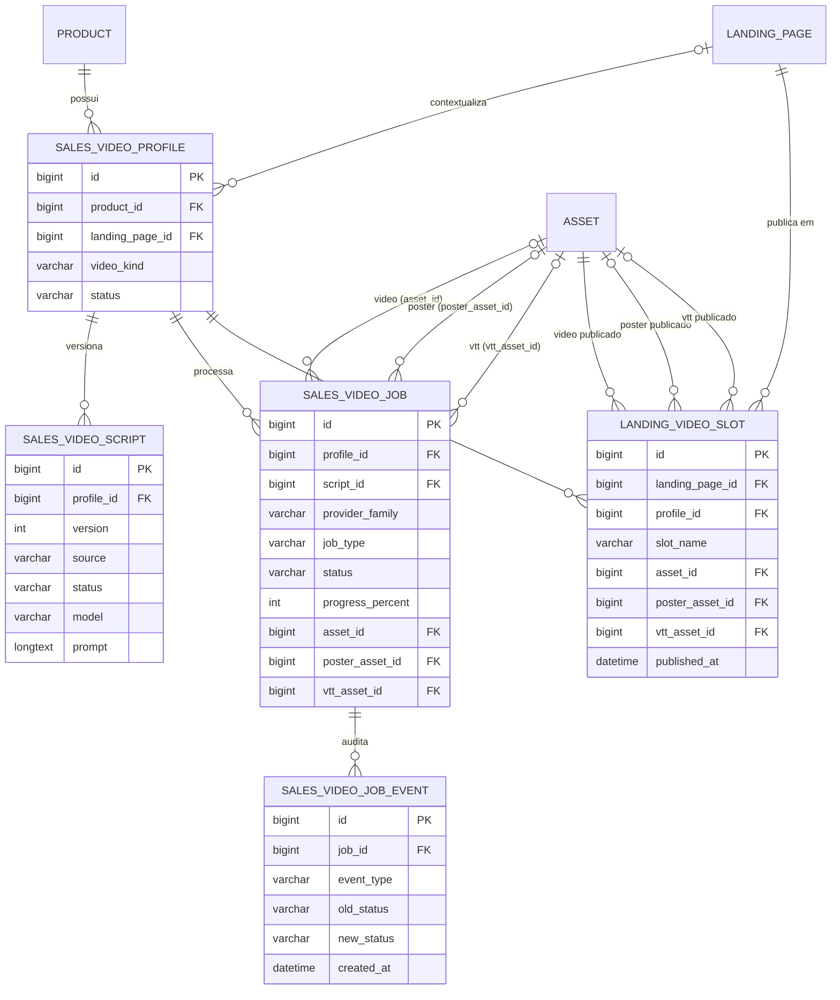

# Modelo de Dados — Módulo de Vídeo (Avatar Sales Video)

## Objetivo

Este documento descreve o modelo de dados persistido no backend para o módulo de vídeo, cobrindo entidades, relacionamentos, campos e estados principais do fluxo de geração/publicação de vídeos de venda.

> Fonte de verdade: projeto `backend/ads-service` (JPA + Liquibase em MySQL 5).

## Visão geral de entidades

O módulo é composto por 5 tabelas principais:

1. `sales_video_profile` — perfil canônico do vídeo para um produto/landing.
2. `sales_video_script` — versões editoriais de script por perfil.
3. `sales_video_job` — jobs de processamento (script, storyboard, render, publish, retry).
4. `sales_video_job_event` — trilha de auditoria e progresso dos jobs.
5. `landing_video_slot` — publicação do vídeo em slots da landing page.

## Diagrama do modelo de dados

### ERD (entidade-relacionamento)

### Assets auxiliares e armazenamento

Os arquivos finais de vídeo, poster e legendas apontados pelos campos `asset_id`, `poster_asset_id` e `vtt_asset_id` do job/perfil são persistidos como registros da tabela `asset`.
Para o módulo de vídeo foi criado o endpoint interno `/internal/video/assets`, que utiliza a categoria dedicada `SALES_VIDEO` e aceita os tipos `VIDEO`, `IMAGE` e `CAPTION`.
Isso permite que serviços externos façam o upload via multipart e recebam o `asset_id` necessário para finalizar o job com `VIDEO_READY`.

### Leitura rápida do fluxo

1. Um `product` cria/possui um `sales_video_profile`, opcionalmente associado a uma `landing_page`.
2. O perfil acumula versões editoriais em `sales_video_script`.
3. O pipeline operacional gera execuções em `sales_video_job`, com rastreabilidade em `sales_video_job_event`.
4. Após vídeo pronto, a publicação final na landing ocorre em `landing_video_slot`, apontando para os `asset` efetivos (vídeo/poster/vtt).

## Tabelas e colunas

### 1) `sales_video_profile`

Representa o perfil de vídeo de venda vinculado a um produto.

**Papel no domínio**
- É a entidade raiz (agregado principal) do módulo de vídeo.
- Centraliza contexto narrativo e operacional: tipo do vídeo, idioma, persona, duração alvo e estado canônico.
- Serve como referência para scripts, jobs e publicação.

**Quando criar**
- Ao iniciar uma estratégia de vídeo para um produto e, opcionalmente, para uma landing específica.

**Quando atualizar**
- Mudanças de direção de conteúdo (persona, estilo, idioma, duração) e avanço de status do funil (ex.: `DRAFT` → `VIDEO_READY`).

| Coluna | Tipo | Nulo | Descrição |
|---|---|---|---|
| `id` | BIGINT (PK, AI) | Não | Identificador do perfil. |
| `product_id` | BIGINT (FK) | Não | Produto dono do perfil (`product.id`). |
| `landing_page_id` | BIGINT (FK) | Sim | Landing page associada (`landing_page.id`). |
| `video_kind` | VARCHAR(32) | Não | Tipo do vídeo (enum `SalesVideoKind`). |
| `title` | VARCHAR(255) | Não | Título administrativo do perfil. |
| `persona_name` | VARCHAR(255) | Sim | Persona usada na narrativa. |
| `persona_style` | VARCHAR(255) | Sim | Estilo de persona. |
| `voice_style` | VARCHAR(255) | Sim | Estilo de voz. |
| `language` | VARCHAR(64) | Sim | Idioma do vídeo/script. |
| `target_duration_seconds` | INT | Sim | Duração alvo em segundos. |
| `status` | VARCHAR(64) | Não | Estado canônico do perfil (enum `SalesVideoStatus`). |
| `created_at` | DATETIME(6) | Não | Data de criação. |
| `updated_at` | DATETIME(6) | Não | Data da última atualização. |

**Índices**
- `idx_sales_video_profile_product (product_id)`
- `idx_sales_video_profile_status (status)`

---

### 2) `sales_video_script`

Armazena versões de script por perfil.

**Papel no domínio**
- Guarda histórico editorial (versionado) do texto do vídeo.
- Permite coexistência de versões manuais e geradas por IA (`source`), mantendo rastreabilidade (`model` e `prompt`).
- Separa claramente o ciclo de revisão/aprovação do ciclo de renderização.

**Regras importantes**
- `version` é incremental por `profile_id`.
- `uq_sales_video_script_profile_version` impede duplicidade da mesma versão no mesmo perfil.
- Scripts gerados por IA devem preservar metadados de geração (`model`/`prompt`).

| Coluna | Tipo | Nulo | Descrição |
|---|---|---|---|
| `id` | BIGINT (PK, AI) | Não | Identificador do script. |
| `profile_id` | BIGINT (FK) | Não | Perfil dono (`sales_video_profile.id`). |
| `version` | INT | Não | Versão incremental por perfil. |
| `script_text` | LONGTEXT | Sim | Texto completo do script. |
| `hook_text` | LONGTEXT | Sim | Gancho principal. |
| `cta_text` | LONGTEXT | Sim | Chamada para ação. |
| `caption_text` | LONGTEXT | Sim | Legenda resumida. |
| `storyboard_json` | LONGTEXT | Sim | Storyboard estruturado em JSON. |
| `source` | VARCHAR(32) | Não | Origem do script (enum `SalesVideoScriptSource`). |
| `model` | VARCHAR(128) | Sim | Modelo de IA utilizado. |
| `prompt` | LONGTEXT | Sim | Prompt usado para geração (quando aplicável). |
| `status` | VARCHAR(32) | Não | Situação editorial (enum `SalesVideoScriptStatus`). |
| `approved_by` | VARCHAR(255) | Sim | Usuário que aprovou. |
| `approved_at` | DATETIME(6) | Sim | Data de aprovação. |
| `created_at` | DATETIME(6) | Não | Data de criação. |

**Índice único**
- `uq_sales_video_script_profile_version (profile_id, version)`

---

### 3) `sales_video_job`

Representa jobs executáveis no pipeline de vídeo.

**Papel no domínio**
- Orquestra o processamento assíncrono do módulo (gerar script, storyboard, render, publicar, retry).
- Captura integração com providers externos (`provider_family`, `provider_name`, `provider_job_id`).
- Mantém resultado técnico da execução, incluindo progresso, falhas e artefatos produzidos.

**Leitura operacional**
- `requested_at` marca entrada na fila.
- `started_at`/`finished_at` delimitam janela de execução.
- `expires_at` ajuda a proteger jobs “claimados” que ficaram órfãos.
- `asset_id`, `poster_asset_id` e `vtt_asset_id` apontam para os artefatos finais.

| Coluna | Tipo | Nulo | Descrição |
|---|---|---|---|
| `id` | BIGINT (PK, AI) | Não | Identificador do job. |
| `profile_id` | BIGINT (FK) | Não | Perfil alvo (`sales_video_profile.id`). |
| `script_id` | BIGINT (FK) | Sim | Script relacionado (`sales_video_script.id`). |
| `provider_family` | VARCHAR(32) | Não | Família de provider (`SalesVideoProviderFamily`). |
| `provider_name` | VARCHAR(128) | Sim | Nome técnico do provider. |
| `provider_job_id` | VARCHAR(255) | Sim | ID externo no provider. |
| `job_type` | VARCHAR(32) | Não | Tipo de job (`SalesVideoJobType`). |
| `status` | VARCHAR(64) | Não | Status do job (`SalesVideoStatus`). |
| `progress_percent` | INT | Não | Progresso (0-100). |
| `failure_code` | VARCHAR(128) | Sim | Código de falha. |
| `failure_detail` | LONGTEXT | Sim | Detalhes de erro. |
| `requested_by` | VARCHAR(255) | Sim | Usuário/ator solicitante. |
| `requested_at` | DATETIME(6) | Não | Data da solicitação do job. |
| `started_at` | DATETIME(6) | Sim | Início do processamento. |
| `finished_at` | DATETIME(6) | Sim | Conclusão/falha terminal. |
| `expires_at` | DATETIME(6) | Sim | Expiração de claim/execução. |
| `asset_id` | BIGINT (FK) | Sim | Asset final de vídeo (`asset.id`). |
| `poster_asset_id` | BIGINT (FK) | Sim | Poster/frame de capa (`asset.id`). |
| `vtt_asset_id` | BIGINT (FK) | Sim | Legendas VTT (`asset.id`). |
| `metadata_json` | LONGTEXT | Sim | Metadados técnicos do provider/pipeline. |
| `created_at` | DATETIME(6) | Não | Data de criação. |
| `updated_at` | DATETIME(6) | Não | Data da última atualização. |

**Índices**
- `idx_sales_video_job_status (status)`
- `idx_sales_video_job_provider_family_status (provider_family, status)`
- `idx_sales_video_job_requested_at (requested_at)`

---

### 4) `sales_video_job_event`

Auditoria das transições e eventos dos jobs.

**Papel no domínio**
- Fornece trilha cronológica detalhada do job.
- Viabiliza observabilidade (monitoramento de progresso), depuração de erros e auditoria funcional.
- Registra mudanças de status e mensagens técnicas sem poluir a tabela principal de jobs.

| Coluna | Tipo | Nulo | Descrição |
|---|---|---|---|
| `id` | BIGINT (PK, AI) | Não | Identificador do evento. |
| `job_id` | BIGINT (FK) | Não | Job relacionado (`sales_video_job.id`). |
| `event_type` | VARCHAR(64) | Não | Tipo de evento (`SalesVideoJobEventType`). |
| `old_status` | VARCHAR(64) | Sim | Status anterior, quando aplicável. |
| `new_status` | VARCHAR(64) | Sim | Novo status, quando aplicável. |
| `message` | VARCHAR(512) | Sim | Mensagem resumida. |
| `details_json` | LONGTEXT | Sim | Payload completo para auditoria/debug. |
| `created_at` | DATETIME(6) | Não | Data de criação. |

**Índice**
- `idx_sales_video_job_event_job (job_id)`

**Regra de deleção**
- FK `job_id` possui `ON DELETE CASCADE`.

---

### 5) `landing_video_slot`

Define publicação/embedding do vídeo em posições de uma landing page.

**Papel no domínio**
- Materializa o estado “publicado” para consumo do frontend.
- Controla comportamento do player por slot (`autoplay`, `muted`, `loop_video`, `controls_enabled`, `lazy_load`).
- Desacopla “vídeo produzido” de “vídeo exibido”, permitindo republicação/ajustes sem perder histórico dos jobs.

**Regra de unicidade**
- `uq_landing_video_slot_landing_slot` garante apenas um registro por slot lógico em cada landing.

| Coluna | Tipo | Nulo | Descrição |
|---|---|---|---|
| `id` | BIGINT (PK, AI) | Não | Identificador do slot publicado. |
| `landing_page_id` | BIGINT (FK) | Não | Landing alvo (`landing_page.id`). |
| `profile_id` | BIGINT (FK) | Não | Perfil de origem (`sales_video_profile.id`). |
| `slot_name` | VARCHAR(64) | Não | Nome lógico do slot (ex.: hero). |
| `asset_id` | BIGINT (FK) | Não | Vídeo publicado (`asset.id`). |
| `poster_asset_id` | BIGINT (FK) | Sim | Poster do player (`asset.id`). |
| `vtt_asset_id` | BIGINT (FK) | Sim | Legenda VTT (`asset.id`). |
| `autoplay` | TINYINT(1) | Não | Autoplay habilitado. |
| `muted` | TINYINT(1) | Não | Mudo por padrão. |
| `loop_video` | TINYINT(1) | Não | Repetição contínua. |
| `controls_enabled` | TINYINT(1) | Não | Exibe controles do player. |
| `lazy_load` | TINYINT(1) | Não | Carregamento tardio. |
| `published_at` | DATETIME(6) | Sim | Momento da publicação. |
| `published_by` | VARCHAR(255) | Sim | Usuário que publicou. |
| `created_at` | DATETIME(6) | Não | Data de criação. |
| `updated_at` | DATETIME(6) | Não | Data da última atualização. |

**Preview administrativo**
- Os DTOs expostos pelo backend incluem `asset_url`, `poster_asset_url` e `vtt_asset_url`, extraídos diretamente das entidades `asset`.
- Essa projeção adicional permite que o frontend renderize previews na landing administrativa sem consultas extras ao catálogo de mídias.

**Índice único**
- `uq_landing_video_slot_landing_slot (landing_page_id, slot_name)`

## Enumerações de domínio

### `SalesVideoKind`
- `HERO`
- `OBJECTION`
- `PROOF`

### `SalesVideoStatus`
- `DRAFT`
- `SCRIPT_PENDING`
- `SCRIPT_READY`
- `STORYBOARD_PENDING`
- `STORYBOARD_READY`
- `VIDEO_REQUESTED`
- `VIDEO_PROCESSING`
- `VIDEO_READY`
- `VIDEO_FAILED`
- `PUBLISHED`
- `ARCHIVED`

### `SalesVideoJobType`
- `SCRIPT`
- `STORYBOARD`
- `RENDER`
- `PUBLISH`
- `RETRY`

### `SalesVideoProviderFamily`
- `OPENAI`
- `EXTERNAL_VIDEO_MODULE`

### `SalesVideoScriptStatus`
- `DRAFT`
- `READY_FOR_REVIEW`
- `APPROVED`
- `ARCHIVED`

### `SalesVideoScriptSource`
- `MANUAL`
- `OPENAI`

### `SalesVideoJobEventType`
- `CREATED`
- `CLAIMED`
- `HEARTBEAT`
- `PROGRESS`
- `STATUS_CHANGED`
- `COMPLETED`
- `FAILED`
- `EXPIRED`

## Regras e observações

- O backend é a única fonte de verdade do modelo de dados de vídeo; serviços externos (como worker) consomem via artefato/API e não devem duplicar schema.
- Para registros gerados por IA no contexto de script, manter preenchimento de `model` e `prompt` quando houver geração automática.
- A tabela `sales_video_script` possui versionamento por perfil para manter histórico editorial.
- A tabela `sales_video_job_event` complementa observabilidade/auditoria do ciclo de vida de jobs.
- A publicação em `landing_video_slot` representa um “snapshot de exibição”, podendo apontar para o resultado mais recente e estável do pipeline.
